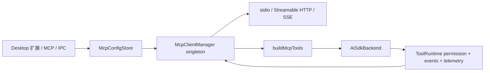

# Maka MCP runtime architecture

状态：V1 implemented and verified（2026-07-18）

## 1. 目标与边界

Maka 的 MCP 接入必须复用现有 `MakaTool` execution boundary，而不是建立第二套 agent loop。MCP manager 负责连接、发现和调用；runtime adapter 把远端 tool 投影成动态 `MakaTool[]`。因此 MCP tool 自动获得现有 permission gating、runtime event log、telemetry、result persistence、abort 和 loop gate。

V1 支持：

- local `stdio`、remote Streamable HTTP、legacy SSE；Streamable HTTP 可显式或自动 fallback 到 SSE。
- `tools/list` pagination、`notifications/tools/list_changed`、tool call timeout 和 abort。
- text、image、audio、embedded resource、resource link content；MCP `isError` 进入 Maka error path。
- workspace-scoped `mcp.json`，采用通用的 `mcpServers` 配置结构。
- 首页侧边栏「扩展 > MCP」模块，提供市场模板、搜索、JSON import、CRUD、test、status/tool list，以及配置变化后的 backend cache invalidation。
- bundled catalog 对 executable package 固定已核验版本；需要 credential、OAuth 或路径选择的模板默认 `enabled: false`，setup 完成前不启动 server。
- market install 是可取消 transaction：renderer 展示明确的 installing/cancelling 状态，main process abort 对应 connect、等待未完成的 config write settle，再 rollback config 并 reconcile tool snapshot。

V1 不包含 OAuth browser flow、resources UI、resource subscription 和给 subprocess 使用的 loopback proxy。它们属于 V2；协议层保留 transport 和 content contracts，避免返工。

## 2. 调研结论

### 本地桌面客户端

逆向调研的成熟桌面客户端使用官方 MCP SDK，并支持 stdio、Streamable HTTP、SSE fallback、tools、resources/templates、resource notifications/subscription 和 OAuth 2.1 + PKCE。值得采用的是 transport fallback、分阶段 timeout、stderr tail 和丰富 content block；不采用 stop-all/start-all refresh、base64 token fallback、未经约束的 stdio env inheritance 和不完整的 JSON Schema 转换。

### 开源 agent 客户端

调研的开源实现使用 centralized client pool，backend 共享 source connection，并通过 stable proxy tool name 暴露 tools。它的 stdio validation（单 process、idle watchdog、hard ceiling、stderr tail 和具体错误诊断）值得采用。Maka 不照搬其 sensitive-env denylist、缺少 SSE、把 result 全部扁平化为 text，以及只比较少数字段的 config reconciliation。

## 3. 组件与数据流



- `@maka/core/mcp`：无 I/O 的 config、status、tool/content contract。
- `@maka/storage`：owner-only atomic `mcp.json` store。
- `@maka/mcp`：官方 SDK client lifecycle、transport、pagination、notifications、diagnostics。
- `@maka/runtime/mcp-tools`：MCP schema/content/annotations 到 `MakaTool` 的适配。
- Desktop main：唯一 manager 实例；renderer 永不持有 MCP client 或 child process。

## 4. 配置 contract

```json
{
  "version": 1,
  "mcpServers": {
    "filesystem": {
      "enabled": true,
      "command": "npx",
      "args": ["-y", "@modelcontextprotocol/server-filesystem", "/tmp"],
      "env": {},
      "cwd": "/tmp"
    },
    "remote-service": {
      "enabled": true,
      "url": "https://mcp.example.com/mcp",
      "transport": "streamable-http",
      "headers": {}
    }
  }
}
```

Server id 是稳定 identity。配置 reconciliation 使用完整 normalized config fingerprint；新增/删除/修改只影响对应连接。remote headers 在 V1 仍位于 `mcp.json`，文件和目录分别强制 `0600`/`0700`；后续迁移到 Keychain-backed credential store。

Bundled catalog 不是第二份 runtime truth：点击安装只把选中的模板写入同一个 `mcpServers` map。需要 setup 的模板以 disabled snapshot 落盘，用户补齐配置并主动启用后才参与连接；不允许用“已写入配置”冒充“已授权”或“已连接”。

## 5. 安全与权限

- stdio 默认只继承运行所需 allowlist：`PATH`、`HOME`、`USER`、`SHELL`、`LANG`、`LC_*`、`TMPDIR`、`XDG_*` 和 Windows system variables。配置中的显式 `env` 最后覆盖。
- 所有 MCP tool 都按 mutation 处理：`categoryHint: network_send`。`readOnlyHint` 是不可信的 server advisory，不能用于降低 permission policy；未来若支持 trusted-server policy，必须由 Maka 侧配置明确授权。
- MCP tools 不设置 `permissionRequired: false`，明确 deny rule 始终优先。
- main-process store boundary 对 IPC payload 做 runtime validation，不接受 prototype keys、空 command、非 HTTP(S) URL、非法 headers/env。
- catalog 中的 executable package 必须 pin 到 reviewed version；stdio credential 优先走显式 env，不进入 process args。V1 的显式 env 仍受 owner-only 文件边界保护，不能等同于 encrypted secret storage。
- tool 名为 `mcp__{serverId}__{toolName}`；仅允许 provider-safe characters，超过 64 chars 时使用 stable hash suffix，并检测 collision。
- rich output 对 model text、image count/总 base64 大小和 summary block 数量做 aggregate bounds；audio、resource blob 和 unknown payload 不直接注入 model context。

## 6. Lifecycle 与错误语义

每个 server 只有一个 active connection promise，避免并发重复 spawn。connect 失败必须关闭半连接 client/transport；disconnect 取消 notification handler 并释放 child process/network stream。manager cache tools；list-changed notification 只刷新对应 server。

install operation 以 server id 串行化。取消时先标记 operation 并 abort active connect，再等待已经开始的 store write 完成；只有随后执行 remove + manager reconcile，才能避免迟到的 upsert 让已取消条目“复活”。renderer 也保留 cancellation marker，防止旧 install promise 覆盖 rollback 后的新 UI state。

timeout 默认值：remote connect 30s、stdio connect 60s、list 15s、call 10min。caller abort 优先于 timeout。协议 `isError` 转为带 server/tool context 的异常；transport/timeout/validation 分别保留可诊断 message，stdio error 附带最多十行经过 redaction/truncation 的 stderr tail。

配置变更或 `notifications/tools/list_changed` 后 manager 先 reconcile，再使 cached backends 失效；正在执行的 turn 不被强杀，invalidation 会在最后一个 active run 完成时释放旧 backend，确保下个 turn 创建包含新 tool snapshot 的 backend。

## 7. V1 验收标准

1. stdio fixture 可完成 connect → paginated discovery → call → structured content projection → disconnect。
2. `isError`、timeout、abort、startup failure 和经过 secret redaction 的 stderr diagnostics 有自动化覆盖。
3. config store 能拒绝非法输入、并发写不损坏、POSIX mode 为 `0600`。
4. tool name 在 64 chars 内稳定、无 collision；不可信 annotations 无法降低权限，model output aggregate bounds 有测试。
5. Desktop 首页侧边栏仅在「扩展」分组下提供「技能」和「MCP」；MCP 模块可搜索市场模板、JSON import、添加、编辑、启停、测试和删除 server，状态与 tools 可见。
6. market `+` 在安装中变为 progress indicator，hover/focus 变为可访问的取消操作；取消后 config 不复活、server 不残留、tools 不可见。
7. 更新配置后新 turn 看见新 tools，删除后 tools 消失。
8. targeted tests、workspace typecheck/build、full tests 和 Electron smoke 均通过。

## 8. V2 backlog

- OAuth 2.1 authorization server metadata、PKCE、dynamic client registration 和 Keychain token persistence。
- resources/templates browse、read、subscribe/unsubscribe 及 host UI。
- authenticated loopback MCP proxy，供受控 subprocess client 共享 pool。
- per-server health/backoff/automatic crash recovery 与 finer-grained permission policy。
- signed remote catalog、last-known-good cache、guided setup schema、package provenance 与 update permission diff。
