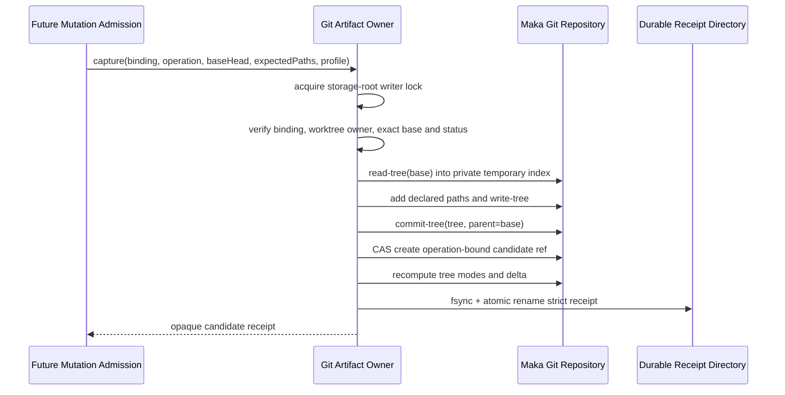

# Managed Workspace Git Mutation Candidate Owner v1

- 状态：M2.2 核心实现完成；stacked Draft，等待 M2.3/M2.4 消费者
- 更新日期：2026-08-17
- 主要不变量：只有 Maka 的 Git artifact owner 能把 owned worktree 中一次声明路径的变化发布成 operation-bound candidate
- owner：既有 `GitWorkspaceService`；不新建第二个 repository/ref writer
- canonical artifact：candidate Git commit/ref + strict durable receipt
- 不做：不写 T2、不推进 SQLite workspace head、不更新 worktree `HEAD`、不接 Desktop/CLI

## 1. 为什么是 candidate，而不是直接提交 head

工具执行后的文件状态还不能直接成为 canonical workspace version。M2.2 先将它冻结成候选：

```text
accepted base commit
  + declared changed paths
  + fixed candidate policy
  + execution profile digest
        ↓
single-parent candidate commit
        ↓
operation-bound candidate ref
        ↓
durable candidate receipt
```

candidate 只证明“Git owner 看到了什么”。只有后续 M2.4 将它与 T1 identity、工具语义和 M2.1 SQLite
bundle 一起验证并提交后，它才成为 accepted workspace version。

## 2. 权限边界

`GitWorkspaceService` 已拥有 verified Git runtime、repository artifact、worktree ownership lock、固定 Git
config 和 storage-root writer lock。M2.2 通过 storage-internal `WeakMap` capability 增加 `capture/discard`，没有
从 `@maka/storage` package exports 暴露普通 writer。

调用者不能提交自造 commit/tree/ref。owner 必须重新证明：

- binding、repository、epoch artifact 和 Git runtime identity 一致；
- worktree 是非 symlink 目录，common-dir 指向 Maka repository，worktree lock 仍存在；
- worktree `HEAD`、managed head ref、base commit/tree 同时匹配；
- status 只有声明的路径，没有 ignored、rename/copy 或额外变化；
- candidate 全树只有普通 blob mode `100644/100755`，没有 symlink、submodule、special mode、属性文件或大小写冲突；
- candidate commit 只有一个 parent，且 commit identity/message 使用固定协议；
- receipt 的 ref、commit、tree、parent、delta digest 和路径集合可从 Git object database 重算。

## 3. 发布协议

候选不修改 worktree 的真实 index。owner 使用 Maka-owned 临时 index：



发布顺序是 `commit object → candidate ref → receipt`。Git ref 与 JSON receipt 不在同一个跨介质事务中，
因此合同依靠可重放状态，而不是宣称不存在中间状态：

- object 已写但 ref 未写：unreachable object，Git GC 可回收；
- ref 已写但 receipt 未写：相同 operation/base/worktree 重试生成相同 commit 并补 receipt；
- receipt 已写：重启后严格重验 Git artifact 和 delta，exact retry 返回同一 receipt；
- ref 与当前 candidate 不一致：fail closed，不覆盖。

## 4. 回收协议

未被 M2.1 接受的候选只能通过同一个 owner 回收：

```text
durable discard tombstone
  → candidate ref CAS delete
  → live receipt delete
  → retain tombstone for exact retry
```

tombstone 在删除 ref 前落盘，所以崩溃后不会把“外部删 ref”误认为成功回收。它也是 operation identity 的
永久终态：同一个 operation 不能在回收后静默复用成另一份 candidate。

## 5. 失败状态与回滚

| 情况 | 结果 | 后续 |
|---|---|---|
| base/head/worktree owner 漂移 | `managed_workspace_drifted` 或 identity conflict | park；不发布 ref |
| undeclared、ignored、dependency/control path | `managed_mutation_candidate_rejected` | 不发布 ref |
| symlink/submodule/special mode/attributes/case collision | reject | 不发布 receipt；已生成 object 可 GC |
| 同 operation 已有不同 ref/receipt | identity conflict | fail closed |
| ref 后崩溃 | ref 保留、receipt 缺失 | exact capture 重放 |
| discard ref 后崩溃 | tombstone 保留 | exact discard 重放 |
| canonical SQLite head 未接受 candidate | 不影响 M2.1 | candidate 仍是非 canonical artifact |

## 6. 平台能力矩阵

| 能力 | Linux | macOS | Windows |
|---|---|---|---|
| verified/bundled Git ref CAS | 支持 | 支持 | 支持 |
| private temporary index | 支持 | 支持 | 支持 |
| symlink candidate 拒绝 | Git tree mode 验证；实测 | Git tree mode 验证；实测 | 同一 tree-mode 验证；创建 symlink fixture 可能跳过 |
| operation path identity | case-sensitive | case-sensitive | filesystem 路径比较 case-insensitive；Git path 仍严格 |
| process-crash convergence | 承诺 | 承诺 | 承诺 |
| power-loss ordering | v1 不承诺 | v1 不承诺 | v1 不承诺 |

普通 `fsync`、Git ref 的平台实现和设备缓存不足以构成统一的断电证明，所以 v1 只声明进程崩溃收敛。

## 7. 留给 M2.3/M2.4 的边界

M2.2 不证明变化一定由某一次 Write/Edit 造成。M2.3 必须在 T1 前冻结 base head、operation identity、
execution profile 和 exclusive mutation scope；M2.4 必须核对正常工具 transform 的 expected result，调用
M2.1 原子 bundle，并在真实 Host kill/reopen 测试中证明唯一 accepted successor。

因此本切片保持 Draft；它没有生产 consumer，也不提升当前 Desktop 的 resume 能力。
