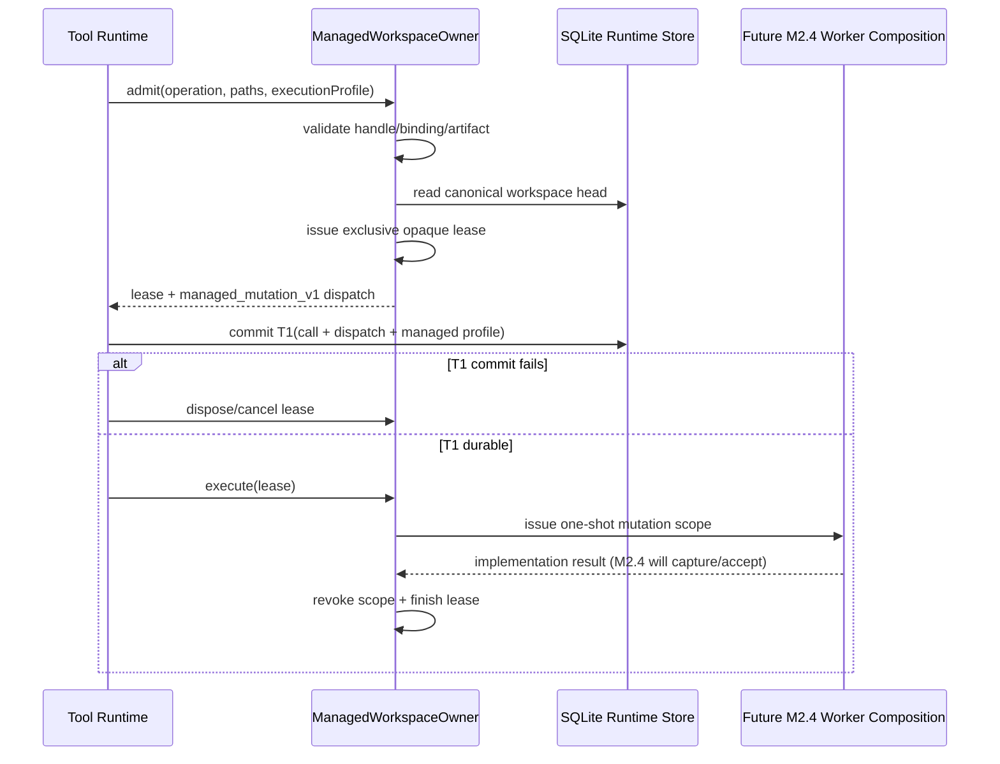

# Managed Workspace Mutation Execution Admission v1

- 状态：M2.3 实现切片；保持 Draft，等待 M2.4 Write/Edit 生产消费者
- 更新日期：2026-08-18
- 主要不变量：任何 managed mutation 必须在 T1 前冻结唯一执行身份并取得 owner-bound 独占 lease；T1 后不得切换 profile 或回退到直接写路径
- owner：`ManagedWorkspaceOwner`
- durable 边界：`toolDispatch.managedMutation.protocol = managed_mutation_v1`
- canonical base：M2.1 SQLite workspace head + M0/M1 managed workspace binding

## 1. 本切片解决什么

M2.1 能原子接受成功 T2 与 successor workspace version，M2.2 能把已发生的文件变化冻结成 immutable Git
candidate，但在 M2.3 以前，工具执行前仍缺少一条受 owner 控制的因果承诺：

```text
这次 operation 在哪个 managed workspace 执行？
它基于哪个 canonical workspace head？
允许改变哪些路径？
使用哪个 execution profile？
同一 workspace 是否还有另一条 mutation 并发执行？
```

M2.3 在任何文件副作用发生前回答这些问题，并把答案作为 T1 的一部分持久化。只有后续 M2.4 能消费这条
admission，把真实 Write/Edit、M2.2 candidate 和 M2.1 successor bundle 串起来。

## 2. Owner、原子边界、失败状态与回滚

| 项目 | 决策 |
|---|---|
| admission owner | `ManagedWorkspaceOwner`；调用者只能持有 opaque lease/scope |
| base head authority | owner 在 admission 内重新读取 M2.1 canonical head，不接受 caller 自报 head |
| concurrency owner | 每个 `workspaceInstanceId` 同时最多一个 pending/active mutation lease |
| T1 authority | Tool Runtime 只接受 owner 返回的 strict `managed_mutation_v1` profile，并与 tool dispatch 同时写入 |
| pre-T1 failure | capability 缺失、handle/scope/base/profile/path 无效、并发冲突、取消：走标准 tool error，不落 T1 |
| post-T1 failure | 不允许 detached/attached/direct-write fallback；operation 保持 durable managed identity，由 M2.4 决定 settle/park |
| rollback | T1 前取消 admission 会撤销 lease；执行 callback 结束后 scope 失效且 owner residency 释放 |
| close/drain | active mutation lease 计入 owner operation；owner close 必须等待 lease 取消或执行完成 |
| platform promise | admission、SQLite identity 与 lease 语义三平台一致；文件替换、power-loss 与 publish 语义不在本切片承诺内 |

“独占”是 owner 生命周期内的执行 admission，不是对任意外部进程的文件系统锁。外部 drift 仍由 M2.2 candidate
验证和后续 M2.4 policy fail closed。

## 3. Durable T1 profile

```ts
type RuntimeEventManagedWorkspaceMutationV1 = {
  protocol: 'managed_mutation_v1';
  repositoryId: string;
  workspaceId: string;
  workspaceEpochId: string;
  workspaceInstanceId: string;
  objectFormat: 'sha1' | 'sha256';
  baseWorkspaceVersionId: string;
  baseAcceptedEventId: string;
  baseHeadRevision: number;
  baseCommitOid: string;
  baseTreeOid: string;
  expectedPaths: string[];
  executionProfileDigest: `sha256:${string}`;
};
```

Core decoder 使用 exact-shape 校验，拒绝未知字段、非法 identity/OID/digest、重复路径、`.`/`..`、绝对路径、
`.git`、`node_modules` 和平台不安全的路径。M2.2 candidate 与 M2.3 admission 复用同一个 canonical path
validator，避免“执行前允许、capture 时拒绝”的双策略漂移。

M2.1 online writer 和 canonical rebuild 都要求 successor 引用的 T1 携带与 successor 完全一致的 managed
profile。由此形成：

```text
T1 frozen base/profile
  == M2.2 candidate base/profile
  == M2.1 accepted successor base/profile
```

缺少 managed profile 的历史实验 successor 会 fail closed；这些 Draft 分支没有生产用户，不提供旧实验格式迁移。

## 4. 时序



Tool Runtime 对标记了 `durableExecutionProfile: managed_mutation_v1` 的工具执行 fail-closed：Host admission
hook、run identity 或 runtime commit sink 任一缺失，都在 T1 前返回标准工具错误，不调用实现，也不写 prepared
dispatch。当前 built-in Write/Edit 尚未设置该标记；该生产启用属于 M2.4。

## 5. Capability 边界

- public lease/scope 只有不可解构的 kind；真实状态保存在 storage-internal `WeakMap`；
- lease 与 owner token、workspace binding、operation ID、base head、paths、profile 一一绑定；
- lease 只能从 `admitted` 进入一次 `executing`，不能重复执行；
- scope 只在 owner callback 生命周期内有效；callback 返回后 capture/discard 都会拒绝；
- candidate receipt 必须属于同一 scope/operation/base，不能跨 operation discard；
- admission input 在进入异步验证前复制并严格校验，caller 后续修改数组不会改变 durable T1。

## 6. Crash / concurrency matrix

| 故障或竞态 | durable 状态 | 收敛 |
|---|---|---|
| admission 前取消 | 无 T1、无 lease | 标准 preflight error |
| admission 后、T1 前进程退出 | 无 T1；内存 lease 随进程消失 | 新 owner 可重新验证并 admission |
| T1 commit 失败 | 无 managed dispatch | dispose lease，不执行工具 |
| T1 已提交、执行前退出 | managed operation prepared | 不 fallback；M2.4/M3 后续恢复 |
| 同 workspace 第二 mutation | 第一 lease 未释放 | `managed_mutation_admission_conflict` |
| owner close 与 pending lease 并发 | close 保持 pending | lease cancel/finish 后 close 收敛 |
| stale base/head/profile | 无 T1 | fail closed |
| successor 不匹配 T1 profile | transaction 拒绝 | head 不推进；canonical rebuild 同样拒绝 |

真实 child-process 测试覆盖 admission 后、T1 前 kill/reopen；SQLite crash harness 覆盖带 managed T1 的
successor transaction 在 commit 前后 kill/reopen。M2.4 必须补真实 Host/worker 在文件副作用、candidate publication
和 successor acceptance 各阶段的完整矩阵。

## 7. 明确不做

- 不给 built-in Write/Edit 启用 managed profile；
- 不执行真实 filesystem worker mutation；
- 不自动 capture 或 accept Git candidate；
- 不改变当前用户可见 resume 能力；
- 不连接 Desktop/CLI；
- 不把 continuation boundary 绑定 workspace version（M3）；
- 不承诺 power-loss durability、attached checkout redo 或外部进程互斥。

因此本切片即使测试全绿也保持 Draft。它证明的是 admission authority，不是完整恢复产品能力。

## 8. M2.4 接入门槛

M2.4 只能通过本 owner 组合真实 Write/Edit：

1. 在 T1 前调用 admission 并持久化 exact managed profile；
2. 在 opaque scope 内调用原有 filesystem worker，保留 permission/sandbox/cancellation 语义；
3. 通过同一 scope 捕获 M2.2 candidate；
4. 严格验证 candidate 与 T1/base/path/profile；
5. 用 M2.1 唯一 writer 原子提交成功 T2 + successor + head；
6. 失败或不确定时禁止普通 error T2 掩盖副作用，必须 discard/park；
7. 用真实 Host kill/reopen 测试证明一次 operation 只有一个 accepted successor。
