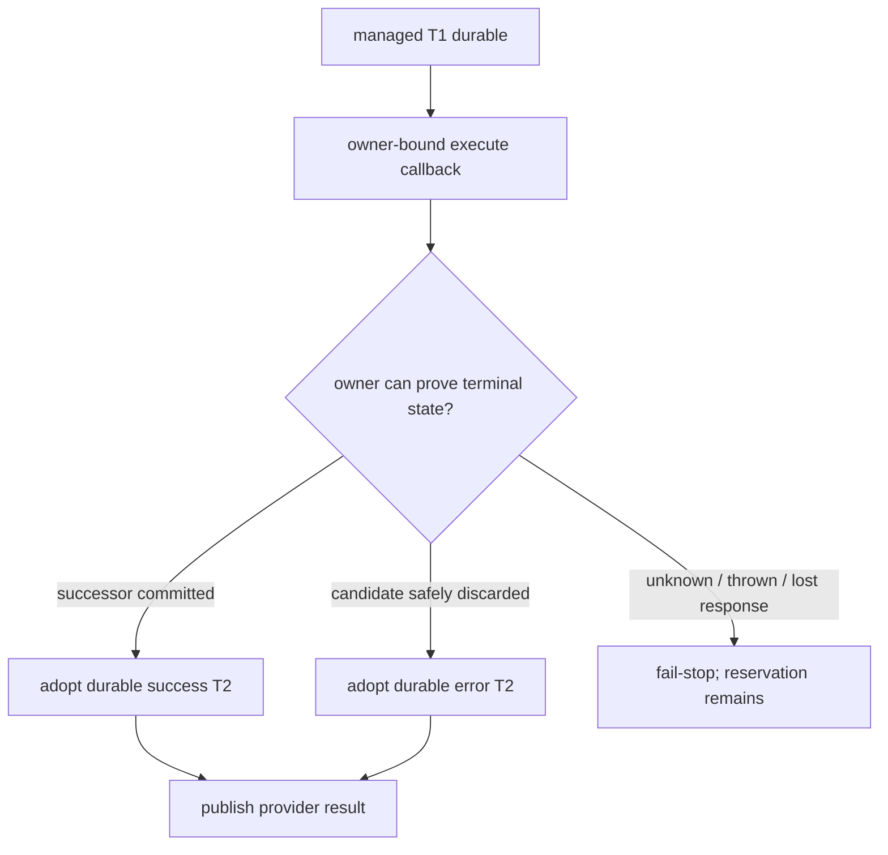

# Managed Workspace Mutation Execution Admission v1

- 阶段：M2.3b
- 状态：实现切片；保持 Draft，等待 M2.4 Write/Edit 生产消费者
- owner：`ManagedWorkspaceOwner` 与 Tool Runtime managed settlement seam
- durable 真相：M2.3a SQLite reservation，而不是进程内 lease

## 1. 主要不变量

Write/Edit 只有在 T1 前取得与 managed workspace、canonical base head、operation、exact paths 和 owner-selected
execution profile 绑定的 capability，才允许落下 `managed_mutation_v1` T1。T1 durable 后，Runtime 不得自行写
generic T2；只有 workspace owner 能报告以下三种结算：

1. `workspace_successor_committed`：M2.1 的成功 T2、successor 与 head 已经原子提交；
2. `safely_discarded`：owner 已证明副作用未被接受，并提交与 exact provider result 一致的 canonical error
   outcome；
3. `unsettled`：副作用或结算状态不可证明，保留 M2.3a reservation，交给恢复流程。

owner callback 抛出异常也属于 `unsettled`，不能静默回退到 Runtime 的 synthetic error T2。

## 2. 权威分层

| 层 | owner | 作用 | 不承担 |
|---|---|---|---|
| durable ownership | M2.3a SQLite authority | T1 时创建跨进程 reservation，successor 时原子消费 | 文件执行和 candidate capture |
| admission capability | `ManagedWorkspaceOwner` | T1 前重验 handle、artifact、head、active reservation，并签发 opaque lease | 跨重启事实源 |
| runtime settlement seam | Tool Runtime | 将 owner 结算投影为 provider-visible result；禁止 generic T2 | 自行判断 Git/filesystem 是否成功 |
| production composition | M2.4 | 调 worker、capture/discard candidate、提交 successor/error | 改写前述事实协议 |

进程内 `WeakMap` lease 只防伪造、重复执行和 owner 生命周期竞态。它消失后不会释放 durable ownership；新
owner admission 必须读取 M2.3a active reservation，发现 prepared operation 就 fail closed。

## 3. T1 前 admission

```text
Tool Runtime
  -> ManagedWorkspaceOwner.admit(operation, paths)
     -> validate opaque execution handle
     -> verify Git artifact and storage-root binding
     -> read canonical workspace head
     -> read active durable mutation reservation
     -> select the protocol-fixed profile owned by its filesystem worker
     -> issue one-shot opaque lease + exact managedMutation dispatch
  -> SQLite commitToolPrepared(call + dispatch + reservation)
```

任一步失败都发生在 T1 前：工具实现不运行，普通 preflight error 可返回给 provider。caller 只提供 operation
和 paths；裸 `executionProfileDigest` 属于非法字段。owner 只有在持有 filesystem worker capability 时才选择唯一
的 v1 profile，并从 canonical profile descriptor 内部计算 digest。caller 数据在第一次异步操作前复制并校验；
路径语法复用 Core 的平台无关 canonical validator。

## 4. T1 后 settlement



Runtime 对 owner 返回的 durable outcome 做 exact identity/content/status 校验，然后只“采用”已经提交的事件，
不重复调用 `commitToolOutcome`。不匹配的 outcome、owner channel 异常或明确 `unsettled` 都 fail-stop，不发布
tool result。

`safely_discarded` 只携带一个 exact `providerResult`。Runtime 从该值生成 canonical content，并与 durable T2
逐字段比较；live 模型和 crash replay 因此不能分别来自两个错误对象。对应 durable writer 和 candidate 证明由
M2.4 提供；M2.3b 只固定 Runtime 不得越权结算。

## 5. 生命周期与失败状态

| 场景 | 结果 |
|---|---|
| admission 前取消、handle/path/head 无效 | 无 T1，标准 preflight error |
| owner 没有 filesystem worker profile | 无 T1，profile unavailable |
| caller 夹带裸 profile digest | 无 T1，unsupported field |
| 同进程已有 pending/active lease | admission conflict |
| 旧进程 T1 已提交、内存 lease 已消失 | SQLite reservation 拒绝新 admission |
| T1 commit 失败 | dispose 未使用 lease，不执行工具 |
| owner 已原子接受 successor | Runtime 采用 durable success outcome |
| owner 已安全 discard | Runtime 采用 durable error outcome |
| owner 返回 unsettled 或抛出 | 无 generic T2、无 provider result，reservation 保留 |
| owner close 与 lease 并发 | close 等待 cancel/finish 后收敛 |

## 6. 平台能力矩阵

| 能力 | Linux | macOS | Windows |
|---|---|---|---|
| T1 前 owner capability 与 head/reservation gate | 承诺 | 承诺 | 承诺 |
| canonical path fact 同值同义 | 承诺 | 承诺 | 承诺 |
| 进程重启后 prepared T1 阻止新 mutation | 承诺 | 承诺 | 承诺 |
| 文件副作用、candidate capture 与 publish | M2.4 | M2.4 | M2.4 |
| power-loss convergence | 不在本切片 | 不在本切片 | 不在本切片 |

三平台的 managed-workspace process-crash inventory 使用同一文件清单、name pattern 和严格通过数量；Linux
由标准 storage stress lane 执行，Windows 与 macOS 分别有独立 recovery workflow。

## 7. 验证

- owner admission 冻结 caller operation/paths，拒绝裸 digest，并从 owner-held worker profile 产生固定 digest；
- 没有 filesystem worker 的 owner 不能签发 mutation profile；
- 关闭旧 owner、重开 SQLite/owner 后，prepared T1 仍拒绝新 admission；
- Tool Runtime 在 Host admission 缺失时不落 T1、不执行工具；
- owner-committed successor 只采用 durable T2，不调用 generic writer；
- safely-discarded exact provider result 与 durable T2 不一致时 fail-stop；
- explicit unsettled 与 owner 抛错都 fail-stop，不发布结果、不写 generic T2；
- owner close 等待 outstanding lease cancel/finish。

## 8. 明确不做

- 不给 built-in Write/Edit 启用 `durableExecutionProfile`；
- 不调用真实 filesystem worker mutation；
- 不 capture、discard 或 accept Git candidate；
- 不接 Desktop/CLI，不改变当前用户可见 resume 能力；
- 不提供手工删除 durable reservation 的公共 API。

这些属于 M2.4。M2.3b 没有生产消费者，因此即使测试通过也保持 Draft。
