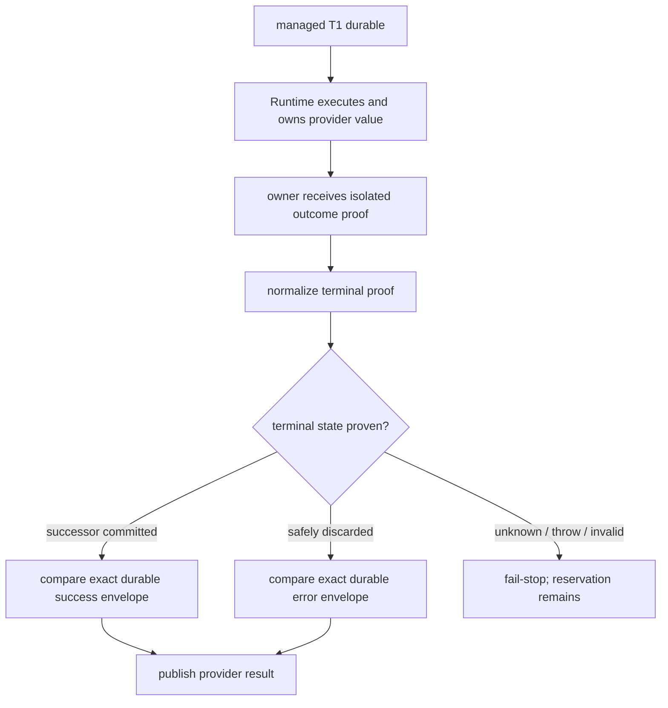

# Managed Workspace Mutation Runtime Settlement v1

- 阶段：M2.3b
- 状态：实现切片；保持 Draft，等待 M2.4 Write/Edit 生产消费者
- owner：Tool Runtime managed settlement seam
- durable 真相：M2.3a SQLite reservation 与 owner 已提交的 immutable outcome

## 1. 本切片只证明一个主要不变量

当未来的 Host owner 在 T1 前返回一份 exact `managed_mutation_v1` dispatch 后，Tool Runtime 将它与 call 一起
提交为 durable T1。从这一刻起，整个 settlement、result canonicalization、大小检查、durable outcome adoption、
provider publication 与 telemetry 都处于 managed fail-stop 状态：任何异常都不得进入 generic synthetic T2。

Runtime 只接受三种 owner 结算：

1. `workspace_successor_committed`：M2.1 的成功 T2、successor 与 head 已经原子提交；
2. `safely_discarded`：owner 已证明 candidate 未被接受，并已提交 exact error outcome；
3. `unsettled`：副作用或结算状态不可证明，M2.3a reservation 保留给恢复流程。

owner 返回值首先经过运行时结构校验，规范化成内部 terminal union。managed/generic lane 只由 T1 前已经确定的
`managedMutationAdmission` 决定，绝不再用 `durableOutcome` 是否 truthy 选择 writer；terminal settlement 缺失
durable outcome 或 canonical content 时只能 fail-stop。成功路径的 provider value 始终由 Runtime 在执行
`operation()` 时捕获并冻结，不进入 owner settlement。

本切片不声称拥有 mutation worker、execution-profile attestation、Git candidate 或 production admission。它只定义
Runtime 如何消费 M2.4 将提供的 owner capability。这样 T1 不会记录一个由只读 worker 或 caller callback 冒充的
execution profile。

## 2. 权威分层

| 层 | owner | 当前职责 |
|---|---|---|
| durable ownership | M2.3a SQLite authority | T1 时创建跨进程 reservation，successor 时原子消费 |
| runtime settlement | M2.3b Tool Runtime | T1 后禁止 generic T2；采用完整一致的 durable response envelope |
| execution admission | M2.4 Host/workspace owner | 绑定真实 mutation worker、sandbox profile、head、paths 与 candidate lease |
| production composition | M2.4 | 执行 Write/Edit、capture/discard candidate、提交 successor/error |

`admitManagedMutation` 在 M2.3b 是一个注入式 Host seam，不是当前 `ManagedWorkspaceOwner` 的公开能力。没有该 seam
时，标记为 `managed_mutation_v1` 的工具必须在 T1 前拒绝；不得降级为普通工具执行。

## 3. T1 前接口边界

```text
Tool Runtime
  -> Host admission seam(operation, tool, args)
     -> M2.4: validate real worker/profile/head/path/candidate capability
     -> return exact managedMutation dispatch + one-shot execute/dispose handle
  -> SQLite commitToolPrepared(call + dispatch + reservation)
```

M2.3b 只校验 Host seam 是否存在，并将其返回的 immutable dispatch 原样纳入 T1。dispatch 的真实性、profile
digest 如何从实际 worker/sandbox 能力产生，以及 admission 如何重验 canonical head，全部由 M2.4 同一个 owner
实现和测试。

## 4. T1 后 fail-stop 状态机



`safely_discarded` 只携带一个 exact `providerResult`。Runtime 从该值生成 canonical content，并执行与普通工具
相同的 `maxResultBytes` 检查。getter、serialization、canonicalization 或 size-check 的任何失败都变成 managed
unsettled，不写 generic T2。

`workspace_successor_committed` 只携带 `durableOutcome`，不得重新提交 provider value。Runtime 在调用真实 operation
时完成唯一一次 size check 和 canonicalization，私有保存 live value，仅把隔离复制的 `content/isError/durationMs`
proof 交给 owner 用于提交 successor。owner 返回后，Runtime 用自己的 canonical outcome 校验 durable envelope；
因此 owner 无法构造 live A / replay B，也无法用替换 value 绕过结果大小限制。

owner 返回的 response 必须与 Runtime 从 T1 identity 构造的唯一 canonical envelope 完全相等，包括：event id、
run/invocation/session/turn、timestamp 形状、origin、model visibility、function response、error bit、exact refs、
parent refs 和 duration。缺字段、多字段或任意值不同都 fail-stop。这样 live provider 与 crash replay 只有一个结果源。

## 5. 失败状态

| 场景 | 结果 |
|---|---|
| Host admission seam 缺失或 admission 在 T1 前失败 | 无 T1、不执行工具 |
| T1 commit 失败 | dispose admission，不执行工具 |
| owner 已原子接受 successor | Runtime 采用 exact durable success outcome |
| owner 已安全 discard | Runtime 采用 exact durable error outcome |
| owner 返回 unsettled、抛错或响应丢失 | 无 generic T2、无 provider result，reservation 保留 |
| canonicalization、size check、envelope validation 或 publication 失败 | 同上，统一 fail-stop |
| durable envelope origin/visibility/refs/duration 不一致 | T2 boundary error，禁止发布 |

## 6. 平台能力矩阵

| 能力 | Linux | macOS | Windows |
|---|---|---|---|
| T1 reservation kill/reopen | CI 证明 | CI 证明 | CI 证明 |
| 跨进程唯一 mutation reservation | CI 证明 | CI 证明 | CI 证明 |
| Runtime managed settlement fail-stop | 平台无关测试 | 平台无关测试 | 平台无关测试 |
| mutation worker/profile/candidate | M2.4 | M2.4 | M2.4 |
| power-loss convergence | 不在本切片 | 不在本切片 | 不在本切片 |

统一 recovery inventory 同时包含 managed baseline/candidate、`sqlite-runtime-crash` 与
`sqlite-recovery-concurrency`。Linux、macOS、Windows 使用相同文件清单、name pattern 和严格测试数量。

## 7. 验证

- Host admission 缺失时不落 T1、不执行工具；
- owner-committed successor 只采用 durable T2，不调用 generic writer；
- success settlement 缺失 durable outcome 时不调用 generic writer；
- success settlement 不能替换 Runtime-owned provider value，live 与 replay 内容不一致时 fail-stop；
- safe-discard live result 与 durable content 不一致时 fail-stop；
- getter/canonicalization 异常和超大 safe-discard 均不写 generic T2、不发布结果；
- code-mode response 的 origin、hidden visibility、parent refs 与 duration 必须完整匹配；
- explicit unsettled、owner throw 和 T1 后任意异常均 fail-stop；
- real-process kill-after-T1 与双进程 reservation 竞争进入三平台 recovery inventory。

## 8. 明确留给 M2.4

- 不给 built-in Write/Edit 启用 `durableExecutionProfile`；
- 不由 `ManagedWorkspaceOwner` 签发 mutation lease 或静态 profile digest；
- 不调用真实 mutation-capable filesystem worker；
- 不 capture、discard 或 accept Git candidate；
- 不接 Desktop/CLI，不改变当前用户可见 resume 能力。

M2.3b 没有生产消费者，因此即使测试通过也保持 Draft。M2.4 必须由同一个 owner 同时签发并执行真实 mutation
profile，不能重新引入 caller digest、静态标签或 callback 自证。
