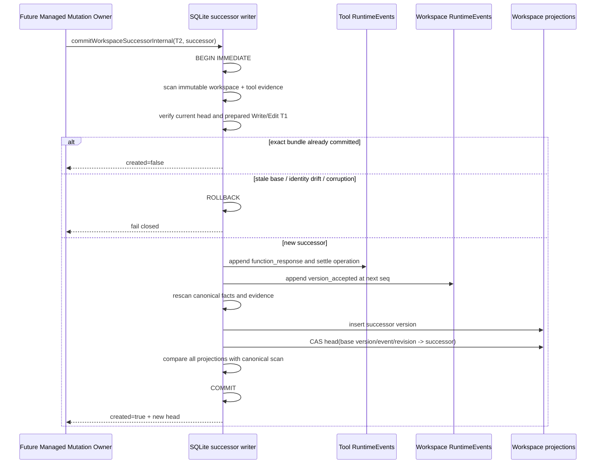

# Managed Workspace Mutation Version Authority v1

- 状态：M2.1 核心实现已落地；Git candidate owner 与生产 Write/Edit composition 尚未接入
- 更新日期：2026-08-08
- 主要不变量：工具成功结果、successor workspace fact、version projection 与 canonical head 推进只能全可见或全不可见
- canonical source：immutable RuntimeEvents
- 写入 owner：storage-internal successor bundle writer
- 原子性边界：单个 SQLite `BEGIN IMMEDIATE ... COMMIT`

## 1. 本切片解决什么

M0 只允许一个 epoch 接受 baseline。M2.1 把 authority spine 扩展成可推进的版本链：

```text
epoch_opened(seq=1)
baseline_accepted(seq=2, head revision=1)
version_accepted(seq=3, head revision=2)
version_accepted(seq=4, head revision=3)
...
```

一次 Write/Edit 只有在以下四部分位于同一个 SQLite transaction 时才可对外宣称成功：

```text
tool function_response (T2)
+ maka.workspace.version_accepted RuntimeEvent
+ runtime_workspace_versions successor projection
+ runtime_workspace_heads compare-and-set
```

任何一项失败都回滚全部写入。不能先提交 T2 再“尽力”更新 workspace head，也不能先推进 head 再补工具结果。

## 2. Owner、失败状态与回滚

| 项目 | 决策 |
|---|---|
| fact contract / pure scanner | `@maka/core` |
| bundle writer | `@maka/storage` 内部 WeakMap capability；不从 package root 导出 |
| canonical evidence | workspace authority facts + 被 successor 引用的 tool call/dispatch/response facts |
| disposable state | `runtime_workspace_versions`、`runtime_workspace_heads` |
| 并发裁判 | SQLite write transaction + base version/event/revision 三元 CAS |
| exact retry | outcome、successor fact 与当前 head 全部一致时返回 `created=false` |
| stale writer | base head 任一字段不一致即拒绝，不覆盖新 head |
| corruption | malformed fact、断链、重复 version identity、tool evidence 不匹配全部 fail closed |
| 运行时回滚 | transaction 未提交时 T2/fact/projection/head 全部回滚 |
| 版本回滚 | schema 11 不能由只支持 schema 10 的 binary 打开；降级使用升级前备份 |

## 3. v1 successor fact

```ts
{
  kind: 'maka.workspace.version_accepted',
  version: 1,
  payload: {
    protocol: 'workspace_version_accepted_v1',
    repositoryId,
    workspaceId,
    workspaceEpochId,
    workspaceVersionId,
    objectFormat,
    parents: [parentWorkspaceVersionId],
    origin: {
      kind: 'tool_mutation',
      operationId,
      dispatchEventId,
      outcomeEventId
    },
    baseAcceptedEventId,
    baseHeadRevision,
    commitOid,
    treeOid,
    policyHash,
    treeDeltaDigest,
    changedFileCount,
    deletedFileCount,
    executionProfileDigest
  }
}
```

Strict decoder 拒绝额外字段、未知 kind/version/protocol、非法 ID/OID/digest、空 parent、多 parent、非安全计数和自指 version。

Scanner 还必须证明：

- successor 与 epoch 的 repository/workspace/epoch/object format/policy 完全一致；
- `parents[0]`、`baseAcceptedEventId`、`baseHeadRevision` 同时指向扫描时的 current head；
- authority `event_seq` 连续，不能跨过或重放旧 revision；
- workspace version identity 在整个 authority 中唯一；
- origin 引用的是同一条无 corruption 的 Write/Edit `reconcile` operation；
- `dispatchEventId` 与 `outcomeEventId` 精确指向该 operation 的 immutable T1/T2 facts。

最后两项在 SQLite canonical reader/rebuild 中对同一 snapshot 的 RuntimeEvents 运行 tool-ledger scanner 后交叉验证；不能由 tool projection 或 caller 自报代替。

## 4. 原子 bundle 时序



## 5. Schema 11

Schema 11 保留 schema 10 的 baseline rows，并扩展 `runtime_workspace_versions`：

- `origin_kind` 支持 `baseline | tool_mutation`；
- mutation row 持久化 operation/dispatch/outcome、base revision 与 execution profile digest；
- CHECK 约束禁止 baseline row 夹带 mutation 字段，也禁止 mutation row 缺少因果字段；
- `runtime_workspace_heads` 重新建立到新 version table 的复合外键。

RuntimeEvents 仍是唯一事实源。projection 删除后可重建；canonical fact 或 tool evidence 损坏时 rebuild 不得先清空旧 projection。

## 6. 当前边界与后续施工

M2.1 **没有**证明 Git candidate 来自真实 owned worktree，也没有生产 Write/Edit consumer。因此当前接口保持 storage-internal，不能由 Desktop/CLI 或普通 runtime caller 直接拼装 OID 调用。

M2.2 必须补：

- operation-bound candidate ref/commit 的唯一 Git owner；
- base accepted head 与 execution profile 复验；
- candidate delta/path policy；
- orphan candidate GC 与 promote 的 crash convergence；
- Linux/macOS/Windows Git ref、worktree 与文件系统能力矩阵。

M2.3 必须补：

- T1 前冻结 base head、execution profile、mutation identity；
- owner-bound mutating worker；
- candidate evidence 到本 bundle writer 的唯一生产 composition；
- production-shaped crash test 后才能接 Desktop/CLI。

## 7. 当前验证

- strict successor decode/scanner 与 causal head advancement；
- exact retry 不重复写 fact/version/head；
- successor event insert 后 failpoint 证明 T2/fact/projection/head 全回滚；
- canonical origin 被篡改后 reader fail closed；
- schema、SQLite multi-process 与既有 recovery 定向 suites 保持通过。

这一组验证只证明 M2.1 的 persistence authority，不代表 M2 整体完成。
