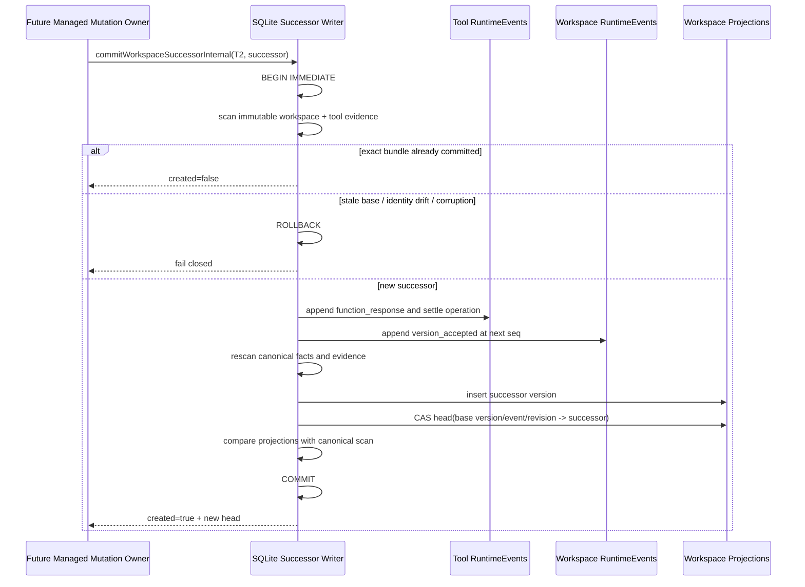

# Managed Workspace Mutation Version Authority v1

- 状态：M2.1 切片实现完成；已从最新 `upstream/main` 平铺重建，保持 Draft 等待 M2.4 生产消费者
- 更新日期：2026-08-17
- 主要不变量：工具成功结果、successor workspace fact、version projection 与 canonical head 推进只能全可见或全不可见
- canonical source：immutable RuntimeEvents
- 写入 owner：storage-internal successor bundle writer
- 原子性边界：单个 SQLite `BEGIN IMMEDIATE ... COMMIT`

## 1. 本切片解决什么

M0 只允许一个 epoch 接受 baseline。M2.1 把 authority spine 扩展成可推进的版本链：

```text
epoch_opened(seq=1)
baseline_accepted(seq=2, head revision=1)
version_accepted(seq=3, head revision=2)
version_accepted(seq=4, head revision=3)
...
```

一次 Write/Edit 只有在以下四部分位于同一个 SQLite transaction 时才可对外宣称成功：

```text
tool function_response (T2)
+ maka.workspace.version_accepted RuntimeEvent
+ runtime_workspace_versions successor projection
+ runtime_workspace_heads compare-and-set
```

任何一项失败都回滚全部写入。不能先提交 T2 再“尽力”更新 workspace head，也不能先推进 head再补工具结果。

本切片故意不接真实 Write/Edit：调用者还不能自行声称某个 Git commit/tree 是可信 candidate。这个证明属于
M2.2 的 Git candidate owner；M2.1 只建立其唯一持久化出口。

## 2. Owner、失败状态与回滚

| 项目 | 决策 |
|---|---|
| fact contract / pure scanner | `@maka/core/workspace-version-authority` |
| bundle writer | `@maka/storage` 内部 WeakMap capability；不从 package root 导出 |
| canonical evidence | workspace authority facts + successor 引用的 tool call/dispatch/response facts |
| disposable state | `runtime_workspace_versions`、`runtime_workspace_heads` |
| 并发裁判 | SQLite write transaction + base version/event/revision 三元 CAS |
| exact retry | immutable outcome 与 successor fact 精确一致时返回该 operation 原先接受的 head；后续合法 head 推进不改变历史结果 |
| stale writer | base head 任一字段不一致即拒绝，且对应 tool operation 保持 `prepared` |
| corruption | malformed fact、断链、重复 version identity、tool evidence 不匹配全部 fail closed |
| 运行时回滚 | transaction 未提交时 T2/fact/projection/head 全部回滚 |
| 数据升级 | schema 12 baseline rows 原样升级到 schema 13；schema 13 不支持向旧 binary 降级 |

“唯一 writer”不是注释：普通 RuntimeEvent writer 仍拒绝 workspace fact；successor writer 仅能通过
`workspace-version-authority-internal.ts` 中与具体 store 实例绑定的 capability 调用。

## 3. v1 successor fact

```ts
{
  kind: 'maka.workspace.version_accepted',
  version: 1,
  payload: {
    protocol: 'workspace_version_accepted_v1',
    repositoryId,
    workspaceId,
    workspaceEpochId,
    workspaceVersionId,
    objectFormat,
    parents: [parentWorkspaceVersionId],
    origin: {
      kind: 'tool_mutation',
      operationId,
      dispatchEventId,
      outcomeEventId
    },
    baseAcceptedEventId,
    baseHeadRevision,
    commitOid,
    treeOid,
    policyHash,
    treeDeltaDigest,
    changedFileCount,
    deletedFileCount,
    executionProfileDigest
  }
}
```

Strict decoder 拒绝额外字段、未知 kind/version/protocol、非法 ID/OID/digest、空 parent、多 parent、非安全计数和
自指 version。

Scanner 还必须证明：

- successor 与 epoch 的 repository/workspace/epoch/object format/policy 完全一致；
- `parents[0]`、`baseAcceptedEventId`、`baseHeadRevision` 同时指向扫描时的 current head；
- authority `event_seq` 连续，不能跨过或重放旧 revision；
- workspace version identity 在整个 authority 中唯一；
- origin 引用的是同一条无 corruption 的 Write/Edit `reconcile` operation；
- `dispatchEventId` 与 `outcomeEventId` 精确指向该 operation 的 immutable T1/T2 facts；
- T2 必须是成功的 `function_response`；`isError: true` 不能创建 successor，也不能通过 rebuild。

最后两项在 SQLite canonical reader/rebuild 中对同一 snapshot 的 RuntimeEvents 运行 tool-ledger scanner 后交叉
验证；不能由 tool projection 或 caller 自报代替。

## 4. 原子 bundle 时序



## 5. Schema 13

Schema 13 保留 schema 12 baseline rows，并扩展 `runtime_workspace_versions`：

- `origin_kind` 支持 `baseline | tool_mutation`；
- mutation row 持久化 operation/dispatch/outcome、base revision 与 execution profile digest；
- CHECK 约束禁止 baseline row 夹带 mutation 字段，也禁止 mutation row 缺少因果字段；
- `runtime_workspace_heads` 重新建立到新 version table 的复合外键；
- populated schema 12 fixture 证明 baseline/head 在升级后保持可读，并可继续接受 revision 2。

RuntimeEvents 仍是唯一事实源。projection 删除后可以重建；canonical fact 或 tool evidence 损坏时 rebuild 不得先
清空旧 projection。

## 6. Crash / concurrency matrix

| 故障点 | 可见状态 | 恢复结论 |
|---|---|---|
| T2 写入前 | operation 仍为 `prepared`，head 不变 | 可由未来 mutation owner 重试 |
| successor event insert 后异常 | T2、fact、projection、head 全回滚 | reopen 仍看到旧 head |
| projection insert 后异常 | transaction 回滚 | 不存在“fact 有、head 没有”的半状态 |
| head CAS 前已有另一 successor | stale writer 被拒绝 | 不结算 stale operation |
| COMMIT 成功、响应丢失 | exact retry 返回 `created=false` | 不重复写 T2/fact/version |
| 更晚 successor 已推进 head 后重试旧 operation | 返回旧 operation 原先接受的 successor | current head 由独立读取返回，不篡改历史重试结果 |
| fact/tool evidence 被篡改 | canonical reader fail closed | projection 不能掩盖 corruption |

SQLite transaction 提供三平台一致的数据库原子性；本切片不声称 Git ref、目录 rename 或 workspace 文件内容已经
与该 transaction 原子绑定，那是 M2.2/M2.4 的责任。

## 7. 后续 PR 切片

### M2.2 — Git mutation candidate owner（当前实现切片）

主要不变量：只有 Git artifact owner 能把一个 operation-bound candidate 证明为 base head 的合法 successor。

- owner：managed Git workspace service；
- 原子边界：candidate ref/commit publication 与 durable candidate receipt；
- 失败状态：base drift、额外路径、ignored mutation、artifact missing、unknown metadata 全部 park/fail closed；
- 回滚：未被 SQLite 接受的 candidate 是 orphan，可按 receipt/ref 证明后回收；
- 不做：不写 T2，不推进 workspace head，不接 Desktop/CLI。

详细合同见
[Managed Workspace Git Mutation Candidate Owner v1](./runtime-managed-workspace-git-mutation-candidate-owner-v1.zh-CN.md)。

该 PR 在 M2.4 消费者存在前保持 Draft。

### M2.3 — Mutation execution admission

主要不变量：T1 前冻结 base workspace head、execution profile、operation identity 和 candidate lease；T1 后禁止切换
attached/managed mode 或退回旧直接写路径。

- owner：Runtime Host managed mutation admission；
- 原子边界：T1 durable dispatch 选择 `managed_mutation_v1`；
- 失败状态：能力缺失、scope 失效、base/head/profile 不一致均在工具副作用前拒绝；
- 回滚：T1 前失败走标准 tool error；T1 后不确定状态保持 unsettled，交给 M2.4 收敛。

该 PR 不新增第二套 workspace writer，只能消费 M2.1/M2.2 的 opaque capabilities。

### M2.4 — Write/Edit production composition

主要不变量：真实 Write/Edit 的成功只能来自“owned candidate 已验证 + M2.1 bundle 已提交”。

- 把 owner-bound worker、candidate capture 与 successor bundle 串成唯一生产路径；
- 增加真实 Host kill/reopen crash matrix；
- 保持现有 tool result、permission、sandbox 与 cancellation 语义；
- 作为 M2.2/M2.3 的首个生产消费者，完成后才允许前三个切片转 Ready/依序合并。

M2.4 不接 workspace-bound continuation；那属于 M3。

## 8. 当前验证

- strict successor decode/scanner 与 causal head advancement；
- exact retry 不重复写 fact/version/head；
- exact retry 在后续 head 推进后仍返回 immutable 的原接受结果；
- 失败 Write/Edit outcome 在 writer 与 canonical rebuild 两处均被拒绝；
- stale successor 不结算对应 prepared operation；
- 真实 child process 在 successor transaction 内被杀后，reopen 证明 T2/fact/projection/head 全回滚；
- 真实 child process 在 COMMIT 后被杀，reopen exact retry 收敛到同一 successor；
- populated schema 12 → 13 数据升级；
- canonical origin 被篡改后 reader fail closed；
- schema、SQLite multi-process 与既有 recovery 定向 suites 保持通过。

这一组验证只证明 M2.1 的 persistence authority，不代表 M2 整体完成，也不提升当前用户可见 resume 能力。
