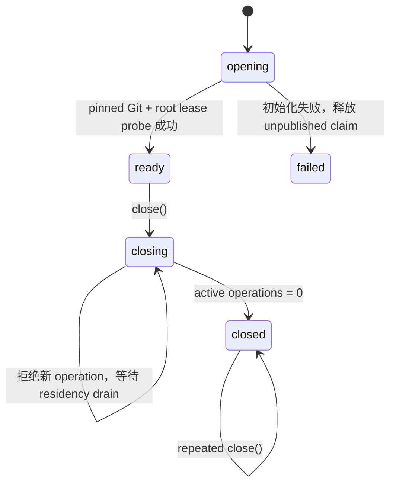

# Managed Workspace Owner v1：M0 生命周期门

- 状态：实现完成；Git Workspace Service 与 Workspace Version Authority 合并后平铺重建
- 更新日期：2026-08-02
- 主要不变量：一个 authenticated interactive storage-root owner 在其生命周期内至多发布一个
  managed workspace owner；已经 admission 的 workspace 操作必须在关闭前 drain
- artifact owner：`GitWorkspaceService`
- lifecycle owner：`ManagedWorkspaceOwner`
- canonical workspace history：仍由 Workspace Version Authority 拥有；M0 composition 只允许 owner 的
  `openManagedWorkspaceBaseline(...)` 通过 storage-internal writer 写入 baseline RuntimeEvents

## 1. 为什么需要独立 owner

`GitWorkspaceService` 能创建、验证、repair 与 quarantine Maka-owned Git artifacts，但它是一个
operation-scoped service；仅有它还不能回答：

- 哪一个 host 有权在当前 storage root 上驱动这些操作；
- 初始化进行中或失败时，是否可能发布半个可用 owner；
- shutdown 与进行中的 Git 操作谁先完成；
- Desktop、CLI 与 runtime-host 是否可能各自绕过同一生命周期门。

本切片把现有 authenticated `InteractiveRootOwner` 作为上层 lease authority。它不增加第二个 OS
owner lock，也不通过路径自行证明 ownership。

## 2. Owner、边界、失败状态与回滚

| 项目 | 决策 |
|---|---|
| 唯一 owner | 一个真实 `InteractiveRootOwner` 对象只能组合一个 `ManagedWorkspaceOwner` |
| 初始化边界 | pinned Git digest 验证与 storage-root authority probe 全部运行在 root write lease 内 |
| operation admission | 仅 `ready` 可 admission；每项操作同时持有 managed-owner residency 与 root lease operation |
| shutdown | `ready -> closing -> closed`；`closing` 拒绝新操作并等待已 admission 操作 drain |
| 初始化失败 | 返回 `managed_workspace_owner_unavailable`，释放未发布 claim，允许同一 root owner 修正后重试 |
| 重复组合 | 返回 `managed_workspace_owner_conflict` |
| drift | 不返回 drifted cwd；receipt/artifact 复验发现 drift 时 fail closed；复验后 reopen 竞态发现 drift 时 durable quarantine |
| 回滚 | 不接 Desktop/CLI/runtime-host，不改变 attached mode；可删除本 owner 而不改变 Git artifacts 或 RuntimeEvents |

owner 不关闭外层 `InteractiveRootOwner`。Runtime Host 仍拥有 root owner 的最终关闭顺序；managed owner
必须先关闭。反过来，如果 root owner 已开始关闭，lease revalidation 会阻止新的 managed operation。

## 3. 公开状态机

`opening` 与 `failed` 不作为已发布 owner 的可见状态。factory 只有在初始化完成并再次确认 root owner
仍然有效后才返回 `ready` owner。

## 4. Workspace gate

owner 的 public surface 只开放一个 workspace admission 操作：

1. `openManagedWorkspaceBaseline(store, identity)` 从 eligible clean source 创建/exact-adopt artifact，
   持久化并复验 receipt，再由 storage-internal writer 接受 canonical baseline。

artifact-only create/open 和 `GitWorkspaceService` factory 不从 package root 导出。调用者不能在 SQLite
acceptance 前取得 `worktreePath` 或裸 `ManagedWorkspaceBinding`。入口返回前必须验证 worktree、index、
HEAD、tree、ownership lock、canonical `runtime.sqlite` pathname/inode 与 durable receipt；任何失败都不能把
cwd 交给工具。

本切片不扫描目录来猜测 workspace identity。Baseline Open Bundle 通过 Git artifact owner 的 durable
receipt 与 canonical workspace authority 绑定 exact identity；未接受 Git artifact 属于 orphan GC 范畴。

## 5. Crash 与并发证明

| 场景 | 必须结果 |
|---|---|
| 同一 root owner 两次 open | 一个 ready；另一个 owner conflict |
| pinned Git 初始化失败 | 不发布 owner；修正 digest 后可重试 |
| operation admission 后 close | close 等待 operation；新 operation 被拒绝 |
| root owner 同时 close | root close 与 managed close 都等待同一 lease-bound operation |
| external drift 后 reopen | receipt/artifact 复验 fail closed；若发生在复验与 reopen 之间则 durable quarantine |
| repeated close | exact no-op，不重复释放外层 root owner |

Git artifact create/quarantine 的进程崩溃矩阵继续由 `GitWorkspaceService` 负责；本 owner 不复制第二套
repair 状态机。Baseline Open Bundle 将补充“startup 时先验证 canonical receipt，再按 exact binding
reopen/repair，最后才允许 baseline authority read”的组合顺序。

## 6. 平台能力矩阵

| 能力 | Linux | macOS | Windows |
|---|---|---|---|
| owner uniqueness / lifecycle | 支持 | 支持 | 支持 |
| root lease-bound operation drain | 支持 | 支持 | 支持 |
| pinned Git initialization | 支持 | 支持 | 支持 |
| external drift quarantine | 支持 | 支持 | 有限支持，沿用 Git service 的 Windows 承诺 |
| power-loss durability | 不承诺 | 不承诺 | 不承诺 |

## 7. 明确延期

- Desktop、CLI、runtime-host 接线与 managed-mode 设置；
- filesystem worker、mutation coordinator 与工具 cwd 切换；
- candidate refs、mutation repair、GC、replication outbox；
- ignored dependencies、build/test environment provisioning；
- Durable Write、workspace-bound continuation 与自动 resume。

这些能力不能借 owner lifecycle PR 顺手接入。下一个 M0 slice 是 Baseline Open Bundle：它会成为本
owner 的第一个 canonical-fact consumer，并证明 Git baseline 与 RuntimeEvent baseline 不会只成功一半。
