# Chapter 8: Resume Is Not Retry—How Maka Continues Safely from Crash Facts

> This chapter answers a deceptively dangerous question: when Maka crashes while a model is calling a tool, how can a restart tell what happened, what may continue, and what must stop for human attention? The answer is: **recover facts from immutable RuntimeEvents, let one RecoveryResolver classify tool state, and create a new Run only when history, execution, and workspace boundaries are all provably safe. Resume never resurrects the old process or disguises “try again” as recovery.**

This chapter is for engineers entering Maka Runtime for the first time. The first half builds intuition with an interrupted file write. The second half explains Phases 0–4, Desktop and CLI integration, T1/T2, recovery decisions, workspace versions, and the recommended implementation sequence.

It describes `main` as verified on 2026-07-31:

- Phases 0–2 are implemented.
- Phase 3A recovery-fact atomic write authority and the Resolver are implemented.
- Immutable continuation boundaries, durable claims, and provider-call T1 are implemented.
- The production workspace mutation coordinator, effect reconciler, and complete host-owner lifecycle remain future work.
- Git-native managed workspaces, workspace versions, isolated restore, and durable rebaseline are not implemented.

Roadmap documents describe targets. Code and contract tests remain the authority for current behavior. This chapter always separates implemented behavior from planned work.

## Start with one crash

Suppose the model asks Maka to change the port in `config.json` from `3000` to `4000`. The tool starts writing and the application crashes at exactly the wrong time.

After restart, the system cannot ask only whether the log contains a tool result. A missing result has at least four explanations:

1. The tool never started.
2. The tool started but did not write the file.
3. The file already contains `4000`, but the result was not committed.
4. The file was written and then changed again by a user or another process.

Always retrying can duplicate the side effect in case 3. Always declaring success gives the model a false history in cases 1, 2, and 4.

Resume therefore has to answer three independent questions:

| Question | Plain-language meaning | Current owner |
|---|---|---|
| How does the old Run close? | Turn a Run left forever in `running` into an explicit terminal attempt | startup recovery + terminal RuntimeEvent |
| What state is each tool operation in? | Completed, definitely not dispatched, unknown, parked, or corrupt | `RecoveryResolver` |
| May the model continue? | Is history legal, and do workspace, tools, and background work still match? | continuation planner + host safety inspector |

These cannot be compressed into one `resume=true`. Repairing the old Run does not prove a side effect. Completing a tool operation does not prove the current workspace still matches its history.

## The answer first

The smallest useful mental model is:

```text
old process disappears
  → reopen durable facts
  → repair the old Run's terminal state
  → let RecoveryResolver interpret every tool operation
  → let the host inspect workspace / tool catalog / background work
  → safe: create a new Run / Invocation / Turn
  → unsafe or unprovable: park
```

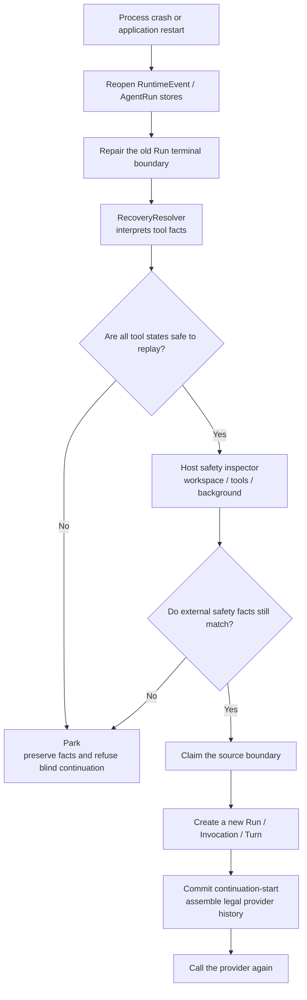

Five rules carry most of the design:

1. Resume creates a new execution. It does not revive an old socket, Promise, JavaScript stack, or OS process.
2. `RuntimeEvent` is the only canonical recovery-fact source.
3. A missing result is not failure and does not prove that the tool did not run.
4. When safety cannot be proved, the system parks. Model self-report cannot raise the evidence level.
5. Workspace identity proves “this is the same workspace,” not “every file still has the old contents.”

## Translate the terminology first

The rest of the chapter repeatedly uses these terms:

| Term | Plain-language meaning here |
|---|---|
| durable | The record survives process death and application restart |
| canonical | The record with final interpretive authority when sources disagree |
| projection | A view computed from canonical records and rebuildable after deletion |
| high-water | The exact immutable-log position covered by a plan |
| park | Preserve state and stop automatic execution pending stronger evidence or a human |
| fail closed | Refuse to continue under uncertainty instead of guessing that it is safe |
| reconcile | Observe the outside world again to determine whether an earlier side effect completed |
| continuation | A new execution built from trusted history, not an old execution revived in place |

So “create a continuation fail-closed from a canonical high-water” simply means:

> Use only formally committed history, remember exactly where it ends, stop when uncertain, and create a new execution only after proving safety.

## Repair, Resume, and Reconcile are different

These three words are easy to mix up:

| Term | Subject | Result |
|---|---|---|
| Repair | Durable state of an old Run | Align terminal RuntimeEvent, Run header, and Turn state |
| Resume / Continuation | A history boundary already proved safe | Create fresh identities and continue the provider loop |
| Reconcile | A tool operation with T1 but no T2 outcome | Observe the external world and commit either completed or parked |

The usual order is repair, then resolve or reconcile, and only then resume. Repair alone is already useful: the UI no longer shows “running” forever, and the user can inspect an explicit failed or interrupted Turn.

## What Phases 0–4 actually mean

The phases are not five separate implementations. Each one adds a kind of fact the system can prove.

| Phase | Question it answers | Current status |
|---|---|---|
| Phase 0 | Given only committed RuntimeEvents, is this prefix safe to replay? | Implemented |
| Phase 1 | At a complete safe boundary, may the Runtime create a new Run? | Implemented, feature-flagged |
| Phase 2 | Can T1 be guaranteed before tool execution and T2 before returning the result? | Implemented in SQLite canonical mode |
| Phase 2.5 / 3A PR A | Who owns recovery facts, how do conflicts fail closed, and how is a bundle atomic? | Implemented |
| Later Phase 3 | Can tool-specific evidence settle an unknown side effect? | Designed; no production reconciler wiring |
| Workspace plane | Can a Runtime boundary bind to an accepted Git workspace version for restore or rebaseline? | Designed |

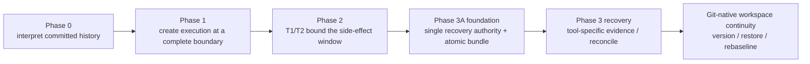

Phase 2 does not replace Phases 0 and 1. Their replay and continuation gates remain active. Phase 2 gives those gates better evidence about whether execution crossed the tool-dispatch boundary.

## Four orthogonal planes

Resume coupling is easiest to understand as four planes:

| Plane | Question | What it may not decide |
|---|---|---|
| Operation | Did one tool side effect settle? | It cannot approve provider continuation by itself |
| Continuation | Which immutable history will the new provider request see? | It cannot guess workspace contents |
| Workspace | Does the filesystem correspond to this history boundary? | A checkpoint provider cannot own execution admission |
| Host | Who owns stores, workers, background recovery, and shutdown order? | UI and CLI cannot invent separate recovery state machines |

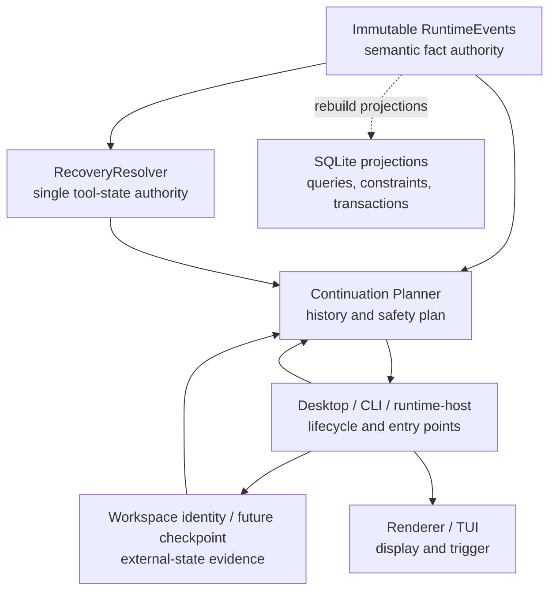

The dotted edge means `tool_operations` and `tool_journal_events` can be rebuilt from RuntimeEvents. They are projections and cannot overwrite canonical events.

## Facts versus views

Safety does not come merely from putting everything in SQLite. It comes from assigning one owner to each kind of data.

| Data | Nature | Purpose |
|---|---|---|
| Immutable `RuntimeEvent` | Canonical semantic fact | Model history, tool call/dispatch/outcome, recovery observation/decision, terminal fact |
| `AgentRunHeader` and AgentRun events | Durable operational envelope | Attempt identity, status, lineage, and diagnostics |
| `tool_operations` | SQLite projection | Fast current-state lookup for an operation |
| `tool_journal_events` | SQLite projection | Fast prepared/outcome/recovery transition lookup |
| Session messages / Turn state | Product and UI projection | Conversation and Turn display, not recovery judgment |
| Mutable partial snapshot | Streaming UI projection | May be discarded or rebuilt; never enters an immutable cursor |
| `.maka-workspace.json` | Workspace identity marker | Logical identity, not file contents |
| Future checkpoint artifact | Workspace carrier | Workspace state corresponding to one Runtime boundary |

The API and database enforce RuntimeEvent authority:

- generic writers cannot persist dispatch, operation-linked outcome, or recovery facts;
- T1, T2, and recovery bundle each have a dedicated writer;
- journal rows reference their RuntimeEvent;
- exact retry must match bytes and identity;
- conflicting retry, orphan facts, lane smuggling, and identity drift are rejected;
- projections must rebuild equivalently from immutable events.

## Five identities that must stay separate

| Identity | Question |
|---|---|
| `sessionId` | Which long-lived interaction owns this work? |
| `turnId` | Which user-visible round is this? |
| `runId` | Which durable execution attempt is this? |
| `invocationId` | Which model/tool flow invocation is this? |
| `operationId` | Which concrete tool side-effect attempt is this? |

A continuation creates fresh `runId`, `invocationId`, and `turnId` values and records:

```text
continuationSource = {
  sourceInvocationId,
  sourceRunId,
  sourceTurnId,
  sourceRuntimeEventHighWater
}
```

`providerToolCallId` still pairs provider-native calls and results. `operationId` identifies the Runtime, SQLite, and future external-idempotency attempt. They are not interchangeable.

## Normal tool execution: T1 and T2 surround the side effect

After the model emits a tool call, `ToolRuntime` completes argument, availability, loop, permission, Runtime ownership, and other preflight checks. Only then may it cross T1.

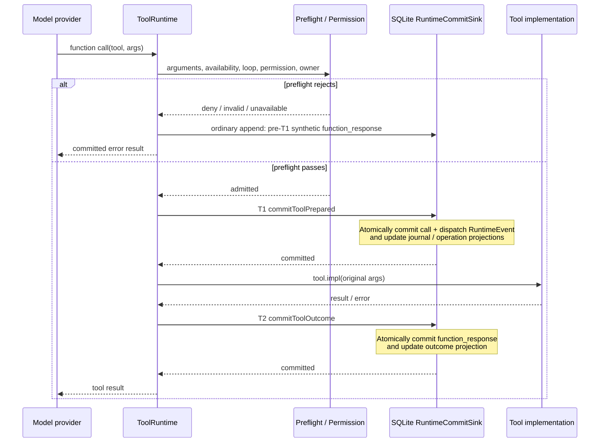

### What T1 means

The T1 dispatch RuntimeEvent means:

> Runtime passed every pre-execution guard. It is no longer safe to assume the implementation did not run.

It does not mean the side effect happened or the tool succeeded.

One short SQLite transaction:

1. validates or commits the canonical function call;
2. commits a model-invisible `actions.toolDispatch` RuntimeEvent;
3. recomputes and checks `canonicalArgsHash` from the real call;
4. creates prepared journal and operation projections;
5. commits.

If T1 fails, `tool.impl` must be called zero times.

### What T2 means

T2 turns the tool result into a canonical function response:

1. read and verify operation identity;
2. commit the function-response RuntimeEvent;
3. update outcome journal and operation projection;
4. commit.

The result cannot reach the next model step before T2 succeeds. If T2 fails after implementation returned, Runtime still cannot publish that uncommitted result to the model.

### Why the tool does not run inside one long transaction

Files, Shell commands, network APIs, and child agents can run for seconds or hours. A SQLite transaction cannot cover those external effects without pretending to be a distributed transaction.

The real shape is:

```text
short T1 transaction
  → external side-effect window
  → short T2 transaction
```

Resume must interpret the unknown interval honestly.

## Crash position determines the conclusion

The full P0–P11 catalog lives in the [Phase 0 Crash Contract](./runtime-resume-phase0-crash-contract.md). The simplified state machine is:

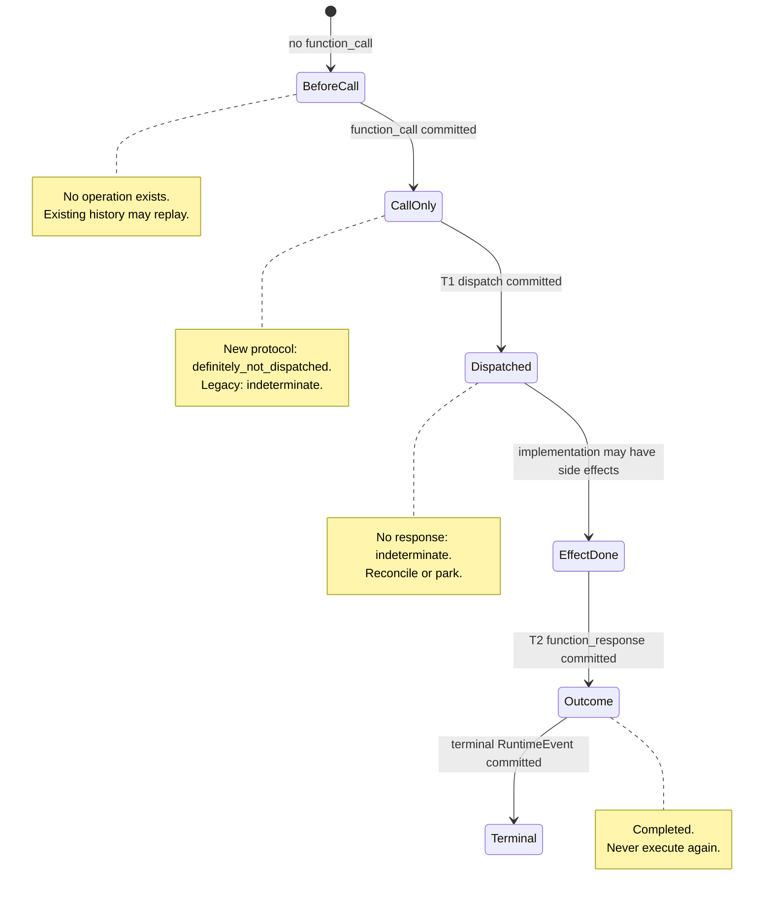

The Resolver decision table:

| Immutable facts | Decision | Consequence |
|---|---|---|
| call + matching response, no dispatch | `completed` | Pre-T1 synthetic result or legacy completed result |
| call + dispatch + matching response | `completed` | Reuse; do not rerun |
| call + dispatch, no response | `indeterminate` | Requires reconcile; continuation currently blocks |
| call, no dispatch/response, first event declares new protocol | `definitely_not_dispatched` | Proven not to have crossed T1; automatic policy still needs an explicit later phase |
| same gap under legacy/unknown protocol | `indeterminate` | Absence of an old dispatch fact proves nothing |
| completed recovery bundle | `completed` | Use its matching outcome |
| parked recovery bundle | `parked` | Permanent v1 stop; no second attempt |
| orphan, duplicate, identity/hash/order conflict | `corruption` | Fail closed |

The legacy rule matters: only a Run whose first event declares `toolBoundary: "t1_after_preflight_v1"` may interpret missing dispatch as definitely not dispatched.

## Phase 0: understand the committed prefix first

Phase 0 is pure:

```text
committed RuntimeEvents
  → RecoveryResolver
  → ToolOperation projection
  → ResumePlan(safe_replay | blocked)
```

It does not run tools, create a new Run, restore the workspace, or mutate the ledger.

It also builds legal provider replay:

- discard mutable partials;
- keep only paired function calls and responses;
- never feed an unresolved call back to the provider;
- keep terminal facts canonical without turning them into user input;
- reject a high-water mismatch as `runtime_offset_mismatch`.

The Phase 0 process harness uses a real child process and file-backed store. The parent kills the child after complete append promises resolve, reopens the store, and requires two identical, non-mutating projections. This proves process-crash committed-prefix semantics, not power-loss durability.

## Startup recovery closes the old Run first

Desktop startup repairs state before it invokes a model.

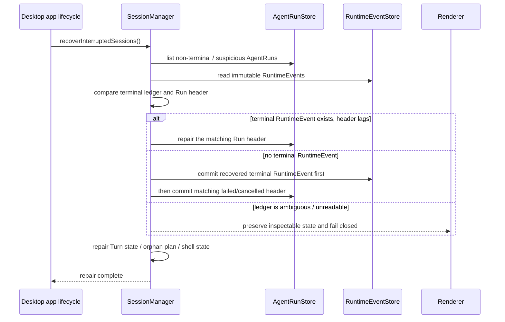

The invariant is:

> The terminal RuntimeEvent commits before the terminal Run header. A header cannot declare completion without its semantic fact.

A second crash between those commits remains repairable from the terminal event. Desktop also recovers Graph coordination. Automatic continuation is considered only after those repairs and only when the feature flag is enabled.

## Phase 1: create a new execution at a safe boundary

Phase 1 does not resolve unknown side effects. It continues only when every accepted tool call already has a committed outcome.

Planner gates include:

- readable source Run and RuntimeEvent ledger;
- exactly one terminal event matching the Run header;
- one source execution identity across events;
- Phase 0 `safe_replay`;
- no pending permission;
- no unsettled background, Shell, or child operation;
- matching current and source workspace identity;
- every historical tool still available;
- provider history begins at a user boundary and ends at a user or tool boundary;
- fresh Run, Invocation, and Turn IDs;
- any host-supplied checkpoint has a ref, is restored, and covers the same high-water.

A `continue` plan is not an execution lease. Immediately before execution, `RuntimeKernel` rereads:

- source identity and terminal state;
- RuntimeEvent high-water and replay context;
- workspace identity;
- background operations;
- tool catalog;
- checkpoint ref and high-water;
- an existing continuation for the same source boundary;
- target Run identity.

Any change becomes a stable revalidation error.

## Complete manual Resume sequence

The Desktop renderer supplies only `sessionId`. It cannot self-report that the workspace is safe.

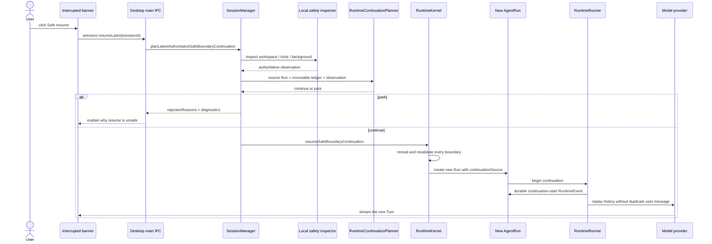

CLI/TUI `/resume` uses the same `SessionManager` plan/execute seam. Desktop startup auto-resume also reuses it.

## Why continuation does not duplicate the user message

A normal Run creates an initial user RuntimeEvent. A continuation already has a validated source history, so it:

1. does not create a duplicate user event;
2. first commits a system-owned, model-invisible continuation-start RuntimeEvent;
3. records source identity and high-water in the new Run;
4. sends the validated history directly to the provider.

This avoids duplicate requests and prevents a completed tool call from running merely because the system created a new Turn.

Multi-generation continuation currently follows `continuationSource` through ancestor Runs and assembles legal segments oldest-first. Planned PR B will replace the current `events.length` high-water and in-process claim with immutable event-seq, domain-separated prefix digest, and a database uniqueness claim.

## What workspace identity proves

The local safety inspector:

1. reads Session cwd;
2. resolves a canonical path with `realpath`;
3. reads or creates the UUID in `.maka-workspace.json`;
4. returns `workspace:v1:<uuid>`;
5. checks available tools and pending background operations.

A path move is diagnostic; marker identity mismatch is a hard gate. This proves the logical workspace identity, not its contents. Content continuity requires an accepted Git-native workspace version.

## Phase 2: SQLite is the durable RuntimeEvent store

A JSONL host without `RuntimeCommitSink` cannot declare the T1 protocol. Only when the host wires the SQLite store as both `RuntimeEventStore` and `RuntimeCommitSink` may the AiSdk tool path declare `t1_after_preflight_v1` on the first Run event.

```text
open a RuntimeEvent writer
  → create or migrate runtime.sqlite
  → batch-idempotently import legacy RuntimeEvent JSONL
  → write RuntimeEvents only to SQLite
```

There is no backend-selection flag. Read-only inspection may read a legacy-only
workspace without creating a database; the first writer performs the one-way
import. Once `runtime.sqlite` exists, all readers use SQLite and never merge or
fall back to stale JSONL. JSONL remains for legacy import and explicit export.

## Phase 3A: atomically commit recovery facts

Phase 3A implements how trustworthy recovery output is stored. It does not yet wire a production observer/reconciler that generates the output.

A recovery bundle contains:

1. a reconcile observation;
2. an optional recovered outcome, only for proven completion;
3. a terminal `completed` or `parked` decision.

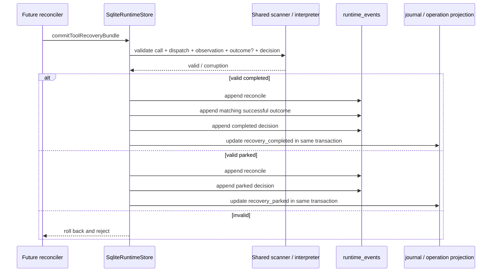

The writer, projection rebuild, and Resolver share one scanner/interpreter, so online, reopen, rebuild, and Resolver must agree on the same immutable ledger.

`parked` is terminal in v1. Only an exact bundle retry may converge idempotently. Reopening recovery would require a new versioned fact.

## Later Phase 3: file recovery only finalizes

Write/Edit recovery first needs durable evidence bound to:

- workspace identity and canonical target;
- operation/call/dispatch identity;
- before and expected-after identity;
- transform/algorithm version;
- production-shaped result;
- size, regular-file, symlink, and encoding boundaries.

| Observation | Action |
|---|---|
| `matches_expected_state` | Cleanup/finalize only; synthesize outcome and commit completed bundle |
| `matches_prior_state` | Park with `redo_disabled_pending_cas` |
| `diverged` | Park; do not overwrite outside changes |
| `unreadable` | Park; do not guess |

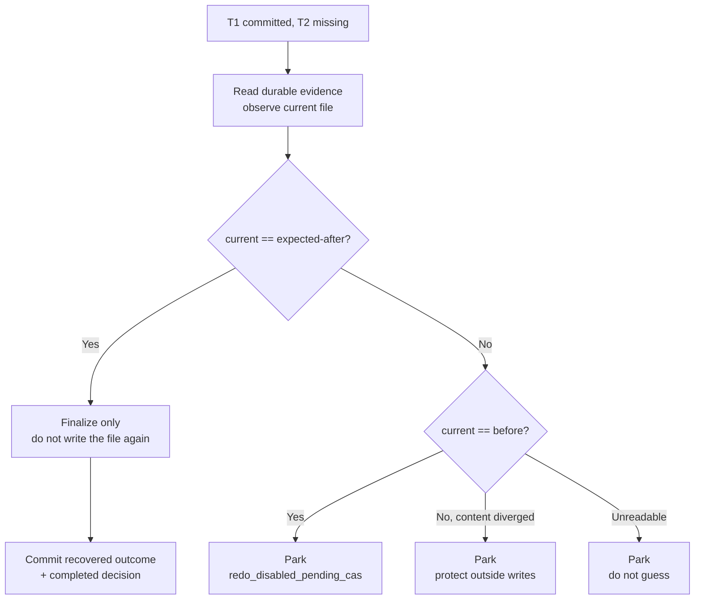

Atomic rename prevents torn files but does not provide conditional replacement. Without CAS, matching the prior state cannot authorize automatic redo.

Generic Bash, arbitrary remote APIs, send, publish, pay, and delete continue to park without a dedicated protocol.

## Phase 4: bind Runtime history to the workspace

> This section preserves the earlier checkpoint model to explain why a workspace boundary is needed.
> The current implementation route is the
> [Git-native Managed Workspace roadmap](./runtime-resume-git-native-workspace-roadmap.zh-CN.md):
> Git commit/tree becomes the managed-mode workspace artifact, while RuntimeEvent remains the sole
> acceptance authority.

Phase 1 proves history completeness. Phase 3 may settle one operation. Long tasks also need workspace-wide continuity.

```ts
interface WorkspaceBoundary {
  workspaceIdentity: string
  workspaceEpoch: number
  immutableRuntimeHighWater: number
  immutableRuntimeDigest: string
  checkpointRef: string
  checkpointPolicyHash: string
}
```

A checkpoint provider may capture, verify, and materialize. It may not approve resume.

### Capture

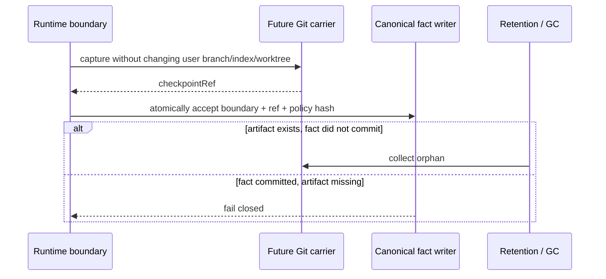

The Git carrier will use Maka-owned refs or separate object ownership. If Git is absent or the repository is ineligible, the host may provide native single-operation recovery but cannot claim a workspace snapshot.

### Isolated restore

Workspace drift should not overwrite the user's current directory:

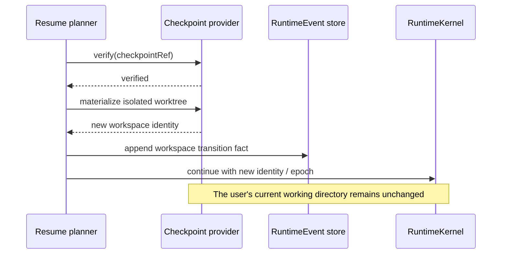

### Durable rebaseline

“Continue from current files” must be an audited transition:

1. capture the current workspace;
2. commit a new baseline fact;
3. increment `workspaceEpoch`;
4. require the model to reread affected files;
5. reference only the new boundary.

## How Resume couples to the system

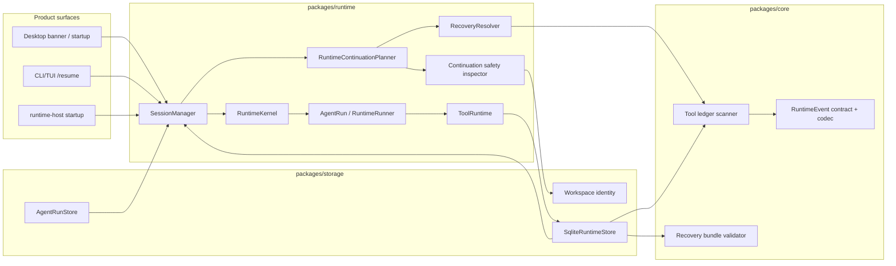

Layer responsibilities:

- `packages/core`: fact shapes, canonical codec, semantic lanes, scanner, and recovery-bundle causality;
- `packages/storage`: SQLite transactions and constraints, projection rebuild, import/export, workspace identity;
- `packages/runtime`: T1/T2 sequence, Resolver, planning, revalidation, lineage, startup repair;
- Desktop main, CLI, and runtime-host: concrete stores, tool catalog, background state, entry points, lifecycle;
- renderer and TUI: trigger and display only;
- Headless/Harbor: add workspace checkpoints and new Attempt semantics to Runtime high-water.

## Current host entry points

### Desktop

- Startup repairs interrupted Sessions and Graph before optional auto-resume.
- The interrupted banner calls `sessions:resumeLatest`.
- Main reads authoritative safety facts and performs planning/execution.
- Renderer passes only `sessionId`.
- Shutdown stops background capabilities before closing Runtime persistence.

### CLI/TUI

- Startup repairs interrupted Runs.
- `/resume` invokes the same latest authoritative plan.
- Park is shown as a stable diagnostic, not turned into a new user prompt.
- Close terminates Shell work before Session and Runtime stores.

### Runtime host

The Runtime host uses strict recovery stores. It does not silently turn an unreadable ledger into best-effort fallback before admitting new writes.

### Headless / Harbor

Runtime provides immutable history high-water and replay gates, but Attempt resume additionally needs:

- Task/Attempt identity;
- compaction summary ref;
- Git-managed workspace ref;
- lease/worktree identity;
- dirty/include policy;
- durable budget.

Without these, the system should record an explicit fallback to a new attempt-level retry, not call it workspace resume.

## The complete execution and recovery flow

1. Select durable mode at host startup; never switch canonical stores after T1.
2. Declare only protocol capabilities actually wired for the Run.
3. Complete every ToolRuntime preflight.
4. Atomically commit call, dispatch, and projection at T1.
5. Execute the external effect without a long database transaction.
6. Atomically commit T2 before publishing the result.
7. Commit terminal RuntimeEvent before terminal Run header.
8. On restart, repair the old Run first.
9. Resolve immutable facts into completed / not-dispatched / indeterminate / parked / corruption.
10. If a production reconciler exists, commit one atomic recovery bundle; otherwise park.
11. Check replay legality, workspace, tool catalog, and background work.
12. Revalidate and claim immediately before execution.
13. Commit continuation-start before calling the provider.
14. At any unprovable boundary, preserve facts and emit a machine-readable park reason.

## How later work should be split

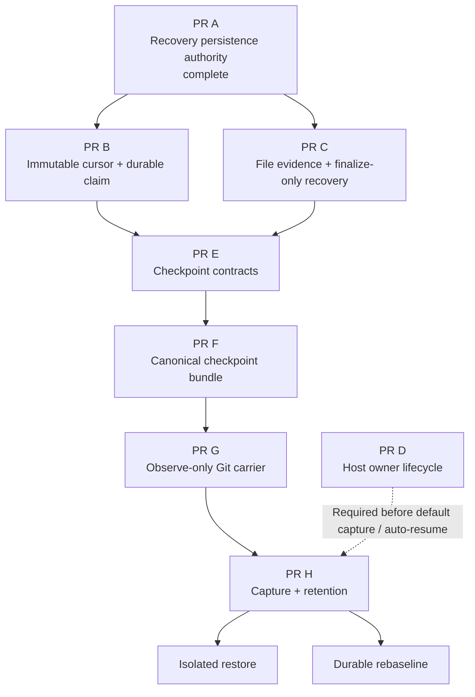

Each PR must name:

- one primary invariant;
- its owner;
- its atomicity boundary;
- failure states;
- rollback or fail-closed behavior;
- Linux, macOS, and Windows commitments;
- production-shaped crash tests;
- the production consumer of every new abstraction.

Start with production-shaped red tests, then land core contract, storage constraint, Runtime consumer, and only then Desktop/CLI wiring. A second failure of the same class at the same seam is a signal to redraw ownership rather than add another local guard.

## Feature flags, migration, and rollback

| Flag | Purpose | Rollback meaning |
|---|---|---|
| `MAKA_RUNTIME_SAFE_BOUNDARY_RESUME=1` | Enable Desktop manual/auto resume and CLI `/resume` | May disable visible continuation; does not delete durable facts |

RuntimeEvent migration is unconditional on the first write. Downgrading to a
reader that does not understand the new schema requires explicit, verified
export. Migration failure must preserve legacy JSONL. A newer database schema
fails closed.

Future recovery/checkpoint modes follow the same rule: select durable mode before T1 or accepted boundary. Never silently fall back to a weaker protocol mid-execution.

## Observability

Continuation lifecycle events:

- `plan_approved`
- `plan_parked`
- `execution_started`
- `execution_completed`
- `execution_failed`

They record identities, reason codes, and error classes—not prompts, tool arguments, results, or secrets.

Stable rejection codes include:

- `dangling_tool_state`
- `runtime_offset_mismatch`
- `pending_permission`
- `workspace_identity_mismatch`
- `background_operation_pending`
- `tool_catalog_mismatch`
- `continuation_already_exists`
- `tool_recovery_parked`
- `tool_recovery_corruption`
- `protocol_marker_invalid`

UI copy may change; machine codes must remain stable for tests, telemetry, dashboards, and future automation.

## Platform capability matrix

| Capability | Linux | macOS | Windows |
|---|---|---|---|
| Phase 0 deterministic replay / unit contract | Supported | Supported | Supported |
| Phase 0 process-crash committed-prefix harness | Supported | Supported | Covered, but not a power-loss claim |
| Phase 1 local safe-boundary continuation | Primary target | Primary target | Limited / best-effort |
| SQLite T1/T2 and recovery-bundle semantics | Supported | Supported | Semantic support |
| Recovery-bundle SIGKILL transaction proof | Release proof platform | Release proof platform | Currently skipped as limited support |
| Phase 3 file finalize-only recovery | Not wired in production | Not wired in production | Not wired in production |
| Phase 4 Git workspace continuity | Not implemented | Not implemented | Not implemented |

Process crash and SQLite transaction atomicity do not automatically prove power-loss durability. Filesystem and hardware behavior need separate tests.

## Current limitations and explicit non-goals

Current implementation does not promise:

- restoring an old provider stream, Promise, or instruction pointer;
- exactly-once for arbitrary Bash, remote APIs, or child processes;
- automatic settlement of real T1-without-T2 tool effects;
- using workspace UUID as proof of file contents;
- final cross-process or multi-node continuation fencing;
- identical Windows and POSIX SIGKILL/durability proof;
- bit-exact provider wire replay;
- model self-report as a substitute for RuntimeEvent, file evidence, or an external receipt;
- green CI as a substitute for concurrency, crash, and data-safety arguments.

The two most important follow-ups are:

1. PR B: immutable event-seq high-water, prefix digest, SQLite unique claim, and unified ancestor replay;
2. PR C/D: production file evidence/reconciler and one complete host-owner lifecycle.

## Code-reading map

### Core contract

1. `packages/core/src/runtime-event.ts`
2. `packages/core/src/canonical-runtime-event.ts`
3. `packages/core/src/tool-ledger-scanner.ts`
4. `packages/core/src/tool-recovery-bundle.ts`
5. `packages/core/src/runtime-event-store.ts`

### Storage

1. `packages/storage/src/sqlite-runtime-schema.ts`
2. `packages/storage/src/sqlite-runtime-store.ts`
3. `packages/storage/src/runtime-event-transfer.ts`
4. `packages/storage/src/agent-run-store.ts`
5. `packages/storage/src/workspace-identity.ts`

### Runtime

1. `packages/runtime/src/recovery-resolver.ts`
2. `packages/runtime/src/runtime-resume.ts`
3. `packages/runtime/src/tool-runtime.ts`
4. `packages/runtime/src/continuation-safety.ts`
5. `packages/runtime/src/session-manager.ts`
6. `packages/runtime/src/runtime-kernel.ts`
7. `packages/runtime/src/runtime-runner.ts`
8. `packages/runtime/src/agent-run.ts`

### Product wiring

1. `apps/desktop/src/main/app-lifecycle.ts`
2. `apps/desktop/src/main/sessions-ipc-main.ts`
3. `apps/desktop/src/renderer/use-shell-resume.ts`
4. `packages/cli/src/runtime-bootstrap.ts`
5. `packages/cli/src/session-driver.ts`

### Contract tests

1. `packages/runtime/src/__tests__/runtime-resume.test.ts`
2. `packages/runtime/src/__tests__/runtime-resume-crash.test.ts`
3. `packages/runtime/src/__tests__/runtime-continuation.test.ts`
4. `packages/runtime/src/__tests__/runtime-continuation-crash.test.ts`
5. `packages/runtime/src/__tests__/tool-runtime-durable-boundary.test.ts`
6. `packages/runtime/src/__tests__/recovery-resolver.test.ts`
7. `packages/runtime/src/__tests__/recovery-authority-equivalence.test.ts`
8. `packages/storage/src/__tests__/recovery-persistence-authority.test.ts`
9. `packages/storage/src/__tests__/sqlite-recovery-concurrency.test.ts`
10. `apps/desktop/src/main/__tests__/runtime-resume-routing-contract.test.ts`

## Further reading

- [Runtime Resume Phase 0 Crash Contract](./runtime-resume-phase0-crash-contract.md)
- [Runtime Resume Phase 1 Safe-Boundary Contract](./runtime-resume-phase1-safe-boundary-contract.md)
- [RecoveryResolver ADR](./runtime-recovery-resolver-adr.zh-CN.md)
- [Runtime Resume Phase 3–4 implementation route](./runtime-resume-phase3-phase4-workspace-checkpoint-design.zh-CN.md)
- [Git-native Managed Workspace implementation roadmap](./runtime-resume-git-native-workspace-roadmap.zh-CN.md)
- [Runtime Resume extraction ledger](./runtime-resume-extraction-ledger.zh-CN.md)
- [Runtime Resume and Tool Journal design draft](../runtime-resume-tool-journal-design-draft.zh-CN.md)
- [Chapter 1: Log Is the Runtime](./runtime-core-architecture-draft.md)

## Summary

Resume quality is not the number of crashes after which the system automatically continues. It is whether the system consistently:

- never calls an unknown side effect “not executed”;
- never repeats a completed tool;
- never gives the provider an illegal half-history;
- never calls workspace identity a workspace snapshot;
- never lets UI, CLI, Journal, or model self-report become a second authority;
- gives every continuation fresh identity and auditable lineage;
- parks whenever safety cannot be proved.

In one sentence:

> **Maka Resume does not continue code from an instruction pointer. It builds a new execution whose safety follows from durable facts.**
