<!--
  Licensed to the Apache Software Foundation (ASF) under one
  or more contributor license agreements.  See the NOTICE file
  distributed with this work for additional information
  regarding copyright ownership.  The ASF licenses this file
  to you under the Apache License, Version 2.0 (the
  "License"); you may not use this file except in compliance
  with the License.  You may obtain a copy of the License at

      http://www.apache.org/licenses/LICENSE-2.0

  Unless required by applicable law or agreed to in writing,
  software distributed under the License is distributed on an
  "AS IS" BASIS, WITHOUT WARRANTIES OR CONDITIONS OF ANY
  KIND, either express or implied.  See the License for the
  specific language governing permissions and limitations
  under the License.
-->

# 第八章：Resume 不是重试——Maka 如何从崩溃事实安全继续

> 本章回答一个看起来简单、实际上很危险的问题：Maka 在模型调用工具时崩溃，重启后怎样知道哪些事情已经发生、哪些事情可以继续、哪些事情必须停下来等人处理？核心答案是：**先从不可变的 RuntimeEvent 恢复事实，再由唯一的 RecoveryResolver 判定工具状态；只有历史、执行和 workspace 三条边界都能证明安全时，才创建新的 Run 继续。Resume 从不复活旧进程，也不把“再试一次”伪装成恢复。**

本文面向第一次接触 Maka Runtime 的工程师。前半部分用一个文件写入例子建立直觉，后半部分说明 Phase 0–4、Desktop/CLI 接线、T1/T2、恢复判定、workspace checkpoint 和工程实施顺序。

本文描述截至 2026-07-28 的 `main`：

- Phase 0–2 已落地；
- Phase 3A 的 recovery fact 原子写入权威与 Resolver 已落地；
- Phase 3 的生产 reconciler、文件 evidence 和完整 host owner lifecycle 仍在后续路线中；
- Phase 4 的 Git checkpoint、隔离恢复和 durable rebaseline 尚未落地。

路线文档写的是目标，代码和 contract tests 才是当前事实。本文会始终把“已经实现”和“计划实现”分开。

## 从一次崩溃开始

假设模型要求 Maka 把 `config.json` 中的端口从 `3000` 改成 `4000`。工具开始写文件，应用恰好在中间崩溃。

重启之后，系统不能只问“日志里有没有 tool result”，因为缺少 result 至少有四种可能：

1. 工具根本没开始；
2. 工具已经开始，但还没写文件；
3. 文件已经写成 `4000`，只是结果没来得及落盘；
4. 文件被写过，随后又被用户或另一个进程改成了别的内容。

如果一律重试，第 3 种情况可能重复副作用；如果一律当成成功，第 1、2、4 种情况又会把错误历史交给模型。

因此 Resume 真正要回答的不是“能不能重新发一个 prompt”，而是三个独立问题：

| 问题 | 白话解释 | 当前 owner |
|---|---|---|
| 旧 Run 怎样收尾？ | 把崩溃前永远停在 `running` 的执行尝试修成明确的终态 | startup recovery + terminal RuntimeEvent |
| 工具到底处于什么状态？ | 已完成、确定没派发、结果未知、已停车，还是账本损坏 | `RecoveryResolver` |
| 能不能继续调用模型？ | 历史是否合法，workspace、工具和后台任务是否仍匹配 | continuation planner + host safety inspector |

这三件事不能压成一个 `resume=true`。旧 Run 修复成功，不代表工具副作用已知；工具已经完成，也不代表当前 workspace 仍与历史一致。

## 先说结论

Maka Resume 的最小心智模型可以写成：

```text
旧进程消失
  → 重新打开 durable facts
  → 修复旧 Run 的终态
  → RecoveryResolver 解释每个工具操作
  → Host 检查 workspace / tool catalog / background work
  → 安全：创建新的 Run / Invocation / Turn
  → 不安全或无法证明：park
```

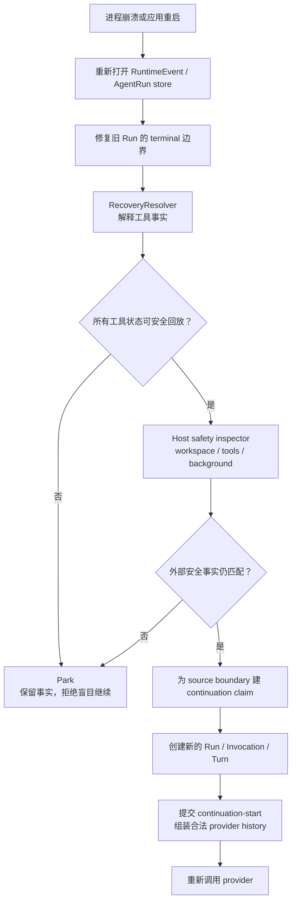

最重要的五条规则是：

1. Resume 创建新执行，不复活旧 socket、Promise、JavaScript 栈或 OS 进程。
2. `RuntimeEvent` 是唯一 canonical recovery fact source。
3. 缺少结果不等于失败，更不等于工具没有执行。
4. 不能证明安全时必须 park；模型的自述不能提升证据等级。
5. workspace identity 只证明“还是这个 workspace”，不证明“文件内容仍是当时那一版”。

## 先把术语翻成白话

后文会反复使用这些词：

| 术语 | 本文中的白话含义 |
|---|---|
| durable | 进程死掉、应用重开后，记录还在 |
| canonical | 发生冲突时，只有这份正式记录有最终解释权 |
| projection | 从正式记录算出来的视图；删掉后可以重建 |
| high-water | 这次计划明确读到了不可变日志的哪个位置 |
| park | 保留现状，停止自动执行，等待更强证据或人工处理 |
| fail closed | 不确定时拒绝继续，而不是猜一个“可能没事”的答案 |
| reconcile | 重新观察外部世界，判断之前的副作用究竟有没有完成 |
| continuation | 从可信历史创建的新执行，不是旧执行原地复活 |

因此，“从 canonical high-water fail closed 地创建 continuation”并不神秘，意思只是：

> 只使用已经正式落盘的历史；明确记住读到哪里；无法确认就停；确认安全才新建一次执行。

## Repair、Resume、Reconcile 不是一回事

代码和产品讨论里最容易混淆的是下面三个词：

| 词 | 处理对象 | 结果 |
|---|---|---|
| Repair | 旧 Run 的持久化状态 | 补齐或对齐 terminal RuntimeEvent、Run header 和 Turn 状态 |
| Resume / Continuation | 一段已经证明安全的历史边界 | 创建新身份，继续 provider loop |
| Reconcile | T1 已派发但没有 T2 outcome 的工具操作 | 观察外部世界，提交 completed 或 parked recovery decision |

典型顺序是先 repair，再 resolve/reconcile，最后才可能 resume。系统启动时即使只完成了 repair，也已经有价值：UI 不会永远显示“运行中”，用户可以检查一个明确失败或中断的 Turn。

## Phase 0–4 到底各做什么

Phase 不是五套实现，而是逐层增加“可以证明的事实”。

| 阶段 | 它回答的问题 | 当前状态 |
|---|---|---|
| Phase 0 | 只看已提交 RuntimeEvent 前缀，这段历史能安全 replay 吗？ | 已实现 |
| Phase 1 | 在完整、安全边界上，能否创建一个新 Run 继续？ | 已实现，feature flag 控制 |
| Phase 2 | 能否保证工具执行前有 T1、结果返回模型前有 T2？ | 已实现，SQLite canonical 模式 |
| Phase 2.5 / 3A PR A | 谁拥有恢复事实？冲突怎样 fail closed？恢复 bundle 怎样原子提交？ | 已实现 |
| Phase 3 后续 | 能否用专属 evidence 判断未知副作用，并完成或永久 park？ | 设计中，生产 reconciler 未接线 |
| Phase 4 | 能否把 Runtime 边界绑定到 workspace snapshot，并隔离恢复或 rebaseline？ | 设计中 |

从能力上看，它们形成一条递进关系：

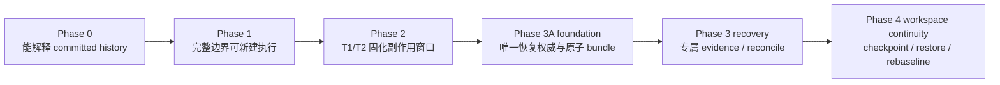

Phase 0 和 Phase 1 并没有因为 Phase 2 出现而失效。它们仍是 replay 和 continuation 的安全闸门；Phase 2 只是让闸门获得了更精确的“是否跨过工具派发边界”证据。

## 四个正交平面

Resume 与整个系统的耦合，最适合拆成四个平面看：

| 平面 | 它回答的问题 | 不能越权做什么 |
|---|---|---|
| Operation plane | 某个工具副作用是否已收敛？ | 不能自行批准 provider continuation |
| Continuation plane | 新 provider 请求应该看到哪段 immutable history？ | 不能猜 workspace 内容 |
| Workspace plane | 当前文件系统是否对应这段 history boundary？ | checkpoint provider 不能成为执行 claim |
| Host plane | 谁拥有 store、worker、后台恢复任务与关闭顺序？ | UI、CLI 不能各自发明恢复状态机 |

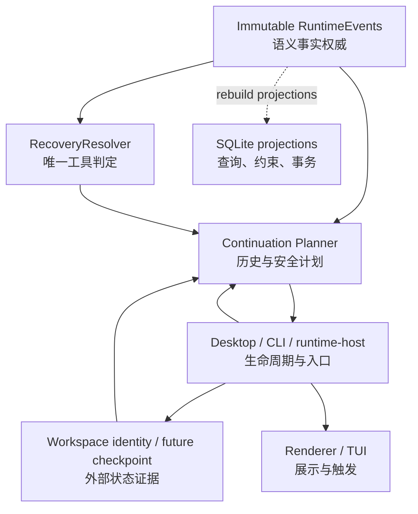

图中的虚线表示 SQLite 中的 `tool_operations` 和 `tool_journal_events` 可以从 RuntimeEvent 重建，所以它们是 projection；它们不能反过来覆盖或改写 canonical RuntimeEvent。

## 哪些数据是事实，哪些只是视图

Resume 安全性的核心不是“数据都写进 SQLite”，而是每类数据只有一个清楚的 owner。

| 数据 | 性质 | 用途 |
|---|---|---|
| Immutable `RuntimeEvent` | canonical semantic fact | 模型历史、工具 call/dispatch/outcome、recovery observation/decision、terminal fact |
| `AgentRunHeader` 与 AgentRun events | durable operational envelope | 一次执行尝试的身份、状态、lineage、诊断 |
| `tool_operations` | SQLite projection | 快速读取某个 operation 当前状态 |
| `tool_journal_events` | SQLite projection | 快速查看 prepared/outcome/recovery 状态变化 |
| Session messages / Turn state | 产品与 UI 投影 | 展示对话和 Turn 状态，不参与工具恢复裁决 |
| Mutable partial snapshot | 流式 UI 投影 | 崩溃后可丢弃或重建，不能进入 immutable cursor |
| `.maka-workspace.json` | workspace identity marker | 证明逻辑 workspace 身份，不证明文件内容 |
| Future checkpoint artifact | workspace carrier | 保存某个 Runtime 边界对应的 workspace 状态 |

“RuntimeEvent 是唯一事实源”不是一句注释，而是由 API 和数据库约束落实：

- generic writer 不能写 dispatch、operation-linked outcome 或 recovery fact；
- T1/T2 和 recovery bundle 有各自专用 writer；
- journal row 必须引用对应 RuntimeEvent；
- exact retry 必须字节和身份一致；
- 冲突 retry、orphan event、lane smuggling 和 identity 漂移全部拒绝；
- 删除 projection 后必须能从 immutable events 重建出等价状态。

## 先分清五种身份

Resume 会同时出现 Session、Turn、Run、Invocation 和 Operation。它们不是同一个 ID 的五种叫法。

| 身份 | 回答的问题 |
|---|---|
| `sessionId` | 这些对话和执行属于哪段长期交互？ |
| `turnId` | 用户界面中的这一轮是什么？ |
| `runId` | 这一次具体的 durable 执行尝试是谁？ |
| `invocationId` | 这一次 model/tool flow 调用边界是谁？ |
| `operationId` | 这一次具体工具副作用尝试是谁？ |

Continuation 会创建新的 `runId`、`invocationId` 和 `turnId`，同时在新 Run 中保存：

```text
continuationSource = {
  sourceInvocationId,
  sourceRunId,
  sourceTurnId,
  sourceRuntimeEventHighWater
}
```

工具的 `providerToolCallId` 继续负责 provider-native call/result 配对；`operationId` 则负责 Runtime、SQLite 和未来外部幂等协议中的执行身份。两者不能互相替代。

## 正常工具调用：T1 和 T2 夹住副作用

先看没有崩溃时的主链。模型产生 tool call 后，`ToolRuntime` 会先完成参数、工具可用性、loop、permission 和 runtime ownership 等 preflight。只有这些检查通过，才进入 T1。

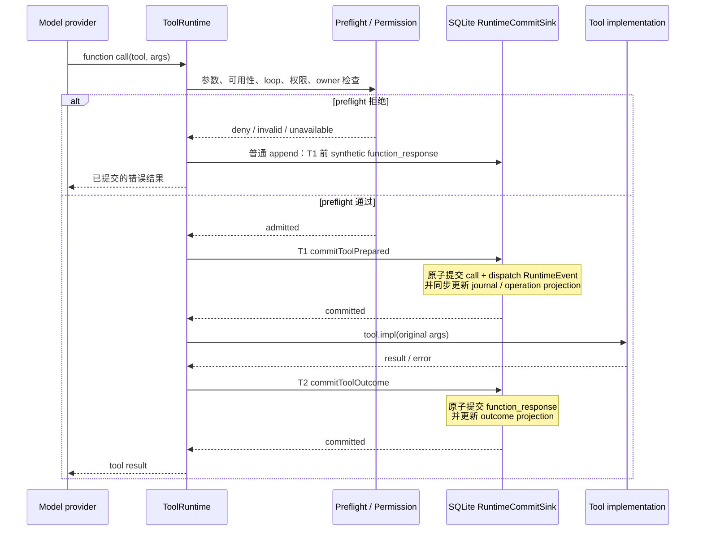

### T1 的准确含义

T1 的 dispatch RuntimeEvent 表示：

> Runtime 已经跨过所有执行前 guard，接下来不能再安全假定 implementation 没有运行。

它不表示副作用已经发生，也不表示工具一定成功。

T1 在一个短 SQLite transaction 中完成：

1. 验证或提交 canonical function call；
2. 提交非模型可见的 `actions.toolDispatch` RuntimeEvent；
3. 重新从 function call 计算并核对 `canonicalArgsHash`；
4. 创建 `prepared` journal 和 operation projection；
5. commit。

T1 失败时，`tool.impl` 调用次数必须为零。

### T2 的准确含义

T2 表示工具结果已经成为 canonical function response。它同样使用短事务：

1. 读取并核对 operation identity；
2. 提交 function response RuntimeEvent；
3. 更新 outcome journal 与 operation projection；
4. commit。

T2 成功前，结果不能返回下一次 model step。T2 失败时，即使 implementation 已经返回结果，Runtime 也不能把这个未提交结果交给模型。

### 为什么不用一个长事务包住工具

文件、Shell、网络 API 和 child agent 可能运行几秒到几小时。SQLite transaction 不能覆盖这些外部副作用，否则会把数据库锁、进程崩溃和外部系统混成一个无法兑现的“分布式事务”。

所以正确形态是：

```text
短事务 T1
  → 外部副作用窗口
  → 短事务 T2
```

Resume 的主要工作，就是诚实处理两个短事务之间的未知区间。

## 崩溃发生在不同位置，会得到什么结论

下面先看简化版决策。完整 P0–P11 failpoint 规范见 [Phase 0 Crash Contract](./runtime-resume-phase0-crash-contract.md)。

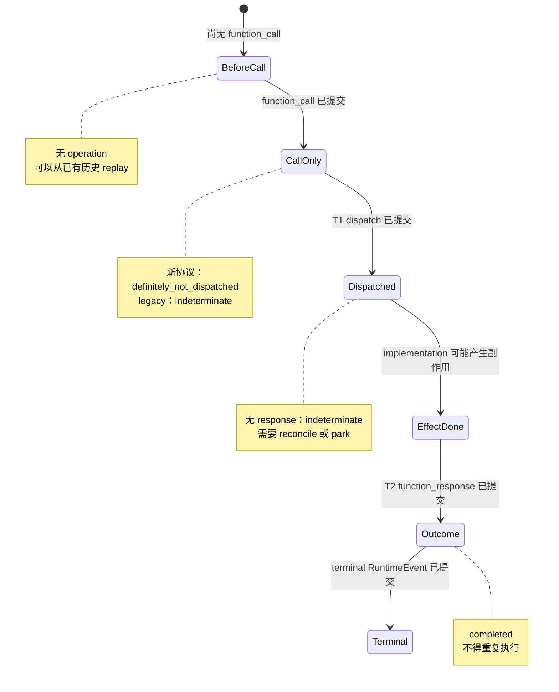

Resolver 的核心决策表是：

| Immutable facts | 判定 | 后续 |
|---|---|---|
| call + matching response，无 dispatch | `completed` | T1 前 synthetic result 或 legacy completed result |
| call + dispatch + matching response | `completed` | 复用结果，不重跑 |
| call + dispatch，无 response | `indeterminate` | 需要专属 reconcile；当前 continuation 会阻断 |
| call，无 dispatch、无 response，首事件声明新协议 | `definitely_not_dispatched` | 事实可证明未跨 T1；自动策略仍需由后续阶段明确 |
| call，无 dispatch、无 response，legacy/unknown protocol | `indeterminate` | 不能用“没看到 dispatch”证明旧版本没执行 |
| recovery bundle 得出 completed | `completed` | 使用 bundle 中匹配的 outcome |
| recovery bundle 得出 parked | `parked` | v1 永久停车，不产生第二次 attempt |
| orphan、duplicate、identity/hash/order 冲突 | `corruption` | fail closed |

这里最值得记住的是 legacy 规则：新协议的首事件带有 `toolBoundary: "t1_after_preflight_v1"`，系统才有资格把“缺少 dispatch”解释成“确定没跨 T1”。旧日志没有这个承诺，所以同样的缺口只能保守判成未知。

## Phase 0：先学会读懂 committed prefix

Phase 0 是一个纯函数：

```text
committed RuntimeEvents
  → RecoveryResolver
  → ToolOperation projection
  → ResumePlan(safe_replay | blocked)
```

它不执行工具、不创建新 Run、不恢复 workspace，也不修改 durable ledger。

Phase 0 还会构造合法的 provider replay history：

- 丢弃 mutable partial；
- 只保留成对的 function call / function response；
- 未配对的 call 不会被偷偷塞回 provider；
- terminal fact 保留在 canonical ledger，但不会被误当成下一次用户输入；
- expected high-water 不匹配时稳定拒绝为 `runtime_offset_mismatch`。

这一步解决了一个很实际的问题：即使系统决定 park，也不能把一段 provider 不接受的半截工具历史交给模型，让模型自行“补全”。

Phase 0 的 crash harness 使用真实子进程和文件 store，在完整 append promise 返回后由父进程强制杀死子进程，再重新打开 store，验证两次 projection 完全相同且没有写回原 ledger。它证明的是 process-crash 下的 committed-prefix 语义，不等于断电级文件系统 durability。

## 启动恢复：先把旧 Run 收敛

Desktop 启动后不是立刻继续模型，而是先执行 repair。

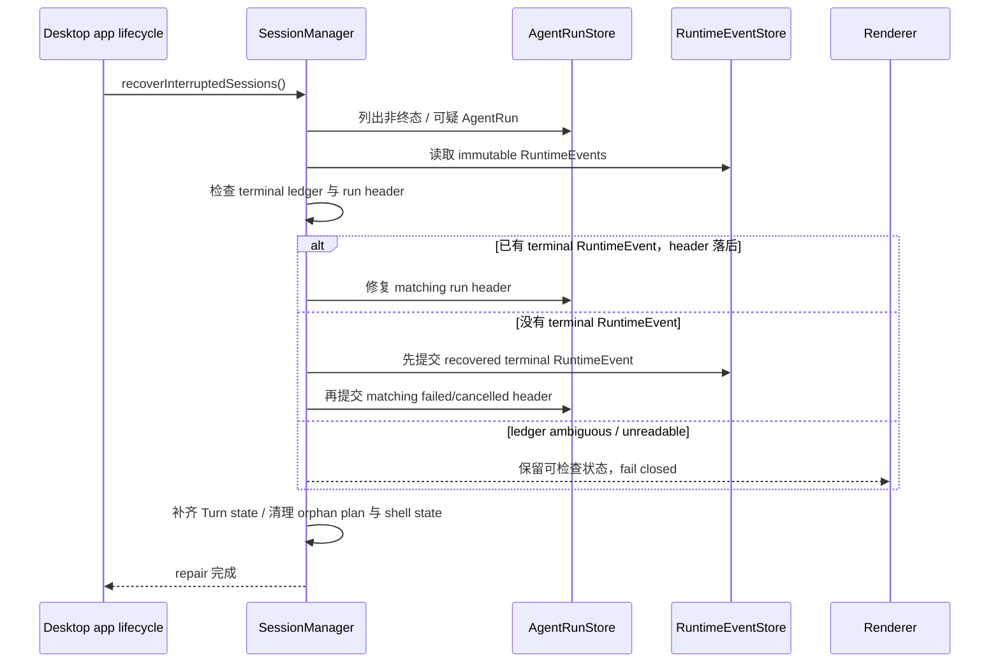

这里保护一个贯穿 Runtime 的不变量：

> terminal RuntimeEvent 必须先于 terminal Run header 提交；header 不能凭自己宣布一次执行已经结束。

如果在两次提交之间再次崩溃，下次启动仍能从 terminal RuntimeEvent 修好 header。反过来先写 header，就会出现一个没有语义事实支持的“完成”状态。

Desktop 还会恢复 Graph coordinator 和 supervisor wake。只有这些 startup repair 完成后，Runtime Host 才会尝试 continuation。普通 Session 仍要求 safe-boundary flag；durable `managed-coding-v1` Session 则按其 T1 前冻结的产品合同自动规划，不允许用运行时 flag 把它静默降级为较弱模式。

## Phase 1：安全边界上创建新的执行

Phase 1 不处理未知副作用。它只允许“所有工具都已经有 committed outcome”的完整边界继续。

Planner 需要同时通过这些 gate：

- source Run 与 RuntimeEvent ledger 可读；
- Run header 与唯一 terminal RuntimeEvent 一致；
- 所有事件属于同一个 source execution identity；
- Phase 0 得到 `safe_replay`；
- 没有 pending permission；
- 没有未收敛 background、Shell 或 child operation；
- 当前 workspace identity 与 source 一致；
- 历史使用过的工具在当前 catalog 中仍可用；
- provider history 从 user boundary 开始，在 user 或 tool boundary 结束；
- 新 Run、Invocation、Turn ID 与 source 不重复；
- 如果 host 提供 checkpoint，它必须有 ref、已经恢复并覆盖同一 high-water。

Planner 返回 `continue` 只是一个计划，不是执行 lease。真正启动前，`RuntimeKernel` 会重新读取：

- source Run identity 与 terminal 状态；
- source RuntimeEvent high-water 和 replay context；
- 当前 workspace identity；
- background operation 状态；
- tool catalog；
- checkpoint ref 与 high-water；
- 是否已有相同 source boundary 的 continuation；
- target Run ID 是否已存在。

任何变化都会变成稳定的 revalidation error，而不是继续使用旧快照。

## 一次手动 Resume 的完整时序

Desktop 的 renderer 只传 `sessionId`。它不能替 main process 提供“workspace 安全”之类的自报事实。

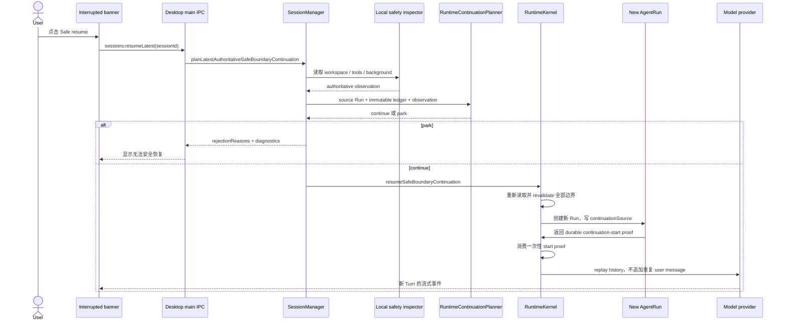

CLI/TUI 的 `/resume` 走同一个 `SessionManager` plan/execute seam。Desktop startup auto-resume 也复用同一 planner 和 execution path，不维护第三套恢复逻辑。

### 当前的 parked 原因边界

Runtime Host 负责把 Runtime planner 的 rejection reasons 投影成封闭的
`TurnResumeParkReason` wire union；CLI 不能重新推断 Host 内部状态。当前 Host 会保留三种容易混淆的原因：

- `resume_feature_disabled`：feature flag 未开启；
- `continuation_authority_unavailable`：Host 无法取得 continuation authority；
- `safety_observation_unavailable`：Host 无法取得安全观测事实。

旧的 `continuation_unavailable` 不再出现在当前 wire contract 中。`/resume` driver 通过
`SafeBoundaryResumeParkedError` 原样携带原因，TUI 只把预期的用户状态显示为普通提示：
`resume_feature_disabled`、`resume_candidate_missing` 和 `session_busy`。authority、safety
以及其他恢复失败仍显示为红色错误，并保留原始 reason 供诊断。

这是不兼容的封闭协议变更，因此 Runtime Host compatibility epoch 推进到 57；旧 Client/Host
组合会在握手阶段被拒绝，而不是把新的 failure reason 误判成“功能未开启”。这次变更只修正
Host 投影和 CLI 展示，不改变 planner、durable continuation claim 或 feature flag 的 owner。

## 为什么 Continuation 不复制原用户消息

普通 Run 会创建 initial user RuntimeEvent，并把当前 user message 加入 provider request。Continuation 已经从 source boundary 得到了完整、验证过的 provider history，所以它：

1. 不创建第二条相同的 user event；
2. 先提交一个 system-owned、model-invisible 的 continuation-start RuntimeEvent；
3. 在新 Run header 中记录 source identity 和 high-water；
4. 直接把验证过的 history 交给 provider。

这样既避免模型看到重复请求，也避免 completed tool call 因为“新建了一轮”而再次执行。

多代 continuation 当前通过 `continuationSource` 逐层读取祖先 Run，再把各段合法 replay history 从老到新拼起来。后续 PR B 会把这条链收紧为 immutable event-seq high-water、domain-separated prefix digest 和数据库唯一 claim；当前实现还不能把 `events.length` 和进程内 claim 描述成跨进程的最终协议。

## Workspace identity 能证明什么

本地 safety inspector 会：

1. 读取 Session 当前 cwd；
2. `realpath` 得到 canonical path；
3. 读取或创建 `.maka-workspace.json` 中的 UUID marker；
4. 返回形如 `workspace:v1:<uuid>` 的逻辑 identity；
5. 同时检查可用工具与 pending background operation。

路径变化只产生诊断；marker identity 变化才是 continuation 的硬拒绝。这允许同一个 workspace 在合法移动后仍被识别，也避免只依赖容易变化的 device/inode。

但 marker 只回答：

> “这是之前那个逻辑 workspace 吗？”

它不回答：

> “workspace 里的每一个文件仍然和 source RuntimeEvent high-water 时相同吗？”

后一个问题必须由 Phase 4 checkpoint/carrier 解决。当前 safe-boundary continuation 不能被描述成 workspace snapshot restore。

## Phase 2：SQLite 是 RuntimeEvent 的 durable store

没有 `RuntimeCommitSink` 的 JSONL host 不能声明 T1 协议。只有 host 真正把 SQLite store 同时接成 `RuntimeEventStore` 和 `RuntimeCommitSink`，AiSdk tool path 才会在 Run 首事件写入 `t1_after_preflight_v1` marker。

当前启动规则是：

```text
打开 RuntimeEvent writer
  → 创建或迁移 runtime.sqlite
  → 批量、幂等导入 legacy RuntimeEvent JSONL
  → RuntimeEvent 只写 SQLite
```

这里不再有 backend selection flag。只读检查可以读取尚未创建数据库的 legacy-only
workspace；第一个 writer 执行单向导入。一旦存在 `runtime.sqlite`，所有 reader
都只读 SQLite，不会再与过期 JSONL 合并或 fallback。

JSONL 在迁移后只承担 legacy import 和显式 export；Session message JSONL 与 AgentRun operational JSONL 仍保留各自用途，但不与 SQLite 竞争 RuntimeEvent authority。

## Phase 3A：恢复事实怎样原子提交

Phase 3A 已经实现“恢复结果怎样写才可信”，但还没有实现生产级 observer/reconciler 去自动产生这些结果。

一个 recovery bundle 最多包含三条 immutable facts：

1. reconcile observation：当前外部状态看起来是什么；
2. 可选 recovered outcome：只有确实能证明 completed 时才存在；
3. terminal recovery decision：`completed` 或 `parked`。

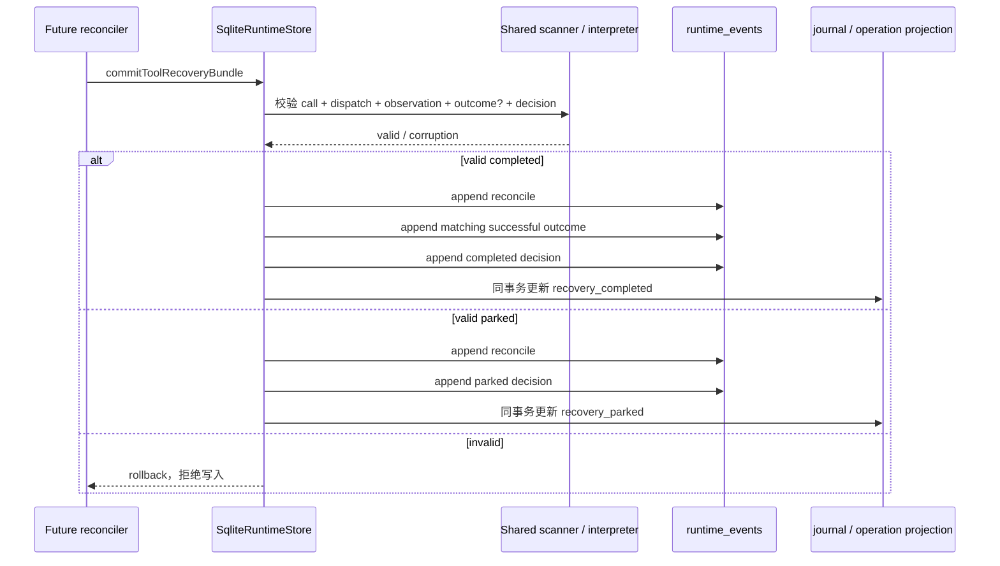

Writer、projection rebuild 和 `RecoveryResolver` 共享同一个 scanner/interpreter，所以 online、close/reopen、rebuild 和 Resolver 对同一 immutable ledger 必须得到同一解释。

`parked` 在 v1 中是 terminal：之后只允许 exact bundle retry 幂等收敛，不能悄悄发起第二次恢复 attempt。若未来需要重新打开，必须设计新的版本化事实，而不是修改旧事件。

## Phase 3 后续：文件恢复为什么只做 finalize

文件 Write/Edit 的目标策略是先持久化可信 evidence：

- workspace identity 与 canonical target；
- operation/call/dispatch identity；
- before identity；
- expected-after identity；
- transform/algorithm version；
- production-shaped result；
- size、regular-file、symlink、UTF-8 等观察边界。

崩溃后比较 current state：

| observation | 动作 |
|---|---|
| `matches_expected_state` | 只做 cleanup/finalize，合成 outcome，提交 completed bundle |
| `matches_prior_state` | park，`redo_disabled_pending_cas` |
| `diverged` | park，不覆盖外部写入 |
| `unreadable` | park，不猜测 |

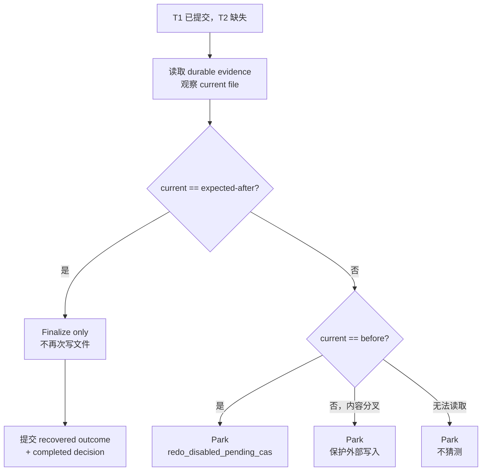

即使 atomic rename 能避免半文件，也不能保证“检查 hash 到 rename”之间没有另一个进程修改文件。没有 conditional replace/CAS 前，`matches_prior_state` 不能自动 redo。

通用 Bash、任意远程 API、发送、发布、付款和删除等没有专属协议的副作用继续默认 park。恢复覆盖范围不是越大越好；错误地自动执行一次，通常比明确停车更危险。

## Phase 4：Runtime history 还要绑定 workspace

Phase 1 证明模型历史完整，Phase 3 证明单个 operation 可以收敛，但长任务还需要 workspace-wide continuity。

Phase 4 把 checkpoint 建模为：

```ts
interface WorkspaceBoundary {
  workspaceIdentity: string
  workspaceEpoch: number
  immutableRuntimeHighWater: number
  immutableRuntimeDigest: string
  checkpointRef: string
  checkpointPolicyHash: string
}
```

Checkpoint provider 只能 `capture / verify / materialize`，不能自行批准 resume。Planner 仍然消费 checkpoint fact、RuntimeEvent boundary 和 host policy，再决定 continue 或 park。

### Capture

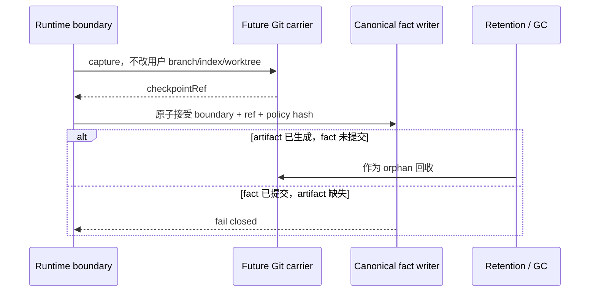

Git carrier 计划使用 Maka 自有 ref namespace 或独立 object ownership。没有 Git CLI、不是合格仓库，或存在无法支持的 submodule/LFS/sparse/case policy 时，只能降级到 native 单 operation recovery，不能假装拥有 workspace snapshot。

### Isolated restore

Workspace drift 时，默认不覆盖用户当前目录：

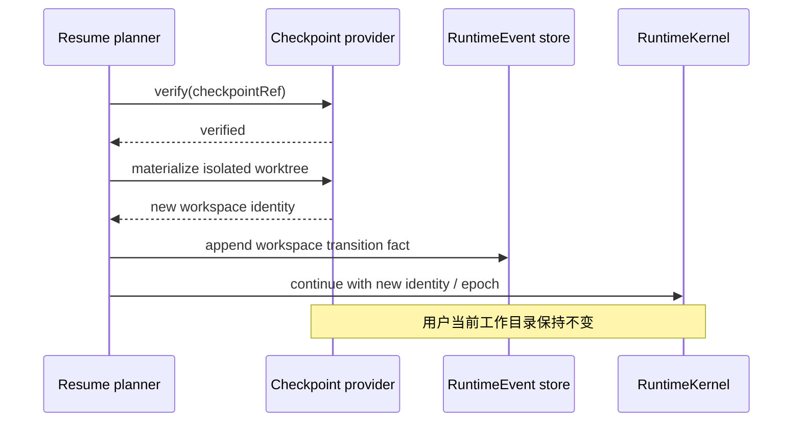

### Durable rebaseline

“以当前文件为准继续”不能等于忽略 mismatch。正确流程是：

1. capture 当前 workspace；
2. 提交新的 baseline fact；
3. `workspaceEpoch + 1`；
4. 明确告诉模型重新读取受影响文件；
5. continuation 只引用新 boundary。

这样 rebaseline 是一次可审计的状态转换，而不是把旧 checkpoint 验证失败静默吞掉。

## 与整个系统怎样耦合

下面这张图把代码层和产品入口放在一起：

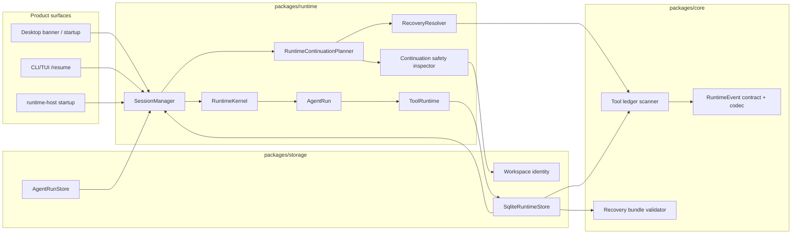

各层的责任可以简化为：

- `packages/core` 定义事实形状、canonical codec、lane、scanner 和 recovery bundle 因果规则；
- `packages/storage` 提供 SQLite transaction、唯一约束、projection rebuild、legacy import/export 和 workspace identity；
- `packages/runtime` 负责 T1/T2 时序、Resolver、plan、execution revalidation、新 Run lineage 和 startup repair；
- Desktop main / CLI / runtime-host 负责真实 store、工具目录、后台任务、入口与生命周期；
- renderer 和 TUI 只触发、展示，不拥有恢复判定；
- Eval 把 Runtime continuation 视为 Runtime Host 内部行为，不把它当作实验 retry。

## 当前 Host 入口

### Desktop

- 启动：先 `recoverInterruptedSessions()`，再恢复 Graph；flag 开启时扫描可继续 Session；
- 手动：中断横幅调用 `sessions:resumeLatest`；
- main process：读取 authoritative safety facts，执行 plan/continue；
- renderer：只发送 `sessionId`，展示 started 或 park diagnostics；
- 退出：先停止后台能力和 Shell/Graph，再关闭 runtime persistence。

### CLI/TUI

- 启动时执行 interrupted-run repair；
- `/resume` 调用同一个 latest authoritative plan；
- 成功时流式输出新 continuation；
- park 时显示稳定诊断，不生成一个新的普通 user prompt；
- `close()` 终止后台 Shell，再关闭 Session store 和 runtime persistence。

### Runtime host

Runtime host 使用 strict recovery stores 执行 startup repair。严格模式不会把 unreadable ledger 吞成 best-effort fallback，适合服务端 composition 在接收新写入前建立清楚的恢复边界。

### Eval

Eval 不恢复或重建 Runtime execution，只请求 Runtime Host 执行 Maka subject。基础设施替换会向同一个 experiment cell 追加新 attempt；Runtime continuation 留在该 subject 内部，不成为 repetition 或 retry。

## 一个完整的运行流程应该怎样走

把普通执行、崩溃和恢复串起来，推荐的产品流程是：

1. Host 启动时先确定 durable mode；不能在 T1 之后静默切换 canonical store。
2. 普通 Run 首事件声明真实可用的 protocol capability。
3. ToolRuntime 完成所有 preflight。
4. T1 原子提交 call、dispatch 和 projection。
5. 执行外部副作用，不持有数据库长事务。
6. T2 原子提交 outcome，再把结果交给模型。
7. terminal RuntimeEvent 先提交，Run header 后提交。
8. 崩溃重启后先 repair 旧 Run。
9. Resolver 只读 immutable facts，判定 completed / not-dispatched / indeterminate / parked / corruption。
10. 有 production reconciler 时，对 indeterminate 提交一个原子 recovery bundle；没有时 park。
11. Planner 检查合法 replay、workspace、工具和后台操作。
12. Kernel 在执行前重新验证并建立 continuation claim。
13. 新 Run 提交 continuation-start 后才调用 provider。
14. 任意一步不能证明安全，就保留事实并输出 machine-readable park reason。

## 后续实现应该怎样拆

Phase 3–4 不适合做成一个横跨 schema、runtime protocol、host lifecycle 和 platform I/O 的大 PR。推荐依赖顺序是：

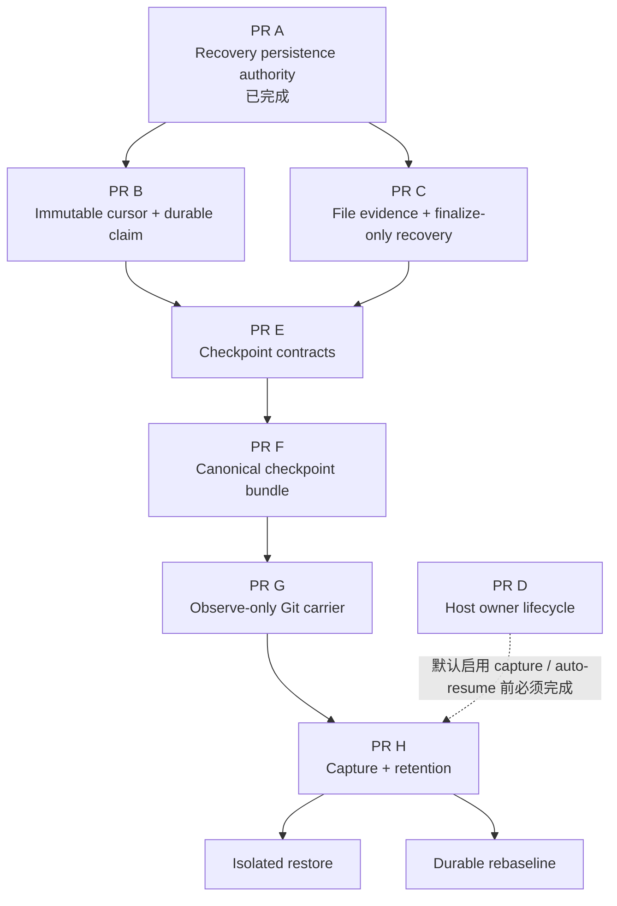

每个 PR 都应该写清：

- 这次只证明哪一个主要不变量；
- owner 是谁；
- 原子性边界在哪里；
- 中间失败会留下什么状态；
- rollback 或 fail-closed 路径是什么；
- Linux、macOS、Windows 分别承诺什么；
- production-shaped crash test 在哪里；
- 哪个 production consumer 会使用新增抽象。

建议实施顺序是先写 production-shaped RED test，再落 core contract、storage constraint、Runtime consumer，最后接 Desktop/CLI。第二次在同一 seam 出现同类问题时，应停止增加局部 guard，重新检查 owner 是否划错。

## Feature flags、迁移与回滚

RuntimeEvent 迁移不再由开关控制；首次写入必然迁移。当前恢复行为开关如下：

| 开关 | 作用 | 回滚含义 |
|---|---|---|
| `MAKA_RUNTIME_SAFE_BOUNDARY_RESUME=1` | 为普通 Session 开启手动/自动 resume 与 CLI `/resume`；managed coding 不依赖该实验开关 | 可关闭普通 Session 的 continuation，但不会删除或改写 durable facts，也不能降级已冻结的 managed mode |

真正降级到不理解新 schema 的旧版本前，必须显式 export 并验证。Migration 失败不能删除 legacy JSONL；数据库版本比当前程序新时必须 fail closed。

未来 checkpoint 和 recovery capability 也应遵守同一原则：一旦在 T1 或 accepted boundary 前选定 durable mode，不能在执行中静默 fallback 到较弱协议。降级必须产生明确、可审计的 mode mismatch 或 park reason。

## 可观测性应该记录什么

Continuation 已有这些 lifecycle event：

- `plan_approved`
- `plan_parked`
- `execution_started`
- `execution_completed`
- `execution_failed`

它们只记录身份、reason code 和 error class，不记录 prompt、工具参数、工具结果或 secret。

稳定 machine code 比自由文本更重要。常见拒绝包括：

- `dangling_tool_state`
- `runtime_offset_mismatch`
- `pending_permission`
- `workspace_identity_mismatch`
- `background_operation_pending`
- `tool_catalog_mismatch`
- `continuation_already_exists`
- `tool_recovery_parked`
- `tool_recovery_corruption`
- `protocol_marker_invalid`

UI 文案可以演进，但 code 必须稳定，才能支持 crash tests、telemetry、operator dashboard 和未来自动化策略。

## 平台能力矩阵

当前文档中的“支持”需要按能力拆开：

| 能力 | Linux | macOS | Windows |
|---|---|---|---|
| Phase 0 deterministic replay / unit contract | 支持 | 支持 | 支持 |
| Phase 0 process-crash committed-prefix harness | 支持 | 支持 | 有覆盖，但不代表断电 durability |
| Phase 1 local safe-boundary continuation | 主要支持目标 | 主要支持目标 | 有限支持 / best-effort |
| SQLite T1/T2 与 recovery bundle 语义 | 支持 | 支持 | 语义支持 |
| Recovery bundle SIGKILL transaction proof | 发布证明平台 | 发布证明平台 | 当前按有限支持跳过 |
| Phase 3 file finalize-only recovery | 尚未生产接线 | 尚未生产接线 | 尚未生产接线 |
| Phase 4 Git workspace continuity | 尚未实现 | 尚未实现 | 尚未实现 |

Process crash、SQLite transaction atomicity 和应用级 `fsync` 不能自动升级成“机器断电后绝不丢数据”的承诺。具体文件系统、磁盘缓存和平台行为必须由单独 durability test 证明。

## 当前限制与明确不做

当前实现不承诺：

- 恢复旧 provider stream、Promise 或 JavaScript 指令位置；
- 对任意 Bash、远程 API 或子进程提供 exactly-once；
- 自动处理 T1 已提交、T2 缺失的真实工具副作用；
- 用 workspace UUID marker 证明文件内容未漂移；
- 跨进程或多节点的最终 continuation fencing；
- Windows 上与 POSIX 完全相同的 SIGKILL/durability 证明；
- bit-exact provider wire replay；
- 用模型自述替代 RuntimeEvent、文件 evidence 或外部 receipt；
- 用 CI 全绿替代并发、崩溃和数据安全论证。

当前最重要的两个后续缺口是：

1. PR B：immutable event-seq high-water、prefix digest、SQLite unique claim 和祖先统一 replay policy；
2. PR C/D：production file evidence/reconciler 与唯一 host owner lifecycle。

## 代码阅读地图

建议按事实到产品入口的顺序阅读。

### Core contract

1. `packages/core/src/runtime-event.ts`：RuntimeEvent、T1 marker、dispatch 与 recovery fact envelope。
2. `packages/core/src/canonical-runtime-event.ts`：唯一 canonical codec 与稳定 JSON bytes。
3. `packages/core/src/tool-ledger-scanner.ts`：call/dispatch/outcome/reconcile/decision lane 和 corruption 检测。
4. `packages/core/src/tool-recovery-bundle.ts`：recovery bundle 因果校验与解释。
5. `packages/core/src/runtime-event-store.ts`：普通 append、T1/T2 与 recovery bundle 的 API 权限边界。

### Storage

1. `packages/storage/src/sqlite-runtime-schema.ts`：schema、WAL、FULL synchronous 和 capability。
2. `packages/storage/src/sqlite-runtime-store.ts`：T1、T2、bundle transaction 与 projection rebuild。
3. `packages/storage/src/runtime-event-persistence.ts`：runtime 事件的 SQLite 持久化。
4. `packages/storage/src/agent-run-store.ts`：AgentRun 与 legacy JSONL authority gate。
5. `packages/storage/src/workspace-identity.ts`：workspace UUID marker 和 canonical path。

### Runtime

1. `packages/runtime/src/recovery-resolver.ts`：唯一工具恢复判定。
2. `packages/runtime/src/runtime-resume.ts`：Phase 0 plan、Phase 1 planner 和 replay projection。
3. `packages/runtime/src/tool-runtime.ts`：preflight → T1 → implementation → T2。
4. `packages/runtime/src/continuation-safety.ts`：host safety observation。
5. `packages/runtime/src/session-manager.ts`：startup repair、authoritative plan 和 continuation API。
6. `packages/runtime/src/runtime-kernel.ts`：claim、execution revalidation 和新 Run 创建。
7. `packages/runtime/src/agent-run.ts`：Run lineage、continuation-start、terminal persistence 与 crash failpoints。

### Product wiring

1. `apps/desktop/src/main/runtime-host-boot.ts`：Runtime Host 启动、客户端投影和 shutdown。
2. `apps/desktop/src/main/runtime-host-session-execution-ipc-main.ts`：`sessions:resumeLatest`。
3. `apps/desktop/src/renderer/use-shell-resume.ts`：中断横幅的手动入口。
4. `packages/cli/src/runtime-host-cli-context.ts`：CLI Runtime Host 连接与上下文。
5. `packages/cli/src/runtime-host-session-driver.ts`：TUI `/resume` 的 plan/execute 路径。

### Contract tests

1. `packages/runtime/src/__tests__/runtime-resume.test.ts`
2. `packages/runtime/src/__tests__/runtime-resume-crash.test.ts`
3. `packages/runtime/src/__tests__/runtime-continuation.test.ts`
4. `packages/runtime/src/__tests__/runtime-continuation-crash.test.ts`
5. `packages/runtime/src/__tests__/tool-runtime-durable-boundary.test.ts`
6. `packages/runtime/src/__tests__/recovery-resolver.test.ts`
7. `packages/runtime/src/__tests__/recovery-authority-equivalence.test.ts`
8. `packages/storage/src/__tests__/recovery-persistence-authority.test.ts`
9. `packages/storage/src/__tests__/sqlite-recovery-concurrency.test.ts`
10. `apps/desktop/src/main/__tests__/runtime-host-session-execution-ipc-main.test.ts`

## 延伸阅读

- [Runtime Resume Phase 0 Crash Contract](./runtime-resume-phase0-crash-contract.md)
- [Runtime Resume Phase 1 Safe-Boundary Contract](./runtime-resume-phase1-safe-boundary-contract.md)
- [RecoveryResolver ADR](./runtime-recovery-resolver-adr.zh-CN.md)
- [Runtime Resume Phase 3–4 实施路线](./runtime-resume-phase3-phase4-workspace-checkpoint-design.zh-CN.md)
- [Runtime Resume 拆分与提取账本](./runtime-resume-extraction-ledger.zh-CN.md)
- [第一章：Log Is the Runtime](./runtime-core-architecture-draft.zh-CN.md)

## 小结

Resume 的质量不取决于“崩溃后能自动继续多少次”，而取决于系统是否始终做到：

- 不把未知副作用说成未执行；
- 不重复已经完成的工具；
- 不把非法半截 history 交给 provider；
- 不用 workspace identity 冒充 workspace snapshot；
- 不让 UI、CLI、Journal 或模型自述成为第二个恢复权威；
- 每次 continuation 都有新的执行身份和可追踪 lineage；
- 不能证明时明确 park。

用一句话收尾：

> **Maka Resume 不是从断点继续代码，而是从 durable facts 重新建立一个可以被证明安全的新执行。**
