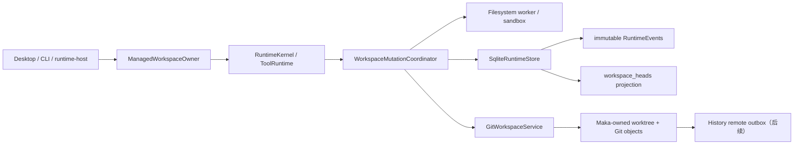
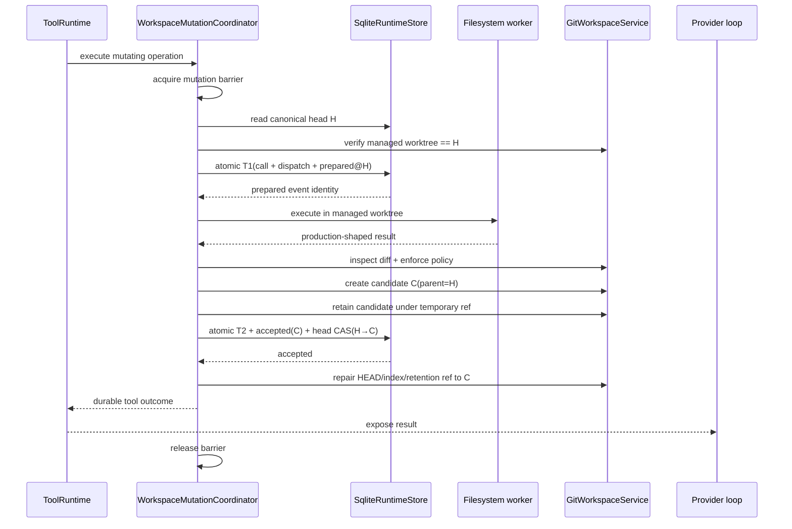
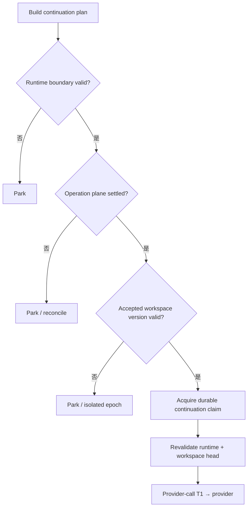
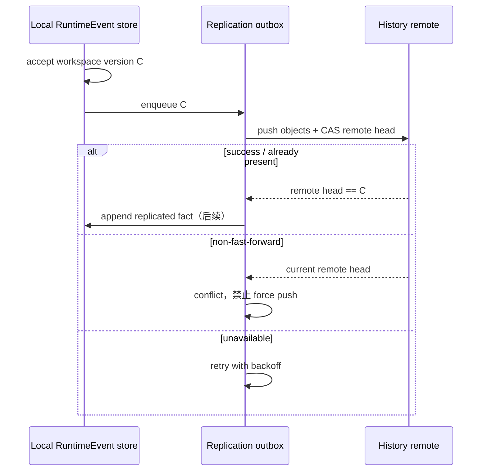
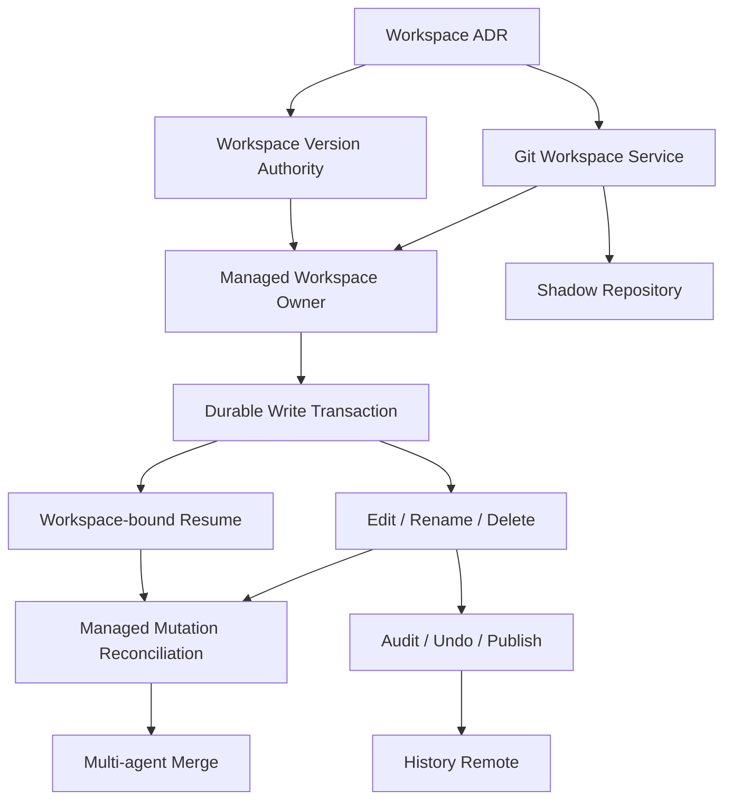

# Git-native Managed Workspace：Runtime Resume 新落地路线

- 状态：Proposed implementation roadmap
- 更新日期：2026-07-31
- 适用范围：Runtime Resume 的 workspace plane、文件型工具、workspace 历史与远端文件备份
- 已有地基：Recovery Authority（#1521）、Continuation Authority（#1573）
- 事实权威：immutable RuntimeEvents
- workspace artifact：Maka-owned Git commit/tree
- 主要发布证明平台：Linux、macOS；Windows 在通过独立能力矩阵前保持有限支持

> 本文取代旧 Phase 3B/4A 中“先建设通用 checkpoint 抽象，再接 Git carrier”的主线。
> 旧路线中的 Recovery Authority 与 Continuation Authority 已经合入主线，仍然有效；
> 单文件 evidence 只保留为 `attached_checkout` 的兼容方案，不再阻塞强保证模式。

## 1. 决策摘要

新的目标架构是：

> **Maka Git-native Managed Workspace**

它建立在一个硬前提上：

> 所有需要强恢复保证的 workspace mutation，都必须发生在 Maka-owned、用户不能同时编辑的
> `managed_worktree` 中。

在这个前提下，职责被明确分开：

| 平面 | 权威 | 回答的问题 |
|---|---|---|
| execution / recovery | immutable RuntimeEvents | 哪个工具被调用、是否派发、结果是否提交、恢复如何判定 |
| continuation | immutable RuntimeEvent boundary + durable claim | provider 将看到哪段历史、谁有权继续执行 |
| workspace | accepted Git commit/tree | 下一次工具实际看到哪一版文件 |
| projection | SQLite derived tables | 当前 head、审计视图、重试队列；可从事实重建 |
| retention | Maka-owned Git refs | 哪些 Git objects 必须保留；不能自行批准 workspace version |
| remote history | 可配置 Git remote | 复制文件版本、浏览 diff、灾备；不承担执行权威 |

核心不变量是：

1. 每个 mutating operation 从一个已接受的 workspace version 开始；
2. 工具执行只能产生 candidate Git commit，不能自行推进 canonical workspace head；
3. T2 outcome 与 `workspace_version_accepted_v1` 必须在一个 SQLite transaction 中原子提交；
4. 只有被 RuntimeEvent 接受的 commit 才能成为下一次工具和 continuation 的 workspace head；
5. Git ref 只保留对象，不是第二个 workspace authority；
6. durable mode、workspace mode、effect contract 和 policy 必须在 T1 前确定；T1 后禁止静默 fallback；
7. 用户 checkout 不被自动 reset、clean、checkout 或覆盖；
8. 无法证明副作用边界时 park，不使用文件内容启发式猜测。

这不是“用 Git 替代数据库”，也不是“每次调用后自动 `git commit -a`”。它是把 Git 的不可变
tree/commit 作为 workspace artifact，把 RuntimeEvent 保持为因果与接受权威。

## 2. 为什么现在换轨

### 2.1 已完成的地基

截至 2026-07-31，主线已经具备：

- SQLite 是 RuntimeEvent canonical writer；legacy JSONL 只承担导入/显式导出；
- T1/T2 工具边界、严格 tool ledger lane 与 Recovery Authority；
- recovery bundle 的唯一原子 writer，以及可重建 projection；
- immutable RuntimeEvent prefix、composite continuation boundary 与 durable claim；
- provider-call T1、claim-only crash repair 和多进程 claim 竞争保护；
- workspace marker identity、cwd safety inspector 与 continuation execution revalidation；
- 一个面向 child Session 的 Git linked-worktree allocator。

因此接下来真正缺失的不是“再做一份文件 hash 日志”，而是：

> 把 provider history boundary 与一个不可变、可恢复、用户不会同时改写的 workspace version 绑定。

### 2.2 旧路线为什么不再适合作为主线

旧 Phase 3B/4A 按以下顺序推进：

```text
per-file evidence
→ generic checkpoint contract
→ canonical checkpoint fact
→ Git observe carrier
→ Git capture carrier
```

这条路线对 `attached_checkout` 有意义，因为用户和 Agent 共用一个目录，恢复必须证明单个文件
究竟是不是本次 operation 改出来的。但它不适合作为强保证模式的中心：

- 它先建设一套自研 checkpoint 外壳，随后才把 Git 接进来，存在重复抽象；
- 用户与 Agent 共享 checkout 时，hash 检查到 replace 之间没有跨进程 CAS，无法消除长窗口 TOCTOU；
- ACL、xattr、hard link、symlink、平台 rename 等边缘会持续侵入通用文件事务层；
- workspace-wide continuity 仍需在后续重新解决；
- 多 Agent、undo、audit、isolated restore 最终仍会回到 Git worktree/commit。

在 `managed_worktree` 中，用户不能并发写入，mutation barrier 又能串行化 Agent mutation，Git commit
天然给出 operation 前后的不可变 workspace version。主线因此可以跳过大部分通用 per-file
checkpoint 基础设施。

### 2.3 这次不是删除已有生产能力

当前主线并没有 #1346 中那套 production file checkpoint carrier。#1346 是未合并的集成实验与
设计记录。因此“删除通用 file checkpoint 主线”主要意味着：

- 不把实验分支中的 `PreparedFileEvidenceV1`、local/Git file carrier、自动 redo 带回主线；
- 不先建设 native workspace manifest/CAS object store；
- 将 `workspaceCheckpoint.ref/restored` 这类占位语义替换为版本化 workspace boundary；
- 如以后支持 `attached_checkout` 自动 finalize，再单独提出兼容 PR，不污染 managed mode。

## 3. 三种 workspace mode

### 3.1 `managed_worktree`：强保证模式

Maka 在自己的 storage root 下创建内部 bare repository，再从该 repository 创建 linked worktree。
所有 Agent 工具的 cwd 指向该目录；用户原始 checkout 只作为 baseline source 和显式 publish
target。

强模式不直接共享用户 repository 的 common-dir。否则用户运行 Git GC、修改 local config、删除
internal ref 或改变 object alternates 时，仍能破坏 Maka 的 artifact owner。初始 baseline 应把
source HEAD tree 导入 Maka-owned object database，并建立独立的 root/baseline commit；不得依赖
`clone --shared`、alternates 或用户仓库持续保留 objects。具体导入算法必须在 Git Workspace
Service PR 中通过大仓库和 crash test 证明。

承诺：

- 每个 accepted mutation 都有不可变 commit/tree；
- 下一次 operation 的 base commit 可证明；
- 崩溃不会留下“半个 canonical workspace version”；
- workspace drift 可精确检测；
- 用户 checkout 不会被恢复流程覆盖；
- 可以提供 diff、undo、isolated epoch 和后续 multi-agent merge。

首版约束：

- source 必须是 eligible Git repository；
- source checkout 必须 clean；dirty/untracked source 不静默丢弃，也不静默导入；
- 现有 `.maka-workspace.json` identity marker 必须通过 Git local exclude 明确排除，不进入 baseline、
  diff 或 remote；除明确的 host identity metadata 外，不能把其他 untracked 文件伪装成“系统文件”；
- baseline 记录 source commit/tree 与 Maka internal baseline commit/tree 的对应关系，但不复制
  用户完整 commit ancestry；
- submodule、LFS filter、sparse checkout、特殊文件和不受支持的 case policy 默认拒绝；
- ignored 路径 mutation 默认拒绝；
- 用户不能把 managed worktree 当普通编辑目录共同修改。

### 3.2 `attached_checkout`：兼容模式

Agent 继续在用户当前 checkout 中运行。它保留现有产品兼容性，但不能宣称拥有强 workspace
continuity。

首版承诺：

- RuntimeEvent history、T1/T2 与 continuation authority 仍然有效；
- workspace marker 可证明逻辑目录 identity；
- 无 workspace version 证据时，resume 对 mutating boundary 保守 park；
- 不自动 reset、redo 或覆盖用户文件。

以后若确有需求，可以单独恢复最小 per-file evidence：只允许 after-state finalize，不允许基于陈旧
before-state 自动 redo。该兼容能力不是 managed mode 的依赖。

### 3.3 `shadow_repository`：非 Git 项目的后续模式

Maka 在 storage root 中创建内部 bare repository 与 managed worktree，将用户目录显式导入为初始
baseline。它不在用户目录中执行 `git init`。

首版不交付此模式。后续引入时必须先解决：

- 初始导入范围预览与用户确认；
- ignored、敏感文件、超大文件和特殊文件政策；
- 从 shadow workspace 发布回用户目录的冲突与审批；
- source directory 后续变化是否开启新 workspace epoch。

## 4. 能力矩阵

| 能力 | managed_worktree | attached_checkout | shadow_repository（未来） |
|---|---|---|---|
| RuntimeEvent history / continuation | 是 | 是 | 是 |
| operation T1/T2 | 是 | 是 | 是 |
| accepted workspace version | 是 | 否 | 是 |
| workspace-wide drift | 精确 | identity only | 精确 |
| 自动覆盖用户当前目录 | 永不 | 永不 | 永不 |
| structured mutation crash finalize | 目标能力 | 仅未来兼容层 | 目标能力 |
| isolated restore | 天然具备 | 否 | 天然具备 |
| operation diff / undo | 是 | 有限 | 是 |
| multi-agent 独立 worktree | 是 | 否 | 是 |
| 需要系统 Git CLI | 否，使用 bundled Git | 否 | 否，使用 bundled Git |
| 非 Git source | 否 | 是 | 是 |

“不需要系统 Git CLI”不等于 Git 语义消失。正式产品必须随应用分发固定版本的 Git runtime；
`managed_worktree` 不应静默 fallback 到 PATH 中任意版本的用户 Git。

## 5. 目标组件与 owner



### 5.1 `GitWorkspaceService`

这是 storage/host-owned 的窄服务，不向模型暴露任意 Git CLI：

```ts
interface GitWorkspaceService {
  probe(): Promise<GitWorkspaceCapabilities>;
  openManagedWorkspace(input: OpenManagedWorkspaceInput): Promise<ManagedWorkspace>;
  inspect(input: InspectWorkspaceInput): Promise<WorkspaceInspection>;
  captureCandidate(input: CaptureCandidateInput): Promise<PreparedWorkspaceVersion>;
  verifyVersion(input: VerifyWorkspaceVersionInput): Promise<WorkspaceVersionValidation>;
  retainCandidate(input: RetainCandidateInput): Promise<RetentionHandle>;
  repairAcceptedHead(input: RepairAcceptedHeadInput): Promise<void>;
  quarantine(input: QuarantineWorkspaceInput): Promise<void>;
  release(input: ReleaseManagedWorkspaceInput): Promise<void>;
}
```

允许的 Git 能力是固定 allowlist，例如：

- `rev-parse`、`cat-file`、`hash-object`；
- 临时 index、`write-tree`、`commit-tree`；
- compare-and-swap `update-ref`；
- `diff-tree`；
- `worktree add/lock/remove`。

强模式禁止：

- 模型任意运行 Git command；
- 自动 `reset --hard` 或 `clean` 用户 checkout；
- 自动 push 用户 `origin`；
- credential prompt、hooks、用户 author identity 与不受控 global config；
- 将 prompt、tool args、环境变量或本地绝对路径写进 commit message。

当前 workspace identity 服务会在 source root 维护 `.maka-workspace.json`，并写入 Git local
`info/exclude`。这是已经存在的 host identity metadata seam，不等于 workspace artifact mutation。
新 Git service 不应借此扩大权限：它仍不得修改用户 project bytes、branch、index 或 project refs。
未来若把 marker 迁入 project catalog，应作为独立 identity migration PR 处理。

当前 `createGitWorktreeChildExecutor` 证明了 linked worktree 的项目价值，但不能直接当作最终
`GitWorkspaceService`：它调用 PATH 中的 `git`，继承大部分进程环境，并直接共享 source
repository 的 common-dir。新服务应复用其 deterministic lease/adoption 经验，而不是直接扩大
其权限或 artifact ownership。

### 5.2 `WorkspaceMutationCoordinator`

它是 operation plane 与 workspace plane 的唯一接缝，负责：

- 获取 workspace mutation barrier；
- 读取 canonical accepted head；
- 在 T1 前固定 mode、base、policy 与 effect contract；
- 让 filesystem worker 在 managed worktree 中执行；
- 生成并验证 candidate commit；
- 调用唯一 SQLite writer 原子接受 outcome + workspace version；
- 在 SQLite 接受后修复 worktree HEAD/index/ref；
- 对 crash residue 做 quarantine/GC，而不是猜测接受。

filesystem worker 仍拥有 permission profile、sandbox、one-call grant 与 abort signal。Git 化不能把
文件写入重新搬回 host 进程并绕过现有安全边界。

### 5.3 `ManagedWorkspaceOwner`

Host owner 管理：

- bundled Git process/runtime；
- worktree lease；
- SQLite store；
- filesystem worker；
- mutation coordinator；
- candidate refs、quarantine 与 GC；
- 后续 replication outbox；
- startup repair 与 shutdown 顺序。

它必须使用显式 `opening -> ready -> closing -> closed` 状态机。Desktop、CLI 与 runtime-host
不能各自组装一套不同的 workspace authority。

## 6. Canonical facts 与 projection

### 6.1 `workspace_epoch_opened_v1`

当 source repository、baseline、workspace mode 或 policy continuity 改变时开启新 epoch：

```ts
interface WorkspaceEpochOpenedV1 {
  protocol: 'workspace_epoch_opened_v1';
  workspaceId: string;
  workspaceEpochId: string;
  mode: 'managed_worktree' | 'attached_checkout' | 'shadow_repository';
  repositoryIdentity: string;
  sourceCommitOid?: string;
  sourceTreeOid?: string;
  baselineCommitOid?: string;
  baselineTreeOid?: string;
  policyHash: string;
  parentWorkspaceEpochId?: string;
}
```

repository identity 不能只信路径，应绑定 canonical repository identity、Git common-dir identity 与
Maka workspace marker。路径变化只作为诊断。

### 6.2 `workspace_mutation_prepared_v1`

该事实与 tool call/dispatch 在同一个 T1 transaction 中提交：

```ts
interface WorkspaceMutationPreparedV1 {
  protocol: 'workspace_mutation_prepared_v1';
  workspaceId: string;
  workspaceEpochId: string;
  workspaceMode: 'managed_worktree';
  operationId: string;
  callEventId: string;
  dispatchEventId: string;
  baseWorkspaceVersionId: string;
  baseCommitOid: string;
  baseTreeOid: string;
  policyHash: string;
  effect: 'managed_workspace_only';
  mutationContractId: string;
  mutationContractVersion: number;
}
```

它必须是独立、model-invisible 的 RuntimeEvent lane，不能夹带进 call、dispatch 或普通
`runtimeFact` generic writer。唯一 prepared writer 必须同时验证 tool execution identity、当前
workspace head 与 policy。

### 6.3 `workspace_version_accepted_v1`

```ts
interface WorkspaceVersionAcceptedV1 {
  protocol: 'workspace_version_accepted_v1';
  workspaceId: string;
  workspaceEpochId: string;
  workspaceVersionId: string;
  parentWorkspaceVersionId: string;
  operationId: string;
  preparedEventId: string;
  outcomeEventId: string;
  parentCommitOid: string;
  commitOid: string;
  treeOid: string;
  policyHash: string;
  diffDigest: string;
  changedFileCount: number;
  deletedFileCount: number;
}
```

约束：

- 只能引用 identity 匹配的 prepared fact 与成功 outcome；
- `parentCommitOid` 必须等于当前 canonical head；
- commit 必须以 parent 为父提交，tree/diff/policy 必须重新验证；
- 一个 operation 最多接受一个 workspace version；
- outcome、accepted fact、`workspace_heads` CAS projection 在一个 SQLite transaction 中提交；
- generic RuntimeEvent append、importer 和拆分 writer 都不能写这类保留事实。

### 6.4 projection 不是第二事实源

建议增加可重建 projection：

```text
workspace_epochs
workspace_versions
workspace_heads
workspace_mutation_operations
```

`workspace_heads` 只加速查询。删除 projection 后从 immutable RuntimeEvents 重建，必须得到同一
head。Git ref 指向不同 commit 时，以 RuntimeEvent + projection rebuild 为准并修复 ref；不能反向
用 ref 覆盖事实。

## 7. 正常 mutation 的事务时序



关键点：

- candidate ref 在 SQLite 接受前只能位于 candidate namespace；
- candidate ref 存在不代表 accepted；
- SQLite COMMIT 成功后，即使进程来不及同步 worktree metadata，重启也能从 canonical fact 修复；
- provider 只能看到已经与 workspace version 一起 durable 的 outcome；
- 不使用跨 SQLite/Git 的伪“分布式事务”。SQLite 决定接受，Git object/ref 通过可验证、幂等 repair
  收敛。

## 8. Crash matrix

| 崩溃点 | durable 状态 | 重启动作 | 是否可自动继续 |
|---|---|---|---|
| T1 前 | 无 operation fact | 清理临时 worktree 状态 | 是 |
| T1 后、worker 前 | prepared@H | worktree 必须仍为 H；记录安全中止或 park | 首版 park |
| worker 执行中 | prepared@H，worktree dirty | quarantine diff，恢复 private worktree 到 H | 视 contract；首版 park |
| candidate commit 前 | prepared@H | quarantine/reset；无 accepted version | 首版 park |
| candidate commit/ref 后、T2 前 | prepared@H + orphan candidate | 验证后保留诊断或 GC；不能当 accepted | 首版 park |
| T2 transaction 中 | SQLite 全有或全无 | reopen/rebuild | 取决于最终 COMMIT |
| T2 后、HEAD/ref 修复前 | accepted C | 从 fact 修复 worktree/ref 到 C | 是 |
| T2 后、provider 收到前 | accepted C + outcome | replay durable outcome，不重做 mutation | 是 |

首批工具 PR 不应该为了“看起来能 resume”而自动接受 orphan candidate。只有单独的
`managed_workspace_reconcile` contract 证明 candidate、result 与 operation 的绑定以后，才能增加：

```text
prepared + verified candidate
→ recovery bundle synthesize outcome
→ atomic workspace_version_accepted
```

在此之前，prepared-only 一律 fail closed。这样正常事务与 crash recovery 的证明边界不会混进
同一个 PR。

## 9. Diff acceptance policy

Git 能记录 diff，但不会判断 diff 是否安全。candidate 在接受前必须检查：

- changed/deleted file 数量与总字节；
- protected paths 与 approval-required globs；
- tool 声明 write scope 与实际 diff；
- 新文件、二进制、大文件、可执行位变化；
- lockfile、构建配置、部署配置；
- symlink target、workspace escape 与特殊文件；
- submodule、Git LFS/filter、sparse checkout；
- case-only rename 与平台 case sensitivity；
- ignored path 与 secret-like path。

需要特别区分三种“未跟踪文件”：

1. source baseline 中已存在的 untracked 文件：首版 managed mode 拒绝进入，不能静默遗漏；
2. 当前 operation 明确创建、且通过 policy 的新文件：必须加入 candidate commit，否则该工具结果
   不能被接受；
3. 工具执行期间出现但无法归因的额外文件：policy violation，park/quarantine。

ignored 文件默认不可被 accepted mutation 修改。否则 provider outcome 表示成功，但 workspace
version 并未保存真实副作用，会破坏最核心不变量。

## 10. 工具 effect contract

每个工具在 T1 前固定：

```ts
type WorkspaceEffect =
  | 'none'
  | 'managed_workspace_only'
  | 'managed_workspace_and_external'
  | 'external_only'
  | 'unknown';
```

首版策略：

| effect | workspace transaction | crash recovery |
|---|---|---|
| `none` | 不创建 workspace version | 走现有 replay/recovery contract |
| `managed_workspace_only` | 允许 candidate/accepted commit | 可逐工具增加 verified recovery |
| `managed_workspace_and_external` | 可以记录本地 commit，但外部副作用单独判定 | 默认 park |
| `external_only` | 不创建 workspace version | 必须有专属 operation contract，否则 park |
| `unknown` | 不授予自动恢复能力 | park |

Write/Edit/Rename/Delete 可以逐步证明为 `managed_workspace_only`。Bash 首版必须是 `unknown`。
即使 Bash 在 managed worktree 中产生了可见 diff，也不能据此证明部署、网络、数据库或其他外部
副作用没有发生。

## 11. Resume 如何绑定 workspace version

Continuation boundary 后续增加：

```ts
interface RuntimeWorkspaceBoundaryV1 {
  workspaceId: string;
  workspaceEpochId: string;
  workspaceVersionId: string;
  commitOid: string;
  treeOid: string;
  policyHash: string;
}
```

Planning 与 execution revalidation 必须同时验证：

1. immutable Runtime boundary 未变化；
2. continuation claim 未被其他 target 消费；
3. operation plane 没有 unresolved/parked corruption；
4. canonical workspace head 仍等于 boundary version；
5. accepted commit/tree 存在且可验证；
6. managed worktree bytes/index/HEAD 可修复到 accepted tree；
7. workspace epoch、repository identity 与 policy 未变化。



旧的 `workspaceCheckpoint: { ref, restored, runtimeEventHighWater }` 只是尚未接入生产的占位字段。
新实现不在这个字段上继续堆字符串协议，而是引入版本化 workspace boundary。

## 12. Audit、Undo、Rebaseline 与 Publish

### 12.1 Operation timeline

本地 UI 通过 `operationId/outcomeEventId ↔ workspaceVersionId/commitOid` 展示：

- Tool、Run、Turn、base/result version；
- changed/deleted files 与 diff stats；
- permission decision 与 outcome；
- remote replication 状态；
- park/quarantine 原因。

Git commit message 只保留 opaque identity：

```text
Maka workspace mutation

workspace-version-id: <opaque-id>
operation-id: <opaque-id>
runtime-boundary-digest: <digest>
```

不得写 prompt、完整 tool args、环境变量或本地绝对路径。

### 12.2 Undo

Undo 创建 inverse commit，并通过新的 accepted workspace version 推进历史。不得 reset/rewrite
canonical history。

### 12.3 Rebaseline

“以当前文件为准继续”必须开启新 workspace epoch：

1. 显式选择来源；
2. capture/verify 新 baseline；
3. 提交 `workspace_epoch_opened_v1`；
4. 模型重新读取受影响文件；
5. continuation 只引用新 epoch。

### 12.4 Publish

发布是用户动作，不是工具 outcome 的一部分：

- 选择 accepted workspace version；
- 生成 publish branch；
- 用户选择保留 operation commits 或 squash；
- push 到正式 `origin`；
- 可选创建 MR/PR。

## 13. 远端 Git 的边界

### 13.1 首版只做 History Remote

用户可以配置 GitLab、GitHub Enterprise、Gitea、Forgejo、SSH bare repo 或未来 Maka 托管仓库。
首版远端只保存 Git 文件版本和最小 opaque version identity：

> 远端工作区历史仓库不保存 RuntimeEvents、prompt、tool args、continuation claim、recovery
> decision 或执行权威。

因此首版能提供：

- 文件新增、修改、删除历史；
- 远端 diff 与审计；
- 本地 Git objects 丢失后的 workspace 恢复；
- 显式 publish 的来源版本。

不能提供：

- 从另一台机器精确 resume 旧 Session；
- 恢复 provider history 或 continuation claim；
- 判断 Bash、部署、远程 API 是否完成；
- 多设备 writer coordination。

只剩远端 Git 时，产品必须显示：

```text
已恢复文件版本；执行上下文不可恢复。请创建新的 Session 继续。
```

### 13.2 History Remote 与 Publish Remote 分离

```text
maka-history
  每个 accepted operation commit 的备份与审计
  默认 private，不触发 CI/deploy hooks

origin
  用户正式项目仓库
  仅在用户显式发布时更新
  正常 MR/PR/CI
```

若共用一个 Git hosting project，也必须使用隔离 namespace 并探测 CI/hook 行为，不能假设自定义
ref 永远不触发流水线。

### 13.3 复制不是 acceptance

History Remote 复制的是 accepted commit 的完整 reachable tree。Git 不能在保持相同 commit OID
的同时“少上传几个敏感文件”。因此：

- remote binding 前必须预览并批准整个 baseline/accepted tree 的上传范围；
- ignored/secret policy 必须在本地 candidate acceptance 前执行；
- 如果同一 local history 需要一份删减后的远端版本，必须另建 redacted export DAG，并使用不同的
  workspace/version identity；首版不做；
- internal baseline 不复制用户完整 ancestry，避免为了上传 Maka operation history而顺带上传整个
  用户仓库历史；但 baseline tree 本身仍可能含敏感 tracked bytes，用户必须明确知情。



远端失败不撤销本地 accepted outcome。`required` 策略也只能在本地接受后设置“下一次 model step
前必须复制”的 gate，不能把网络请求塞进 SQLite transaction。

### 13.4 不提前引入 fencing

History Remote 只有复制权，没有执行权，因此不需要 lease/fencing。只有未来明确支持多设备同时
对同一 workspace active resume 时，才需要另一份 ADR，设计：

- RuntimeEvent bundle replication；
- signed boundary manifest；
- writer lease 与 fencing epoch；
- stale writer rejection；
- remote claim authority。

该能力不进入当前项目路线。

## 14. 平台能力矩阵

| 能力 | Linux | macOS | Windows |
|---|---|---|---|
| bundled Git worktree | 必须证明 | 必须证明 | 独立证明后启用 |
| path/case identity | case-sensitive baseline | case-insensitive volume 需探测 | case/long-path 需探测 |
| symlink policy | 默认拒绝逃逸 | 处理 `/var` 等 canonical alias | junction/reparse point 单独拒绝/探测 |
| executable bit | 保留 | 保留 | Git 模拟语义，不当作 ACL |
| ACL/xattr/owner | Git 不承诺 | Git 不承诺 | Git 不承诺 |
| process crash matrix | 必须 | 必须 | 不以 skip 反推支持 |
| power-loss durability | 单独验证 | 单独验证 | 单独验证 |
| worktree cleanup | owner + GC | owner + GC | 锁文件/杀毒占用专项测试 |

Git 能可靠表达 regular file bytes、目录结构、可执行位、symlink target 与 gitlink；它不保存完整
ACL、xattr、owner/group、hard-link topology。若目标文件依赖这些语义，首版必须在 mutation 前
拒绝或明确降级，不能宣称无损保留。

## 15. 代码落点与迁移策略

### 15.1 直接保留的地基

| 当前代码 | 处理 | 原因 |
|---|---|---|
| `packages/core/src/runtime-event.ts` canonical codec | 保留并扩展保留 workspace fact lane | 继续保证 stable bytes、strict JSON 与 lossless round-trip |
| tool ledger scanner / RecoveryResolver | 保留 operation authority | Git 不能判定外部副作用，也不替代 recovery decision |
| `packages/core/src/runtime-boundary.ts` | 保留 immutable continuation cursor | workspace boundary 与 runtime boundary 组合验证，但不混成同一事实源 |
| `packages/storage/src/sqlite-runtime-store.ts` | 保留为唯一 RuntimeEvent/workspace fact writer | 新 schema 必须从已发布 main schema 做 populated migration test |
| `packages/runtime/src/runtime-resume.ts` / `runtime-kernel.ts` | 保留 planning、claim 与 execution revalidation seam | 后续增加独立 workspace gate |
| `packages/runtime/src/continuation-safety.ts` | 演进现有 safety inspector | 用版本化 workspace boundary 替换 `ref/restored` 占位字段 |
| filesystem worker / sandbox | 保留执行所有权 | managed mode 不能绕开 permission 与 sandbox |
| `packages/storage/src/execution-stores.ts` | 演进 host authority facade | Desktop、CLI、runtime-host 组合同一 workspace owner |

### 15.2 只复用经验、不直接扩张的代码

`packages/storage/src/git-worktree-child-executor.ts` 当前提供：

- deterministic worktree lease；
- retry adoption；
- repository-scoped allocation serialization；
- clean source gate；
- child Session workspace continuity。

这些测试和生命周期经验值得迁移，但该实现不是强 workspace artifact owner：它使用 PATH Git、
共享用户 common-dir、继承更宽环境，也没有 candidate/accepted version 语义。新 PR 应从最新 main
平铺建立 `GitWorkspaceService`，先迁移能表达相同不变量的测试，再写最小生产代码；不要把整个
executor cherry-pick/复制成新服务。

### 15.3 建议新增的窄模块

文件名可在实现时调整，但 owner 不应混合：

```text
packages/core/src/workspace-version.ts
  版本化 facts、strict decoder、identity 与 transition validator

packages/storage/src/git-workspace-service.ts
  bundled Git allowlist、internal bare repo、worktree、candidate 与 repair

packages/storage/src/workspace-version-authority.ts
  SQLite writer/projection/rebuild port；实现可继续位于 SqliteRuntimeStore

packages/runtime/src/workspace-mutation-coordinator.ts
  mutation barrier、T1/T2 orchestration、worker 与 Git service 协调

packages/runtime/src/workspace-continuation-safety.ts
  plan/execution 共用的 workspace version verification
```

不要先抽取通用 `WorkspaceVersionStore` 多实现框架。只有出现第二个生产 carrier 时，才根据真实
共同点抽象。

### 15.4 明确不迁移的实验代码

从 #1346 或其他长期 integration branch 不迁移：

- count-occurrence/内容启发式判定；
- based-on-before 的自动文件 redo；
- generic native manifest/CAS；
- Local/Git per-file checkpoint carrier 主线；
- 没有生产消费者的 restricted verifier、retry/reattach 预设；
- 把用户 checkout 当 managed workspace 的 host-local apply；
- 任何未绑定 published schema migration 的实验 SQLite 格式。

每个实现分支从最新 `upstream/main` 建立，测试先迁移，生产代码按不变量手工移植。使用 path diff
与 range-diff 证明没有无意带回相邻阶段能力。

## 16. 新 PR 路线

每个 PR 只证明一个主要不变量。下面的 owner、原子边界、失败状态和回滚方式是 merge gate，
不是事后补充说明。

### Workspace ADR — Freeze managed workspace semantics

- 不变量：强保证 mutation 只发生在 Maka-owned managed worktree；三种 mode 不互相静默 fallback。
- owner：Architecture / Core contracts。
- 原子边界：无生产写入。
- 失败状态：未拍板的 mode 不进入代码。
- 回滚：撤销 ADR，不影响 runtime。
- 交付：本文定稿、稳定 error codes、平台能力矩阵、威胁模型。

### Git Workspace Service — Build the narrow artifact owner

- 不变量：服务只能在 Maka-owned namespace 创建、验证、保留和清理 worktree/artifact，永不修改
  用户 project bytes、branch、index 或 project refs；现有 identity marker seam 不得被扩大。
- owner：`packages/storage` + host lifecycle。
- 原子边界：单 repository allocation/lease；不写 RuntimeEvent。
- 失败状态：`git_workspace_unavailable` / `repository_ineligible`，不 fallback 到 attached mode。
- 回滚：服务无生产消费者，可完整移除。
- 测试：bundled Git isolation、environment/config/hook/credential fence、adoption、crash residue、三平台矩阵。

### Workspace Version Authority — Add canonical facts and projection

- 不变量：workspace epoch/head 只由保留 RuntimeEvent writer 推进；online/reopen/rebuild 同义。
- owner：`packages/core` contracts + `packages/storage` SQLite authority。
- 原子边界：workspace fact + head CAS projection 的 SQLite transaction。
- 失败状态：malformed/duplicate/out-of-order/row-payload mismatch 全部 fail closed。
- 回滚：schema capability gate；无工具消费者时可移除。
- 测试：writer bypass、causal order、projection rebuild、concurrent head CAS、process crash。

### Managed Workspace Owner — Compose one production lifecycle

- 不变量：每个 storage root 只有一个 managed workspace owner，初始化/关闭/repair 恰好一次。
- owner：Desktop、CLI、runtime-host shared composition。
- 原子边界：owner lease 与生命周期状态机。
- 失败状态：owner conflict / partial initialization；不启动工具。
- 回滚：设置中关闭 managed mode，attached mode 保持现状。
- 测试：初始化失败、双 host、退出中 mutation、double close、startup repair order。

### Durable Write Transaction — Prove one end-to-end mutating tool

- 不变量：Write 的 provider-visible success 必须与一个以 canonical H 为父的 accepted commit 原子绑定。
- owner：WorkspaceMutationCoordinator + filesystem worker。
- 原子边界：T1 prepared；T2 outcome + accepted version + head CAS。
- 失败状态：pre-T2 residue quarantine/park；post-T2 metadata 由 repair 收敛。
- 回滚：只关闭 Write managed contract，不影响 fact authority/Git service。
- 测试：先写 production-shaped crash harness，再接 Desktop/CLI；覆盖本文 crash matrix与外部 diff 注入。

### Structured Mutation Expansion — Reuse the proven transaction

- 不变量：Edit/Rename/Delete 不拥有第二套 transform、capture 或 acceptance path。
- owner：同一个 coordinator；每个工具只提供 deterministic transform 与 declared write scope。
- 原子边界：与 Write 相同。
- 失败状态：unsupported metadata/path/policy 在 T1 前结构化失败；T1 后不得 direct-write fallback。
- 回滚：按工具关闭 contract。
- 测试：每个工具的原有返回契约、rename/delete policy、new-file attribution、cross-tool crash matrix。

### Workspace-bound Resume — Gate continuation on accepted version

- 不变量：provider continuation 同时绑定 immutable Runtime boundary 与 accepted workspace boundary。
- owner：RuntimeContinuationPlanner + RuntimeKernel revalidation。
- 原子边界：claim transaction 读取同一个 workspace head；provider-call T1 前再次验证。
- 失败状态：workspace drift/artifact missing/policy change 稳定 park。
- 回滚：managed mode只允许新 Session，不启用 resume；现有 continuation authority 保持。
- 测试：A→B→C lineage + workspace version、claim/head race、post-T2 pre-provider crash。

### Managed Mutation Reconciliation — Close the pre-T2 crash gap

- 不变量：只有版本化 contract 能把 verified candidate 转成 synthesized outcome；没有证据不接受。
- owner：RecoveryResolver policy + workspace recovery contract。
- 原子边界：reconcile observation + outcome + recovery decision + workspace accepted fact 的单事务 bundle。
- 失败状态：candidate missing/mismatch/unknown external effect 全部 park。
- 回滚：关闭 contract 后仍保留正常 mutation transaction。
- 测试：candidate/ref corruption、orphan、effect mismatch、bundle crash 与 replay。

### Audit, Undo and Explicit Publish — Expose versions without changing authority

- 不变量：UI/undo/publish 只能消费 accepted versions；undo 追加历史，publish 必须用户确认。
- owner：Product service + GitWorkspaceService read/publish ports。
- 原子边界：undo 是新 mutation；publish 是独立外部 operation。
- 失败状态：publish failure 不改变 local accepted head。
- 回滚：移除 UI/adapter，不影响 workspace history。

### History Remote — Add asynchronous file-history replication

- 不变量：remote ref 只能复制 accepted commit，不批准本地 outcome，也不 force push 分叉。
- owner：Replication service + credential store。
- 原子边界：local outbox state；remote CAS push，不伪装跨系统原子事务。
- 失败状态：pending/failed/conflict；本地 execution 继续按 policy gate 行为。
- 回滚：解除 remote binding，保留本地 history。
- 测试：push-before-ack crash、already-present、non-fast-forward、credential isolation、secret policy。

### Shadow Repository — Support non-Git sources explicitly

- 不变量：导入与发布都经用户确认，绝不在 source directory 静默 `git init` 或覆盖文件。
- owner：Workspace import/export service。
- 原子边界：new epoch baseline acceptance；publish 是独立 operation。
- 失败状态：import scope/policy conflict，保持 source 不变。
- 回滚：删除 shadow workspace，不影响 source。

### Multi-agent Workspace Merge — One worktree per writer

- 不变量：两个 Agent 永不共享同一 mutating worktree；合并是显式 coordinator operation。
- owner：Agent graph coordinator + GitWorkspaceService。
- 原子边界：base H、left A、right B → accepted merge M。
- 失败状态：conflict park/人工处理，不采用 last-writer-wins。
- 回滚：保留各自 branch/version，不接受 merge candidate。

## 17. 依赖顺序与可并行项



建议的发布里程碑：

| 里程碑 | 包含 | 用户可见能力 |
|---|---|---|
| M0 地基 | ADR + Git Service + Facts + Owner | 可创建/验证 managed workspace；尚不接工具 |
| M1 单工具闭环 | Durable Write | Write 成功必有 accepted commit；crash fail closed |
| M2 文件工具闭环 | Structured mutations + Resume + Reconcile | 文件型任务可绑定 workspace version 并安全继续 |
| M3 产品能力 | Audit/Undo/Publish | 查看、回退、发布 Agent 文件历史 |
| M4 远端历史 | History Remote | 私有远端备份与灾备；不支持跨设备精确 resume |
| M5 扩展 | Shadow + Multi-agent | 非 Git source 与显式多 Agent merge |

Git Service 与 Workspace Version Authority可以并行，但第一个工具消费者必须等两者与 host owner
都完成。History Remote 不阻塞本地 resume。

## 18. 每个实现 PR 的统一证明模板

PR body 必须回答：

1. 本 PR 唯一主要不变量是什么？
2. 谁拥有该状态和写入权限？
3. 原子性边界在哪里？
4. 每个 crash point 的 durable prefix 是什么？
5. fail-closed 的稳定 machine code 是什么？
6. 如何 rollback，是否影响已经接受的 history？
7. Linux、macOS、Windows 分别证明了什么？
8. 哪个 production consumer 使用它？若没有，为什么此基础 PR 仍然必要且下一 PR 是谁？
9. production-shaped crash test 是否先于产品接线存在？
10. path diff/range-diff 是否证明没有带入相邻阶段代码？

任何 PR 同时跨越 schema、runtime protocol、host lifecycle、platform I/O 中的三个边界，默认转
Draft 并继续拆分。

## 19. 性能、容量与 GC 指标

启用前定义并采集：

- managed worktree open/adopt p50/p95；
- candidate capture 与 diff policy p50/p95；
- T2 + workspace acceptance transaction p50/p95；
- post-crash repair p50/p95；
- 每 operation Git object 增量；
- orphan candidate、quarantine 与 worktree 数量；
- `workspace_policy_rejected`、`artifact_missing`、`head_conflict`、`effect_unknown` park 比例；
- history remote pending age、retry count 与 conflict rate。

GC roots 只来自：

- accepted workspace versions；
- active Session/workspace heads；
- 用户 pin 的版本；
- publish/replication 尚未完成的版本；
- 有期限的 quarantine/candidate refs。

候选 commit 已创建但 accepted fact 未提交时是 orphan，可按 grace period 回收。accepted fact 已存在
但 object 缺失是 corruption，必须 fail closed，不能当普通 GC miss。

## 20. 明确不做

当前路线不承诺：

- 任意 Bash 自动恢复；
- 任意远程 API、部署、付款、数据库 transaction 可由 Git 回滚；
- attached checkout 中的自动 redo；
- ignored/secret/特殊文件默认进入 workspace history；
- 完整 ACL、xattr、owner/group、hard-link topology 保存；
- 自动修改、reset 或 force push 用户 branch；
- generic Git remote 提供跨设备精确 resume；
- 在只有 history remote 时引入 lease/fencing；
- 两个 Agent 同时写同一个 worktree；
- 在没有 production consumer 时合并通用 `WorkspaceVersionStore` 多实现框架。

首版直接依赖 Git workspace semantics。只有出现第二个真实 carrier（例如 cloud snapshot 或
container layer）时，才抽取比 `GitWorkspaceService` 更通用的 `WorkspaceVersionStore`。

## 21. 下一步拍板清单

### 21.1 灰度与默认值

建议按以下顺序启用：

1. Git Service / facts 阶段没有生产工具消费者；
2. Durable Write 只对新建 Session、用户显式选择的 managed mode 开放；
3. 已存在的 attached Session 不自动搬迁 cwd，也不在后台创建新 epoch；
4. 先提供显式“安全恢复”，启动自动续跑保持独立设置且默认关闭；
5. workspace-bound resume 达到 crash/平台门槛后，再考虑 eligible repository 的 managed mode 默认值；
6. History Remote 默认关闭，首次绑定必须显示完整 baseline 上传范围、隐私边界与 repository role；
7. remote auto-sync 与 auto-resume 是两个设置，不能用一个 flag 联动。

Feature flag 只能作为灰度门，不得改变 durable fact 的解释。一个 workspace epoch 一旦以
`managed_worktree` 建立，关闭设置不能让同一 epoch 静默退回 attached execution；必须显式结束
epoch 或创建新的 mode transition。

### 21.2 仍需产品与工程共同决定

实现前还需要明确以下产品决策：

1. eligible repository 首版是否严格要求 clean source checkout；本文建议“是”；
2. managed worktree 生命周期按 workspace、Session 还是 task；本文建议 workspace epoch 拥有，
   Session 引用；
3. 新文件政策：只接受本 operation 可归因、通过 policy 的文件；
4. ignored 路径：首版 mutation 直接拒绝；
5. submodule/LFS/sparse：首版 fail closed，按真实需求逐项解锁；
6. commit author：固定 Maka service identity，不读取用户 identity；
7. internal refs namespace 与 retention grace period；
8. managed mode 从 opt-in 到默认的灰度条件；
9. history remote 是否只提供 `async/manual`；本文建议首版不做 `required`；
10. Windows 何时从 limited support 升级为强保证平台。

## 22. 最终目标

本地 v1 完成时，Maka 应能诚实承诺：

> Agent 的每次已接受文件修改都发生在 Maka-owned worktree 中，并映射到唯一 immutable
> Runtime operation 和唯一 Git workspace version。崩溃后，系统要么证明 history 与 workspace
> 仍位于同一边界并继续，要么 park；它不会猜测、不会重复覆盖用户 checkout，也不会把未接受的
> candidate 当成事实。

远端历史 v1 完成时，再增加：

> 用户可以把这些已接受的文件版本复制到自己的私有 Git history repository，用于审计、diff 与
> 灾备。该远端不包含会话执行语义，也不授予跨设备执行权。

这条路线把 Git 从“后置的高级 checkpoint carrier”提前为 workspace transaction engine，同时
保留 RuntimeEvent 的唯一因果权威。它减少了中间抽象，缩小了文件系统 TOCTOU 的核心问题，并为
undo、publish、multi-agent worktree 和远端历史留下同一条可证明的版本链。
