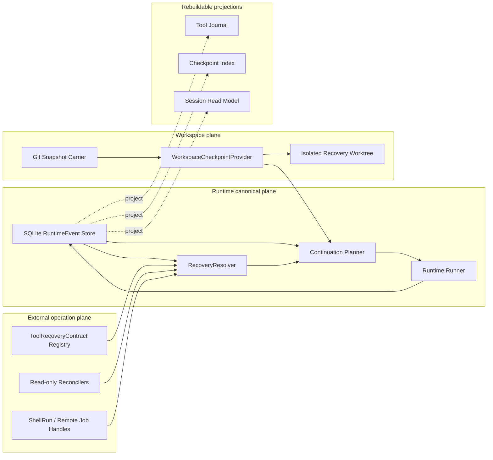
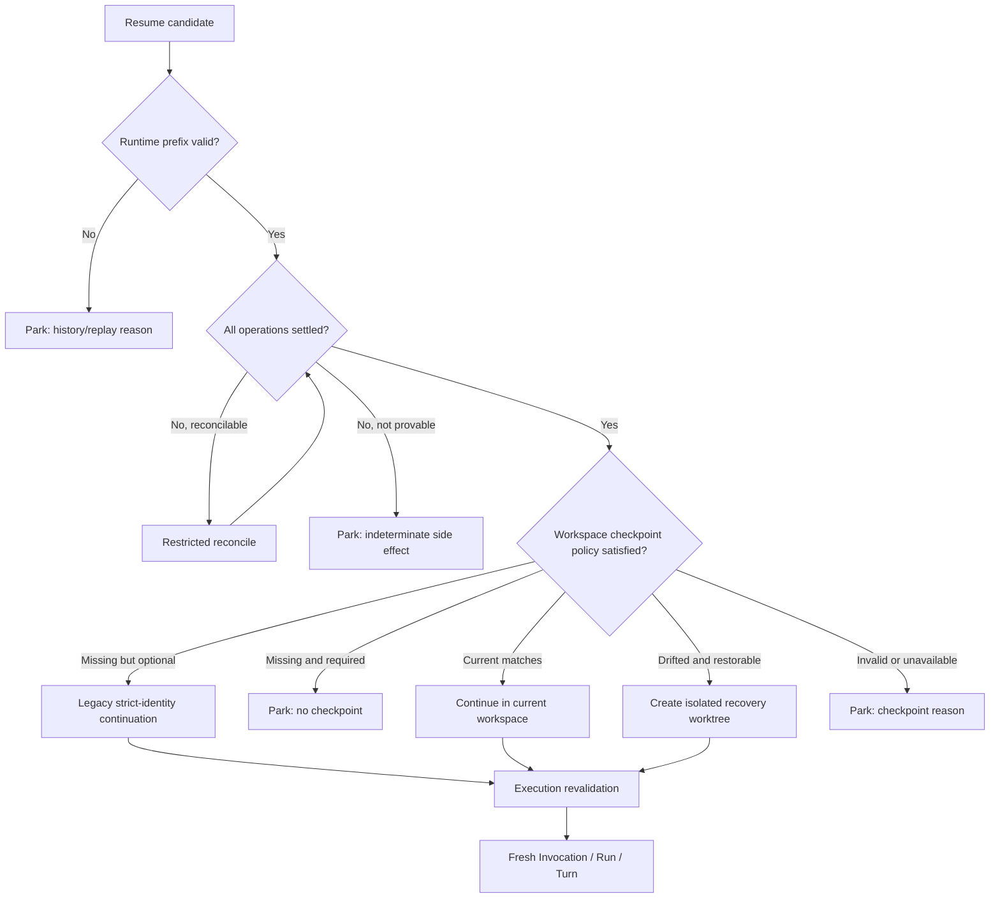
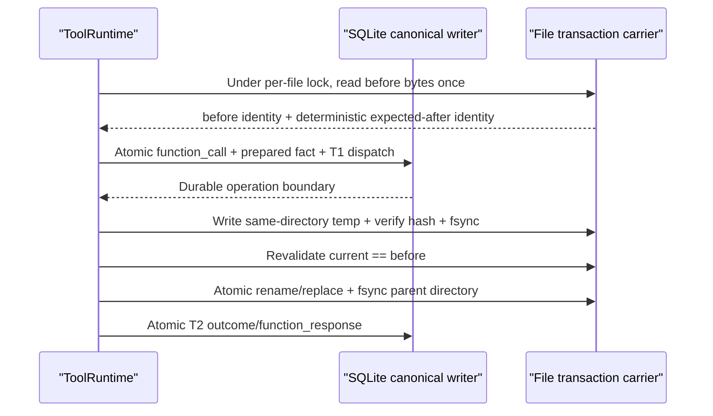
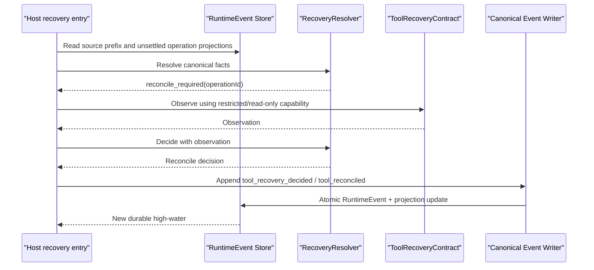
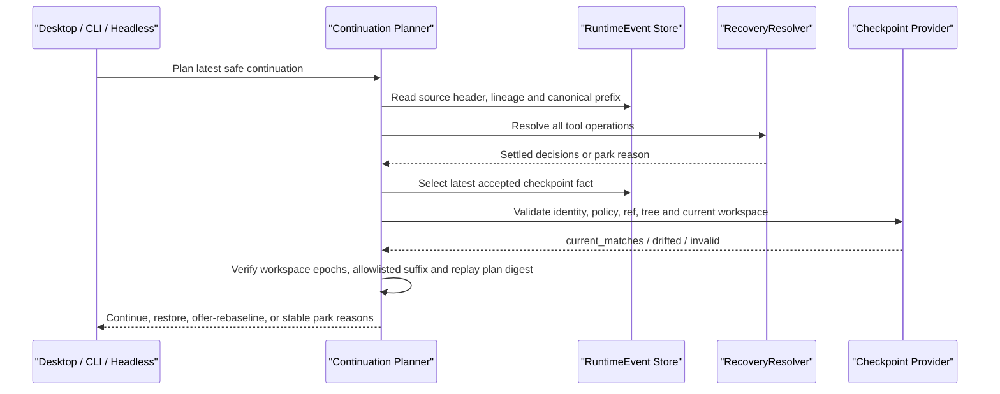
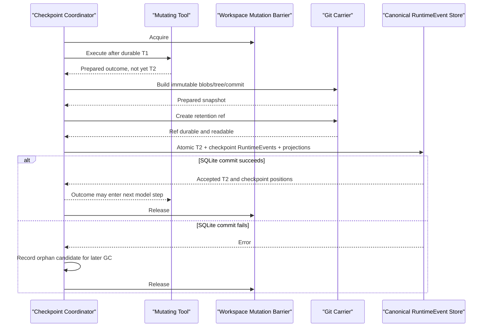
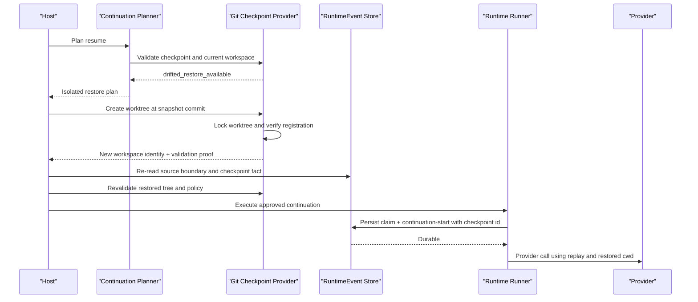

# Runtime Resume Phase 3–4：受控恢复与 Workspace Checkpoint 设计

- 状态：Proposed
- 目标版本：Phase 3A、Phase 3B、Phase 4A、Phase 4B、Phase 4C
- 前置实现：Phase 0–2.5
- 事实权威：RuntimeEvent
- 主要支持平台：Linux、macOS；Windows 有限支持
- Roadmap 权威：本文取代 `runtime-resume-tool-journal-design-draft.zh-CN.md` 中旧的 Phase 3/4 划分；旧文档保留背景与 Phase 0–2 记录

## 1. 摘要

Phase 0–2.5 已经建立了可信的写侧地基：RuntimeEvent 是唯一 canonical recovery fact source；T1/T2 把工具派发和结果提交变成 durable boundary；RecoveryResolver 是唯一恢复判定者；continuation 使用新的 Run、Invocation 和 Turn，不复活旧调用栈。

但“历史可以安全回放”仍不等于“任务可以端到端恢复”。一个可实践的 resume 必须同时回答三个问题：

1. 模型将看到的 RuntimeEvent 前缀是否完整、无歧义、可重放；
2. Agent 将看到的 workspace 是否与该历史处于同一个执行边界；
3. ShellRun、远程 API、子 Agent 等 workspace 之外的副作用是否已经收敛。

本文把 Phase 3–4 定义为一个连续的恢复系统：

- **Phase 3A：受控工具恢复。** 把崩溃窗口中的工具 operation 判定为 `completed`、`definitely_not_dispatched`、`reconcile_required`、`parked` 或 `corruption`，并将决定与 reconcile 结果追加为 RuntimeEvent；
- **Phase 3B：Workspace checkpoint 语义。** 将一个不可变 workspace snapshot 与一个可验证的 RuntimeEvent 前缀绑定，先交付 validation-only，不自动改写用户目录；
- **Phase 4A：Git snapshot carrier。** 用 Git object database、临时 index 和隐藏 retention ref 实现本地不可变 snapshot，不修改用户的 HEAD、branch 或 index；
- **Phase 4B：隔离恢复。** workspace 漂移时，在新的 recovery worktree 中恢复 snapshot，经 planning 与 execution revalidation 后继续；
- **Phase 4C：专属 durable integrations。** 为 ShellRun、远程任务、子 Agent 和带幂等协议的 API 补齐 workspace 之外的恢复能力。

Phase 编号是对既有 roadmap 的细化而不是另起一套命名：旧 Phase 3 被拆为 3A/3B，旧 Phase 4 被拆为 4A/4B/4C。两份文档发生冲突时，Phase 3–4 以本文为准。

核心结论是：

```text
可恢复边界
  = 已收敛的 RuntimeEvent 前缀
  + 与该前缀绑定的 workspace checkpoint
  + 已收敛的外部 operation facts
```

checkpoint 不是第二个事实源。SQLite checkpoint 表、Git ref 和 Tool Journal 都是 RuntimeEvent 的投影、载体或查询索引。发生冲突时，以 canonical RuntimeEvent 为准；无法证明一致时 fail closed。

## 1A. 用户最终看到的 Resume

本节描述 Phase 3A–4C 全部落地后的目标体验，不代表当前版本已经具备这些能力。每个“可以安全恢复”的结论都必须来自后文定义的证据链；UI 不能在 planner 完成前先承诺安全。

### 场景一：文件修改过程中应用崩溃

用户让 Maka 重构一个模块。前八个文件已经完成，修改第九个文件时应用进程退出。

目标体验：

1. 用户重新打开会话，横幅先显示“正在核验上次中断”；
2. RecoveryResolver 发现第九次 Write/Edit 已有 T1 dispatch、但没有 T2 outcome；
3. 对应 ToolRecoveryContract 使用只读证据检查目标文件，判定为 `applied`、`not_applied` 或 `conflict`；
4. 如果能证明文件已经完整写入，Runtime 追加 reconcile fact，补交 recovery-origin outcome，并为包含该结果的新边界捕获 checkpoint；它不是错误地要求当前 workspace 仍等于旧 checkpoint；
5. 历史、workspace 和外部 operation 三个平面全部通过后，横幅才变为“可以安全恢复”；
6. 用户点击恢复，Runtime 创建 fresh Invocation/Run/Turn，模型看到已完成的前九次工具结果，并继续处理剩余任务。

系统保证同一个已证明完成的 operation 不会因为 resume 被重新派发，但不保证新的 LLM 推理一定机械地产生“第十个文件”这一模一样的调用。模型可以重新规划；Runtime 保证的是证据、历史和副作用边界正确，而不是模型输出确定性。

在符合 §22 reference fixture 的 workspace 中，本地核验和增量 checkpoint 的目标通常位于亚秒到数秒范围；后续 provider 推理时间另计，不能把端到端恢复承诺写成固定 1–2 秒。

### 场景二：崩溃后用户已经手动修改文件

应用中断后，用户自己修好了文件、又做了其他修改，甚至已经创建普通 Git commit。重启后，planner 发现当前 tree 与 checkpoint snapshot 不一致。

Runtime 不执行 reset、checkout、stash，也不覆盖当前文件。UI 提供三个动作：

```text
上次中断后，工作区发生了变化。

○ 在隔离目录中恢复（推荐）
  从中断前的 checkpoint 创建独立工作目录继续。
  当前 checkout 的文件不会被修改。

○ 以当前文件为准继续
  将当前 workspace 作为用户确认的新基线。
  模型会被告知旧的文件假设可能已经过期。

○ 暂不恢复
  保留中断事实，稍后再处理。
```

选择“在隔离目录中恢复”时，系统创建 locked linked recovery worktree。用户当前 checkout 的文件保持不变，但 Git common dir 会增加 §9.2 明示的 Maka objects、refs 和 `.git/worktrees/maka-*` 管理信息；因此这里承诺“当前文件零改写”，不承诺“repository metadata 零足迹”。

选择“以当前文件为准继续”时，系统只有在 Phase 3A 已证明不存在 unsettled external operation 后才允许 rebaseline。它捕获当前 tree，建立新 workspace epoch，记录用户授权的 transition/checkpoint facts，并向模型注入“当前 workspace 是新基线”的 system context。对中断 operation 涉及的路径，首次继续应进入 read-before-write 的受限验证；一句 prompt 不能替代 Runtime gate。

如果 checkpoint object 已损坏、Git carrier 不可用或未知外部副作用仍未收敛，UI 会缩小可选动作；不能为了维持“三个按钮”而放开不安全路径。

### 场景三：长时间 ShellRun 中断了 UI 连接

用户启动一个三十分钟的构建或部署命令，在第二十八分钟时 Maka 应用进程崩溃，但操作系统和受监管的 shell supervisor 仍然存活。

Phase 4C ShellRun durable handle 落地后：

1. 启动前生成 stable `shellRunId`；独立 supervisor/spool 记录 process identity、启动时间、cwd、command digest 和输出 high-water；
2. 重启后先查询 durable handle，不能只凭一个可能被复用的 PID；
3. 进程仍在运行时，Runtime 重新连接 supervisor 并从 durable spool high-water 继续读取；
4. 进程已经退出、但 T2 尚未提交时，Runtime 从 terminal status 与 spool 重建 outcome；
5. handle、进程身份或 terminal result 无法证明时，operation 保持 indeterminate 并 park，不自动重复命令。

如果机器断电或重启，原进程通常已经不存在；ShellRun resume 只能利用 durable spool/remote job status 判断结果，不能声称“reattach 到已经消失的进程”。在 Phase 4C 之前，任何可能写 workspace 的 active ShellRun 都会阻止最新 safe checkpoint，并以 `checkpoint_blocked_active_shell_run` 明确展示；这段能力空窗不能隐藏。

### 场景四：无法查询的高风险远程副作用

用户让工具调用一个不支持幂等键和状态查询的支付 API，调用期间进程崩溃。Runtime 只能证明请求进入了 dispatch boundary，无法证明服务端是否扣款。

目标 UI：

```text
无法安全恢复。

上一次 payment.charge 调用可能已经产生副作用，但目标服务不支持
状态查询或幂等重试。为避免重复扣款，Maka 没有再次调用该工具。

请在支付后台确认订单状态，然后通过“提交恢复判断”选择：
“已确认成功”、“已确认未执行”或“仍无法确认”。
```

用户判断必须通过结构化恢复动作写成 user-attested RuntimeEvent，而不是让模型从一句普通聊天文本中猜测授权。即使用户选择“已确认未执行”，是否允许 retry 仍由 ToolRecoveryContract 决定。所有 dispatch、observation、用户判断、reconcile 和 park facts 都可审计。

### 场景五：一个 Session 中途切换项目目录

用户在 `/proj-a` 中完成两个 Turn，随后通过 CLI 把同一 Session 移到 `/proj-b`，继续工作后发生崩溃。

目标行为：

1. `/proj-a` 和 `/proj-b` 属于两个 workspace epochs；
2. 下一次 provider/tool execution 前，Runtime 写入 canonical `workspace_transition` fact；
3. replay 可以保留 `/proj-a` 的历史结果，但 system context 明确告诉模型当前 active epoch 是 `/proj-b`；
4. `/proj-b` checkpoint 只证明 `/proj-b` 的 snapshot，不会假装旧项目文件仍存在于当前目录；
5. 如果只观察到 Session header 的 cwd 已改变，却没有 durable transition fact，自动 resume 使用 `workspace_transition_uncommitted` 或 `workspace_epoch_legacy_gap` park；用户可以回到原目录、隔离恢复或显式 rebaseline。

这样，cwd move 仍然是可用功能，但不再让一份 checkpoint 暗中覆盖两个不同 workspace。

### 场景六：从较早 Turn 创建 Branch

用户在 Session 后期已经从 `/proj-a` 移到 `/proj-b`，随后选择从仍属于 `/proj-a` 的早期 Turn 创建分支。

目标行为：

1. branch 默认选择 source Turn 所属 workspace epoch，而不是 source Session header 的最新 cwd；
2. branch clone 先建立 source→branch ID map，按 fact kind 重写允许导入的历史；
3. source checkpoint event 不会被 object spread 原样复制；
4. 如果 source snapshot 仍可用，branch 可以共享 immutable Git object，但必须在 branch ledger 中追加新的 branch-local checkpoint fact；
5. 如果对应 workspace 不可用，UI 要求选择隔离恢复或“以当前 workspace 为新基线”，不能生成指向另一个 Session IDs 的伪 checkpoint。

用户看到的结果是“从那一刻、那个项目状态继续”，而不是“复制了聊天文本，却在另一个目录执行”。

### 场景七：Checkpoint 自己写到一半再次崩溃

用户不需要理解 SQLite 与 Git 的跨系统事务，但系统必须经得住 checkpoint 自己的崩溃窗口：

- blob/tree/commit 尚未完成：没有 canonical checkpoint，临时对象以后由 Git GC 处理；
- retention ref 已创建、SQLite bundle 尚未提交：留下 orphan ref 和 T1-only operation，恢复器忽略该 ref，Phase 3A 处理 operation；
- SQLite 正在提交 T2 + checkpoint：事务要么整体回滚，要么两个 facts 与 projections 全部可见；
- checkpoint 已接受、provider 尚未调用：下一次 planning 重新验证并使用 durable continuation claim；
- 用户连续点击两次恢复，或者 startup auto-resume 与手动点击并发：至多一个 source-boundary claim 成功。

因此用户不会看到“半个 checkpoint”，也不会因为快速点击按钮触发两次 provider/tool execution。

### 用户可见的能力边界

| 场景 | 系统承诺 |
|---|---|
| 已有可靠 reconciler 的 Write/Edit | 根据证据收敛 applied/not-applied/conflict，不重复已完成 operation |
| 任意 Bash、身份无法证明的进程 | 默认不猜、不盲重跑 |
| 不支持幂等或查询的远程 API | park，要求结构化人工判断 |
| 非 Git workspace（首版） | Runtime history 可以保持可读；不承诺 workspace-continuous resume |
| Git binary 缺失或版本不支持 | required checkpoint park，并提供可操作说明 |
| JSONL/file-ledger session | 保留 Phase 0/1 能力；迁入 sticky SQLite 后才能写 Phase 3 facts |
| 用户在崩溃后修改了 workspace | 不覆盖，提供 isolated restore、rebaseline 或 park |
| legacy 跨 cwd 历史缺少 transition fact | 不自动跨 epoch resume |
| active ShellRun 尚无 durable handle | 明确阻止最新 checkpoint，不伪装成可恢复 |

### 用户效果如何被量化

- required 模式下，`uncheckpointed_mutating_t2_count` 必须恒为 0：任何 accepted mutating T2 都在同一 SQLite transaction 中拥有 checkpoint；
- eligible Git workspace 的 `latest_boundary_recoverable_ratio` dogfood 目标不低于 99%；overall ratio 必须同时报告，并按 active ShellRun、policy limit、Git unavailable、大仓库等原因分层，不能只展示最好看的 cohort；
- 在 §22 定义的 5,000 文件、100 MiB reference fixture 上，warm incremental capture 目标为 p50 ≤ 500 ms、p95 ≤ 2 s；这不是对所有“常规仓库”的无条件承诺；
- 每 workspace 的 Maka-managed artifact 初始软配额为 2 GiB，Git 内容寻址负责增量去重；达到配额时停止新 capture 或清理过期 artifact，不能删除 active recovery boundary；
- UI 应分别展示“本地核验/恢复准备耗时”和“provider 继续生成耗时”，避免用模型延迟掩盖 checkpoint 性能。

### 一句话描述最终形态

崩溃从“历史可能损坏、副作用可能重复、用户只能重试”的事故，变成“系统能证明发生了什么、明确不能证明什么，并让用户在不丢失当前工作的前提下选择下一步”的可管理事件。

## 1B. Git 环境决定的三档体验

“机器安装了 Git”和“当前 workspace 是 Git repository”是两个不同条件。首版 Git carrier 还要求 SQLite canonical、Git 版本和 repository features 符合 snapshot policy，因此产品实际应按 carrier capability 分档，而不是只检测一个 `git --version`。

| 档位 | 环境 | 可获得能力 |
|---|---|---|
| A：eligible Git carrier | 支持的 Git CLI + 当前 workspace 位于受支持的 Git repository + SQLite canonical | Phase 3A 工具恢复，以及 checkpoint、内容漂移检测、隔离恢复、durable rebaseline |
| B：non-Git workspace | Git CLI 可用，但当前 workspace 不属于 Git repository | Phase 3A 工具恢复；Desktop optional policy 可以走 legacy strict identity；没有 workspace snapshot |
| C：Git carrier unavailable | Git CLI 缺失/过旧，或者 repository feature/policy 不受支持 | 与 B 相同的非 carrier 能力；required policy 明确 park 并给出可操作原因 |

即使磁盘上存在 `.git`，只要 CLI 不可用、object format/filters/submodule 状态不受支持或 workspace 超过 policy limits，也不能假装属于 A 档。反过来，安装了 Git CLI 也不会把普通目录自动变成 repository。

Maka 首版不得替用户对普通目录执行 `git init`。自动初始化会改变父目录发现、ignore 行为、其他工具输出和用户对项目的所有权预期；这不是透明的内部实现。

### 崩溃后用户没有修改文件

| A 档 | B/C 档 |
|---|---|
| 校验 checkpoint fact、tree、policy、workspace epoch 与当前内容，能够证明 workspace 仍匹配 | 只能校验 canonical path、filesystem identity、cwd 和已收敛 operation；不能证明文件字节未变化 |
| checkpoint-required host 可以继续 | `optional_legacy` host 可以在明确的弱保证下继续；required host 必须 park `no_checkpoint/unsupported_workspace_carrier` |

B/C 档在用户确实没有修改文件时，表面体验可能与 A 档接近，但证明强度不同。UI 和 telemetry 必须标明 `legacy_identity_only`，不能把“目录 identity 没变”描述成“workspace 已验证未变”。目录 mtime、文件数或其他快速信号只能触发保守 park，不能升级为内容一致证明。

### 崩溃后用户修改了文件

| A 档 | B/C 档 |
|---|---|
| 在 snapshot policy 覆盖范围内做 tree/path 级漂移比较，提供 locked isolated restore、durable rebaseline 或 park | 没有历史 snapshot，无法可靠生成内容漂移报告，也无法还原崩溃时 workspace |
| isolated restore 不改写当前 checkout 文件；rebaseline 捕获当前内容为新 durable boundary | 不能提供真正的 isolated restore 或 durable rebaseline |

B/C 档如果当前状态无法证明，应 park。Desktop optional policy 未来可以提供明确标红的“在没有 workspace 证明的情况下开始普通新 Turn”，但它不是 approved resume，也不应继承“安全恢复”文案；required host 永远不能走这条路。

A 档的内容证明也只覆盖 snapshot policy 纳入的路径。ignored/excluded 文件不在 snapshot 中时，系统必须展示 policy limitation，不能宣称整个目录所有字节都经过验证。

### ShellRun 与远程副作用

ShellRun durable handle、远程 job query 和 API idempotency protocol 本身不依赖 Git，所以 A/B/C 都可以查询进程或远程 operation 状态。不过 Git 能力仍影响命令产生的文件状态：

- A 档可以在 operation 收敛且 workspace writer 静止后，为结果建立内容 checkpoint；
- B/C 档可以证明“进程退出码/远程状态是什么”，却不能因此证明当前 workspace 等于命令结束时的文件状态；
- 无法证明的支付、部署等外部副作用在所有档位都 park，Git snapshot 不能替代服务端查询或人工确认。

### 能力对照

| 能力 | A：eligible Git carrier | B/C：无可用 carrier |
|---|---:|---:|
| Session view 与 committed history 可读 | 是 | 是 |
| Phase 3A supported-tool reconcile | 是 | 是 |
| optional legacy identity continuation | 可用但通常不需要 | 可用，明确弱保证 |
| required workspace-continuous resume | 是 | 否 |
| ShellRun durable-handle query/reattach | 是 | 是 |
| policy 范围内的内容级漂移检测 | 是 | 否 |
| 崩溃边界 workspace snapshot | 是 | 否 |
| locked isolated recovery workspace | 是 | 否 |
| durable rebaseline | 是 | 否 |
| 未知副作用时 fail-closed park | 是 | 是 |

### 为什么首版优先复用 Git

Git 正好提供 checkpoint carrier 所需的最小原语：

1. **内容寻址。** blob/tree OID 是内容完整性身份，不依赖脆弱的 mtime；
2. **不可变 snapshot。** tree/commit 创建后不会被原地改写；
3. **增量去重。** 重复 checkpoint 复用已有 objects，修改一个文件不必复制整个 workspace；
4. **有序持久化。** 可以先创建 objects/ref，再提交 canonical RuntimeEvent；失败只留下可识别 orphan；
5. **隔离恢复。** detached locked worktree 能从指定 commit/tree 建立独立执行目录；
6. **成熟校验。** `cat-file`、OID read-back、ref compare/update 和 repository consistency 工具已经存在；
7. **生命周期管理。** namespaced refs 可以承担 retention root，过期后交给正常 Git GC 回收 objects；
8. **代码项目覆盖率高。** Maka 的主要工作负载通常已经在 Git repository 中，不需要先部署新的 daemon 或服务。

其他候选并不是不能实现，而是首版代价更高：

| 方案 | 首版主要问题 |
|---|---|
| 每次 tar/zip 全量复制 | I/O 与磁盘近似 O(workspace × checkpoints)，去重、原子引用和增量恢复都要另做 |
| 把文件内容塞进 SQLite BLOB | 放大数据库、延长 migration/backup/transaction 风险，并把 filesystem metadata 语义塞进 Runtime store |
| reflink/APFS clone/VSS | 平台相关，不能形成统一内容 identity，跨机器和 retention 行为难以一致 |
| 自研 filesystem CAS | 最终需要重新实现 blob/tree、metadata policy、GC、校验、restore 和损坏处理，相当于维护第二套 Git 子集 |
| 自动 `git init` | 对用户 workspace 产生可见且长期的产品副作用，不是透明 fallback |

因此“使用已有 Git”是明确的产品边界，不是把 Git 当作恢复真相源：RuntimeEvent 仍决定 checkpoint 是否被接受，Git 只保存不可变 workspace artifact。当前路线不实现 Native workspace manifest/CAS。无 Git 环境的 Native 能力止于 Phase 3A 的 Write/Edit 文件事务 checkpoint；它能证明单次受支持文件操作的 before/after 三态，但不能升级为目录级 snapshot、内容漂移证明或隔离恢复。

## 2. 背景与问题边界

### 2.1 Phase 2 已经解决什么

Phase 2 的 T1/T2 协议保证：

- 工具实现只能在 durable T1 dispatch fact 成功后进入；
- 工具结果必须在 durable T2 response/outcome 成功后才能进入下一次模型推理；
- function call、dispatch fact、response 与 Tool Journal 投影可在 SQLite 中原子提交；
- completed tool 在 provider replay 中作为历史结果出现，而不是被重新执行；
- unmatched call 或 dispatch 不会被误判成“肯定没执行”。

这些保证封闭的是 **Runtime 写侧与 provider history**，并没有证明当前文件系统仍等于崩溃时的文件系统。

### 2.2 仅有 RuntimeEvent high-water 为什么不够

假设 Agent 已经：

1. 编辑 `src/a.ts`；
2. 提交工具 response；
3. RuntimeEvent high-water 到达 42；
4. 应用崩溃；
5. 用户在重启前手动修改了 `src/a.ts`。

此时 high-water 42 仍然是完整历史，但基于这段历史继续会让模型错误地相信 workspace 仍处于步骤 2 后的状态。反过来，如果只恢复 Git tree，却没有相应的 RuntimeEvent 前缀，模型也不知道这些文件为何存在、哪些工具已执行。

所以历史与 workspace 必须被一个逻辑 checkpoint 绑定，而不是分别“看起来差不多”。

### 2.3 Git snapshot 不能解决什么

Git snapshot 只覆盖 Agent 可见的 workspace 字节与目录结构。它不能证明：

- shell 子进程是否仍在运行；
- 邮件、支付、部署或远程 API 是否已经成功；
- child Agent 是否已经提交外部成果；
- 数据库事务是否提交；
- 端口、容器或远程 job 是否还存在。

这些状态必须由 operation-specific reconciler 或 durable handle 处理。Phase 4C 因而不是附加优化，而是第三个恢复平面的补齐。

## 3. 目标与非目标

### 3.1 目标

- 让 RuntimeEvent 始终保持唯一恢复事实源；
- 对崩溃中的工具副作用给出稳定、可审计、fail-closed 的判断；
- 把 RuntimeEvent 前缀与不可变 workspace snapshot 绑定；
- 显式表示 session 中途 cwd move 形成的 workspace epoch，并安全处理 branch clone；
- 在规划时与执行前分别校验历史、workspace 和外部 operation；
- workspace 漂移时不覆盖用户当前改动，而是在隔离 worktree 中恢复；
- 允许 Desktop、CLI 和 Headless 根据 host policy 选择不同的 checkpoint 要求；
- 用 crash injection、真实进程 SIGKILL 和 Git fixture 证明每个持久化窗口的行为；
- 为未来多 worker/fencing 留出边界，但不在单机 Phase 3–4 中提前引入分布式协议。

### 3.2 非目标

- 不复活旧 provider stream、Promise、进程或 JavaScript 调用栈；
- 不承诺任意 Bash 命令都能自动判断结果；
- 不用 LLM 猜测副作用是否发生；
- 不默认执行 `git reset --hard`、`git checkout`、`git stash` 或普通 Git commit；
- 不修改用户当前 branch、HEAD、index 或工作区；
- 不在第一版实现非 Git workspace 的完整内容寻址快照；
- 不在单机 Runtime 中加入 lease epoch、fencing token 或分布式 scheduler；
- 不把“打开桌面应用”默认变成可能产生 provider token 费用的自动恢复动作。

## 4. 术语

| 术语 | 定义 |
|---|---|
| RuntimeEvent prefix | 按 durable 顺序读取的一段 canonical RuntimeEvent 事实 |
| high-water | 某一个 source Run 中已提交事件的 durable 上界；单独一个数字不能表达祖先链 |
| Runtime boundary cursor | source Run high-water 加 lineage manifest/digest 的组合边界 |
| operation | 一次有稳定 `operationId` 的工具执行尝试 |
| reconcile | 使用 operation-specific、优先只读的证据判断副作用结果 |
| snapshot | workspace 字节与目录结构的不可变内容对象，例如 Git tree/commit |
| checkpoint | RuntimeEvent 边界与 snapshot 的逻辑绑定事实 |
| carrier | 保存、校验和恢复 snapshot 的实现，例如 Git object database |
| retention ref | 让 Git snapshot 不被 GC 的隐藏 ref；它不是事实权威 |
| workspace drift | 当前 Agent 可见 workspace 与 checkpoint snapshot 不一致 |
| workspace epoch | session 中 cwd/repository identity 连续不变的一段执行历史；cwd move、branch workspace 选择、isolated restore 或 rebaseline 会开启新 epoch |
| isolated recovery workspace | 从 snapshot 创建、与用户当前 workspace 分离的新 worktree |
| accepted boundary | 历史、workspace 和外部 operation 均满足当前 host policy 的恢复边界 |

必须严格区分以下三个概念：

```text
snapshot   = 不可变内容
checkpoint = Runtime 历史与 snapshot 的绑定
Git ref    = snapshot 的保留根
```

Git ref 丢失可能使 snapshot 不可恢复，但 ref 本身不能证明 checkpoint 曾被 Runtime 接受。只有 canonical checkpoint RuntimeEvent 能证明这一点。

## 5. 总体架构



### 5.1 三平面决策



三个平面是逻辑上的 AND，不是互相替代：workspace snapshot 正确不能覆盖 dangling tool state；工具状态 completed 也不能覆盖 workspace drift。

## 6. 核心不变量

### 6.1 事实归属

1. 工具 dispatch、outcome、恢复决定、reconcile 结果和 checkpoint 接受都必须表现为 append-only RuntimeEvent；
2. Tool Journal 与 checkpoint SQLite 表必须能从 RuntimeEvent 重建；
3. Git object/ref 只保存载体，不独立决定能否 resume；
4. 禁止修改历史 RuntimeEvent 来“修正”崩溃，修复只能追加新事实；
5. 未知 marker、未知 event shape、重复冲突事实或投影冲突一律 fail closed。

### 6.2 副作用顺序

1. T1 成功前不得进入工具 implementation；
2. T2 成功前不得把结果交给下一次模型推理；
3. 未收敛 operation 不得被 checkpoint 宣称为 safe boundary；
4. `indeterminate` 不等于 failed，也不等于可重试；
5. 受限验证优先只读，不允许第一步重复原命令；
6. 自动重试只能由 tool recovery contract 明确授权，不能由 LLM 自行决定。

### 6.3 Checkpoint 一致性

1. checkpoint 必须引用一个可验证的 composite Runtime boundary，而不是只有裸 high-water；
2. checkpoint snapshot 必须包含该 boundary 之前所有已收敛的 workspace mutation；
3. snapshot 捕获期间不得有 Maka 工具并发修改 workspace；
4. 若检测到外部进程/用户在捕获期间修改文件，捕获必须重试或失败；
5. RuntimeEvent 绝不能引用尚未创建或无法读取的 Git object/ref；
6. 若 checkpoint 存在但校验失败，不能静默降级到较弱的 Phase 2 路径；
7. 恢复不得覆盖用户当前 workspace，除非用户对一次明确操作给予授权；默认只允许隔离恢复。

### 6.4 Continuation 身份

1. continuation 总是创建新的 Invocation、Run 和 Turn；
2. source RuntimeEvent ledger 永不被 continuation 修改；
3. continuation-start 必须在 provider 调用前 durable；
4. 同一 source boundary 只能存在一个被接受的 continuation claim；
5. planning 结果不是 lease，execution 前必须重新读取所有权威事实。

### 6.5 Workspace epoch 与 branch

1. Session header 的当前 `cwd` 不是历史上所有 Run 的 cwd；每个 Run 必须保留其创建时不可变的 workspace epoch；
2. session cwd move 是一个恢复边界变化，不能只依赖可覆盖的 Session header 字段；
3. 新 workspace epoch 必须在下一次 provider/tool execution 前由 canonical workspace-transition fact 建立；
4. checkpoint 只能证明其 active workspace epoch 的 snapshot，不能把早期 epoch 的 workspace 状态暗中归入当前 snapshot；
5. branch clone 是语义导入，不是 RuntimeEvent 字节复制；任何包含内部 ID 的 fact 必须按类型重写或重新接受；
6. 未建立 transition fact 的 legacy 跨 cwd 历史不得用于 Phase 3B+ 自动 resume。

## 6A. PR 0：Runtime fact 前向兼容

这是所有 Phase 3 新 event kind 的发布前置。当前 read-model 会把未知 event 形状记为 `unsupported_event`，随后将整个 session view 判为不可读取。仅给每个新 fact 增加一个专用 benign 分支仍会让旧 binary 在第一次遇到新事实时失败。

目标是在 RuntimeEvent actions 中先引入一个通用、显式声明 UI 投影语义的 envelope：

```ts
interface RuntimeFactEnvelope {
  kind: string;
  version: number;
  legacyProjection: 'invisible';
  payload: unknown;
}

interface RuntimeEventActions {
  runtimeFact?: RuntimeFactEnvelope;
}
```

兼容规则必须分层：

- legacy read-model 遇到 `runtimeFact.legacyProjection === 'invisible'` 时，不创建聊天行，记录 `unknown_runtime_fact` soft diagnostic 后继续构建 session view；
- 未放入该 envelope 的未知 action/event shape 仍然是 hard diagnostic，避免把未来可能拥有聊天行的事件静默吞掉；
- RecoveryResolver、checkpoint planner 和 runner 必须对 `kind + version` 使用严格白名单；未知 runtime fact 只能 park，不能执行 continuation；
- 新 writer 只能在 storage schema/capability 声明 reader 已支持该 envelope 后写入 Phase 3 fact；
- PR 0 必须先独立发布并经过兼容测试，之后才能有任何 Phase 3 writer 落盘新 kind。

Runtime fact kind 统一使用 `maka.<domain>.<name>` 小写点分命名，例如
`maka.tool.recovery_decision`、`maka.tool.reconcile_result`、
`maka.workspace.checkpoint`。兼容性由 `kind + version` 共同决定；不得通过改用
snake_case、缩写或省略 `maka.` 前缀表达协议版本。

PR 0 的 reader/writer capability matrix：

| Store / binary | 读取 envelope | 写入 envelope | downgrade 行为 |
| --- | --- | --- | --- |
| SQLite schema 5+ / PR 0+ | 可读；UI soft diagnostic，recovery hard park | 仅当 store 声明 `runtime_fact_envelope_v1` | pre-PR0 binary 最高只支持 schema 4，必须拒绝打开 |
| legacy JSONL / PR 0+ | 可导入和读取既有兼容数据 | 禁止写入 `runtimeFact` | 不会产生 pre-PR0 reader 无法理解的新事实 |
| pre-PR0 binary | 不理解 envelope | 不具备 capability | 不能打开 schema 5 SQLite；不能由 JSONL 新 writer 暴露新事实 |

SQLite schema 5 是 envelope 的 downgrade gate，不表示某个具体 fact kind 已被 recovery
支持。具体 kind 的 writer 还必须检查 store capability，并且不得在 legacy JSONL host 上
降级写入。PR 0 本身仍不包含任何生产 fact writer。

这一区分保证“旧 UI 尽量可读”而不把“旧 Runtime 可以安全执行”混为一谈。

## 7. Phase 3A：受控工具恢复

### 7.1 为什么 Phase 3A 是 checkpoint 的硬前置

如果一个 Write 工具已经提交 T1，但应用在 T2 前崩溃，workspace 可能处于以下任一状态：

- 文件完全未改变；
- 文件已经完整改变；
- 多文件操作只完成一部分；
- 文件改变完成，但 response 未提交；
- 外部命令仍在运行。

直接捕获当前 workspace 只能记录“现在是什么”，不能证明这个状态是否是工具契约允许的完整结果。Phase 3A 必须先判定 operation；只有 `completed`、被证明的 `not_applied`，或被明确接受的 reconciled result 才能进入 checkpoint。

### 7.2 RecoveryResolver 输出

建议稳定输出：

```ts
type RecoveryDisposition =
  | 'completed'
  | 'definitely_not_dispatched'
  | 'reconcile_required'
  | 'parked'
  | 'corruption';

interface RecoveryDecision {
  operationId: string;
  disposition: RecoveryDisposition;
  reasonCode: RecoveryReasonCode;
  evidenceEventIds: string[];
  recoveryContractId?: string;
  automaticActionAllowed: boolean;
}
```

Resolver 是纯函数：输入 RuntimeEvent facts、已注册 recovery contract capability 和必要的 durable handle observation；输出稳定 decision。它不调用工具、不修改文件、不写数据库。

### 7.3 ToolRecoveryContract

每类工具显式声明恢复能力：

```ts
interface ToolRecoveryContract<TObservation = unknown> {
  id: string;
  version: number;
  mode:
    | 'replay_safe_read'
    | 'reconcile_then_decide'
    | 'idempotent_with_runtime_key'
    | 'durable_handle'
    | 'manual_only';
  observe?(operation: UnsettledOperation): Promise<TObservation>;
  decide?(input: {
    operation: UnsettledOperation;
    observation: TObservation;
  }): ReconcileDecision;
}
```

第一版策略：

| 工具类别 | Phase 3A 行为 |
|---|---|
| 纯读工具 | 可在受限模式重放，结果作为新的 recovery fact 提交 |
| Write/Edit | 读取目标当前状态，与 operation-specific pre/post evidence 比对 |
| 原子文件替换 | 可利用目标存在性、大小、mtime、inode 与预期内容身份；不能只靠 mtime |
| 多文件写入 | 必须有 manifest/transaction marker；无法证明全部完成则 park |
| Bash 任意命令 | 默认 `manual_only`，不得自动重复 |
| 可重新连接 ShellRun | 通过 durable handle 查询或 reattach |
| 支持服务端幂等键的 API | 使用 Runtime 分配的稳定 operation key 查询/重试 |

mtime 与 size 可作为快速否定或候选筛选，不能单独证明内容一致。内容 hash 不应在所有 happy path 工具上无条件计算，但 reconcile/checkpoint 本身需要足够强的内容身份。

#### 7.3.1 文件事务 checkpoint 与 workspace snapshot 是两个独立层级

Write/Edit 的 operation-level checkpoint 不依赖 Git，也不能等待 Phase 4A 的 workspace
snapshot 来替代。两者回答的是不同问题：

| 层级 | 回答的问题 | 最小证据 | Git 依赖 |
|---|---|---|---|
| 文件事务 checkpoint | 这一次 Write/Edit 是否完成 | canonical path、before identity、expected-after identity、transform/version/args hash | 无 |
| workspace snapshot | 整个 agent-visible 目录是否仍对应同一 Runtime boundary | tree/object identity、workspace identity、policy、boundary cursor | 首版使用 Git carrier |

文件事务 fact 只持久化身份，不要求持久化文件正文：

```ts
interface PreparedFileMutationFact {
  protocol: 'prepared_file_mutation_v1';
  operationId: string;
  workspaceRoot: string;
  canonicalPath: string;
  relativePath: string;
  before:
    | { kind: 'missing' }
    | { kind: 'file'; sha256: string; byteLength: number; mode: number };
  expectedAfter: {
    kind: 'file';
    sha256: string;
    byteLength: number;
    mode: number;
    blobOid?: string; // 可选 carrier 优化，不是恢复正确性的前提
  };
  transform: { id: string; version: number; argsHash: string };
  carrier?: { kind: 'git_object_v1'; repositoryCommonDir: string; retentionRef: string };
}
```

正常执行与恢复必须调用同一份、带版本的 Write/Edit transform。`old_string`、
`new_string` 只用于从 durable args 和 hash 匹配的 before bytes 确定性生成 after bytes，
不能用于统计当前文件中的字符串出现次数并推断副作用是否发生。恢复只接受三态证据：

```text
current identity == expected-after identity  -> 已完成；只补 recovery facts/response
current identity == before identity          -> 可重做 exact transform + atomic replace
其他                                          -> drift/conflict；park
```

没有 prepared checkpoint、transform 版本不匹配、args hash 不匹配或无法读取 hash
匹配的 before bytes 时一律 park；不存在基于 `countOccurrences`、mtime 或 size 的
recovery fallback。无 Git 环境仍获得这一 operation-level 能力，只失去 Phase 3B/4A
的 workspace snapshot、精确目录漂移报告、隔离恢复和 rebaseline。

#### 7.3.2 文件事务提交顺序



per-file lock 覆盖 prepare、T1、replace 和 T2，阻止同一 Runtime 内的并发写者穿透
边界；replace 前仍须重新验证 before identity，以检测外部 drift。SQLite T1 bundle
成功才表示 checkpoint durable；仅在内存中计算完 hash 不构成持久边界。当前 Phase 3
writer 仍要求 SQLite capability，因为 JSONL 无法原子绑定 prepared fact 与 dispatch；
这项 storage 约束不等于 Git 依赖。

Edit 的匹配也是 durable preflight 的一部分：读取 before bytes 后，正常执行使用的
`computeEditedSource` 会在 T1 前验证 `old_string` 是否存在、唯一且可安全变换。匹配失败
时不会写 dispatch fact，也不会产生 T2；恢复语义是 `definitely_not_dispatched`。这与旧
实现“T1 后由 impl 失败并提交 error outcome”的事件形状不同，是协议级的刻意变化。
统计、调试和测试不得假设每个 Edit 失败都存在 dispatch；只有跨过 durable preflight
的调用才具有 T1。

本地 carrier 为每个 operation 使用确定性的同目录 temp 名。真实进程崩溃可能跳过
`finally`，authoritative recovery 在 inspect/redo 前只清理该 prepared fact 可证明归属
的 temp；不通过宽泛 glob 扫描和删除用户 workspace 文件。相同 operation 多次崩溃最多
留下一个 temp。被放弃 session 的长期 housekeeping 后续由 workspace retention/GC 处理。

### 7.4 恢复事件

建议通过 PR 0 的 `actions.runtimeFact` envelope 追加两类 canonical、模型默认不可见的 fact：

```ts
interface ToolRecoveryDecisionFact {
  protocol: 'tool_recovery_v1';
  operationId: string;
  disposition: RecoveryDisposition;
  reasonCode: RecoveryReasonCode;
  evidenceEventIds: string[];
  recoveryContractId?: string;
}

interface ToolReconcileResultFact {
  protocol: 'tool_reconcile_v1';
  operationId: string;
  result: 'applied' | 'not_applied' | 'conflict' | 'still_running';
  observationDigest: string;
  observedAt: string;
  nextAction: 'synthesize_response' | 'retry_allowed' | 'reattach' | 'park';
}

// envelope.kind/version:
// maka.tool.recovery_decision / 1
// maka.tool.reconcile_result / 1
```

`observationDigest` 保护证据身份，原始敏感内容不进入 telemetry。若需要合成 provider-visible tool response，应另追加合法 function response event，并清楚标记 `origin: 'runtime_recovery'`；不能把 recovery decision event 伪装成模型原始结果。

### 7.5 给模型的 indeterminate 反馈

当策略允许模型参与后续判断时，合成反馈必须是可执行约束，而不是一句“结果未知”：

```text
The previous tool execution was interrupted. Its side effects may or may not
have occurred. Do not repeat the command. First inspect current state using
read-only tools permitted by the recovery plan, then decide the next step.
```

但 prompt 只是 UX 防线，不是安全边界。Runtime 仍须在 restricted verification mode 中拦截不被允许的写工具、原 operation 重试和等价危险调用，避免模型死循环。

### 7.6 Phase 3A 时序



### 7.7 Phase 3A 完成条件

- RecoveryResolver 决策表和 corruption 分支有纯单元测试；
- 同 operation 多 dispatch/response 不会静默覆盖；
- protocol marker 只接受白名单值；
- recovery decision 与 reconcile result 是 canonical RuntimeEvent；
- journal 删除后可从 RuntimeEvent 重建相同 operation 状态；
- Write/Edit 至少能稳定区分 `applied/not_applied/conflict`；
- Write/Edit 使用 durable before/expected-after identity 与正常执行相同的 transform；
- 非 Git workspace 可完成文件事务恢复，且缺 checkpoint 时不会退回内容启发式；
- Bash 默认不会因 crash 自动重跑；
- restricted verification 拦截原命令立即重试；
- execution rejection 使用稳定 code，而不是裸 `Error`。

## 8. Phase 3B：Workspace checkpoint 语义与 validation-only

### 8.1 Composite Runtime boundary

现有 continuation 可以沿父链组装 replay，一个裸 `sourceRuntimeEventHighWater` 只描述直接 source Run，不能覆盖祖先前缀。checkpoint 必须绑定完整 lineage：

```ts
interface RuntimePrefixSegment {
  invocationId: string;
  runId: string;
  turnId: string;
  highWater: number;
  prefixDigest: string;
  workspaceEpochId: string;
  workspace: WorkspaceIdentity;
}

interface RuntimeBoundaryCursor {
  sourceInvocationId: string;
  sourceRunId: string;
  sourceTurnId: string;
  sourceHighWater: number;
  replaySources: RuntimePrefixSegment[];
  replayManifestDigest: string;
}
```

`prefixDigest` 只摘要 `readImmutableRuntimeEvents` 返回的非 partial、append-only canonical rows，包括规范化 event envelope 与完整 payload。可覆盖的 partial snapshot 不进入 digest；崩溃后仍可见的 partial 只作为 UI/recovery evidence，必须先由 terminal repair 或 Phase 3A 收敛，不能成为 checkpoint boundary。

`providerReplayDigest` 不属于 durable cursor。它依赖 binary 中的 provider projection 版本，只放进短命 continuation plan，并与 `providerProjectionVersion` 一起在 execution revalidation 时重算。binary 升级使旧 plan 失效是可接受的；checkpoint 本身不能因此失效。

未来若 SQLite 提供 workspace-wide global durable position，可以作为加速索引加入 cursor；第一版仍必须保留 source identity 与 lineage manifest，避免一个全局数字掩盖错误归属。

### 8.2 Workspace 身份拆分

现有 filesystem identity 适合判断“是否仍是同一个本地目录”，但隔离 worktree 的路径和 inode 必然不同。目标模型拆成：

```ts
interface WorkspaceIdentity {
  repositoryIdentity: string;
  workspaceInstanceIdentity: string;
  canonicalRoot: string;
  carrierKind: 'git' | 'none';
}
```

- `repositoryIdentity` 标识同一个 Git object universe，例如 canonical common-dir、filesystem identity、object format 的摘要；
- `workspaceInstanceIdentity` 标识一个具体工作目录；
- in-place resume 要求两者都符合计划；
- isolated restore 允许新的 instance identity，但 repository identity 与 snapshot carrier 必须匹配。

### 8.3 Workspace epoch 与 cwd move

上游已经允许 session 中途修改 `cwd`，因此不能再把 Session header 的当前 cwd 当成整个 lineage 的 workspace identity。目标模型为每个连续 workspace 段分配 `workspaceEpochId`：

```ts
interface WorkspaceEpoch {
  workspaceEpochId: string;
  workspace: WorkspaceIdentity;
  openedByEventId: string;
  previousEpochId?: string;
}

interface WorkspaceTransitionFact {
  fromEpochId: string;
  toEpochId: string;
  from: WorkspaceIdentity;
  to: WorkspaceIdentity;
  reason: 'session_cwd_move' | 'branch_workspace_select' | 'isolated_restore' | 'user_rebaseline';
}
```

规则：

- Session 第一个 durable Run 的首事件建立 initial epoch；后续 epoch 只能由 transition fact 建立；
- 每个 Run header 的 cwd/workspace identity 在创建后不可变，并映射到一个 epoch；
- CLI `moveSession()` 可以先更新当前 Session header 和 pending reminder，但在下一次 provider/tool execution 前，必须把 `workspace_transition` runtime fact 写成新 Run 的首个 system-owned event；
- 如果 cwd 已变化而 transition fact 尚未 durable，旧 failed Run 只能 park 为 `workspace_transition_uncommitted`，不能在新 cwd 自动 resume；
- replay 可以包含多个 epoch，但每次 transition 必须是 canonical、连续且 identity 可验证的；模型输入必须包含明确的 workspace transition system context；
- active checkpoint 只证明最后一个 epoch 的 workspace；较早 epoch 的工具结果是历史事实，不得被解释成当前文件仍存在；
- legacy ledger 如果只能观察到 Run cwd 变化、却没有 transition fact，Phase 3B+ 自动恢复使用 `workspace_epoch_legacy_gap` park；用户仍可走显式 rebaseline。

### 8.4 Branch clone 语义

现有 `cloneBranchRuntimeLedger` 会为 cloned event 改写 envelope 的 session/run/invocation/event ID，但不会重写 payload 内部的 boundary、event ref 或 checkpoint identity。Phase 3 fact 落地前必须把 branch clone 改为按 fact kind 的语义导入：

1. branch point 必须位于 settled Runtime boundary；
2. 默认 branch cwd 取 source turn 所属 workspace epoch，而不是 source Session header 的最新 cwd；若该 workspace 不可用，用户必须选择 restore 或 rebaseline；
3. 先建立 source→branch 的 Run、Invocation、Event 和 workspace-epoch ID map，再重写允许复制的 provider-visible facts；
4. continuation-start、recovery decision、workspace transition 和 checkpoint 等 recovery-only facts 不得由通用 object spread 原样复制；
5. source checkpoint 可以共享同一 immutable Git object，但 branch 必须在验证 source snapshot 与 branch workspace 后，追加新的 branch-local checkpoint fact；其 `coveredBoundary` 使用 branch IDs，并通过 `derivedFromCheckpointId` 保留来源；
6. 无法识别或无法安全重写的 runtime fact 会让 branch 的 Phase 3B resume capability park，不允许生成“指向别的 session ledger”的 checkpoint；
7. branch import 后必须用 branch-local canonical events 重建 projection，不能复制 source projection rows。

branch 是新 session 的历史导入，不代表外部副作用再次发生。operation identity 的共享/派生规则必须由 branch import contract 明确，不能让同一外部 operation 因深复制而被当成第二次 execution。

### 8.5 Canonical checkpoint fact

通过 `RuntimeEvent.actions.runtimeFact` 表达 checkpoint；envelope 使用 `kind: 'maka.workspace.checkpoint'`、`version: 1`、`legacyProjection: 'invisible'`：

```ts
interface WorkspaceCheckpointFact {
  protocol: 'workspace_checkpoint_v1';
  checkpointId: string;
  kind: 'captured' | 'restored' | 'rebased';
  coveredBoundary: RuntimeBoundaryCursor;
  workspaceEpochId: string;
  workspace: WorkspaceIdentity;
  snapshot: {
    carrierKind: 'git';
    objectFormat: 'sha1' | 'sha256';
    commitOid: string;
    treeOid: string;
    retentionRef: string;
  };
  policy: {
    version: number;
    hash: string;
  };
  capture: {
    capturedAt: string;
    parentCheckpointId?: string;
    derivedFromCheckpointId?: string;
  };
}
```

不引入 `mutationOrdinal`：checkpoint 排序和覆盖关系完全由 canonical RuntimeEvent position、boundary cursor 与 workspace epoch 决定，避免维护另一个 crash 后需要恢复的计数器。projection 可以计算性能用 mutation count，但它不是事实或排序依据。

### 8.6 “Checkpoint event 覆盖哪个 high-water”

checkpoint event 自身会增加 high-water，因此必须避免循环定义：

```text
H   = snapshot 所覆盖的最后一个 RuntimeEvent
H+1 = workspace_checkpoint RuntimeEvent 自身
```

checkpoint fact 中的 `coveredBoundary` 指向 H；event envelope 的位置是 H+1。planner 只允许 H+1 之后存在由协议版本控制的 workspace-neutral **白名单 suffix**。首版白名单可以包含：

- terminal repair/terminal header 对应事实；
- model text/thinking/token usage；
- permission decision 和不触发 implementation 的系统 marker；
- recovery registry 明确声明 `workspaceEffect: 'none'` 的 Read/Glob/Grep 等工具的完整 call/response；
- 已知 telemetry-only runtime fact。

以下情况一律不在白名单：未知 event/action/runtime-fact kind、未知工具、只有名称推断为 read 的工具、任意 dispatch 未收敛、workspace transition、branch import 和任何声明 `workspaceEffect !== 'none'` 的 operation。新增工具若忘记声明 recovery contract，默认结果是要求新 checkpoint 或 park，而不是被误判为 neutral。

除白名单外，还必须验证 lineage digest、source high-water、active workspace epoch 与当前 snapshot 均未变化。该规则是 fail-closed allowlist，不是“没有发现 mutation”的黑名单推断。

### 8.7 Snapshot 复用

首版删除 `reaffirmed` fact。验证 workspace 是否仍匹配 snapshot 本身通常需要扫描/hash，规划器也不应为了延长 checkpoint 覆盖范围而写事实。纯模型输出和严格白名单只读工具通过上一节的 neutral suffix 复用最近 checkpoint；planner 保持只读。

mutation-aware 策略：

| 边界 | 行为 |
|---|---|
| 纯模型 / 白名单只读工具后 | 不写新 fact；planner 以 neutral suffix 复用最近 snapshot，并在 plan/execute 两次校验当前 tree |
| 单文件 Write/Edit | implementation 后、T2 前准备 snapshot；T2 与 checkpoint event 在同一 SQLite transaction 接受 |
| 多文件原子 operation | 整组 mutation 后准备一个 snapshot，再原子接受 outcome + checkpoint |
| 多次连续 mutation | 可按一个明确的 tool-step transaction coalesce；未被 checkpoint bundle 接受的中间点不宣称可恢复 |
| T1 后、T2 前崩溃 | 先进入 Phase 3A；未收敛前禁止 checkpoint |
| 用户/外部进程并发改动 | 捕获失败或标记 drift，不接受混合 snapshot |

### 8.8 Provider 接口

Phase 3B 先定义 provisional port 并使用 fake/in-memory provider，不把 Git 细节渗入 planner：

```ts
interface WorkspaceCheckpointProvider {
  inspectWorkspace(input: InspectWorkspaceInput): Promise<WorkspaceObservation>;
  capture(input: CaptureCheckpointInput): Promise<PreparedWorkspaceSnapshot>;
  validate(input: ValidateCheckpointInput): Promise<CheckpointValidation>;
  restoreIsolated(input: RestoreCheckpointInput): Promise<RestoredWorkspace>;
  retain(input: RetainSnapshotInput): Promise<RetentionHandle>;
  release(input: ReleaseSnapshotInput): Promise<void>;
}

type CheckpointValidationDisposition =
  | 'current_matches'
  | 'drifted_restore_available'
  | 'drifted_restore_unavailable'
  | 'missing'
  | 'identity_mismatch'
  | 'policy_mismatch'
  | 'corrupt';
```

`restoreIsolated` 在 Phase 3B 可以返回 unsupported。该 port 在首个真实 Git carrier 通过 conformance fixture 前允许 breaking 演进；Phase 4A 完成后才冻结 v1。fake provider 的目的在于验证 planner 分层，不是凭空证明 I/O 接口已经正确。

### 8.9 Host policy

checkpoint 在 schema 上可以 optional，但是否允许缺失由 host policy 决定：

```ts
interface ResumeWorkspacePolicy {
  checkpointRequirement: 'optional_legacy' | 'required';
  driftAction: 'park' | 'isolated_restore' | 'offer_rebaseline';
  allowCurrentWorkspaceOverwrite: false;
  supportedCarriers: readonly ('git')[];
}
```

- Desktop 可以暂时使用 `optional_legacy`，在 checkpoint 不存在时沿用 Phase 1 的 cwd/workspace strict identity；
- Harbor/Headless 若承诺 workspace continuity，应使用 `required`；
- checkpoint 存在但 invalid 时，所有 host 都必须 park，不能当作“没有 checkpoint”继续；
- `allowCurrentWorkspaceOverwrite` 第一版恒为 `false`。

`offer_rebaseline` 不是覆盖 workspace。它是一个只允许用户显式触发的第三条恢复路径：

1. Phase 3A 先证明没有 unsettled external operation；
2. 把当前 workspace 当作用户选择的新事实基线，捕获新 snapshot；
3. 创建新的 workspace epoch，追加 `workspace_transition(reason: 'user_rebaseline')` 与 `workspace_checkpoint(kind: 'rebased')`；
4. provider replay 注入明确 system context：当前 workspace 已由用户选择为新基线，旧历史中的文件假设可能过期，修改前应重新读取；
5. Runtime 建立 epoch-scoped read-before-write gate：下一次 Write/Edit 的目标路径必须在新 epoch 中由允许的只读工具观察过；无法声明 write set 的 Bash/外部工具在 gate 解除前保持 manual-only；
6. 使用 fresh Invocation/Run/Turn 继续。

rebaseline 不声称旧 checkpoint 与当前 workspace 一致，也不能消除未知远程副作用。它只把用户已经接受的当前文件状态变成新的 canonical boundary。

### 8.10 Planner 验证时序



### 8.11 Compaction 与 replay plan

Compaction 会改变 provider-visible history，但不改变被摘要的 canonical RuntimeEvent prefix。二者使用不同身份：

```ts
interface HistoryReplayAnchor {
  canonicalBoundary: RuntimeBoundaryCursor;
  compactionArtifact?: {
    artifactId: string;
    sourceBoundaryDigest: string;
    artifactDigest: string;
    protocolVersion: number;
  };
}
```

- checkpoint 只绑定 `canonicalBoundary`，不因 binary projection 或新 compaction artifact 出现而失效；
- continuation plan 选择一个可验证的 compaction artifact，或在预算允许时从 raw canonical prefix 重建；
- plan 的 safety snapshot 绑定 artifact identity、`providerProjectionVersion` 与 `providerReplayDigest`；
- execution revalidation 重算同一版本的 projection；版本或 artifact 变化只让短命 plan 失效并重新规划；
- artifact 缺失且 raw replay 超预算时 park `compaction_ref_missing`，不能换一个未经计划的 projection 继续；
- compaction artifact 的 source boundary digest 必须与 checkpoint canonical boundary 相容。

### 8.12 Phase 3B 完成条件

- checkpoint contract、policy、validation disposition 和 reason codes 稳定；
- fake provider 覆盖 current/missing/drifted/corrupt/policy mismatch；
- checkpoint fact 是 canonical RuntimeEvent 且 read-model invisible；
- checkpoint projection 可完全重建；
- planner 同时验证 lineage manifest、tool recovery decision 和 workspace observation；
- 多 workspace epoch、cwd move 与 branch-local checkpoint 有 contract tests；
- source 有 checkpoint 但 invalid 时不会降级；
- execution revalidation 能检测 plan 后 workspace 或 RuntimeEvent 改变；
- Phase 3B 不执行当前 workspace restore。

## 9. Phase 4A：Git Snapshot Carrier

### 9.1 选择 Git 的理由

Git 已经提供：

- 内容寻址的 blob/tree/commit；
- 不可变 object；
- 本地增量去重；
- tree identity；
- ref 保留与 GC；
- worktree 隔离恢复能力。

这里使用 Git 作为存储 carrier，不把 Maka checkpoint 伪装成用户开发历史。

选择依据、A/B/C 用户能力差异和未采用的替代方案见 §1B；本节只定义 Git carrier 的工程契约。

### 9.2 用户 Git 状态与允许的 carrier footprint

Git carrier 必然会在 repository common dir 写 object 和 `refs/maka/checkpoints/*`；linked recovery worktree 还会写 `.git/worktrees/*`。因此这里不承诺“零 Git 足迹”，只承诺不改变用户当前 checkout 的语义状态。carrier 不得：

- 移动或 detach 用户 HEAD；
- checkout 文件到当前工作区；
- 修改 `.git/index`；
- 创建普通 branch/tag；
-执行 `git stash`；
- 自动提交到用户 branch；
- 触发 commit hook；
- 自动清理用户 untracked 文件。

允许且必须被命名空间和生命周期约束的内部足迹只有：

- Git object database 中的 checkpoint blob/tree/commit；
- `refs/maka/checkpoints/*` retention refs；
- Phase 4B 选择 linked-worktree carrier 时的 `.git/worktrees/maka-*` 管理目录；
- Maka app-data 中的临时 index、lock 和 recovery workspace。

Phase 4B MVP 选择 **locked linked worktree**：创建后立即执行 `git worktree lock --reason "maka checkpoint <id>"`，防止普通 `git worktree prune` 清理。每次执行前仍须验证 worktree registration、lock、commit/tree 和 workspace identity。用户手动强制 unlock/remove 或删除 common dir 后，恢复必须 park；系统不静默重建现场。

MVP 使用 Git plumbing 与临时 index。ref 命名建议：

```text
refs/maka/checkpoints/<workspace-id>/<session-id>/<checkpoint-id>
```

### 9.3 Snapshot capture 算法

推荐实现轮廓：

1. T1 已 durable，工具 implementation 在 mutation barrier 内执行；
2. implementation 返回 prepared outcome，但尚不提交 T2、也不把结果交给模型；coordinator 预分配 T2/checkpoint event IDs 和期望 positions，基于“当前 immutable prefix + prepared T2 envelope”计算 covered boundary digest；
3. 持有同一 Run writer/mutation barrier，保证预分配前缀不会被其他 writer 插入；随后解析 Git availability/version、repository common dir、worktree root、object format 和 workspace identity；
4. 根据 policy 枚举纳入 snapshot 的路径并记录捕获前 metadata sweep；
5. 创建临时 index，绝不复用用户 index；
6. 将选中文件以精确字节写入 Git blob，构建 index/tree；
7. 执行 `write-tree` 得到 tree OID；
8. 用 `commit-tree` 创建内部 commit，metadata 中写 checkpoint id、policy hash、covered boundary digest；显式设置 `GIT_AUTHOR_NAME/GIT_COMMITTER_NAME=Maka Checkpoint` 和 `GIT_AUTHOR_EMAIL/GIT_COMMITTER_EMAIL=noreply@localhost`，不依赖用户 Git identity；
9. 再次执行 metadata sweep；若文件集合、size、mtime、稳定 file identity 或 symlink target 在捕获期间变化，则丢弃本次 prepared result 并有界重试；
10. 创建隐藏 retention ref并读回验证；
11. 在一个 SQLite transaction 中先 compare expected prior high-water，再按预分配顺序提交 T2 outcome RuntimeEvent、覆盖 T2 的 checkpoint RuntimeEvent 及两者 projections；
12. transaction 成功后才把 tool result 交给模型并释放 mutation barrier。

临时 index 的具体填充可以由原生 `git` CLI plumbing 实现。第一版不强制引入 Git 库；先保持 provider port，待 fixture 验证跨平台行为后再决定依赖。

### 9.4 Git filters、LFS 与精确字节

普通 `git add` 可能应用 clean filter，LFS 会把工作区内容变成 pointer，不能天然代表 Agent 当时看到的精确字节。MVP 必须二选一并写进 policy：

- 使用 `hash-object --no-filters` 加 `update-index --cacheinfo` 构建精确字节 tree；或
- 对存在非空 filter/LFS 属性的纳入路径 fail closed。

不得默默使用过滤后的 blob，同时宣称 snapshot 是精确 workspace。首版推荐“精确字节 + 无 filters”，遇到特殊 mode/driver 则 `checkpoint_policy_unsupported`。

### 9.5 Include/exclude policy

policy 至少需要：

```ts
interface WorkspaceSnapshotPolicyV1 {
  version: 1;
  trackedFiles: 'include';
  untrackedFiles: 'include_with_limits' | 'exclude';
  ignoredFiles: 'exclude';
  symlinks: 'preserve_link';
  submodules: 'gitlink_clean_only';
  gitFilters: 'reject';
  maxFiles: number;
  maxFileBytes: number;
  maxTotalBytes: number;
  captureTimeoutMs: number;
  excludedGlobs: string[];
}
```

建议默认：

- tracked 文件全部纳入；
- untracked deliverable 纳入，但受单文件与总量上限约束；
- ignored 文件默认排除，避免 `.env`、cache、build output 和密钥被意外持久化；
- symlink 保存 link target，不跟随到 workspace 外；
- submodule 只保存 gitlink，dirty submodule 直接 park；
- socket、device、FIFO 和 workspace 外 symlink 不支持；
- policy 规范化后计算 hash，capture、plan、restore 使用同一个 version/hash。

初始可测试默认值：`maxFiles=50_000`、`maxFileBytes=32 MiB`、`maxTotalBytes=256 MiB`、Desktop `captureTimeoutMs=5_000`。这些是安全上限而不是性能承诺；Headless 可以通过显式 task policy 调整，超过限制时使用稳定 `checkpoint_policy_limit_exceeded` park。

排除 ignored 文件意味着“完整 Agent 可见 workspace”仍有边界。若任务依赖 ignored 文件，host 必须显式选择更严格的 policy，或将该边界标记为不可 checkpoint；不能假设 excluded 内容无关。

Policy version/hash 的兼容规则：

- hash 校验 stored canonical policy serialization 与 artifact/capture 使用的 policy 是否相同，不与“当前默认 policy”直接比较；
- reader 按 `policy.version` 分派旧版本 validator/restore implementation；升级默认 policy 不会自动废弃旧 checkpoint；
- 至少在一个发布迁移窗口内保留上一版本 reader；
- 只有 stored version 已不受支持、同版本 canonical serialization/hash 冲突，或 carrier 无法遵守旧 policy 时才返回 `checkpoint_policy_mismatch/unsupported`；
- 淘汰旧 policy reader 前必须先统计仍被 active/pinned session 引用的 checkpoint，并提供重新 capture/rebaseline 路径。

### 9.6 SQLite 与 Git 的有序提交协议

SQLite 和 Git object database 之间没有原子事务。采用以下顺序：



选择这个方向的原因：RuntimeEvent 永远不会引用尚不存在的 Git object，且 `checkpointRequirement: required` 模式不会出现“mutating T2 已接受、对应 checkpoint 尚未接受”的 C4 窗口。崩溃在 ref 后、SQLite bundle 前只会留下 orphan ref 和 T1-only operation；Phase 3A reconcile 后可以重新捕获并提交 outcome，GC 稍后清理未被 canonical event 引用的 ref。

`optional_legacy` 或 observe-only rollout 可以允许 T2 不等待 checkpoint，但必须明确计入 `uncheckpointed_mutating_t2_count`，不能宣称具备 required-mode recoverability。

反向顺序不可接受：先写 event 再创建 ref 会产生 canonical checkpoint 指向不存在 snapshot 的窗口。

### 9.7 Canonical projection 与 operational artifact 表

建议区分两个 SQLite 视图：

```sql
CREATE TABLE workspace_epochs (
  session_id TEXT NOT NULL,
  workspace_epoch_id TEXT NOT NULL,
  opened_by_event_id TEXT NOT NULL UNIQUE,
  from_epoch_id TEXT,
  transition_reason TEXT NOT NULL,
  workspace_identity_json TEXT NOT NULL,
  PRIMARY KEY (session_id, workspace_epoch_id)
);

CREATE TABLE workspace_checkpoints (
  checkpoint_id TEXT PRIMARY KEY,
  checkpoint_event_id TEXT NOT NULL UNIQUE,
  session_id TEXT NOT NULL,
  source_invocation_id TEXT NOT NULL,
  source_run_id TEXT NOT NULL,
  source_turn_id TEXT NOT NULL,
  covered_source_high_water INTEGER NOT NULL,
  replay_manifest_digest TEXT NOT NULL,
  workspace_identity_json TEXT NOT NULL,
  carrier_kind TEXT NOT NULL,
  commit_oid TEXT NOT NULL,
  tree_oid TEXT NOT NULL,
  retention_ref TEXT NOT NULL,
  policy_version INTEGER NOT NULL,
  policy_hash TEXT NOT NULL,
  workspace_epoch_id TEXT NOT NULL,
  created_at TEXT NOT NULL
);

CREATE TABLE checkpoint_artifacts (
  retention_ref TEXT PRIMARY KEY,
  checkpoint_id TEXT,
  artifact_state TEXT NOT NULL,
  created_at TEXT NOT NULL,
  last_verified_at TEXT
);
```

`workspace_epochs` 与 `workspace_checkpoints` 都是 canonical RuntimeEvent 的可重建投影。`checkpoint_artifacts` 是 GC/retention 的 operational bookkeeping，可以包含 `prepared/orphan/retained/released`，但不得让 planner 绕过 canonical event。

### 9.8 Phase 4A 完成条件

- capture 不修改 HEAD、branch、用户 index 和当前文件；
- snapshot tree 能精确恢复纳入 policy 的字节、mode 和 symlink；
- concurrent mutation 会导致重试或失败，不会接受混合 tree；
- ref 创建后、event 前 crash 只留下可安全清理的 orphan；
- event 不可能指向尚未创建的 object/ref；
- ref/object 丢失或损坏得到稳定 park code；
- retention 与 GC 不删除仍被可恢复 session 引用的 snapshot；
- Linux/macOS 真实 Git fixture 全部通过。
- Git binary/version availability 在启用前探测；缺失与版本不支持分别产生 `git_binary_unavailable`、`git_version_unsupported`，而不是笼统归为 carrier kind 不支持。

## 10. Phase 4B：隔离 Worktree 恢复

### 10.1 恢复策略矩阵

| Checkpoint 状态 | 当前 workspace | Host policy | 结果 |
|---|---|---|---|
| 不存在 | identity 未变 | optional_legacy | 使用 Phase 1 严格 identity 继续 |
| 不存在 | 任意 | required | park: `no_checkpoint` |
| 有效 | 与 snapshot 一致 | 任意 | in-place continuation |
| 有效 | drifted | `park` | park: `workspace_drifted` |
| 有效 | drifted | `isolated_restore` | 创建 recovery worktree |
| 有效 | drifted | `offer_rebaseline` + 用户确认 | 捕获当前 workspace，建立新 epoch 后继续 |
| 有效 | repo identity 不符 | 任意 | park: `workspace_identity_mismatch` |
| ref/object 缺失 | 任意 | 任意 | park: `workspace_ref_missing` |
| policy 不兼容 | 任意 | 任意 | park: `checkpoint_policy_mismatch` |
| tool operation 未收敛 | 任意 | 任意 | 先 Phase 3A，否则 park |

### 10.2 为什么默认使用隔离 worktree

覆盖当前 workspace 会产生不可逆风险：用户可能在应用崩溃后继续工作，或者另一个编辑器/进程正在写文件。即使 checkpoint 是正确的，也不代表用户同意丢弃新改动。

隔离恢复创建新的 workspace instance：

```text
<maka-data>/recovery-worktrees/<session-id>/<checkpoint-id>/
```

该路径只是建议，实际位置由 host 管理。MVP 使用 detached、locked linked worktree，所以 source repository common dir 会出现受控的 `.git/worktrees/maka-*` metadata；这属于 §9.2 明示的 carrier footprint，不是零足迹导出。创建成功后必须立即 lock，并在 Maka 自己的 registry 中记录 worktree admin path、lock reason 和 source checkpoint。

`git archive`/纯目录导出可以作为未来的零 `.git/worktrees` fallback，但它会切断 repository identity 和后续增量 capture，首版不作为 resumable workspace。恢复后 Run header 与 continuation-start fact 必须记录新的 workspace instance identity、source checkpoint id、worktree registration 和 restore disposition。

### 10.3 隔离恢复时序



### 10.4 Execution revalidation

执行前必须重新验证：

- source run、terminal fact、high-water、lineage manifest 与 digest 未改变；
- RecoveryResolver 对全部 operation 的判断仍相同；
- checkpoint event 仍存在且字段一致；
- retention ref、commit、tree 与 policy 仍可读取；
- linked worktree registration 与 lock 仍存在且指向计划中的 admin path；
- target workspace identity 与 plan 相同；
- target workspace 当前 tree 仍匹配 snapshot；
- target Run ID 不存在；
- 同 source boundary 尚无成功 claim；
- 没有新的本地 active Run 冲突。

任何一项改变都必须使用稳定 revalidation code 拒绝；不得拿旧 plan 继续。

### 10.5 Restore 后崩溃

如果 worktree 已创建但 provider 尚未调用就再次崩溃：

- worktree 是 operational artifact，不代表 continuation 已开始；
- 没有 continuation claim 时可复用或 GC；
- claim 已提交但 continuation-start 未提交时，沿现有 startup repair 规则收敛 target Run；
- continuation-start 已提交后崩溃，下一次 resume 以新的 source/claim 链处理；
- 绝不能因为 worktree 存在就直接调用 provider。

### 10.6 Phase 4B 完成条件

- drifted workspace 不会被覆盖；
- isolated worktree 的 tree、policy 和 repository identity 可证明；
- continuation 在新 workspace 使用 fresh execution identity；
- plan 后用户修改 current 或 recovery workspace，execution revalidation 会拒绝；
- restore 后任一 crash point 不会产生重复 provider 调用；
- abandoned worktree 有可观察、保守的清理生命周期。
- user-authorized rebaseline 不覆盖任何文件，并留下明确 transition/checkpoint facts 与 provider context。

## 11. Phase 4C：专属 Durable Integrations

Workspace checkpoint 之后，剩余风险集中在 workspace 外部。每种集成必须提供自己的事实和 reconcile 语义。

### 11.1 ShellRun

在 durable handle 落地前，只要存在可能写 workspace 的 active ShellRun，就不能接受新的 safe checkpoint：它既是 unsettled external operation，也会让 capture 前后 sweep 持续失稳。系统必须明确记录 `checkpoint_blocked_active_shell_run`，保留最近一个旧 checkpoint，并告诉用户当前长任务不具备最新边界恢复能力；不能把这种状态包装成“capture 暂时慢”。

因此 Phase 4C 的编号表示专属集成层，不表示它必须最后实现。ShellRun durable handle 是 Phase 4B 广泛 GA 的前置能力，可以与 4A 并行落地。第一版不会通过 SIGSTOP、带病 snapshot 或无界等待来绕过 active writer；只有 recovery contract 能证明进程已静止、只读，或可以 reattach 并协调 snapshot barrier 时，才允许 checkpoint。

目标 contract：

- T1 前生成 stable `shellRunId`；
- 进程启动后记录 pid、process-start identity、cwd、command digest 和输出 spool ref；
- 重启后优先 reattach/query，不重复启动；
- pid reuse 通过 start time/token 防护；
- 无法证明进程身份时 park；
- 输出 spool 的 high-water 与 RuntimeEvent response 绑定。
- 对 workspace 写入能力使用显式 `workspaceEffect` 和 barrier 协议；未知命令默认 `may_write`。

### 11.2 远程 API / Job

- Runtime 生成 `TurnID + ToolIndex` 派生的稳定 operation identity；
- 参数 canonical digest 用于检测同 identity 下参数漂移，不作为唯一幂等身份；
- 服务端支持 idempotency key 时，可查询再决定是否 retry；
- 服务端不支持查询或幂等时，默认 manual/reconcile-only；
- 远程 job ID、状态和结果摘要追加为 RuntimeEvent。

### 11.3 Child Agent

- child run 有独立 Run/Invocation ledger；
- parent 只消费 child terminal/recovery fact；
- child workspace 是共享、隔离还是复制必须由显式 workspace ownership contract 决定；
- 多 child 并发写同一 workspace 需要 scheduler ownership；在此需求真正出现前，不引入 fencing。

### 11.4 Phase 4C 完成条件

- 每个声明 resumable 的外部工具都有 durable handle 或服务端幂等/查询协议；
- 没有 contract 的工具自动回退为 manual-only；
- workspace checkpoint 不会掩盖 unsettled external operation；
- operation identity、query observation 和最终结果均可从 RuntimeEvent 审计。

## 12. Planner 与 Runner 的目标数据结构

建议扩展 continuation plan，而不是创建第二套 checkpoint planner：

```ts
interface RuntimeContinuationPlan {
  disposition: 'continue' | 'restore_then_continue' | 'offer_rebaseline' | 'park';
  sourceBoundary: RuntimeBoundaryCursor;
  toolRecovery: {
    decisions: RecoveryDecision[];
    digest: string;
  };
  workspace: {
    policy: ResumeWorkspacePolicy;
    proofLevel: 'checkpoint_verified' | 'legacy_identity_only' | 'none';
    checkpoint?: WorkspaceCheckpointFact;
    validation?: CheckpointValidation;
    targetWorkspace?: WorkspaceIdentity;
  };
  safetySnapshot: RuntimeContinuationSafetySnapshotV2;
  rejectionReasons: RuntimeContinuationReasonCode[];
}
```

`RuntimeContinuationSafetySnapshotV2` 应保存 planning 时用于 execution revalidation 的事实摘要，而不是完整文件内容：

```ts
interface RuntimeContinuationSafetySnapshotV2 {
  sourceBoundaryDigest: string;
  providerProjectionVersion: number;
  providerReplayDigest: string;
  compactionArtifactId?: string;
  compactionArtifactDigest?: string;
  toolRecoveryDigest: string;
  checkpointEventId?: string;
  checkpointFactDigest?: string;
  snapshotTreeOid?: string;
  snapshotPolicyHash?: string;
  targetWorkspaceIdentity?: WorkspaceIdentity;
  plannedAt: string;
}
```

## 13. 稳定错误与 Park Reason

建议分层：机器 code 稳定，用户文案由 host 映射，详细证据只进安全日志。

### 13.1 Tool recovery

```text
tool_recovery_required
tool_recovery_contract_missing
tool_recovery_observation_failed
tool_recovery_conflict
tool_outcome_indeterminate
tool_fact_corruption
restricted_verification_violation
```

### 13.2 Checkpoint

```text
no_checkpoint
checkpoint_policy_unsupported
checkpoint_policy_mismatch
checkpoint_capture_failed
checkpoint_artifact_corrupt
checkpoint_policy_limit_exceeded
workspace_ref_missing
workspace_identity_mismatch
workspace_drifted
workspace_transition_uncommitted
workspace_epoch_legacy_gap
runtime_offset_mismatch
runtime_lineage_mismatch
checkpoint_restore_failed
unsupported_workspace_carrier
git_binary_unavailable
git_version_unsupported
checkpoint_blocked_active_shell_run
rebaseline_read_required
rebaseline_opaque_write_blocked
```

### 13.3 Execution revalidation

```text
source_boundary_changed
tool_recovery_decision_changed
checkpoint_fact_changed
checkpoint_artifact_changed
target_workspace_changed
continuation_already_exists
target_run_already_exists
local_runtime_busy
```

`errorClass: 'Error'` 不足以支持运维和 UX。异常对象应包含 stable code、stage、source/checkpoint identity；不得包含 prompt、tool arguments、文件内容或 secret。

## 14. 并发、锁与 Fencing 边界

Phase 3–4 的默认部署仍是一个本地 canonical writer。需要：

- SQLite 短事务和 uniqueness constraint；
- workspace mutation mutex；
- capture/restore 的本地 file lock；
- source-boundary continuation claim；
- execution 前 revalidation。

执行工具和 Git snapshot 的慢 I/O 期间不持有 SQLite transaction。mutation mutex 只串行化 Maka 自己的 workspace mutation，不能假装锁住用户编辑器；所以 capture 仍需前后 observation 检测外部变化。

这一阶段不需要 fencing token。只有当多个机器/进程可能同时拥有同一个 Run 或共享 workspace mutation 权时，才需要 lease epoch、fencing 和 stale writer rejection。专家团的逻辑并发本身不等于分布式 ownership；如果所有 child 仍由单一 orchestrator writer 提交，现有本地约束足够。

## 15. Retention 与 Garbage Collection

### 15.1 Retention 原则

- 被可恢复 source boundary 引用的 checkpoint ref 不得删除；
- continuation 成功后仍保留一个可配置窗口，便于审计与回退；
- pinned/active session 的 snapshot 保留；
- orphan ref 必须经过宽限期和 canonical event 反查后才能删除；
- GC 只删除 `refs/maka/checkpoints/` 命名空间，不触碰用户 refs；
- 删除 ref 后 Git object 是否回收交给正常 Git GC，不主动运行破坏性 prune。

初始 retention 默认值：orphan grace period 24 小时；terminal、未 pinned session 的 checkpoint 保留 7 天；active/pinned session 持续保留；Maka-managed checkpoint/recovery artifacts 的软配额为每 workspace 2 GiB。达到配额时先释放超过保留期且无 active 引用的 refs/worktrees；仍无法满足时停止新 capture 并给出可见诊断，不删除活跃恢复边界。

### 15.2 GC 扫描

```text
enumerate refs/maka/checkpoints/*
  -> lookup canonical checkpoint RuntimeEvent
  -> referenced and retained: keep
  -> event missing and older than grace period: remove ref
  -> event present but ref/object missing: emit diagnostic, never recreate silently
```

如果用户删除了整个 Maka app-data/SQLite，canonical checkpoint facts 已不存在，残留 `refs/maka/checkpoints/*` 都会在宽限期后成为 orphan 并被释放。这是正确行为：Git ref 不是独立备份产品，也不能在 canonical history 已丢失时自行恢复会话。

## 16. 安全、隐私与资源限制

- snapshot 默认只保存在本地，不自动上传；
- ignored 文件默认排除，避免 `.env`、credentials、cache 泄漏；
- checkpoint 日志只记录 OID、policy hash、identity 和 timing；
- telemetry 不记录文件名列表，除非在本地 debug 模式且经过脱敏；
- 限制单文件大小、文件总数、总字节和捕获耗时；
- workspace 外 symlink、special file 和 dirty submodule fail closed；
- Git ref/commit message 不包含 prompt、tool args 或文件路径清单；
- incognito 默认禁用 durable checkpoint；若未来支持，只能使用会话结束即销毁的 ephemeral carrier；
- restore worktree 权限不得比 source workspace 更宽；
- provider 调用前再次确认 cwd 位于获批 recovery root 内。

## 17. 可观测性

建议 lifecycle events：

```text
tool_recovery_planned
tool_recovery_observed
tool_recovery_committed
checkpoint_capture_started
checkpoint_capture_completed
checkpoint_capture_failed
checkpoint_validation_completed
checkpoint_restore_started
checkpoint_restore_completed
checkpoint_restore_failed
checkpoint_orphan_detected
checkpoint_orphan_released
resume_revalidation_rejected
```

字段限制为：

- session/run/invocation/operation/checkpoint ID；
- carrier kind；
- covered boundary digest/high-water；
- tree/commit OID；
- policy version/hash；
- disposition/reason code；
- capture/validate/restore duration；
- error class 与 stable code。

不得记录文件内容、工具完整参数、模型文本、环境变量或 secret。

## 18. 代码改造地图

以下为目标切面，具体文件名可在实施时按仓库现状收敛。

### 18.1 `packages/core`

- 先扩展通用 `actions.runtimeFact` envelope；tool recovery、workspace transition 与 checkpoint 作为严格 versioned fact kind；
- 新增 `RuntimeBoundaryCursor`、`WorkspaceIdentity`、`WorkspaceEpoch`、`WorkspaceCheckpointFact`；
- read-model 对显式 invisible runtime fact 做 soft diagnostic；recovery consumer 对未知 kind/version 仍硬 park；
- 建立共享 run/lineage predicate，禁止各层重复猜测 continuation 语义。

### 18.2 `packages/runtime`

- 完成纯 `RecoveryResolver` 与 `ToolRecoveryContractRegistry`；
- 新增 restricted verification executor；
- 新增 `WorkspaceCheckpointProvider` port；
- 扩展 `RuntimeContinuationPlanner` 和 execution revalidation；
- 在 `SessionManager` 现有 authoritative plan/resume 路径接线，不新增平行恢复入口；
- 把 session cwd move 和 branch clone 接入 workspace epoch/typed fact rewrite contract；
- 在 `RuntimeRunner` continuation-start 中记录 checkpoint/restore identity；
- 新增 checkpoint coordinator 与 workspace mutation barrier。

### 18.3 `packages/storage`

- SQLite migration：checkpoint projection、artifact bookkeeping、必要唯一索引；
- canonical writer 同事务写 RuntimeEvent 与 projection；
- projector/rebuilder 支持从 RuntimeEvent 清空重建；
- 加入 orphan scan 所需查询，但不让 artifact 表参与恢复判定。

### 18.4 Git carrier

- repository/worktree identity；
- policy enumeration；
- temp index 与 exact-byte object writer；
- commit/ref retain/release；
- tree validation；
- isolated worktree create/remove；
- Linux/macOS fixture 和故障注入。

### 18.5 Desktop、CLI、Headless

- 复用现有 interrupted banner、CLI `/resume` 和 authoritative IPC；
- 展示用户可读 park reason，不直接暴露枚举；
- Desktop checkpoint 缺失可按灰度策略使用 legacy strict identity；
- Headless/Harbor 在承诺 workspace continuity 时强制 checkpoint；
- startup auto resume 继续受 feature flag 控制，不扫描并自动消费所有 session。

## 19. 分步实施与 PR 切片

### PR 0：Runtime fact read compatibility

交付：通用 `actions.runtimeFact` envelope；read-model invisible/soft-diagnostic 规则；recovery consumer unknown-kind hard-park 规则；新旧 reader/writer capability matrix。

验收：新 binary 写入未知 invisible test fact 后，支持 PR 0 的旧 reader 能加载 session view但不能 resume；更老 schema writer 被版本 gate 阻止写入。

### PR 1：Phase 3A contracts 与 Resolver 收敛

交付：

- RecoveryResolver 完整决策表；
- duplicate/corruption 与 protocol marker 白名单；
- ToolRecoveryContract 类型和 registry；
- stable reason/revalidation codes；
- 纯测试，不自动执行 reconcile。

验收：相同 canonical facts 永远得到相同 decision，未知组合 fail closed。

### PR 2：Phase 3A canonical recovery facts 与文件事务机制

交付：

- `tool_recovery_decided`、`tool_reconciled` RuntimeEvent；
- journal projector/rebuilder；
- versioned runtime fact writer/consumer；
- restricted verification 骨架；
- Write/Edit prepared mutation fact、共享 transform 和 hash 三态 reconciler；
- 同目录 temp write、hash verify、fsync、replace 前 revalidation、atomic rename/replace
  与 parent-directory fsync；Git object/blob ref 只作为可选 carrier enhancement。

验收：删除 projection 后重建等价；Bash 不自动重跑；非 Git workspace 的 Write/Edit
在 current=before/current=after/drift 三种状态分别稳定得到 redo/finalize/park。

### PR 2.5：Phase 3A 生产接线（进入 Phase 3B 的硬前置）

PR 2 交付的是可独立验证的恢复协议和执行机制；PR 2.5 负责让 authoritative resume 入口真正驱动这些机制。它不是 Phase 3B 的 workspace checkpoint 工作，也不能被 PR 3 隐式吸收。

交付：

- `SessionManager` 在 authoritative safety gate 通过后、生成最终 continuation plan 前，扫描 RuntimeEvent 投影出的 eligible unsettled operations；
- planning、reconcile 后 replan 和执行前 revalidation 共享同一个 `ToolRecoveryContractRegistry` 实例；
- Desktop 与 CLI 在 SQLite canonical writer 可用时注册同一个本地文件事务 carrier；该 carrier 不检查 Git repository 可用性；JSONL 路径不写 Phase 3 recovery facts；
- carrier 只读取 source Run 的 workspace cwd，拒绝越界路径、符号链接和非普通文件；恢复仅对 durable before/expected-after hash 做三态判定；
- reconcile fact、可选 synthetic outcome 和 recovery decision 作为一个 SQLite recovery bundle 原子提交；中途崩溃整笔回滚；
- bundle 提交后重新读取 canonical RuntimeEvent，并用新的 high-water 重新规划；对外只发布最终 lifecycle decision；
- observation failure、workspace identity/cwd 漂移、background operation、contract mismatch、conflict/unknown 均使用稳定诊断 fail closed。

首版能力边界：

- Write/Edit 已能证明 expected-after 生效时，允许合成 matching response 并继续，不重做副作用；
- Write/Edit 已能证明 current=before 时，使用 durable args 和同版本正常 transform 重新生成 after，校验 expected-after hash 后执行受限 atomic replace；这不是重新询问 LLM 或盲重放工具；
- 其他工具的 `not_applied` 只记录为 `retry_allowed` 并 park。只有未来引入可重新验证 durable permission、sandbox 与 exact-operation identity 的受限 executor 后，才允许自动执行原操作；
- Bash、远程 API 与未知工具不因本 PR 自动重跑；
- workspace checkpoint 尚未参与本 PR 的 reconcile；Phase 3B 从 PR 2.5 已收敛的 operation plane 开始。

验收：真实 SessionManager 路径可将“Write/Edit 已实际落盘但 T2 丢失”和“prepared+T1 已落盘但 replace 未发生”的 Run 自动收敛并继续；恢复 bundle 任一 failpoint 后账本仍保持原始 prepared 状态；文件事务 crash matrix 只收敛为 before/after，外部 drift 不被覆盖；安全 gate 未通过时 observer 调用次数为零；Desktop/CLI 构建验证 registry 与 canonical writer 同时接入。

### PR 3：Phase 3B checkpoint contracts 与 fake provider

交付：

- planner 同时返回 initial recovery projection，复用 Phase 3A 初次 Resolver 结果；durable facts 写入后的 authoritative replan 仍必须重新计算；
- continuation plan 增加结构化 `recoveredOperations` 摘要，供 host 展示“已自动恢复 N 个工具”，完整证据仍以 RuntimeEvent 为准；
- boundary cursor、workspace identity/epoch、cwd transition、checkpoint fact 与 policy；
- branch clone typed rewrite/branch-local checkpoint contract；
- `WorkspaceCheckpointProvider`；
- planner/revalidation gate；
- fake provider matrix；
- validation-only，restore unsupported。

验收：checkpoint 有效、缺失、漂移、损坏、policy mismatch 均有稳定结果。

### PR 4：Phase 3B canonical checkpoint projection

交付：

- checkpoint runtime fact；
- SQLite projection/migration/rebuilder；
- PR 0 envelope conformance；
- lineage/epoch manifest 与 strict allowlisted neutral suffix 验证；
- host policy 接线。

验收：RuntimeEvent 是唯一接受 checkpoint 的事实；invalid checkpoint 不降级。

### PR 5：Phase 4A Git capture（observe-only）

交付：

- Git repository identity、policy、temp index/object/ref；
- ordered commit protocol；
- capture telemetry；
- orphan detection；
- 默认只捕获/验证，不启用 restore。

验收：不修改用户 HEAD/branch/index/current files；内部 object/ref footprint 只出现在 Maka namespace；真实 Git fixture 可精确比对 tree。

### PR 6：Phase 4A retention、GC 与生产 capture

交付：

- implementation→snapshot/ref→atomic T2+checkpoint capture bundle；
- size/privacy limits；
- orphan grace period 与 ref release；
- Desktop/Headless 灰度策略。

验收：crash matrix 证明无 event 指向缺失 object，orphan 可安全清理。

### PR 7：Phase 4C ShellRun durable handle

交付：ShellRun stable identity、reattach/query、workspace-effect contract、active-writer checkpoint barrier 和输出 spool high-water。

验收：长时间 ShellRun 不会被重复启动；可协调的进程允许 checkpoint，不可协调的 active writer 明确阻止最新边界 checkpoint。

### PR 8：Phase 4B isolated restore 与 rebaseline

交付：

- recovery worktree；
- linked worktree registration + lock；
- fresh workspace instance identity；
- restore plan 与 execution revalidation；
- abandoned worktree lifecycle；
- user-authorized current-workspace rebaseline；
- UX 文案。

验收：用户当前 workspace 零改写，drift 后可在隔离目录继续。

### PR 9+：其余 Phase 4C durable integrations

按工具单独交付，优先顺序建议：

1. 支持服务端幂等键和 query 的远程 API；
2. child Agent ownership/resume；
3. 其他外部 job provider。

每个 PR 必须独立声明 failure model，不能用一个通用 “retryable” 布尔值覆盖全部副作用。

## 20. 测试与验证

### 20.1 纯 contract tests

- RecoveryResolver 全决策表；
- 未知/重复/冲突 fact fail closed；
- boundary cursor lineage cycle、depth overflow、digest mismatch；
- partial snapshot 不进入 canonical prefix digest；
- cwd move workspace epoch continuity、legacy gap park；
- branch clone ID rewrite、checkpoint re-accept 与 source workspace epoch 选择；
- unknown invisible runtime fact 可读但不可 resume；未知普通 action 仍 hard diagnostic；
- rebaseline 后目标路径 read-before-write，opaque writer 保持 manual-only；
- checkpoint policy 规范化与 hash；
- planner 三平面组合矩阵；
- stable reason code 与用户文案映射。
- A/B/C carrier capability negotiation、`legacy_identity_only` proof level 与 required-mode no-fallback；
- non-Git workspace 不会被自动 `git init`；

### 20.2 Fake carrier tests

- `current_matches`；
- `drifted_restore_available`；
- missing ref；
- corrupt object；
- repository/workspace identity mismatch；
- policy mismatch；
- stored old policy version 仍可验证且不与新 default 误判 mismatch；
- plan 后 observation 改变；
- checkpoint 存在但 invalid 时禁止 legacy fallback。

### 20.3 真实 Git fixture

- tracked modify/add/delete；
- untracked include/exclude；
- ignored exclude；
- executable bit；
- symlink；
- filenames with spaces/unicode；
- empty/unborn repository；
- nested worktree 与 common-dir identity；
- linked recovery worktree registration、lock、用户 prune/force-remove 后 fail closed；
- submodule clean/dirty；
- attributes/filter/LFS rejection；
- SHA-1 与可用时 SHA-256 object format；
- snapshot 前后用户 HEAD、branch、index 完全不变。

### 20.4 Crash injection matrix

文件事务先独立通过 operation-level matrix；这些断点不依赖 Git：

| 编号 | 文件事务 Crash 点 | 重启后的唯一合法结果 |
|---|---|---|
| F0 | prepared fact 计算完成、T1 bundle 前 | 无 durable dispatch；正常路径可重新开始 |
| F1 | prepared fact + T1 bundle 后、temp write 前 | current=before；重建 exact after 后 redo |
| F2 | temp write 中/后、temp fsync 前 | target 仍为 before；清理临时文件后 redo |
| F3 | temp fsync 后、replace 前 | target 仍为 before；重新验证后 redo |
| F4 | replace 后、parent fsync 前 | target 为 after；只 finalize，不再次 replace |
| F5 | parent fsync 后、T2 bundle 前 | target 为 after；只合成缺失 response |
| F6 | T2 bundle transaction 中 | outcome/facts 全部回滚或全部可见 |
| F7 | 任一 replace 前发现外部修改 | current 既非 before 也非 after；park，绝不覆盖 |
| F8 | transform/version/args identity 不一致 | park，绝不调用旧版或猜测性 transform |

F1–F5 必须断言文件最终只可能是完整 before 或完整 expected-after，不得出现半写内容；
F4/F5 必须断言 function response 最多一条。单元 failpoint 可覆盖确定性分支，Linux/macOS
还应以子进程强杀覆盖真实 fsync/rename 边界。

下面是 workspace snapshot 与 continuation 的更高层 matrix：

| 编号 | Crash 点 | 期望 |
|---|---|---|
| C0 | T1 前 | implementation 未执行，可判 definitely_not_dispatched（新协议） |
| C1 | T1 后、implementation 前 | operation indeterminate/reconcile，禁止盲重试 |
| C2 | mutation 中 | Phase 3A 判断 applied/not_applied/conflict |
| C3 | mutation 后、snapshot 前 | T2 尚未提交；Phase 3A reconcile 后重新 capture 或 park |
| C4 | snapshot/ref 后、SQLite T2+checkpoint bundle 前 | orphan ref + T1-only operation；不存在 mutating T2 无 checkpoint |
| C5 | blob/tree 写入中 | 无 canonical checkpoint，临时 object 可由 Git GC 处理 |
| C6 | commit 后、ref 前 | 无 canonical checkpoint，object 未被 ref 保留 |
| C7 | ref 后、SQLite bundle 前 | orphan ref，恢复忽略，宽限期后清理 |
| C8 | T2+checkpoint transaction 中 | 两个 events/projections 一起回滚或完整提交 |
| C9 | checkpoint event 后、terminal repair 前 | checkpoint 有效；suffix 由恢复器验证 |
| C10 | planning 后、execution 前 workspace 改变 | revalidation 拒绝 |
| C11 | worktree 创建中 | 无 claim；残留 worktree 可清理 |
| C12 | worktree 完成后、claim 前 | 可安全复用/清理，不调用 provider |
| C13 | claim 后、continuation-start 前 | target Run 按 startup repair 收敛 |
| C14 | continuation-start 后、provider 前 | 不重复使用旧 plan；按新 source 链恢复 |
| C15 | provider/tool 执行中 | 回到 T1/T2 与 Phase 3A 规则 |

真实 crash 测试必须启动子进程并 SIGKILL，不能只 mock throw。Linux/macOS 是完整支持目标，Windows 测试不应阻塞主线，但代码不得写死盘符或固定 C 盘路径。

### 20.5 Property 与竞态测试

- 任意 RuntimeEvent prefix 截断都不会导致 completed side effect 被自动重复；
- 任意 checkpoint 捕获截断都不会产生 event→missing-object 的被接受状态；
- 同 source boundary 双击 resume 最多一个 claim 成功；
- startup recovery、手动 resume 与 GC 并发；
- capture 与 Maka mutating tool 并发；
- capture 期间外部进程修改文件；
- continuation 祖先链多代、cycle 和 prefix tamper；
- 多代 lineage 穿越 canonical workspace transitions；
- planner 与 branch clone 并发；
- rebaseline 与旧 continuation claim 并发，最多一个新 epoch 被接受；
- projection 清空重建后 planner 决策不变。

## 21. Feature Flags 与发布路径

不要复用一个 flag 同时控制 storage migration、手动 resume、自动 resume、checkpoint capture 和 restore。建议：

```text
MAKA_RUNTIME_WORKSPACE_CHECKPOINTS=1
MAKA_RUNTIME_CHECKPOINT_RESTORE=1
MAKA_RUNTIME_SAFE_BOUNDARY_RESUME=1
MAKA_RUNTIME_AUTO_RESUME=1        # 若未来拆分
```

发布顺序：

1. PR 0 runtime-fact envelope/read compatibility 先独立发布，不写任何新 fact kind；
2. contracts 与 fake provider，仅测试；
3. checkpoint observe-only：计算 disposition 和 telemetry，不改变 resume 结果；
4. 新 workspace opt-in capture，restore 关闭；
5. capture soak，验证体积、性能、隐私与 orphan GC；
6. ShellRun durable handle 与 active-writer barrier；
7. 手动 isolated restore/rebaseline opt-in；
8. Headless 明确声明 required policy 后接入；
9. 自动 resume 最后灰度，且必须独立开关。

所有 flag 默认关闭，直到对应 crash matrix、带数据 SQLite migration、Git fixture 和本地 dogfooding 达标。SQLite canonical 仍是单向 sticky migration，不因 checkpoint flag 关闭而回退到 JSONL。

### 21.1 能力分层

详细用户体验见 §1B。发布和 capability negotiation 使用以下机器分层：

| Storage / carrier | 可获得能力 | 明确限制/升级路径 |
|---|---|---|
| JSONL/file-ledger | Phase 0/1 safe replay 与 legacy strict identity | 不写 Phase 3 runtime facts；符合迁移条件时可显式迁入 sticky SQLite |
| SQLite + eligible Git carrier | Phase 3A–4 checkpoint/capture | 仍受 policy、active external operation、Git feature 和 rollout flags 限制 |
| SQLite + non-Git workspace | Phase 3A supported-tool recovery | Phase 3B+ checkpoint-required resume park `unsupported_workspace_carrier` |
| SQLite + Git unavailable/unsupported | Phase 3A supported-tool recovery | 分别 park `git_binary_unavailable`、`git_version_unsupported` 或 `checkpoint_policy_unsupported` |

“checkpoint 不可用”不等于 session 不可读取，也不等于数据丢失；它只限制能否声称 workspace-continuous resume。`optional_legacy` continuation 必须标记 `legacy_identity_only`；required host 不得降级。产品支持说明不能笼统宣称所有 workspace 都获得 Phase 3B+。

## 22. 性能预算

checkpoint 启用后，内容读取与 hash 是构建可信 snapshot 的必要成本，但不能无界影响 happy path：

- mutation-aware，只在可恢复边界捕获；
- 相同内容由 Git object database 去重；不通过 reaffirm event 制造虚假的低成本覆盖；
- 文件 monitor/mtime/size 可用于缩小候选集合，但最终 integrity 由 object/tree identity 决定；
- 对大文件、文件数和总字节设硬上限；
- required mode 的 mutating outcome 在 capture/ref 准备期间停留在内存，T2 与 checkpoint 接受前不会进入下一 model step；
- 慢 capture 不持有 SQLite transaction；
- mutation barrier 的持有时间、扫描时间与 object 写入时间必须分别监控。

### 22.1 初始性能 SLO

统一参考 fixture：5,000 个纳入文件、总计 100 MiB、一次 mutation 改变 5 个文件、warm Git object database，在项目 Linux/macOS CI reference runner 上测量。

| 指标 | 初始目标 |
|---|---|
| warm incremental capture | p50 ≤ 500 ms，p95 ≤ 2 s，p99 ≤ 5 s |
| cold first capture | p95 ≤ 5 s |
| warm current-tree validation | p95 ≤ 1 s |
| SQLite T2+checkpoint transaction | p95 ≤ 50 ms，不含 Git I/O |
| required-mode mutating boundary coverage | 100%：任何 accepted mutating T2 必须在同一 transaction 有 checkpoint |

文件事务 checkpoint 使用独立 fixture，在项目 Linux/macOS CI reference runner 的本地
SSD 上测量；fsync 时间必须计入，SQLite T1/T2 时间单独报告：

| 指标 | 初始目标 |
|---|---|
| ≤ 1 MiB Write/Edit prepare + atomic apply | p50 ≤ 50 ms，p95 ≤ 250 ms |
| 1–32 MiB Write/Edit prepare + atomic apply | p50 ≤ 500 ms，p95 ≤ 2 s，p99 ≤ 5 s |
| 单次正常 apply 的目标内容全量 read/hash | 最多 3 次：初次 identity、replace 前 identity、temp verify |
| prepared file before/after 单侧上限 | 32 MiB |

超过 32 MiB 时属于 durable preflight capability failure：不跨 T1，不允许静默回落到无
checkpoint 的 Write/Edit。optional host 若未来允许 uncheckpointed mutation，必须通过独立
policy 和 telemetry 明确表达，不能由 carrier 私自降级。

这些数值是实现验收线，不是任意规模仓库的承诺。超过 §9.5 policy limits 或 timeout 时，required host 必须 park/fail attempt，optional host 可以显式降级但必须记录缺口。

### 22.2 可恢复率 KPI

至少采集：

```text
required_mode_mutating_boundary_coverage
latest_boundary_recoverable_ratio
checkpoint_capture_duration_ms
checkpoint_validation_duration_ms
checkpoint_lag_ms
checkpoint_blocked_duration_ms
checkpoint_blocked_reason
uncheckpointed_mutating_t2_count
```

- required mode 的 `uncheckpointed_mutating_t2_count` 必须恒为 0；
- eligible Git workspace 的 dogfood `latest_boundary_recoverable_ratio` 目标 ≥ 99%；
- overall ratio 必须同时报告，不能通过排除 active ShellRun、policy limit、Git unavailable 等困难场景美化；
- active ShellRun 阻塞时间单独报告，以决定 ShellRun durable handle 是否已达到 Phase 4B GA 门槛；
- 高频 mutation 的真实成本体现在 tool-result latency，而不是隐藏成 crash 后 park 窗口。

## 23. 待拍板决策

以下决策应在对应 PR 前通过 ADR 或 contract test 固化：

1. Runtime boundary 是否增加 SQLite global durable position，还是仅使用 lineage manifest；推荐先以后者为 correctness source，前者只做索引；
2. untracked 默认是否纳入；推荐 Desktop `include_with_limits`，Headless 由任务 policy 显式配置；
3. Git attributes/filter/LFS 首版是全部拒绝还是实现 exact-byte tree；推荐先拒绝不支持的 filter；
4. non-Git workspace 在 checkpoint-required 模式直接 park；Native 只提供文件事务恢复，不规划 filesystem CAS carrier；
5. Desktop legacy fallback 的淘汰时间；
6. locked linked worktree 的用户可见位置、打开方式与任务完成后的清理交互；
7. policy 是否允许 ignored secrets；推荐默认永不允许，必须有单独显式 host policy；
8. branch import 中 historical operation identity 是保留 source identity 还是生成 branch-local alias；必须与 SQLite uniqueness/projector 一起用测试拍板；
9. cwd move 的 transition fact 使用 next Run 首事件还是专属 system Run；首版推荐 next Run 首事件，并在落盘前 park resume；
10. real Git carrier 是否需要把 mutation barrier handle 暴露给 port；port 在 Phase 4A conformance 前允许 breaking 调整。

## 24. 最终验收标准

Phase 3–4 完成时，系统应能对一次中断给出可解释的三平面证明：

```text
History proof:
  canonical RuntimeEvent prefix + lineage digest + replay projection

Workspace proof:
  checkpoint event + policy hash + Git commit/tree/ref + workspace identity

Operation proof:
  dispatch/outcome/recovery/reconcile facts + durable external handles
```

并满足：

- 已完成工具不会因为 resume 被重复执行；
- 未知副作用不会被 LLM 或 Runtime 盲目重试；
- workspace 漂移不会被忽略，也不会覆盖用户改动；
- RuntimeEvent 是唯一判定事实源，所有查询表可重建；
- SQLite/Git 任一 crash 窗口都能 fail closed；
- planner 与 runner 使用同一套事实语义并执行二次校验；
- Desktop、CLI、Headless 可以共享 Runtime 核心而采用不同 host policy；
- 系统能明确告诉用户“为什么不能恢复”和“恢复将在什么 workspace 继续”。

## 25. 决策总结

1. Phase 3A 不是 checkpoint 的旁支，而是安全 checkpoint 的前置门槛；
2. RuntimeEvent 继续是唯一事实源；Tool Journal、checkpoint 表和 Git ref 都不是平行真相；
3. checkpoint 绑定 composite Runtime boundary 与不可变 snapshot；
4. Phase 3B 先做 contract、validation 和 fail-closed planning，不做 destructive restore；
5. PR 0 先让 read-model 理解显式 invisible runtime-fact envelope；UI 可软跳过未知 fact，但 recovery 执行仍硬 park；
6. cwd move 建立 workspace epoch；branch clone 使用 typed semantic import 与 branch-local checkpoint；
7. Phase 4A 使用 Git plumbing、临时 index 和隐藏 ref，不改变用户 HEAD/branch/index/current files；object/ref/worktree metadata 是明示、受控的 carrier footprint；
8. required mode 使用“implementation→object/ref→SQLite 原子 T2+checkpoint”的协议，消除 accepted mutating T2 无 checkpoint 的窗口；
9. workspace drift 可以 park、隔离恢复或由用户明确 rebaseline；当前 workspace 永不自动覆盖；
10. Git snapshot 只解决 workspace plane；active ShellRun 在 durable handle 前会阻止最新 checkpoint，ShellRun integration 是广泛 GA 门槛；
11. checkpoint 不写 reaffirm fact；neutral suffix 使用严格白名单，planner 保持只读；
12. 单机阶段使用本地 writer、mutex、claim 与 revalidation，不提前引入 fencing；
13. 性能和可恢复率有数值 SLO/KPI；自动 resume 仍是最后的发布层。

这条路线把 Maka 从“能安全回放对话”推进为“能证明历史、workspace 与外部副作用处在同一恢复边界”，同时保留 fail-closed、单一事实权威和不破坏用户工作区这三个最重要的工程约束。
