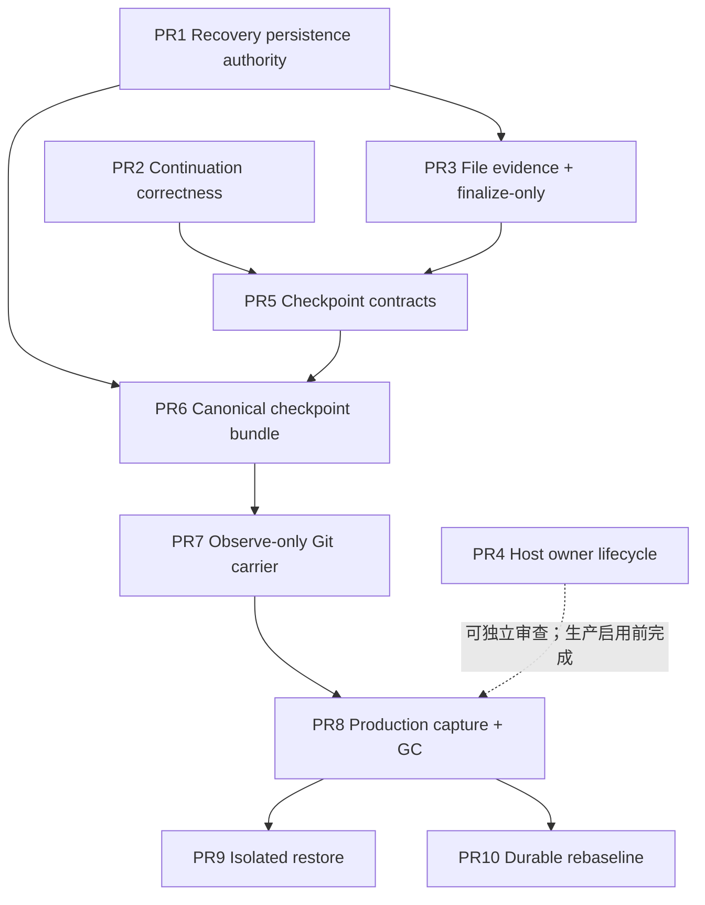
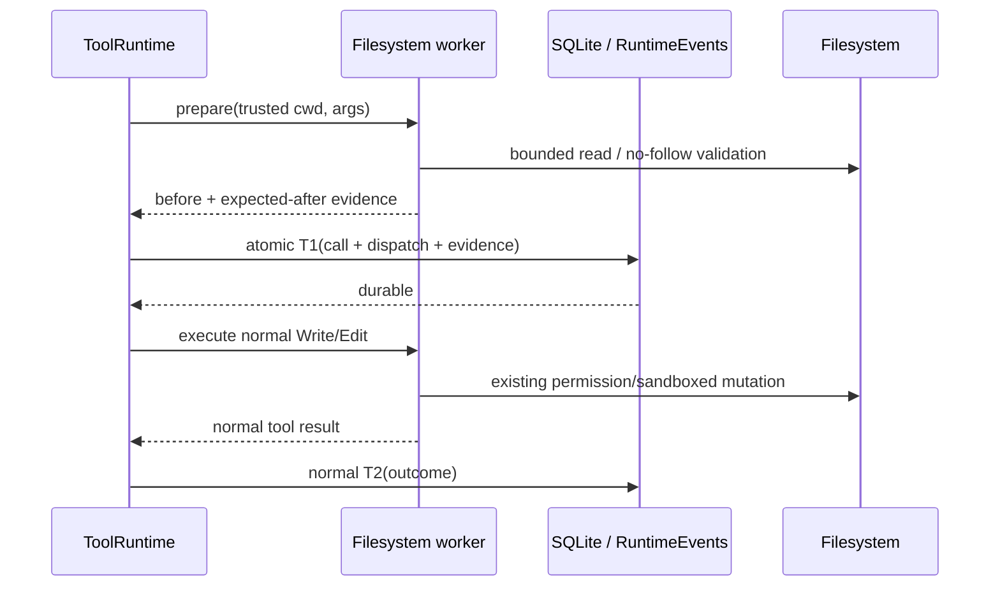
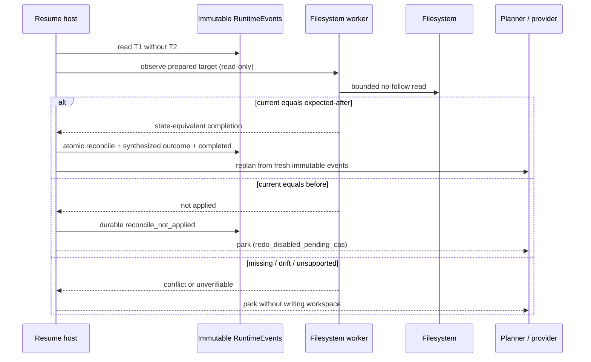
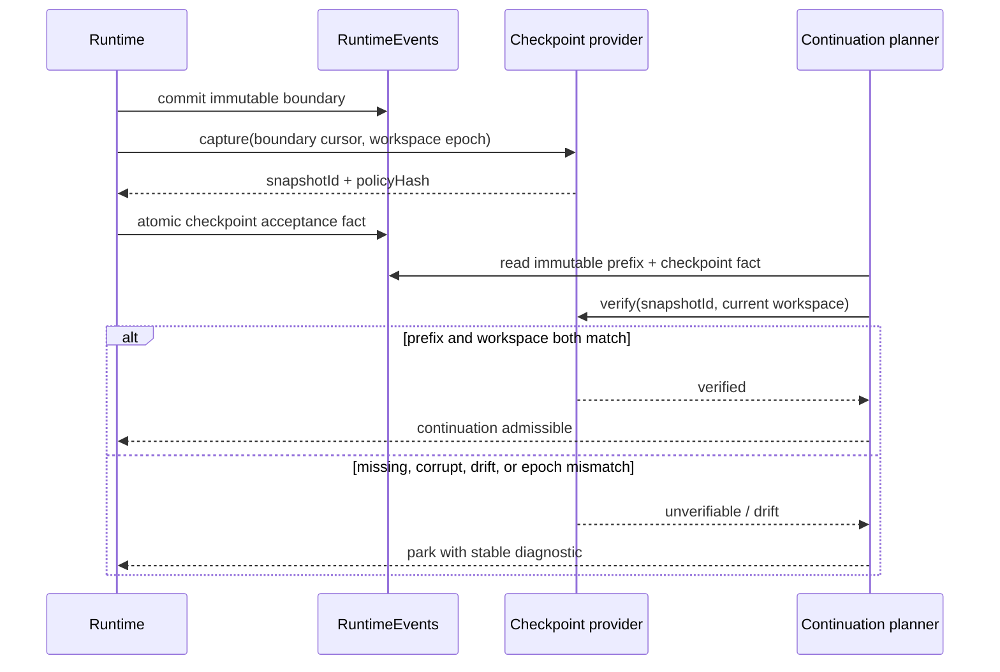

# Runtime Resume Phase 3–4：最新实施路线

- 状态：Proposed / implementation-tracked
- 更新日期：2026-07-27
- 事实权威：immutable RuntimeEvents
- 主要平台：Linux、macOS；Windows 有限支持
- 拆分审计：`runtime-resume-extraction-ledger.zh-CN.md`

## 1. 当前判断

Phase 0–2 建立了 call/dispatch/outcome 的 durable boundary，但“可以回放历史”仍不等于“可以安全恢复
任务”。Phase 3–4 必须分别证明：

```text
operation plane:
  工具副作用是否已收敛

continuation plane:
  provider 将看到的 immutable history boundary 是否一致

workspace plane:
  agent 将看到的文件系统是否与 history boundary 对应

host plane:
  谁拥有 store、worker、background recovery 和退出清理
```

这四个平面不能在同一 PR 一起证明。#1346 作为集成实验和设计记录保留，但生产落地改为平铺 PR。


```mermaid
flowchart LR
    Provider["Provider / model loop"]
    Runtime["Runtime / ToolRuntime"]
    Events[("Immutable RuntimeEvents\nsingle fact authority")]
    Projection[("Disposable SQLite projections")]
    Worker["Filesystem worker\npermission + sandbox boundary"]
    Workspace["Current workspace"]
    Snapshot["Workspace checkpoint provider"]
    Git["Git object database\nPhase 4A carrier"]

    Provider --> Runtime
    Runtime -->|"PR1 canonical bundle writes"| Events
    Events --> Projection
    Events -->|"PR2 immutable cursor + replay"| Provider
    Runtime -->|"PR3 prepare evidence"| Worker
    Worker --> Workspace
    Workspace -->|"PR3 bounded observation"| Worker
    Events -->|"Phase 3B accepted boundary"| Snapshot
    Snapshot -->|"Phase 4A capture / verify"| Git
    Git -.->|"Phase 4B isolated restore only"| Workspace
```

依赖关系：


```mermaid
flowchart TD
    PR1["PR1 Recovery persistence authority"]
    PR2["PR2 Continuation correctness"]
    PR3["PR3 File evidence + finalize-only"]
    PR4["PR4 Host owner lifecycle"]
    PR5["PR5 Checkpoint contracts"]
    PR6["PR6 Canonical checkpoint bundle"]
    PR7["PR7 Observe-only Git carrier"]
    PR8["PR8 Production capture + GC"]
    PR9["PR9 Isolated restore"]
    PR10["PR10 Durable rebaseline"]

    PR1 --> PR3
    PR1 --> PR6
    PR2 --> PR5
    PR3 --> PR5
    PR5 --> PR6
    PR6 --> PR7
    PR7 --> PR8
    PR8 --> PR9
    PR8 --> PR10
    PR4 -.->|"可独立审查；生产启用前完成"| PR8
```

## 2. 最终能力边界

### 无 Git CLI / 非 Git workspace

Maka native 支持到“单次文件 operation 的因果证据”为止：

- Write/Edit 在 T1 前记录 before/expected-after evidence；
- 崩溃后可证明 expected-after 时补 outcome；
- 无法证明时 park；
- 不建设 native workspace manifest 或 CAS object store；
- 不提供 workspace-wide drift report、isolated restore 或 durable rebaseline。

### 有 Git CLI 且 workspace 是 eligible repository

在 native operation evidence 之外，Git carrier 提供：

- workspace snapshot；
- RuntimeEvent boundary ↔ Git tree/commit binding；
- workspace-wide drift detection；
- isolated worktree restore；
- durable rebaseline；
- object-level retention 与 GC。

Git 不是单次 Write/Edit 因果证明的前置条件；它是 workspace 连续性的 carrier。

## 3. 关键安全修正：不自动 redo stale file checkpoint

旧方案在恢复时看到 `current == before`，会根据旧 checkpoint 重新生成文件并 rename。这个路径不安全：

```text
old checkpoint
  → recovery observe current == before
  → another process writes target
  → recovery rename overwrites external write
```

最终 hash/stat 检查只能缩小 TOCTOU，不能提供 compare-and-swap。atomic replace 只保证“不会出现半个
文件”，不保证“替换的仍是刚才检查的版本”。

因此当前实施路线固定为：

| Recovery observation | 自动动作 |
|---|---|
| `current == expected-after` | finalize cleanup，合成 outcome，提交 recovery bundle |
| `current == before` | 持久化 `reconcile_not_applied`；planner/UI park：`redo_disabled_pending_cas` |
| 其他状态 | park：drift/conflict |

未来只有在目标平台具备可证明的 conditional replace，或执行发生在隔离 workspace 中时，才单独设计
auto redo。它不属于 PR1–4，也不从 #1346 移植。

## 4. Phase 3A 平铺 PR

### PR1：Recovery persistence authority

目标不变量：

> recovery fact 只有一个 atomic writer；completed 必须引用 matching persisted outcome；
> projection 可从 RuntimeEvents 重建。

实施：

1. core 定义最小 reconcile-result/recovery-decision fact；
2. core pure validator 拥有 identity、evidence、outcome、order 规则；
3. SQLite 提供显式 capability 与一个 bundle transaction；
4. generic append/import/JSONL/terminal durability 禁止 reserved fact；
5. tool journal/operation 只做 projection；
6. resolver 遇到非法 fact 标记 monotonic corruption；
7. read model 接受 audit fact，但不创建消息行。

测试：

- atomic rollback；
- exact retry；
- completed missing outcome；
- parked mismatch；
- event order；
- rebuild；
- populated schema migration；
- writer bypass。

当前实现分支：`codex/runtime-recovery-authority`。

### PR2：Continuation correctness

目标不变量：

> continuation 只建立在 immutable ledger cursor 上；同一 source boundary 至多一个 claim；
> 多代 replay 不会重新引入先前被裁掉的 provider suffix。

数据结构：

```ts
interface ContinuationBoundary {
  sourceSessionId: string;
  sourceInvocationId: string;
  sourceRunId: string;
  sourceTurnId: string;
  immutableHighWater: number;
  immutablePrefixDigest: string;
}

interface ContinuationClaim {
  boundary: ContinuationBoundary;
  continuationInvocationId: string;
  continuationRunId: string;
  claimedAt: number;
}
```

实施步骤：

1. planner 只调用 `readImmutableRuntimeEvents`；
2. partial snapshot 仅供 UI，不进入 high-water/digest；
3. 抽取唯一 `buildContinuationReplaySegment()`；
4. immediate source 与每个 ancestor 都使用该函数；
5. suffix trimming 只影响 provider replay view，不删除 immutable event；
6. SQLite 以 source boundary identity 建唯一 claim；
7. SessionManager 的 precheck 只做优化，数据库 claim 才是裁判；
8. runner revalidation 重读 immutable prefix 并验证 digest；
9. conversation clone 建立 old→new event/run/invocation map；
10. 对 recovery evidence typed rewrite；暂不支持的 fact 明确拒绝 clone。

拒绝：

- 用 `readRuntimeEvents().length` 当 durable cursor；
- 用 mutable partial snapshot 参与 admission；
- 只修 immediate source 而让 ancestor 用另一套 replay；
- 手工枚举 continuation envelope 字段导致新字段静默丢失。

### PR3：File causal evidence + finalize-only recovery

目标不变量：

> T1 选择 reconcile 之前必须已有有效 evidence；恢复不覆盖任何无法证明属于本 operation 的状态。

建议结构：

```ts
interface PreparedFileEvidenceV1 {
  protocol: 'prepared_file_evidence_v1';
  operationId: string;
  trustedWorkspaceRoot: string;
  canonicalTarget: string;
  toolName: 'Write' | 'Edit';
  before:
    | { kind: 'missing' }
    | { kind: 'regular_file'; contentHash: string; size: number };
  expectedAfter: {
    contentHash: string;
    size: number;
  };
  transformVersion: string;
}
```

它不是新的顶层 recovery fact。建议把它作为 canonical dispatch 的受校验扩展，并仍由
`commitToolPrepared` 这个唯一 T1 writer 提交：

```ts
interface RuntimeEventToolDispatch {
  // Existing canonical T1 identity and recovery mode...
  preparedFileEvidence?: PreparedFileEvidenceV1;
}
```

T1 校验规则：

- builtin Write/Edit 声明 `recoveryMode: 'reconcile'` 时，evidence 必须存在且版本受支持；
- evidence 的 operation、tool、args hash、trusted workspace 与 canonical target 必须和 dispatch
  identity 一致；
- evidence 与 call、dispatch、operation projection 在一个 SQLite transaction 中提交；
- generic RuntimeEvent append、importer 和独立 fact writer 不能补造或覆盖它；
- 无法准备 evidence 时必须在 T1 前返回标准 tool error，不能先提交 reconcile dispatch 再静默走旧路径。

正常执行时序：

```text
host acquires per-file in-process lock
  → worker validates trusted workspace and reads bounded before state
  → production Write/Edit transform derives expected-after
  → validated evidence is embedded in canonical dispatch and made durable with T1
  → the existing filesystem worker executes the normal tool implementation
  → normal T2 outcome
  → release lock
```


```mermaid
sequenceDiagram
    participant R as ToolRuntime
    participant W as Filesystem worker
    participant S as SQLite / RuntimeEvents
    participant F as Filesystem

    R->>W: prepare(trusted cwd, args)
    W->>F: bounded read / no-follow validation
    W-->>R: before + expected-after evidence
    R->>S: atomic T1(call + dispatch + evidence)
    S-->>R: durable
    R->>W: execute normal Write/Edit
    W->>F: existing permission/sandboxed mutation
    W-->>R: normal tool result
    R->>S: normal T2(outcome)
```

重要约束：

- worker 仍拥有 filesystem execution；不能因为装了 carrier 就回退 host-local write；
- permission profile、one-call grant、sandbox mode、abort signal 必须保留；
- evidence preparation 失败是 definitely-not-dispatched 的业务错误，返回标准 tool error result；
- evidence 返回路径不改变用户传入路径的 provider-visible contract；
- canonical target 用 trusted `operation.workspaceCwd` 计算，不能由 fact 自我认证；
- inspect 不跟随 symlink，读取有 size/UTF-8 bounds；
- normal Write/Edit transform 只有一个 owner；
- 不用 `countOccurrences` 推断 causality；
- 不用 temp rename 替代原 implementation，避免 ACL/xattr/owner/hard-link 语义漂移；
- per-file lock 只保证 Maka 进程内排序，不声称外部 CAS。

这里的 `current == expected-after` 证明的是“文件状态已经等价于该 operation 的目标状态”，
不是证明某个具体进程一定执行过 `write(2)`。对 Write/Edit 这种以文件状态变换为契约的工具，
状态等价足以安全合成成功；对支付、Shell 或远程 API 等非状态等价工具，不能复用这个结论。

no-op 也必须显式处理：

- Write 的 before 已经等于 expected-after：在 T1 前作为确定性 no-op 返回正常结果，不创建
  reconcile operation；
- Edit 的 `old_string === new_string`：继续遵守生产 Edit transform，返回标准 preflight error；
- 不能让 no-op 进入“after-state 因果证明”，否则“文件本来如此”会被误写成“恢复证明已执行”。

恢复时序：

```text
resolver finds T1 without T2
  → contract validates durable evidence + execution identity
  → worker performs bounded read-only observation
  → expected-after:
       finalize cleanup
       synthesize response
       PR1 atomic bundle commit
     before:
       commit reconcile_not_applied
       park with planner/UI diagnostic redo_disabled_pending_cas
     other:
       park drift/conflict
  → replan from fresh immutable events
  → execution revalidation uses the same registry instance
```

production-shaped crash test 必须真实经过：

```text
builtin definition
→ ToolRuntime preflight/evidence
→ SQLite T1
→ filesystem worker execution
→ injected failure before T2
→ close store
→ reopen store
→ SessionManager resume
→ worker observation
→ PR1 bundle
→ provider continuation
```


```mermaid
sequenceDiagram
    participant H as Resume host
    participant S as Immutable RuntimeEvents
    participant W as Filesystem worker
    participant F as Filesystem
    participant P as Planner / provider

    H->>S: read T1 without T2
    H->>W: observe prepared target (read-only)
    W->>F: bounded no-follow read
    alt current equals expected-after
        W-->>H: state-equivalent completion
        H->>S: atomic reconcile + synthesized outcome + completed
        H->>P: replan from fresh immutable events
    else current equals before
        W-->>H: not applied
        H->>S: durable reconcile_not_applied
        H-->>P: park (redo_disabled_pending_cas)
    else missing / drift / unsupported
        W-->>H: conflict or unverifiable
        H-->>P: park without writing workspace
    end
```

`redo_disabled_pending_cas` 是 planner/UI diagnostic，不是 PR1 的持久化 recovery-decision
枚举。持久层只记录事实 `reconcile_not_applied`；这样未来启用平台级 CAS 时不需要篡改旧事实，
只需改变当前 policy 对这个事实允许的动作。

### PR4：Host owner 与资源生命周期

目标不变量：

> 一个 host 只有一个明确 owner；所有资源在初始化失败、取消和退出时恰好释放一次。

建议 owner：

```ts
interface RuntimeHostOwner {
  stores: ExecutionStores;
  filesystemWorker?: FilesystemWorkerClient;
  recoveryRegistry?: ToolRecoveryContractRegistry;
  backgroundResumeTasks: Set<Promise<unknown>>;
  close(): Promise<void>;
}
```

初始化顺序：

```text
open stores
→ create worker
→ create registry
→ construct SessionManager/runtime
→ register UI/CLI triggers
```

失败/退出按相反顺序关闭。`close()` 必须幂等。background resume 必须始终有 rejection owner，不能
fire-and-forget 产生 `UnhandledPromiseRejection`。

PR4 不改变 resolver、continuation 或文件判定；它可以在 PR1–3 后独立合并。

## 5. Phase 3B：Workspace checkpoint semantics

Phase 3B 只定义 workspace boundary 和 validation，不写 Git。

### PR5：Checkpoint contracts + fake provider

定义：

```ts
interface WorkspaceCheckpointFactV1 {
  protocol: 'workspace_checkpoint_v1';
  workspaceId: string;
  workspaceEpoch: string;
  canonicalRoot: string;
  boundary: {
    invocationId: string;
    runId: string;
    turnId: string;
    immutableHighWater: number;
    immutablePrefixDigest: string;
  };
  carrier: {
    kind: 'fake' | 'git';
    snapshotId: string;
    policyHash: string;
  };
}
```

交付：

- checkpoint provider interface；
- fake in-memory provider；
- workspace epoch/transition contract；
- planner validation-only gate；
- no-checkpoint/unsupported/corrupt/drift reason codes；
- planning 与 execution 使用同一 checkpoint facts。

非目标：自动 capture、Git CLI、恢复用户目录。

### PR6：Canonical checkpoint bundle + host policy

交付：

- checkpoint RuntimeEvent；
- SQLite projection；
- T2 + checkpoint 的 atomic bundle contract；
- `required | optional_legacy | disabled` host policy；
- projection rebuild；
- schema migration；
- checkpoint read model；
- failpoint matrix。

约束：

- RuntimeEvent 仍是事实源；
- snapshot carrier 不能单独宣称 boundary accepted；
- immutable ledger prefix 和 checkpoint 必须共同验证；
- Session 中途 cwd change 必须产生 workspace transition/epoch。

Phase 3B 的验收时序：


```mermaid
sequenceDiagram
    participant R as Runtime
    participant E as RuntimeEvents
    participant C as Checkpoint provider
    participant P as Continuation planner

    R->>E: commit immutable boundary
    R->>C: capture(boundary cursor, workspace epoch)
    C-->>R: snapshotId + policyHash
    R->>E: atomic checkpoint acceptance fact
    P->>E: read immutable prefix + checkpoint fact
    P->>C: verify(snapshotId, current workspace)
    alt prefix and workspace both match
        C-->>P: verified
        P-->>R: continuation admissible
    else missing, corrupt, drift, or epoch mismatch
        C-->>P: unverifiable / drift
        P-->>R: park with stable diagnostic
    end
```

## 6. Phase 4A：Git workspace snapshot carrier

### PR7：Observe-only Git capture

首版只捕获和验证，不改变用户工作区：

- capability probe：Git version、repo/common-dir/object-format；
- 临时 index；
- `git hash-object -w` / `git write-tree`；
- Maka-owned hidden retention ref；
- snapshot metadata 与 policy hash；
- read-only drift comparison；
- 不修改 HEAD、branch、用户 index、stash；
- 不执行 `git init`；
- submodule/filter/LFS/ignored path 限制显式 park。

测试使用真实临时 repository，覆盖 dirty worktree、staged changes、untracked policy、linked worktree 和
crash orphan ref。

### PR8：Production capture + retention/GC

交付：

- mutation barrier 后 capture；
- accepted mutating T2 与 checkpoint binding；
- soft quota；
- active boundary pin；
- orphan ref cleanup；
- object retention；
- capture performance telemetry；
- required policy 下 `uncheckpointed_mutating_t2_count == 0`。

GC 只能删除不再被任何 active/recoverable boundary 引用的 Maka artifact。

## 7. Phase 4B：隔离恢复与 rebaseline

### PR9：Isolated restore

- 从 snapshot 创建 locked linked worktree；
- 当前 checkout 文件零改写；
- recovery run 绑定新 workspace epoch；
- provider/system context 明确 active root；
- 所有 tool permission 重新以 isolated root 编译；
- cleanup/retention 有 owner。

### PR10：Durable rebaseline

- 需要用户结构化授权；
- Phase 3A operation plane 必须已收敛；
- 捕获当前 tree 为新 checkpoint；
- 写 workspace transition + rebaseline fact；
- 对中断 operation 相关路径启用 runtime-enforced read-before-write；
- prompt 不能替代 gate。

## 8. Phase 4C：专属 durable integrations

后续按工具单独设计，不放进通用 file recovery：

- ShellRun supervisor + spool + durable handle；
- 支持幂等键/状态查询的远程 API；
- child-agent durable schedule/claim；
- remote job reattach。

默认 Bash/未知远程副作用仍 park，不盲重试。

## 9. 分支与 PR 工程实践

每个 PR：

1. `git fetch upstream`；
2. 从当时最新 `upstream/main` 建平铺分支；
3. 先移植/重写 production-shaped tests；
4. 验证 RED 原因正确；
5. 只实现本 PR 不变量所需最小代码；
6. 做 `range-diff` 和 owned-path diff；
7. 跑本 PR crash matrix；
8. PR body 列出明确 exclusions；
9. 不使用 merge commit，不整体 cherry-pick 跨边界 commit。

PR1–3 合并后关闭 #1346，保留其 Draft discussion 作为历史。PR4、Phase 3B 和 Phase 4 不应继续堆到
#1346。

## 10. 发布策略

- SQLite canonical 可以在 schema migration/backup/telemetry 完成后逐步默认开启；
- 手动 resume 与 startup auto-resume 必须拆成不同设置；
- startup auto-resume 默认关闭；
- 新 recovery writer 先 dogfood，再灰度；
- park reason 映射为用户文案，机器 code 保留在详情/日志；
- 任何 capability 缺失或证据冲突都 fail closed。

## 11. 验收总表

| 阶段 | 可证明能力 |
|---|---|
| PR1 | recovery fact 不会绕过原子 authority |
| PR2 | continuation history boundary 不漂移、不重复 claim |
| PR3 | 已完成文件 mutation 可收敛；未知状态不覆盖 |
| PR4 | host 生命周期无泄漏、无 fire-and-forget failure |
| PR5–6 | history boundary 与抽象 workspace checkpoint 绑定 |
| PR7–8 | Git workspace snapshot 可捕获、验证、保留 |
| PR9–10 | 漂移时隔离恢复或结构化 rebaseline |
| Phase 4C | 工具专属外部副作用恢复 |
