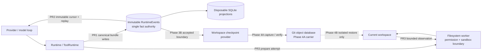
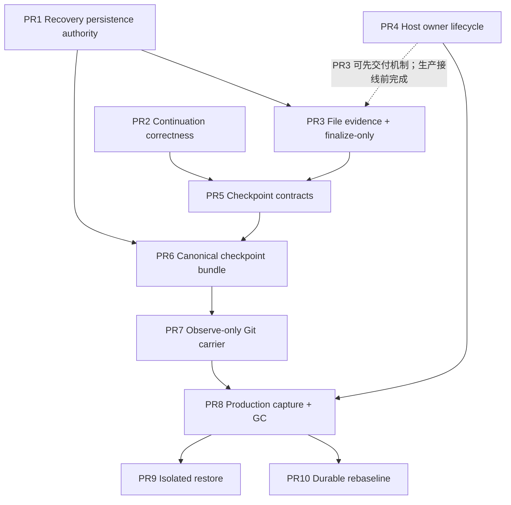
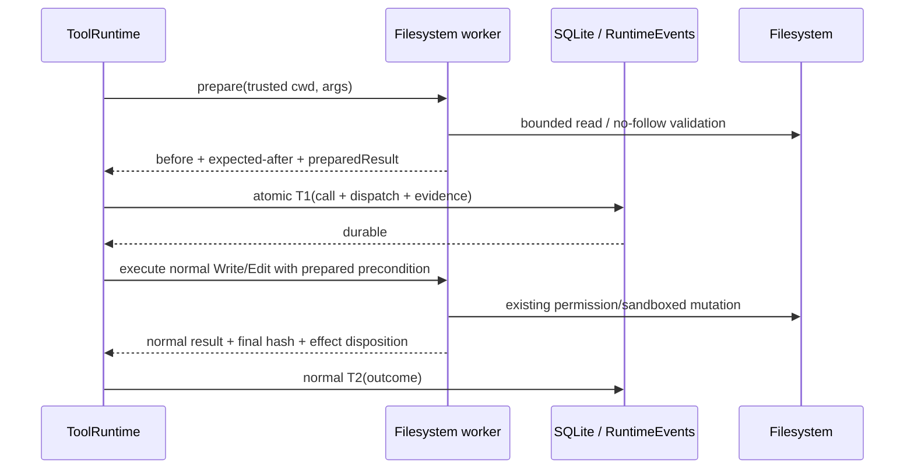
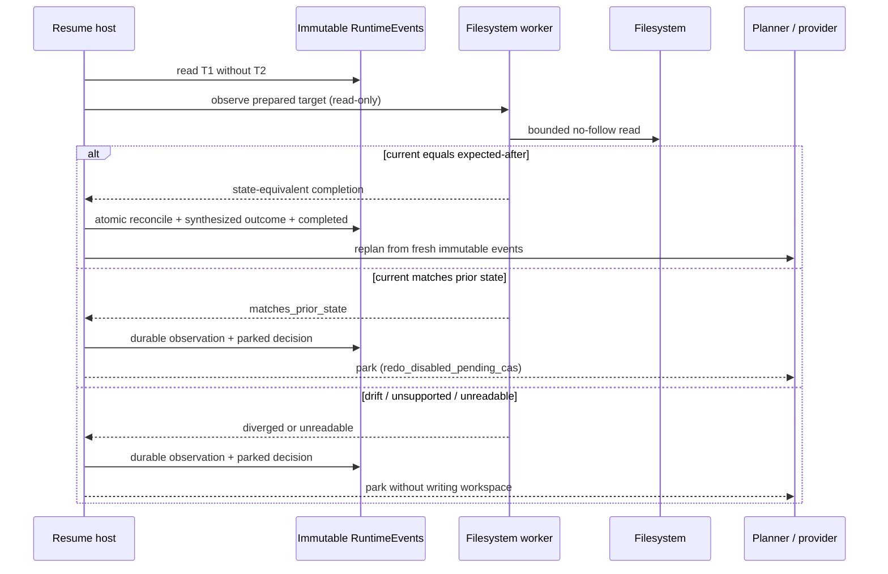
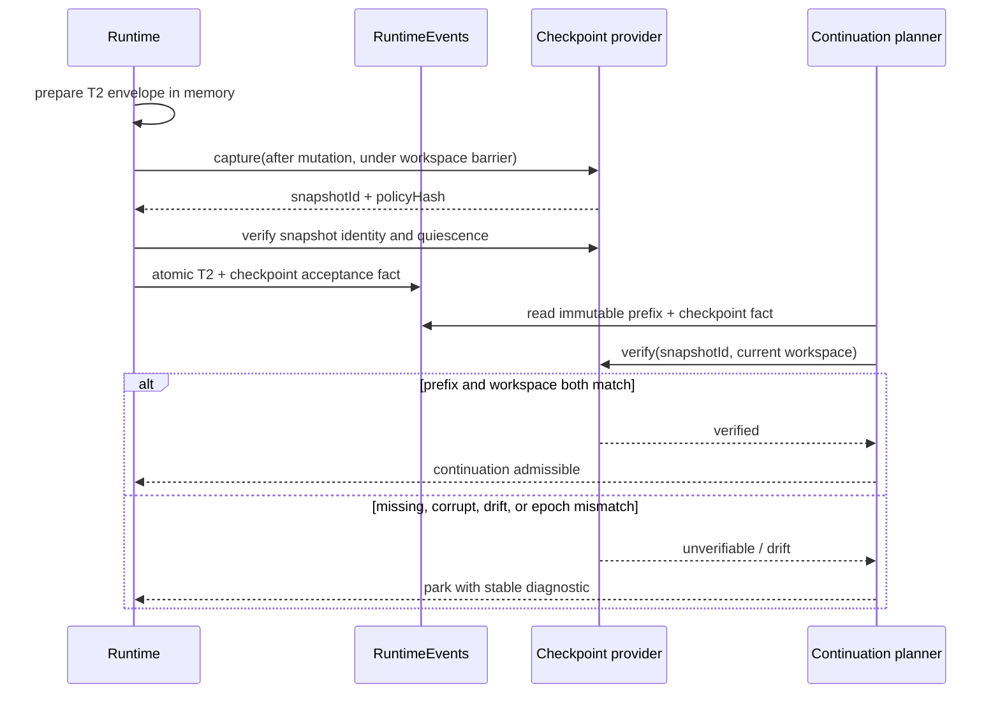

# Runtime Resume Phase 3–4：最新实施路线

- 状态：Proposed / implementation-tracked
- 更新日期：2026-07-27
- 事实权威：immutable RuntimeEvents
- 主要平台：Linux、macOS；Windows 有限支持
- 拆分审计：`runtime-resume-extraction-ledger.zh-CN.md`

## 1. 当前判断

Phase 0–2 建立了 call/dispatch/outcome 的 durable boundary，但“可以回放历史”仍不等于“可以安全恢复
任务”。Phase 3–4 必须分别证明：

```text
operation plane:
  工具副作用是否已收敛

continuation plane:
  provider 将看到的 immutable history boundary 是否一致

workspace plane:
  agent 将看到的文件系统是否与 history boundary 对应

host plane:
  谁拥有 store、worker、background recovery 和退出清理
```

这四个平面不能在同一 PR 一起证明。#1346 作为集成实验和设计记录保留，但生产落地改为平铺 PR。

### 1.1 权威边界

“RuntimeEvent 是唯一事实源”只适用于语义事实，不能代替执行所有权的原子仲裁。后续设计统一使用
以下术语：

| 层级 | 权威 | 职责 |
|---|---|---|
| semantic recovery authority | immutable RuntimeEvents | call、dispatch、outcome、observation、decision、checkpoint acceptance |
| execution ownership authority | admission/claim record | root turn 或 continuation source boundary 只能由一个执行者取得 |
| query/index state | SQLite projection | 可从 immutable RuntimeEvents 删除并重建 |
| artifact carrier | Git object/ref 或 fake provider | 保存 workspace artifact；不能单独宣称恢复已被接受 |

continuation claim 必须先通过 admission CAS 决出唯一 owner，再创建 target run 并写
`continuation-start` RuntimeEvent，把控制平面决定接回语义账本。

### 1.2 崩溃保证

Phase 3A 首版只承诺 host/worker **进程级崩溃**：

- T1 已 durable、T2 未提交时，重启后可以根据受约束 evidence 观察并收敛或 park；
- worker transport loss、worker crash、执行开始后的 abort 默认视为副作用未知；
- 在文件及父目录 fsync、平台 crash matrix 完成前，不承诺 OS reboot、断电或磁盘写缓存丢失后的
  power-loss durability。

任何产品文案、测试名称和 telemetry 都必须使用这个保证范围，不能把“进程崩溃恢复”扩写成
“断电级文件事务”。

### 1.3 版本与兼容决策

#1346 从未发布且没有用户，其 SQLite 数据是一次性实验数据：

- 不迁移 #1346 schema/fact；
- 不支持 #1346 binary downgrade 或 mixed-version reader/writer；
- 不引入仅为旧 reader soft-skip 服务的通用 `runtimeFact` PR0；
- 旧实验数据库按 capability/format fail closed，由开发者备份后清理。

这不降低新协议自身的完整性要求。新 fact 仍必须有精确 kind/version/schema，未知版本 hard park；
新 dispatch wire shape 必须使用显式新 protocol version，不能把字段悄悄塞进 v1。官方 mainline
schema 的受支持迁移与 #1346 兼容是两件事，仍保留独立测试。


```mermaid
flowchart LR
    Provider["Provider / model loop"]
    Runtime["Runtime / ToolRuntime"]
    Events[("Immutable RuntimeEvents\nsingle fact authority")]
    Projection[("Disposable SQLite projections")]
    Worker["Filesystem worker\npermission + sandbox boundary"]
    Workspace["Current workspace"]
    Snapshot["Workspace checkpoint provider"]
    Git["Git object database\nPhase 4A carrier"]

    Provider --> Runtime
    Runtime -->|"PR1 canonical bundle writes"| Events
    Events --> Projection
    Events -->|"PR2 immutable cursor + replay"| Provider
    Runtime -->|"PR3 prepare attempt"| Worker
    Worker --> Workspace
    Workspace -->|"PR3 bounded observation"| Worker
    Events -->|"Phase 3B accepted boundary"| Snapshot
    Snapshot -->|"Phase 4A capture / verify"| Git
    Git -.->|"Phase 4B isolated restore only"| Workspace
```

依赖关系：


```mermaid
flowchart TD
    PR1["PR1 Recovery persistence authority"]
    PR2["PR2 Continuation correctness"]
    PR3["PR3 File evidence + finalize-only"]
    PR4["PR4 Host owner lifecycle"]
    PR5["PR5 Checkpoint contracts"]
    PR6["PR6 Canonical checkpoint bundle"]
    PR7["PR7 Observe-only Git carrier"]
    PR8["PR8 Production capture + GC"]
    PR9["PR9 Isolated restore"]
    PR10["PR10 Durable rebaseline"]

    PR1 --> PR3
    PR1 --> PR6
    PR2 --> PR5
    PR3 --> PR5
    PR5 --> PR6
    PR6 --> PR7
    PR7 --> PR8
    PR8 --> PR9
    PR8 --> PR10
    PR4 -.->|"PR3 可先交付机制；生产接线前完成"| PR3
    PR4 --> PR8
```

## 2. 最终能力边界

### 无 Git CLI / 非 Git workspace

Maka native 支持到“单次文件 operation 的因果证据”为止：

- Write/Edit 在 T1 前记录 before/expected-after evidence；
- 崩溃后可证明 expected-after 时补 outcome；
- 无法证明时 park；
- 不建设 native workspace manifest 或 CAS object store；
- 不提供 workspace-wide drift report、isolated restore 或 durable rebaseline。

### 有 Git CLI 且 workspace 是 eligible repository

在 native operation evidence 之外，Git carrier 提供：

- workspace snapshot；
- RuntimeEvent boundary ↔ Git tree/commit binding；
- workspace-wide drift detection；
- isolated worktree restore；
- durable rebaseline；
- object-level retention 与 GC。

Git 不是单次 Write/Edit 因果证明的前置条件；它是 workspace 连续性的 carrier。

## 3. 关键安全修正：不自动 redo stale file checkpoint

旧方案在恢复时看到 `current == before`，会根据旧 checkpoint 重新生成文件并 rename。这个路径不安全：

```text
old checkpoint
  → recovery observe current == before
  → another process writes target
  → recovery rename overwrites external write
```

最终 hash/stat 检查只能缩小 TOCTOU，不能提供 compare-and-swap。atomic replace 只保证“不会出现半个
文件”，不保证“替换的仍是刚才检查的版本”。

因此当前实施路线固定为：

| Recovery observation | 自动动作 |
|---|---|
| `matches_expected_state` | finalize cleanup，合成 outcome，提交 recovery bundle |
| `matches_prior_state` | park；不能据此声称“历史上从未执行” |
| `diverged` / `unreadable` | park：drift/conflict/unverifiable |

未来只有在目标平台具备可证明的 conditional replace，或执行发生在隔离 workspace 中时，才单独设计
auto redo。任何未来 redo 都必须重新进行 live observation，并在同一个 conditional mutation 中验证
identity；旧的 `matches_prior_state` observation 永远不能独立授权写入。它不属于 PR1–4，也不从
#1346 移植。

## 4. Phase 3A 平铺 PR

### PR1：Recovery persistence authority

目标不变量：

> recovery fact 只有一个 atomic writer；completed 必须引用 matching persisted outcome；
> projection 可从 RuntimeEvents 重建。

实施：

1. core 定义最小 reconcile-result/recovery-decision fact；
2. core pure validator 拥有 identity、evidence、outcome、order 规则；
3. SQLite 提供显式 capability 与一个 bundle transaction；
4. generic append/import/JSONL/terminal durability 禁止 reserved fact；
5. tool journal/operation 只做 projection；
6. resolver 遇到非法 fact 标记 monotonic corruption；
7. read model 接受 audit fact，但不创建消息行。

PR1 v1 事实语义：

```ts
type ReconcileObservation =
  | 'matches_expected_state'
  | 'matches_prior_state'
  | 'diverged'
  | 'unreadable';
```

- observation 只描述本次读取证明的状态关系，不携带 `nextAction`；
- `still_running` 不属于一次性 recovery bundle，留给未来可重复追加的 durable-handle 协议；
- completed outcome 必须是成功 response，并引用 matching persisted observation/outcome；
- `canonicalArgsHash` 必须从 canonical function call 的 `toolName + args` 重新计算，不能只比较
  operation/dispatch/projection 三个副本；
- duplicate tool-call/operation identity 一律形成 monotonic corruption。

明确不做：

- #1346 数据迁移、downgrade、mixed binary；
- 通用 `runtimeFact` envelope；
- contract registry、filesystem evidence、continuation 或 host wiring；
- 为尚不存在的 tool contract 预埋 contract ID/version。实际 contract identity 在 PR3 的
  per-attempt preparation 协议中定义。

测试：

- atomic rollback；
- exact retry；
- completed missing outcome；
- parked mismatch；
- event order；
- rebuild；
- populated schema migration；
- writer bypass。

PR1 Ready 前补充：

- 两个 SQLite connection 的 completed/parked/exact/divergent 竞争；
- rebuild 与 bundle commit 竞争；
- 子进程在 reconcile/outcome/decision/COMMIT 前后退出，reopen WAL 后只能看到完整 bundle 或零
  bundle；
- export 含 recovery fact 时明确标记 audit-only；restore/import 在写入任何一行前以 stable code
  拒绝，直到 typed bundle-aware importer 落地。

当前实现分支：`codex/runtime-recovery-authority`。

### PR2：Continuation correctness

目标不变量：

> continuation 只建立在 immutable ledger cursor 上；同一 source boundary 至多一个 claim；
> 多代 replay 不会重新引入先前被裁掉的 provider suffix。

store-owned boundary：

```ts
interface RuntimePrefixSegment {
  sourceSessionId: string;
  sourceInvocationId: string;
  sourceRunId: string;
  sourceTurnId: string;
  immutableHighWater: number;
  immutablePrefixDigest: string;
}

interface RuntimeBoundaryCursorV1 {
  source: RuntimePrefixSegment;
  ancestors: readonly RuntimePrefixSegment[];
  lineageManifestDigest: string;
}

interface ImmutableRuntimeBoundary {
  events: readonly RuntimeEvent[];
  cursor: RuntimeBoundaryCursorV1;
}

interface ContinuationClaim {
  boundary: RuntimeBoundaryCursorV1;
  continuationInvocationId: string;
  continuationRunId: string;
  claimedAt: number;
}
```

实施步骤：

1. store 提供唯一的 `readImmutableRuntimeBoundary()`，同时返回 events、canonical position 与
   prefix/lineage digest；
2. partial snapshot 仅供 UI，不进入 high-water/digest；
3. 调用者禁止用 `events.length` 自行制造 durable cursor；
4. 抽取唯一 `buildContinuationReplaySegment()`；
5. immediate source 与每个 ancestor 都使用该函数；
6. suffix trimming 只影响 provider replay view，不删除 immutable event；
7. SQLite 以 source boundary identity 建唯一 claim；
8. SessionManager 的 precheck 只做优化，数据库 claim 才是裁判；
9. runner revalidation 重读 immutable prefix 并验证 digest；
10. conversation clone 建立 old→new event/run/invocation map；
11. 对 recovery evidence typed rewrite；暂不支持的 fact 明确拒绝 clone。

所有 lineage 消费者必须共用 store boundary 与 segment builder：

- 普通 resume；
- child-agent resume；
- child-agent retry；
- conversation branch；
- regenerate/revise；
- runtime-host root execution；
- CLI resume。

provider projection、compaction artifact 与 projection version 属于短命 plan，不进入 canonical cursor；
执行前重新 materialize 并 revalidate。修改任意 ancestor 的 high-water、digest 或顺序，都必须使整个
lineage validation 失败。

拒绝：

- 用 `readRuntimeEvents().length` 当 durable cursor；
- 用 mutable partial snapshot 参与 admission；
- 只修 immediate source 而让 ancestor 用另一套 replay；
- 手工枚举 continuation envelope 字段导致新字段静默丢失。

### PR3：File causal evidence + finalize-only recovery

目标不变量：

> T1 选择 reconcile 之前必须已有有效 evidence；恢复不覆盖任何无法证明属于本 operation 的状态。

建议结构：

```ts
interface PreparedFileEvidenceV1 {
  protocol: 'prepared_file_evidence_v1';
  operationId: string;
  trustedWorkspaceRoot: string;
  canonicalTarget: string;
  toolName: 'Write' | 'Edit';
  before:
    | { kind: 'missing' }
    | { kind: 'regular_file'; contentHash: string; size: number };
  expectedAfter: {
    contentHash: string;
    size: number;
  };
  transformVersion: string;
  preparedResult:
    | { tool: 'Write'; path: string; bytes: number }
    | {
        tool: 'Edit';
        path: string;
        replacements: number;
        matchedVia: 'exact' | 'line-trimmed' | 'whitespace' | 'escape';
        startLine: number;
        endLine: number;
      };
}
```

它不是可由 generic append 写入的新顶层 recovery fact。PR3 定义新的 exact dispatch protocol
`t1_after_preflight_v2`，并仍由 `commitToolPrepared` 这个唯一 T1 writer 与 call 同事务提交。不能
给 v1 dispatch 静默增加 optional 字段：

```ts
interface RuntimeEventToolDispatchV2 {
  protocol: 't1_after_preflight_v2';
  // canonical operation identity...
  preparedEvidence: PreparedFileEvidenceV1;
}
```

恢复 contract identity 来自 `protocol + evidence.protocol + transformVersion`。planning 与 execution
必须使用同一 registry 实例；未知版本 park。PR1 不提前发明没有生产 contract 的
`recoveryContractId`。

每次 attempt 动态决定 recovery mode：

```ts
type PreparedDurableAttempt<R> =
  | {
      kind: 'prepared';
      recoveryMode: 'reconcile';
      evidence: PreparedFileEvidenceV1;
      execute(): Promise<R>;
      close(): Promise<void>;
    }
  | {
      kind: 'unreconciled';
      recoveryMode: 'never_auto_retry';
      reason: string;
    }
  | {
      kind: 'tool_error';
      result: unknown;
    };
```

`execute()` 仍调用 filesystem worker 的 production implementation；`close()` 幂等释放跨越
prepare→T1→execute→T2 的 per-file lease。T1 失败、abort、worker error 和 T2 failure 都必须经过
同一个 finally owner。

T1 校验规则：

- builtin Write/Edit 声明 `recoveryMode: 'reconcile'` 时，evidence 必须存在且版本受支持；
- evidence 的 operation、tool、args hash、trusted workspace 与 canonical target 必须和 dispatch
  identity 一致；
- evidence 与 call、dispatch、operation projection 在一个 SQLite transaction 中提交；
- generic RuntimeEvent append、importer 和独立 fact writer 不能补造或覆盖它；
- 无法准备 evidence 时必须在 T1 前返回标准 tool error，不能先提交 reconcile dispatch 再静默走旧路径。
- trusted workspace 外的一次性 grant 首版固定为 `never_auto_retry`/manual-only；旧 grant 不能在
  重启后自动变成永久读取权限。

正常执行时序：

```text
host acquires per-file in-process lock
  → worker validates trusted workspace and reads bounded before state
  → production Write/Edit transform derives expected-after
  → production result factory derives preparedResult
  → validated evidence is embedded in v2 dispatch and made durable with T1
  → Edit worker revalidates current hash == prepared before hash
  → the existing filesystem worker executes the normal tool implementation
  → worker reports final content hash + effect disposition
  → Runtime verifies final hash == expected-after
  → normal T2 outcome
  → release lock
```


```mermaid
sequenceDiagram
    participant R as ToolRuntime
    participant W as Filesystem worker
    participant S as SQLite / RuntimeEvents
    participant F as Filesystem

    R->>W: prepare(trusted cwd, args)
    W->>F: bounded read / no-follow validation
    W-->>R: before + expected-after + preparedResult
    R->>S: atomic T1(call + dispatch + evidence)
    S-->>R: durable
    R->>W: execute normal Write/Edit with prepared precondition
    W->>F: existing permission/sandboxed mutation
    W-->>R: normal result + final hash + effect disposition
    R->>S: normal T2(outcome)
```

重要约束：

- worker 仍拥有 filesystem execution；不能因为装了 carrier 就回退 host-local write；
- permission profile、one-call grant、sandbox mode、abort signal 必须保留；
- evidence preparation 失败是 definitely-not-dispatched 的业务错误，返回标准 tool error result；
- evidence 返回路径不改变用户传入路径的 provider-visible contract；
- canonical target 用 trusted `operation.workspaceCwd` 计算，不能由 fact 自我认证；
- inspect 不跟随 symlink，读取有 size/UTF-8 bounds；
- normal Write/Edit transform 只有一个 owner；
- preparedResult 与正常 result 使用同一个 production result factory；recovery 不手写第二套 Edit
  response；
- 不用 `countOccurrences` 推断 causality；
- 不用 temp rename 替代原 implementation，避免 ACL/xattr/owner/hard-link 语义漂移；
- per-file lock 只保证 Maka 进程内排序，不声称外部 CAS。

worker protocol 必须升级版本并显式返回：

```ts
type FilesystemEffectDisposition = 'none' | 'unknown' | 'applied_unconfirmed';
```

- `none`：T1 后仍可提交标准 error T2；
- `unknown` / `applied_unconfirmed`：不得提交 function response，operation 保持 T1-only；
- worker crash、transport loss、执行开始后的 abort 默认 `unknown`；
- 路径、Edit 匹配、大小、UTF-8 等 T1 前业务错误保持标准 tool error，不制造 unsettled operation。

这里的 `current == expected-after` 证明的是“文件状态已经等价于该 operation 的目标状态”，
不是证明某个具体进程一定执行过 `write(2)`。对 Write/Edit 这种以文件状态变换为契约的工具，
状态等价足以安全合成成功；对支付、Shell 或远程 API 等非状态等价工具，不能复用这个结论。

no-op 也必须显式处理：

- Write 的 before 已经等于 expected-after：在 T1 前作为确定性 no-op 返回正常结果，不创建
  reconcile operation；
- Edit 的 `old_string === new_string`：继续遵守生产 Edit transform，返回标准 preflight error；
- 不能让 no-op 进入“after-state 因果证明”，否则“文件本来如此”会被误写成“恢复证明已执行”。

恢复时序：

```text
resolver finds T1 without T2
  → contract validates durable evidence + execution identity
  → worker performs bounded read-only observation
  → expected-after:
       finalize cleanup
       synthesize response
       PR1 atomic bundle commit
     matches_prior_state:
       commit observation + parked decision
       park with planner/UI diagnostic redo_disabled_pending_cas
     diverged/unreadable:
       commit observation + parked decision
       park drift/conflict/unverifiable
  → replan from fresh immutable events
  → execution revalidation uses the same registry instance
```

production-shaped crash test 必须真实经过：

```text
builtin definition
→ ToolRuntime preflight/evidence
→ SQLite T1
→ filesystem worker execution
→ injected failure before T2
→ close store
→ reopen store
→ SessionManager resume
→ worker observation
→ PR1 bundle
→ provider continuation
```


```mermaid
sequenceDiagram
    participant H as Resume host
    participant S as Immutable RuntimeEvents
    participant W as Filesystem worker
    participant F as Filesystem
    participant P as Planner / provider

    H->>S: read T1 without T2
    H->>W: observe prepared target (read-only)
    W->>F: bounded no-follow read
    alt current equals expected-after
        W-->>H: state-equivalent completion
        H->>S: atomic reconcile + synthesized outcome + completed
        H->>P: replan from fresh immutable events
    else current matches prior state
        W-->>H: matches_prior_state
        H->>S: durable observation + parked decision
        H-->>P: park (redo_disabled_pending_cas)
    else drift / unsupported / unreadable
        W-->>H: diverged or unreadable
        H->>S: durable observation + parked decision
        H-->>P: park without writing workspace
    end
```

`redo_disabled_pending_cas` 是 planner/UI diagnostic，不是 PR1 的持久化 recovery-decision
枚举。持久层记录本次 observation 与 parked decision；未来启用平台级 CAS 时仍必须重新观察，
不能直接重用旧 observation 授权写入。

### PR4：Host owner 与资源生命周期

目标不变量：

> 一个 host 只有一个明确 owner；所有资源在初始化失败、取消和退出时恰好释放一次。

生产接线前必须先完成 Authority Map：

- 下一生产版本的 root execution owner 是 Desktop embedded adapter 还是 `runtime-host`；
- 同一个 storage root 只能由哪个 composition 取得 write lease；
- semantic RuntimeEvent writer、recovery bundle writer、continuation admission writer 分别由谁持有；
- JSONL host 缺少 recovery bundle capability 时在初始化阶段如何显式失败；
- SQLite sticky migration、关闭顺序和 background recovery rejection 由谁负责。

PR1 可以先交付没有生产消费者的 storage primitive；PR3 也可以先交付 worker/preparation mechanism。
但真正启用 resume/file finalize 前，Desktop、runtime-host、CLI/Headless 必须经过同一套
composition contract test，不能靠 duck typing 在恢复现场发现能力缺失。

建议 owner：

```ts
interface RuntimeHostOwner {
  stores: ExecutionStores;
  filesystemWorker?: FilesystemWorkerClient;
  recoveryRegistry?: ToolRecoveryContractRegistry;
  backgroundResumeTasks: Set<Promise<unknown>>;
  close(): Promise<void>;
}
```

初始化顺序：

```text
open stores
→ create worker
→ create registry
→ construct SessionManager/runtime
→ register UI/CLI triggers
```

失败/退出按相反顺序关闭。`close()` 必须幂等。background resume 必须始终有 rejection owner，不能
fire-and-forget 产生 `UnhandledPromiseRejection`。

PR4 不改变 resolver、continuation 或文件判定；它可以在 PR1–3 后独立合并。

## 5. Phase 3B：Workspace checkpoint semantics

Phase 3B 只定义 workspace boundary 和 validation，不写 Git。

在 workspace checkpoint 进入生产 capture 前，必须先有 workspace effect registry：

```ts
interface ToolEffectDescriptor {
  workspace: 'none' | 'single_file' | 'may_write' | 'unknown';
  external: 'none' | 'queryable' | 'unknown';
}
```

首版 required mode 全局串行化所有 workspace mutator；mutation 与 checkpoint capture 共用同一个
barrier。`FormatJson`、Bash 和未知工具不能漏出 registry：未知/Bash 默认 `may_write`。active
ShellRun 是 unsettled external mutator，在 durable handle 或确定 terminal 前阻止 checkpoint
acceptance。

### PR5：Checkpoint contracts + fake provider

定义：

```ts
interface WorkspaceCheckpointFactV1 {
  protocol: 'workspace_checkpoint_v1';
  workspaceId: string;
  workspaceEpoch: string;
  canonicalRoot: string;
  boundary: {
    invocationId: string;
    runId: string;
    turnId: string;
    immutableHighWater: number;
    immutablePrefixDigest: string;
  };
  carrier: {
    kind: 'fake' | 'git';
    snapshotId: string;
    policyHash: string;
  };
}
```

交付：

- checkpoint provider interface；
- fake in-memory provider；
- workspace epoch/transition contract；
- planner validation-only gate；
- no-checkpoint/unsupported/corrupt/drift reason codes；
- planning 与 execution 使用同一 checkpoint facts。

非目标：自动 capture、Git CLI、恢复用户目录。

### PR6：Canonical checkpoint bundle + host policy

交付：

- checkpoint RuntimeEvent；
- SQLite projection；
- T2 + checkpoint 的 atomic bundle contract；
- `required | optional_legacy | disabled` host policy；
- projection rebuild；
- schema migration；
- checkpoint read model；
- failpoint matrix。

约束：

- RuntimeEvent 仍是事实源；
- snapshot carrier 不能单独宣称 boundary accepted；
- immutable ledger prefix 和 checkpoint 必须共同验证；
- Session 中途 cwd change 必须产生 workspace transition/epoch。

Phase 3B 的验收时序：


```mermaid
sequenceDiagram
    participant R as Runtime
    participant E as RuntimeEvents
    participant C as Checkpoint provider
    participant P as Continuation planner

    R->>R: prepare T2 envelope in memory
    R->>C: capture(after mutation, under workspace barrier)
    C-->>R: snapshotId + policyHash
    R->>C: verify snapshot identity and quiescence
    R->>E: atomic T2 + checkpoint acceptance fact
    P->>E: read immutable prefix + checkpoint fact
    P->>C: verify(snapshotId, current workspace)
    alt prefix and workspace both match
        C-->>P: verified
        P-->>R: continuation admissible
    else missing, corrupt, drift, or epoch mismatch
        C-->>P: unverifiable / drift
        P-->>R: park with stable diagnostic
    end
```

只有最后一步形成 accepted boundary。不能先提交 mutating T2，再在另一个事务接受 checkpoint。
Session 中途 cwd 变化必须写 workspace transition/epoch；缺少 transition fact 时 fail closed。

## 6. Phase 4A：Git workspace snapshot carrier

### PR7：Observe-only Git capture

首版只捕获和验证，不改变用户工作区：

- capability probe：Git version、repo/common-dir/object-format；
- 临时 index；
- `git hash-object -w` / `git write-tree`；
- Maka-owned hidden retention ref；
- snapshot metadata 与 policy hash；
- read-only drift comparison；
- 不修改 HEAD、branch、用户 index、stash；
- 不执行 `git init`；
- submodule/filter/LFS/ignored path 限制显式 park。

Git carrier 安全边界：

- 首版默认只 capture tracked files；untracked capture 必须显式 opt-in，并披露 blob 会在 Git object
  database 中长期存在；
- incognito 禁止 capture；
- reject external filters、dirty submodules 和不受支持的 LFS/attributes；
- 固定/限制 Git config，restore 不执行 hook、credential helper 或任意外部程序；
- linked worktree 只提供 checkout 文件隔离，不宣称 refs/config/remotes 隔离；
- Git tree 只证明 policy 覆盖的 bytes、mode 与 symlink target，不证明 ACL、xattr、owner 或完整
  inode metadata；
- capture 只承诺经过 quiescence verification 的一致 tree，不宣称 filesystem atomic snapshot。

capture 对每个文件执行 `fstat-before → read → fstat-after`，检查 dev/ino/size/mtime/ctime；完成
tree 后再做 bounded manifest sweep，最好连续两次得到同一 tree OID。超过重试预算仍变化则 park。

测试使用真实临时 repository，覆盖 dirty worktree、staged changes、untracked policy、linked worktree 和
crash orphan ref。

### PR8：Production capture + retention/GC

交付：

- mutation barrier 后 capture；
- accepted mutating T2 与 checkpoint binding；
- soft quota；
- active boundary pin；
- orphan ref cleanup；
- object retention；
- capture performance telemetry；
- required policy 下 `uncheckpointed_mutating_t2_count == 0`。

GC 只能删除不再被任何 active/recoverable boundary 引用的 Maka artifact。

## 7. Phase 4B：隔离恢复与 rebaseline

### PR9：Isolated restore

- 从 snapshot 创建 locked linked worktree；
- 当前 checkout 文件零改写；
- recovery run 绑定新 workspace epoch；
- provider/system context 明确 active root；
- 所有 tool permission 重新以 isolated root 编译；
- cleanup/retention 有 owner。

### PR10：Durable rebaseline

- 需要用户结构化授权；
- Phase 3A operation plane 必须已收敛；
- 捕获当前 tree 为新 checkpoint；
- 写 workspace transition + rebaseline fact；
- 对中断 operation 相关路径启用 runtime-enforced read-before-write；
- prompt 不能替代 gate。

## 8. Phase 4C：专属 durable integrations

后续按工具单独设计，不放进通用 file recovery：

- ShellRun supervisor + spool + durable handle；
- 支持幂等键/状态查询的远程 API；
- child-agent durable schedule/claim；
- remote job reattach。

默认 Bash/未知远程副作用仍 park，不盲重试。

ShellRun durable handle 与 Git observe-only 并行推进，不等待 isolated restore。广泛启用 production
checkpoint/restore 前必须至少具备：

- `workspaceEffect` 分类与 active ShellRun barrier；
- pid + process-start identity；
- output spool 与 terminal result；
- reattach/terminal observation；
- 无法证明时 park。

## 9. 分支与 PR 工程实践

每个 PR：

1. `git fetch upstream`；
2. 从当时最新 `upstream/main` 建平铺分支；
3. 先移植/重写 production-shaped tests；
4. 验证 RED 原因正确；
5. 只实现本 PR 不变量所需最小代码；
6. 做 `range-diff` 和 owned-path diff；
7. 跑本 PR crash matrix；
8. PR body 列出明确 exclusions；
9. 不使用 merge commit，不整体 cherry-pick 跨边界 commit。

当前 PR1 分支创建后 upstream 继续前进，因此 Ready 前需基于最新 `upstream/main` 做受控
rebase/移植，并用 `git range-diff` 与 owned-path diff 证明没有把新 main 的 RuntimeEvent exact
schema 或 host changes 覆盖掉；不因此重新引入 #1346 跨边界 commit。

PR1–3 合并后关闭 #1346，保留其 Draft discussion 作为历史。PR4、Phase 3B 和 Phase 4 不应继续堆到
#1346。

## 10. 发布策略

- SQLite canonical 可以在 schema migration/backup/telemetry 完成后逐步默认开启；
- 手动 resume 与 startup auto-resume 必须拆成不同设置；
- startup auto-resume 默认关闭；
- 新 recovery writer 先 dogfood，再灰度；
- park reason 映射为用户文案，机器 code 保留在详情/日志；
- 任何 capability 缺失或证据冲突都 fail closed。
- UI 必须区分 proof level：`operation_settled`、`workspace_checkpoint_verified`、
  `legacy_identity_only`、`workspace_unverified`；只有第二种可以称为 workspace-continuous safe
  resume。

## 11. 验收总表

| 阶段 | 可证明能力 |
|---|---|
| PR1 | recovery fact 不会绕过原子 authority |
| PR2 | continuation history boundary 不漂移、不重复 claim |
| PR3 | 已完成文件 mutation 可收敛；未知状态不覆盖 |
| PR4 | host 生命周期无泄漏、无 fire-and-forget failure |
| PR5–6 | history boundary 与抽象 workspace checkpoint 绑定 |
| PR7–8 | Git workspace snapshot 可捕获、验证、保留 |
| PR9–10 | 漂移时隔离恢复或结构化 rebaseline |
| Phase 4C | 工具专属外部副作用恢复 |
