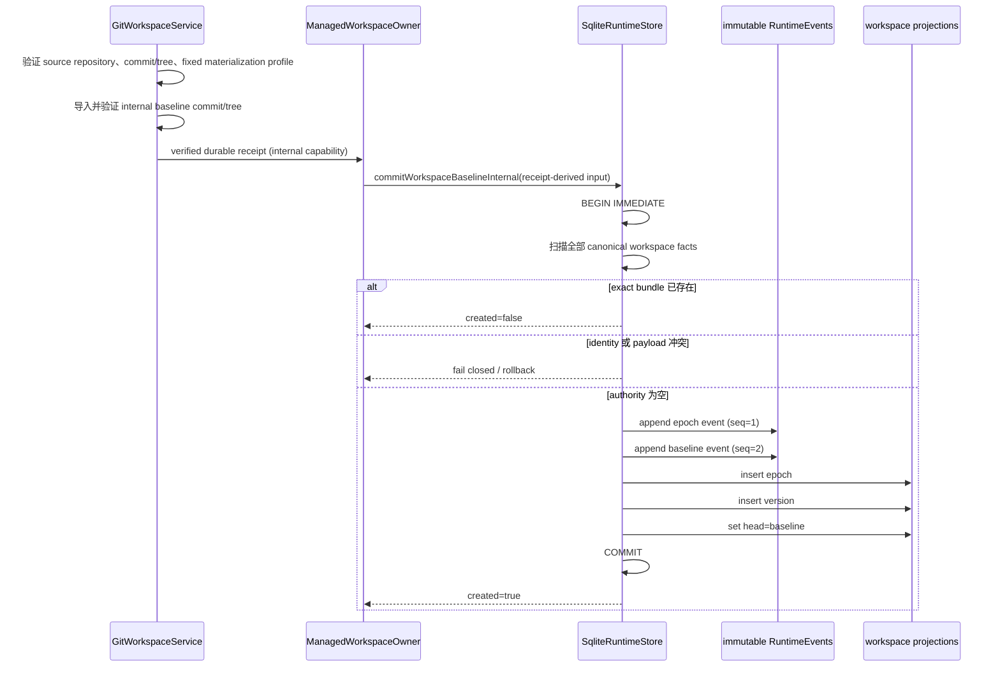

# Workspace Version Authority v1：Baseline 事实权威

- 状态：authority foundation 已由 M0 Baseline Open Bundle 接入；仍待前置 PR 合并后从最新 `main`
  平铺并完成最终 CI
- 更新日期：2026-08-02
- 主要不变量：经专用 writer 提交的一个 workspace epoch，其 baseline canonical facts 与三个 SQLite projection 对外只能全可见或全不可见
- 事实权威：immutable RuntimeEvents
- artifact owner：后续 `GitWorkspaceService`；本切片不执行 Git 命令
- 主要发布证明平台：Linux、macOS；Windows 当前仅验证 SQLite 事务与多进程路径

## 1. 本切片为什么存在

Git-native managed workspace 需要先回答一个比“怎样创建 worktree”更基础的问题：

> 哪一个 Git commit/tree 已被 Maka 正式接受为某个 workspace epoch 的初始版本？

如果答案只存在于 Git ref、内存对象或一张可变的 `workspace_heads` 表里，崩溃、重建或并发打开都可能
产生第二套真相。本切片因此先建立一个很窄的 authority：

```text
epoch opened RuntimeEvent
+ baseline version accepted RuntimeEvent
+ epoch projection
+ version projection
+ head projection
```

五部分由一个专用 SQLite writer 在同一个事务中提交。RuntimeEvents 是 canonical facts；三张表只是
可删除、可重建、每次读取都要与 canonical facts 交叉验证的 projection。若维护操作或外部损坏只删除
projection，公开 reader 会 fail closed，直到显式 rebuild；这种损坏态不被伪装成合法的“全不可见”。

本切片只接受 baseline，不接受 mutation。它不创建 internal repository、不创建 worktree、不调用工具，
也不改变 Desktop/CLI 行为。这种收缩是刻意的：一个 PR 只证明一个主要不变量。

authority slice 本身只证明事实合同、SQLite 原子写入与 projection 可重建性；M0 Baseline Open Bundle
在其上增加了生产 composition seam：`ManagedWorkspaceOwner` 持有未导出的 Git receipt capability，
先持久化并复验 exact receipt，再调用 storage-internal raw writer，SQLite COMMIT 后还会再次复验 Git
artifact。裸 OID、TypeScript brand、caller 自报的 `verified: true` 或 caller 提供的 policy hash 都不
构成证据。

## 2. Owner、边界、失败状态与回滚

| 项目 | 决策 |
|---|---|
| 协议 owner | `@maka/core` 的 strict fact contract 与 pure scanner |
| 写入 owner | storage-internal WeakMap writer；不属于 package API，只能由 `ManagedWorkspaceOwner` composition seam 到达 |
| 原子性边界 | 单个 `BEGIN IMMEDIATE ... COMMIT` SQLite transaction |
| canonical source | store-owned authority stream 中的两条 immutable RuntimeEvents |
| disposable state | `runtime_workspace_epochs`、`runtime_workspace_versions`、`runtime_workspace_heads` |
| 正常失败 | exact retry 返回 existing；payload/identity drift 返回 conflict |
| 损坏失败 | malformed fact、orphan、projection mismatch、partial snapshot 污染全部 fail closed |
| 运行时回滚 | 事务未提交时五部分全部回滚；已提交时五部分全部可读 |
| 版本回滚 | schema 8 数据库不能由只支持 schema 7 的旧 binary 打开；降级必须使用升级前备份 |

逻辑回滚可以停止调用本 writer，但必须保留 schema 8 reader/migration；不能通过删除 capability marker
伪装成旧格式。

## 3. Authority stream

Workspace facts 不挂在普通用户 Session、AgentRun 或工具 invocation 下。每个 epoch 使用一个确定性的
store-owned execution spine：

```text
sessionId     = maka_workspace_authority
invocationId  = workspace_inv_<epoch suffix>
runId         = workspace_run_<epoch suffix>
turnId        = workspace_turn_<epoch suffix>
event_seq     = 1 (epoch opened), 2 (baseline accepted)
```

原因：

1. 普通 conversation copy/purge 不能复制或删除 workspace authority；
2. provider replay 与 UI 消息不应看到 control-plane facts；
3. caller 不能借普通 append、T1/T2、recovery bundle 或 continuation writer 写入保留语义；
4. 每个 epoch 有独立、确定、可重试的物理 spine。

`RuntimeEvent` 的 execution identity 通常对应 AgentRun，但协议现在明确允许 storage-owned control-plane
stream。这个例外只由专用 writer 创建，不能成为 generic append 的逃生口。

## 4. v1 事实合同

### 4.1 Epoch opened

```ts
{
  kind: 'maka.workspace.epoch_opened',
  version: 1,
  payload: {
    protocol: 'workspace_epoch_opened_v1',
    repositoryId,
    workspaceId,
    workspaceEpochId,
    workspaceInstanceId,
    initialWorkspaceVersionId,
    mode: 'managed_worktree',
    objectFormat: 'sha1' | 'sha256',
    sourceCommitOid,
    sourceTreeOid,
    materializationProfileDigest,
    materializationSemantics: 'git_tree_materialized_with_fixed_config_v1',
    policyHash
  }
}
```

### 4.2 Baseline version accepted

```ts
{
  kind: 'maka.workspace.baseline_accepted',
  version: 1,
  payload: {
    protocol: 'workspace_baseline_accepted_v1',
    repositoryId,
    workspaceId,
    workspaceEpochId,
    workspaceVersionId,
    objectFormat: 'sha1' | 'sha256',
    parents: [],
    origin: {
      kind: 'baseline',
      epochOpenedEventId
    },
    commitOid,
    treeOid,
    policyHash,
    treeDeltaDigest,
    changedFileCount,
    deletedFileCount: 0
  }
}
```

Strict decoder 逐层拒绝额外字段、未知 kind/version/protocol、非法 namespace ID、非小写 digest、
不安全计数以及与 `objectFormat` 长度不符的 Git OID。它不做 legacy normalization，也不允许
`runtimeFact` 充当 workspace fact 的别名。

跨事实 scanner 还必须证明：

- 两条事实的 repository/workspace/epoch/object format/policy 一致；
- `initialWorkspaceVersionId === workspaceVersionId`；
- baseline origin 精确引用 epoch event；
- baseline `treeOid === sourceTreeOid`；
- baseline 没有 parent，也没有 deletion；
- 两条事件位于同一条确定 authority spine 的 seq 1/2。

## 5. Semantic lane 与写权限

合法 workspace fact event 的唯一形状是：

```text
partial = false
role = system
author = system
content/status/branch/refs = absent
actions 的唯一 key = workspaceFact
```

任何与 text、function call/response、tool dispatch/recovery、continuation、terminal state 或 partial
混合的事件都是 lane corruption。

Writer reservation 同时覆盖：

- SQLite generic append、batch import 与 terminal writer；
- JSONL append 与 terminal writer；
- tool T1/T2；
- recovery bundle；
- continuation claim/start；
- conversation copy；
- ordinary event 占用保留 authority stream；
- ordinary Session purge 试图删除 authority session。

storage 内部 writer 接受 typed baseline input，由 store 自己构造 RuntimeEvents。它不接受 caller 拼好的
event，因此 caller 没有机会夹带另一条 semantic lane。该 seam 所在模块不从 `@maka/storage` 导出；
公开 store 只暴露 capability、reader 与 projection rebuild。当前唯一生产入口由
`ManagedWorkspaceOwner` 重新验证 durable Git receipt 后调用 raw seam；receipt issuer 与 raw writer
都不进入 package root exports。

## 6. Baseline Open Bundle 时序



Git 验证与 tree-delta 计算故意不放进 SQLite transaction。Baseline Open Bundle 在调用 writer 前读取
并重新验证 durable receipt，COMMIT 后再次复验；SQLite writer 负责冻结已验证 identity，并保证
facts/projections 原子提交。该 composition 仍未接 Desktop、CLI、tool 或自动恢复入口。
`treeDeltaDigest` 必须是 canonical empty-tree → baseline-tree delta 的摘要，不能由 caller 随意填写。

## 7. Schema 7–8 与 projection

Schema 7 从 schema 6 增加 workspace authority facts/projections 并写入 capability：

```text
runtime_workspace_version_authority @ 1
```

三张 projection：

| 表 | 含义 |
|---|---|
| `runtime_workspace_epochs` | epoch identity、source 与 materialization policy |
| `runtime_workspace_versions` | accepted baseline commit/tree 与因果引用 |
| `runtime_workspace_heads` | 当前 epoch head；M0 必须等于 baseline |
| `runtime_storage_root_binding` | singleton durable rootId；阻止单独复制/移动 `runtime.sqlite` 后被另一 storage root 静默认领 |

Schema 8 增加 `runtime_storage_root_binding(singleton=1, root_id, protocol_version=1)`。M0 在任何
workspace fact 写入前，通过 storage-internal binder 将它绑定到 authenticated root owner 的 durable
`rootId`；已绑定数据库只接受 exact rootId。没有 binding 但已经含任何 Session、RuntimeEvent、claim 或
workspace fact 等逻辑数据的实验数据库必须显式 adopt/清理，不能自动认领；只有除 schema/capability metadata
外完全为空的新数据库可以首次绑定。正式 whole-root import 保留 marker 与数据库中的同一 rootId，并只通过
`adoptStorageRootOnImport` 更新 host-local dev/ino，因此仍可打开；只复制 `runtime.sqlite` 会 fail closed。

公开的 `WorkspaceHeadRecordV1` 使用通用字段 `acceptedEventId`，因为后续 head 可能由 mutation acceptance
推进；只有 baseline version record 与 canonical scanner 使用更具体的 `baselineAcceptedEventId`。SQLite
列继续使用语义稳定的 `accepted_event_id`，不把 M0 的 baseline 特例固化为长期 head 合同。

构造 store 时缺少 capability、capability 版本未知或数据库 schema 比 binary 新，全部拒绝打开；不静默
降级到 JSONL 或无 authority 模式。

读取 epoch/version/head 时，store 先从全部 immutable RuntimeEvents 重建 canonical baseline 集合，再与
三张 projection 做完整比较。整次 canonical scan、projection compare 与目标 lookup 必须位于同一个
SQLite read transaction/snapshot；否则并发 writer 可能让读者拼接两个合法时刻并误报 corruption。
不能只信 projection，也不能用冗余 `event_kind` 过滤 canonical rows。

显式 rebuild 先在内存中严格扫描所有事实，只有 canonical ledger 完整时才在一个事务中替换 projection。
扫描失败不会先清空旧 projection；事务插入失败也会保留旧状态。

## 8. 幂等、并发与 crash matrix

| 场景 | 必须结果 |
|---|---|
| 同一进程 exact retry | `created=false`，不新增 event |
| 两进程提交相同 baseline | 一个 created、一个 existing |
| 两进程提交冲突 baseline | 只接受一个；另一个 conflict |
| reader 扫描期间另一进程提交 baseline | reader 在旧 snapshot 返回 absent；下一次读取看到完整 baseline |
| schema 6/7 两进程同时升级 | 在 migration lock 内重读版本，每个 pending migration 只执行一次 |
| epoch event insert 后崩溃 | facts/projections 全无 |
| version event insert 后崩溃 | facts/projections 全无 |
| epoch projection insert 后崩溃 | facts/projections 全无 |
| version projection insert 后崩溃 | facts/projections 全无 |
| head projection insert 后崩溃 | facts/projections 全无 |
| COMMIT 后进程被杀 | 两条 facts 与三张 projection 全部可读 |
| projection 被删除 | explicit rebuild 精确恢复 |
| canonical payload/row 被篡改 | read/rebuild fail closed |
| authority partial snapshot 出现 | fail closed，不把 mutable state 当 canonical fact |

事务内五个 failpoint 已有定向 rollback 测试。真实子进程 kill harness 覆盖“事务内被杀”和“commit
后被杀”；它在 Linux/macOS CI 承担发布证明，Windows 本地不反向宣称同等 crash durability。

## 9. 平台能力矩阵

| 能力 | Linux | macOS | Windows |
|---|---|---|---|
| strict fact/lane | 支持 | 支持 | 支持 |
| SQLite bundle 原子性 | 支持 | 支持 | 支持 |
| 多进程 exact/conflict arbitration | 支持 | 支持 | 已有定向测试 |
| schema 6/7→8 并发升级 | 支持 | 支持 | 已有定向测试 |
| 真实 SIGKILL crash harness | 发布门槛 | 发布门槛 | 当前不承诺 |
| Git object/worktree 语义 | 后续切片 | 后续切片 | 后续能力矩阵 |

本表只描述 authority persistence，不能推导 managed worktree 已跨平台可用。

## 10. 明确延期

以下能力不属于 M0 baseline authority：

- bundled Git 探测、source eligibility 与 internal bare repository；
- managed worktree 创建、owner lifecycle、quarantine 与 repair；
- `.maka-workspace.json` 在 managed worktree 的 identity/exclude 策略；
- ignored dependency/cache 路径的挂载或 scratch policy；
- tool mutation prepared/settled/no-op facts；
- T1/T2 与 workspace version 的原子接受；
- head CAS、conditional redo、undo、publish 与 multi-agent merge；
- continuation boundary 绑定 workspace version；
- Desktop/CLI 设置、默认启用或自动恢复。

尤其不能在本协议中提前定义无生产消费者的 mutation 抽象。Mutation fact 必须与真实 Durable Write
的 T1/T2、tool outcome 引用、session retention 和 head CAS 一起冻结。

## 11. 后续 M0 交付顺序

### Slice 2：Managed Workspace Owner（已完成）

只证明：Maka 能用 bundled Git 创建并独占一个 private internal repository/worktree lifecycle；外部 drift
被检测后 quarantine。需要先拍板 ignored dependencies/scratch、identity marker、fixed Git config、
symlink/LFS/submodule/case/filemode 平台政策。

### Slice 3：Baseline Open Bundle（实现中）

只证明：从 eligible clean source HEAD 导入 Maka-owned objects、materialize baseline、验证 tree/cleanliness，
然后调用本切片的 atomic authority writer。Git artifact 在失败时可作为 orphan GC；只有 RuntimeEvent
接受后的 commit 才是 canonical workspace version。

完成这两片以后，系统才拥有一个可供工具使用的 managed baseline。真正的 Durable Write 与
workspace-version/T2 原子接受仍是下一组独立 PR，不能在 host 接线中顺手补入。

Baseline Open 的详细 receipt 合同、组合 owner、crash matrix 与平台承诺见
[`runtime-managed-workspace-baseline-open-v1.zh-CN.md`](./runtime-managed-workspace-baseline-open-v1.zh-CN.md)。

## 12. 当前验收记录

本分支完成的短门禁：

- core/storage 定向集合：93/93；
- 其中 workspace authority：3 个 pure contract + 12 个 persistence + 4 个新增多进程/升级场景；
- runtime read-model 定向集合：59/59；
- `@maka/storage` 与 `@maka/runtime` build 通过；
- `git diff --check` 通过。

未运行全仓测试；Windows 本地没有执行被 suite 明确跳过的 Unix process-kill crash proof。
