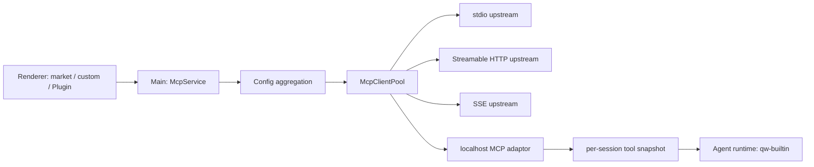

# QoderWork MCP 专项逆向与 Maka 演进方案

> 日期：2026-07-18
> 目标：从本机安装包还原 MCP runtime、market、OAuth、Plugin 与 Agent 接入链路，并映射到 Maka 的可执行路线。
> 边界：只分析程序代码、公开 catalog、数据库 schema 与非敏感配置结构；没有读取或记录 credential、token、cookie、authorization header 或用户数据行。

## 1. 样本与方法

| 项目 | 值 |
|---|---|
| App | `/Applications/QoderWork.app` |
| Version | `0.9.11` |
| Bundle ID | `com.qoder.work` |
| `app.asar` SHA-256 | `0f90145b0efbc18f947b5ec4a8ea00c67486df33315f8456487bd6f491b24292` |
| Electron | `33.4.5` |
| 解包样本 | `/tmp/qoderwork-mcp-re-0.9.11.K8JlS0` |
| 格式化 main bundle | `/tmp/qoderwork-mcp-pretty-0.9.11.yvsnld/main.js` |

方法包括：`asar` 静态解包、bundle formatting、symbol/string 交叉定位、调用链回溯、只读 SQLite schema 检查、公开 market catalog 校验。临时路径只用于复现实验，不是 Maka runtime 依赖。

## 2. 结论摘要

QoderWork 的关键不是“支持三种 transport”，而是把所有来源汇总为一个有生命周期、有权限边界的 MCP control plane：

1. `McpClientPool` 统一管理 builtin、market、custom、Plugin 与 external connector。
2. 独立 `QoderWorkMcpAdaptor` 把多个 upstream MCP server 汇总成一个本机 authenticated proxy。
3. Agent runtime 只连接一个稳定的 `qw-builtin` endpoint，不直接感知上游数量和 transport 差异。
4. market 安装、setup、OAuth、enable 是分离状态；“进入配置”不等于“已经可用”。
5. tool snapshot 以 chat/subChat 为单位写入，active turn 中的 Plugin reload 延迟到 turn end。
6. OAuth token 按 user 与 server 隔离，使用 Electron `safeStorage`，logout 会 suspend pool 并断开 upstream。
7. reconnect、OAuth refresh、HTTP session failure、SSE failure 分流处理，而不是统一粗暴 restart-all。

Maka V1 已具备 transport、tool projection、permission boundary、config reconciliation 与 desktop management；最大差距是 OAuth、authenticated loopback proxy、market setup schema 和 crash recovery。

## 3. Process topology



### 3.1 Pool

Pool entry 持有 normalized config、client、transport、status、connect/reconnect lock、OAuth state 与 tool metadata。所有 source 最终进入相同 pool，因此状态、disconnect、tool refresh 和 error reporting 不需要为 market/Plugin 重复实现。

### 3.2 Adaptor

Adaptor 在 `127.0.0.1` 暴露 MCP HTTP endpoint；macOS/Windows 另提供 Unix Socket/Named Pipe。每次实例使用随机 `x-api-key`。Agent 只看到 adaptor 汇总后的 tool surface。

这层解决了三个问题：

- 多个 upstream 只占 Agent 一个 MCP slot。
- upstream reload 不要求重启 Agent process。
- 可以集中做 header filtering、tool snapshot 与 session isolation。

### 3.3 Header boundary

Adaptor 明确拒绝转发：

- `Authorization`
- `cookie`
- proxy headers
- internal headers

上游 credential 只能由对应 connector/OAuth provider 注入，不能借 Agent 请求穿透本机 proxy。

## 4. Config source 与优先级

聚合顺序为：

1. enabled builtin connector
2. market-installed/custom/enterprise `mcp.json`
3. enabled Plugin `.mcp.json`

同名 server 不覆盖已有项：要么跳过，要么进入 conflict resolution。Plugin server 使用 namespace `plugin:<folder>:<server>`，并由 `pluginConnectorEnabledList` 控制启用状态。

Plugin enable、disable、install、uninstall 都会触发 `reloadMcpAdaptor()`。如果当前 turn 仍在运行，reload 延迟到 turn end，防止半轮中 tool set 改变。

## 5. Transport 与 lifecycle

支持：

- stdio
- Streamable HTTP
- legacy SSE

连接管理包含：

- per-server connect/reconnect lock
- exponential backoff：1s 到 60s
- 20% jitter
- HTTP session failure、SSE close、network error、dynamic token failure、OAuth refresh failure 的独立恢复路径
- pool/adaptor startup degraded mode：单个 server 失败不阻塞整个桌面启动

这比 stop-all/start-all 更适合桌面 Agent：失败域限制在单 server，已经可用的 tools 不被无关 connector 拖下线。

## 6. Market、custom 与 guided setup

### 6.1 Catalog schema

公开 catalog 使用：

```text
schemaVersion: 1
connectors[]
  id / name / description / icon / category / tags
  items[]
    type: mcp | skill
    required
    mcpConfig | skillConfig
```

独立 metadata 文件定义 category、ecosystem 和 sort order。catalog 与 metadata 都有本地 cache、MD5 对比、启动 refresh 和每 10 分钟 refresh。

### 6.2 安装语义

market install 不直接声明连接成功，而是写入 disabled snapshot：

```json
{
  "enabled": false,
  "_builtinId": "...",
  "_source": "market",
  "_marketId": "...",
  "_marketItemId": "..."
}
```

connector 如果同时包含 required skill，会同步安装 skill。用户完成 parameters、guided setup 或 OAuth 后才 enable。

### 6.3 `needs-setup`

带 `_setup` 的 config 在 setup 完成前进入 `needs-setup`，Pool 不启动 server。这个状态应与 `disabled`、`connecting`、`needs-auth`、`connected`、`error` 区分，否则 UI 会把“还没配置”错误显示为“连接失败”。

### 6.4 当前公开 market 实例

本次从本地 bundle 还原出的公开 catalog URL 验证到 Notion、Vercel、Supabase 均使用 official remote MCP endpoint：

| Connector | Endpoint | Auth |
|---|---|---|
| Notion | `https://mcp.notion.com/mcp` | OAuth |
| Vercel | `https://mcp.vercel.com` | OAuth + local callback |
| Supabase | `https://mcp.supabase.com/mcp` | OAuth |

## 7. OAuth 与 user isolation

OAuth flow 覆盖：

1. RFC authorization server metadata discovery
2. `WWW-Authenticate` 的 `resource_metadata`
3. Dynamic Client Registration
4. PKCE S256
5. random state 与 callback validation
6. localhost callback 或 app deep link
7. refresh token single-flight
8. 401 时 refresh 一次，仍失败再回到 OAuth discovery

Token persistence：

- SQLite table：`mcp_oauth_tokens_by_user`
- unique key：`(user_id, server_name)`
- payload：Electron `safeStorage`
- logout：suspend Pool、取消 pending flow、disconnect upstream

这里最重要的是 user isolation。桌面端不能只以 server name 保存 token，否则账号切换会把上一账号的授权带到新会话。

## 8. Agent adaptor 与 tool snapshot

`buildMcpServersConfig()` 不把每个上游逐个注入 Agent，而是注入单个 `qw-builtin`。每个 chat/subChat 获得对应 adaptor URL，并通过 `setMainSessionMcpToolSnapshot` 维护当前 tools。

优势：

- Agent config 稳定。
- tool list_changed、Plugin reload、OAuth reconnect 可在 host 内处理。
- active turn 保持旧 snapshot，下一 turn 使用新 snapshot。

Maka V1 目前通过 backend cache invalidation 达到相似的“下一 turn 生效”语义，但还没有可供 subprocess 共用的 loopback proxy。

## 9. MCP Apps

客户端声明 `io.modelcontextprotocol/ui` capability，识别 `text/html;profile=mcp-app` resource。host 通过 `resources/read` 加载 App，使用 AppBridge 处理 server tool call 与 model context update。

这说明 MCP 不只是一组 tools；后续若 Maka 支持 MCP Apps，必须同时设计：

- iframe/webview trust boundary
- resource CSP 与 navigation policy
- server tool call permission
- App → model context 的 size/type validation

## 10. WorkBuddy 安装 UX 的实现证据

本机 WorkBuddy 5.2.6 的 connector card 使用四态交互：

```text
idle (+)
  -> connecting (spinner, disabled)
  -> cancellable connecting (spinner; hover/focus 显示 red ×)
  -> connected / disconnected / error
```

它在进入 `connecting` 后设置 2 秒防误触窗口，随后 `useCancellableConnecting()` 才将 connector 加入可取消集合。点击取消不是纯视觉 reset：

- abort pending server-side OAuth
- 清理 fresh-auth marker 与 user-initiated marker
- optimistic status → `disconnected`
- 调用 adapter `cancelConnector(configId)`

Maka 本次实现保留了该模式的核心：spinner hover/focus 变 `×`、可访问名称随状态变化、点击后 abort connect、序列化等待 config write 完成、remove config、reconcile manager、刷新 tool snapshot。Maka 使用较短的可感知窗口，因为 V1 market 中大量条目只是写入 disabled setup template，并没有长时间 OAuth flow。

## 11. Capability matrix

| 能力 | QoderWork 0.9.11 | Maka 当前 | 结论 |
|---|---|---|---|
| stdio | 完整 | 完整 | 已对齐 |
| Streamable HTTP | 完整 | 完整 | 已对齐 |
| SSE fallback | 完整 | 完整 | 已对齐 |
| tools/list pagination | 完整 | 完整 | 已对齐 |
| list_changed | 完整 | 完整 | 已对齐 |
| rich tool result | 完整 | 完整且有 aggregate bounds | Maka 更严格 |
| permission/event boundary | host adaptor | 统一 `MakaTool` runtime | 已对齐 |
| market templates | remote catalog + cache | bundled catalog | V2 动态化 |
| guided setup | `_setup` + `needs-setup` | disabled template + manual editor | 待补 |
| OAuth 2.1/PKCE/DCR | 完整 | 未实现 | P0 |
| encrypted token/user isolation | `safeStorage` + per-user DB | headers/env in owner-only file | P0 |
| reconnect/backoff | 分流 + jitter | manual reconnect/基本 close | P1 |
| loopback aggregate proxy | 有 | 无 | P1 |
| resources/templates | 有 | protocol contract 未做 UI | P1 |
| MCP Apps | 有 | 无 | P2 |
| Plugin `.mcp.json` | 有 | 无统一 Plugin source | P2 |

## 12. Maka roadmap

### P0：授权与 setup 真值

- OAuth metadata discovery、PKCE、state validation、local callback/deep link。
- Keychain/`safeStorage` token store，以 workspace user + server id 隔离。
- market item schema 增加 `parameters`、`setup`、`authType`、platform/version constraints。
- 状态机显式增加 `needs-setup`、`needs-auth`，禁止把未配置模板当作 runtime error。
- credential 从 process args/header JSON 迁出；stdio secret 通过受控 env 注入。

### P1：稳定 control plane

- per-server backoff、jitter、crash budget、manual retry reset。
- authenticated loopback aggregate proxy，header denylist 与 random API key。
- resources/templates browse/read/subscribe。
- remote catalog 签名或 digest 校验、atomic cache、last-known-good fallback。
- install operation idempotency、cancel/retry audit event。

### P2：生态与 UI surface

- MCP Apps sandbox 与 AppBridge。
- Plugin/Skill bundled connector manifest。
- enterprise catalog/policy overlay 与 conflict resolution。
- per-tool enable policy、trusted-server read-only policy。
- market update/version/source provenance 与 permission diff review。

## 13. Maka 本次市场实现说明

本次新增钉钉、飞书、Slack、LINE、Notion、macOS 应用、Google Calendar、Figma、Vercel、Supabase。

来源差异必须透明：WorkBuddy 当前的钉钉/飞书是其私有 CLI connector，不是可直接复用的通用 MCP server；Maka 因此采用公开 npm MCP package。Notion/Vercel/Supabase 使用公开 official remote endpoint。需要 credential/OAuth/setup 的条目安装为 `enabled: false`，用户完成配置后再启用，避免空 credential 启动和虚假“安装成功”。

Bundled catalog 对新增 npm server 固定已核验版本，避免 `latest` 静默漂移。飞书 0.5.1 已核验支持 `APP_ID`/`APP_SECRET` env，因此 credential 不写入 process args；LINE 按 package 建议默认设置 `NPM_CONFIG_IGNORE_SCRIPTS=true`。

Figma credential 使用 `FIGMA_API_KEY` env，不放在 process args。V1 仍会把显式 env 写入 owner-only `mcp.json`；在 P0 encrypted credential store 完成前，UI 必须继续提示该限制。

## 14. Evidence index

格式化 `main.js` 行号以本次样本为准：

| 范围 | 证据 |
|---|---|
| 30269–30540 | config 与 OAuth storage |
| 32590–33540 | OAuth discovery/PKCE/callback/refresh |
| 34980–37230 | `McpClientPool` lifecycle/reconnect |
| 79860–80720 | main-session tool snapshot |
| 101420–102480 | authenticated adaptor 与 header boundary |
| 102772+ | Plugin `.mcp.json` aggregation |
| 116300–117240 | market schema/cache/refresh |
| 118873–119764 | `McpService` |
| 138927–139170 | pool/adaptor lifecycle |
| 145899–146000 | runtime adaptor injection |
| 192767–192820 | startup degraded mode |

WorkBuddy 证据来自本机 5.2.6 `renderer/assets/connector-*.js` formatting 后的 `use-cancellable-connecting.ts`、`renderAvailableCard`、`cancelMcpConnector` 与主进程 connector protocol。报告只记录状态机和调用语义，不复制其产品代码或资产。
