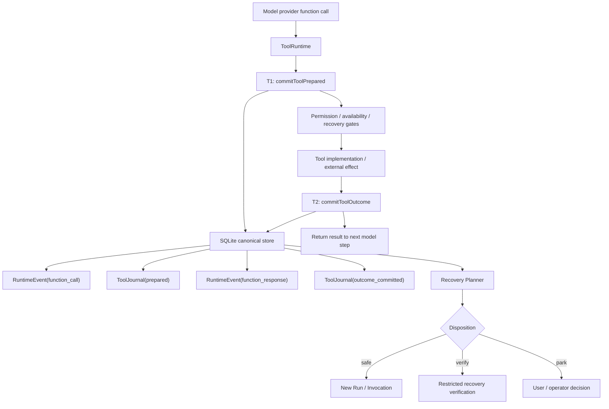

# Runtime Resume 与 Tool Journal：从事件回放到安全续跑

> **Phase 2.5 决策更新（2026-07-17）**：恢复事实已收敛为 RuntimeEvent 单一事实源；`tool_journal_events` 与 `tool_operations` 都是可重建查询投影。T1 由独立、非模型可见的 `actions.toolDispatch` RuntimeEvent 表达，RecoveryResolver 是唯一判定权威。完整契约见 [RecoveryResolver ADR](./architecture/runtime-recovery-resolver-adr.zh-CN.md)。本文后续出现“Journal 事实源”的旧表述均以该 ADR 为准。

> **Phase 3–4 设计入口**：受控工具恢复、RuntimeEvent boundary 与 workspace checkpoint 的绑定、Git snapshot carrier、隔离 worktree 恢复及外部 durable integrations 的详细设计，见 [Runtime Resume Phase 3–4：受控恢复与 Workspace Checkpoint 设计](./architecture/runtime-resume-phase3-phase4-workspace-checkpoint-design.zh-CN.md)。Phase 3A 是接受 workspace checkpoint 前的硬性副作用收敛门槛。

> 本文提出 Maka Runtime 的 crash-resume 设计：Runtime Event Log 继续保存模型与工具交互的 canonical semantics；Tool Journal 在真实副作用边界提供 write-ahead 事实；SQLite 为两类事实提供短事务与幂等约束；恢复器从最后一个可信 high water 创建新的 Run / Invocation 继续，而不是复活旧调用栈。对于无法确认的副作用，Runtime 强制进入受限验证或停车，不允许模型盲目重试。对于 Harbor / Headless 的 timeout checkpoint resume，Runtime 只提供 committed information-flow 与 replay gate；workspace 连续性必须由 Git-backed checkpoint 或等价 carrier 证明。

本文同时记录 Target 设计与分阶段落地状态。文中未明确标注为“已实现”的 Target、后续 Phase 和 Proposed 类型仍属于提案。

截至 2026-07-17：

- Phase 0 的恢复语义、replay gate 与真实进程 crash harness 已实现；
- Phase 1 的 safe-boundary continuation 已实现，并由 `MAKA_RUNTIME_SAFE_BOUNDARY_RESUME=1` 控制 Desktop 中断横幅手动恢复、CLI/TUI `/resume` 与 Desktop 自动启动；continuation lineage 会回溯拼装 user-anchored provider history，普通后续 Turn 也会包含 continuation Run；
- Phase 2 的 SQLite schema、Tool Journal、T1/T2、operationId、CAS、partial snapshot、带 source marker 的批量 JSONL 导入、显式导出及 CLI/Desktop 单一 canonical writer 接线已实现；
- `MAKA_RUNTIME_SQLITE_CANONICAL=1` 是 workspace 的迁移触发器而非可随意来回切换的读写开关：workspace 一旦存在 `runtime.sqlite`，后续即使关闭环境变量也继续使用 SQLite canonical，避免 SQLite-only 事件突然不可见；系统不会双写两个 RuntimeEvent 真相源；
- Phase 2 已实现 write-side durable boundary；崩溃留下的 unmatched function call 会沿用 Phase 0 gate 安全 park，但 journal 的 `indeterminate/reconciled/parked` 状态写入与专用 reconciler 属于 Phase 3；
- Phase 3 的受控恢复、reconciler 与 recovery verification 尚未实现。

## 一、执行摘要

Maka 已经具备 resume 的主要事实基础：

- RuntimeEvent 是模型交互的 canonical semantic log；
- function call 与 function response 已通过 toolCallId 配对；
- Run、Turn、Invocation 和 Session 已有稳定身份；
- completed RuntimeEvents 可以重建模型历史、UI 与 terminal fact；
- startup recovery 已能把悬挂 Run 收敛为确定终态；
- Headless 已经把跨执行继续建模为新的 Attempt，而不是一条不死的调用栈。

缺失的是副作用边界上的 durable commit protocol。当前 ToolRuntime 可以在 canonical function-call RuntimeEvent 真正落盘前开始执行工具，也可能在工具已经产生副作用后、function-response RuntimeEvent 落盘前崩溃。因此：

```text
Event replay 已能回答：日志里记录了什么？

Resume 还必须回答：
1. 工具是否可能已经执行？
2. 已完成结果是否已经 durable？
3. 未知结果能否安全重试、验证或重新接管？
4. 下一次执行从哪个边界继续？
```

本文建议：

1. **恢复单位是新的 Run / Invocation。** 不恢复旧 provider socket、Promise、进程句柄或 JavaScript 指令指针。
2. **RuntimeEvent 与 Tool Journal 同库事务提交。** tool call 的 intent 在副作用前提交；tool result 在返回模型前提交。
3. **operation identity 来自崩溃前已持久化的 operationId。** 不使用 TurnID + ToolIndex 推测“逻辑上是不是同一步”。
4. **indeterminate 是事实，不是行动策略。** Runtime 另行注入 recovery directive，并用工具白名单强制 verification；无法安全验证的通用 Bash 直接 park。
5. **文件恢复采用分层策略。** 原子替换防止 torn write；mtime/size 快速筛选；hash 从已有内存计算或仅在恢复路径按需读取。
6. **近期只做单机 ownership。** 进程内互斥、SQLite 唯一约束、短事务 CAS 和必要的 OS lock 足够；多节点 fencing 推迟到真实 multi-worker 需求出现。
7. **SQLite 成为新的 canonical store，JSONL 降为兼容导入与导出。** 不允许 SQLite 与 JSONL 同时自称 source of truth。
8. **MVP 先支持 safe-boundary continuation。** 只有 ledger 完整、所有工具都有 committed outcome、workspace identity 一致时自动续跑；否则 park。
9. **Harbor P0 是 Runtime high-water + Git-backed workspace checkpoint。** 不能只恢复消息流；必须同时恢复或验证 agent-visible workspace ref，并把拒绝原因显式写入 fallback taxonomy。

## 二、目标、边界与非目标

### 2.1 目标

进程退出、应用崩溃或操作系统重启后，Maka 应能：

- 重建 Invocation 已提交的模型、工具、权限与 terminal facts；
- 判断 Tool Operation 是完成、结果未知，还是可被专属 reconciler 确认；
- 保证已提交的工具结果不会因为 resume 再次执行；
- 在安全边界创建新的执行尝试，并向模型提供合法、成对、可解释的历史；
- 对不可确认副作用 fail closed；
- 重复运行 recovery 得到同一个计划，不产生重复 terminal、重复 result 或重复副作用；
- 让 Desktop、Headless 和未来 scheduler 消费同一套恢复事实。

### 2.2 非目标

近期明确不承诺：

- 恢复旧 provider streaming connection；
- 恢复旧 JavaScript 调用栈的下一行；
- 复活没有 durable handle 的 OS 子进程；
- 对任意 Bash 或任意第三方 API 提供 exactly-once；
- 让 LLM 自己判断未知副作用是否“权威完成”；
- 第一阶段支持多节点 active-active worker；
- bit-exact provider wire replay；
- 用 Resume 替代 TaskRun、Workspace Snapshot、Memory 或 Compaction。

准确的产品承诺应是：

> Maka 可以从 durable facts 计算安全续跑计划；只有能证明安全时才自动继续，不能证明时明确验证或停车。

## 三、Current：现有实现与 crash window

### 3.1 RuntimeEvent 已经是正确的事实根

现有架构已经规定 Runtime Event Log 是 Agent 交互语义的 source of truth。RuntimeEvent 保存 sessionId、invocationId、runId、turnId、content、actions、refs、partial 和 terminal status。

function call 与 function response 已有稳定关联：

- function_call.content.id；
- function_response.content.id；
- refs.toolCallId；
- function_call 可附带 refs.stepId。

因此新设计不应创建第二套“模型工具历史”。Tool Journal 只回答执行边界与恢复问题，canonical args/result 仍由 RuntimeEvent 保存。

### 3.2 ToolRuntime 当前时序

```text
append ToolCallMessage
  → push tool_start SessionEvent
  → permission / availability / loop guards
  → execute tool.impl
  → append ToolResultMessage
  → push tool_result SessionEvent
  → telemetry / trace / artifact
  → return result to AI SDK
```

AiSdkFlow 随后把 tool_start/tool_result 映射成 RuntimeEvents；AgentRun 消费 Flow 输出并持久化。Session projection 的 tool_call 通常先于工具执行，但 canonical function_call RuntimeEvent 的 durable acknowledgement 没有被 ToolRuntime await。

对应代码：

- `packages/runtime/src/tool-runtime.ts`；
- `packages/runtime/src/ai-sdk-backend.ts`；
- `packages/runtime/src/ai-sdk-flow.ts`；
- `packages/runtime/src/agent-run.ts`。

### 3.3 两个关键窗口

#### Window A：无 durable canonical intent 的副作用

```text
tool_start 已 push
  → tool.impl 开始
  → 进程崩溃
  → function_call RuntimeEvent 尚未提交
```

此时环境可能已经变化，但 canonical ledger 无法证明 Runtime 接受过调用。

#### Window B：副作用已完成、outcome 未提交

```text
tool.impl 完成真实副作用
  → 进程崩溃
  → function_response RuntimeEvent 尚未提交
```

恢复器不能因为“没有 result”就判断“没有执行”，也不能自动重复 Bash、发布、付款、删除或远程创建操作。

### 3.4 当前 recovery 与 JSONL 边界

当前 startup recovery 会识别 stale stream、tool tail、permission wait 和损坏的 operational event，生成失败/取消终态并修复 projection。它不会分析未知副作用、创建 ResumePlan 或自动启动 continuation Run。

当前 RuntimeEvent 与 AgentRun event 主要依赖独立 JSONL append。文件内顺序有意义，文件之间没有事务，也没有数据库级 event-id 唯一约束，不能原子表达：

```text
function_call RuntimeEvent
+ tool prepared journal fact
= 同一个提交
```

## 四、外部评审意见的处理

| 意见 | 处理 | 最终决定 |
|---|---|---|
| LLM 不善于处理 indeterminate | 采纳并加强 | 增加 Runtime 强制 recovery_verification、工具白名单和重试拦截 |
| 每次 before/after 全量 hash 成本高 | 部分采纳 | 原子替换为基础；metadata 快筛；hash 从内存计算或恢复时按需读取 |
| 单机阶段 lease/fencing 过度 | 采纳近期判断 | MVP 不上分布式 fencing；使用进程互斥、短事务 CAS、唯一约束和必要 OS lock |
| TurnID + ToolIndex 生成幂等键 | 拒绝 | 使用持久化 operationId；ordinal 仅诊断，args hash 仅防 identity misuse |
| 尽早迁移 SQLite | 采纳 | SQLite 成为 canonical；JSONL 只做兼容导入/导出 |

### 4.1 Actionable prompt 不等于 enforcement

模型可能忽略“不要重试”，也可能通过 Bash 执行看似只读但实际有副作用的命令。必须把三层分开：

```text
Synthetic function response：
  只陈述 execution_outcome = indeterminate

Recovery directive：
  说明必须检查什么、禁止什么

Runtime gate：
  真正限制可用工具与重复调用
```

### 4.2 Atomic replace 与 hash 是互补关系

原子替换保证目标文件是旧版或新版之一，避免只写一半；它不能独立证明 crash 前替换是否完成，也不能判断文件是否随后被其他进程修改。

```text
atomic replace：防 torn write
mtime + size：低成本快速判断
hash：需要证明时的内容身份
journal：说明 Runtime 原本打算做什么
```

### 4.3 TurnID + ToolIndex 的风险

同一 Turn 可包含多个 step、并行调用、provider 重排和 branch/regenerate。恢复后模型重新生成的第 N 个调用也可能参数改变。如果按索引复用旧结果，Runtime 会把新操作静默误判为旧操作。

正确原则是：

```text
operationId：标识是不是同一个已接受操作
canonicalArgsHash：验证同一 operationId 下参数是否漂移
stepOrdinal/toolOrdinal：只用于排序、诊断和 UI
```

Resume 不要求模型重新生成旧调用；旧身份与参数从 ledger 读取。

## 五、恢复等级

- **Semantic replay**：从 RuntimeEvents 重建模型历史、UI、权限与终态。当前基本具备。
- **Safe-boundary continuation**：所有已接受调用都有 committed outcome，新 Run 从 high water 继续。MVP 目标。
- **Reconciliation**：专属检查根据环境、handle 或 postcondition 确认未知副作用。
- **Re-execution**：仅当 contract 明确 replay-safe/idempotent，且使用原 operationId 与原参数。
- **Hot resume**：继续旧 provider stream、Promise 或进程。不是默认目标。

## 六、设计不变量

1. **Intent before effect**：provider-visible function-call intent 可以先于权限决策提交；真实 tool implementation 只能在权限与执行前 guards 全部通过，且 T1 原子确认 function-call fact 与 prepared fact 后开始。
2. **Outcome before observation**：function-response fact 与 outcome fact 提交前，结果不能返回下一模型 step。
3. **Completed means no re-execution**：已有 committed outcome 的 operation 只能复用，不能再次执行。
4. **Unknown is not failed**：没有 outcome 不能推导副作用未发生。
5. **No blind retry**：indeterminate 默认不得自动重试。
6. **Provider history remains legal**：provider-visible function call 必须有 matching response。
7. **Resume creates new execution identity**：恢复创建新 Run / Invocation，记录来源 high water。
8. **Projection is rebuildable**：Session message、tool status、UI 都可从 canonical logs 重建。
9. **One canonical store**：SQLite canonical 后，JSONL 不再并列写入真相。
10. **Local first**：近期 correctness 不依赖多节点 fencing。
11. **Workspace claims require evidence**：无 workspace/carrier 证据不得声称连续。
12. **Privacy does not regress**：SQLite 不得扩大敏感内容留存；不持久化的隐私模式不提供 crash resume。

## 七、目标架构



外部副作用位于两个短事务之间。数据库事务不能覆盖文件系统、Shell 或网络；中间 crash 由 recovery contract 处理。

## 八、身份模型

保留 Session、Turn、Run、Invocation 四层身份，并新增 Runtime operationId：

```ts
interface ToolOperationIdentity {
  operationId: string
  providerToolCallId: string
  invocationId: string
  runId: string
  turnId: string
}
```

推荐由 Runtime 生成 operationId：

- providerToolCallId 继续用于 provider-native call/result 配对；
- operationId 作为数据库主键、journal identity 和外部 idempotency key；
- RuntimeEventRefs 增加 operationId；
- 数据库同时约束 `(invocationId, providerToolCallId)` 唯一。

参数身份：

```text
canonicalArgsHash = SHA256(stable-json(toolName, normalizedArgs))
```

args hash 只检测 identity misuse、支持 exact-repeat guard 和诊断，不猜测业务语义等价。

## 九、Tool Journal

Tool Journal 不复制完整 args/result，而是引用 canonical RuntimeEvent：

```ts
interface ToolJournalEvent {
  journalEventId: string
  operationId: string
  invocationId: string
  runId: string
  turnId: string
  ts: number
  state:
    | 'prepared'
    | 'dispatch_acknowledged'
    | 'outcome_committed'
    | 'indeterminate'
    | 'reconciled'
    | 'parked'
  runtimeEventId?: string
  canonicalArgsHash?: string
  recoveryMode?: ToolRecoveryMode
  externalHandle?: string
  metadata?: Record<string, unknown>
}
```

- prepared 表示权限与执行前 guards 已通过、调用即将派发；恢复时仍不能仅凭 prepared 判断副作用是否发生；
- dispatch_acknowledged 仅用于能提供 durable receipt 的 executor；
- outcome_committed 必须引用 function-response RuntimeEvent；
- indeterminate 是 recovery 提交的事实；
- reconciled 必须记录 reconciler 与 observations；
- parked 表示 Runtime 拒绝自动决定。

可以维护 `tool_journal_events` 与 `tool_operations` 快速状态表，但二者都只是 projection。新协议数据删除后必须能从 RuntimeEvent 重建。

## 十、SQLite schema 提案

以下是概念 DDL，不是最终迁移脚本：

```sql
CREATE TABLE runtime_events (
  event_id TEXT PRIMARY KEY,
  session_id TEXT NOT NULL,
  invocation_id TEXT NOT NULL,
  run_id TEXT NOT NULL,
  turn_id TEXT NOT NULL,
  event_seq INTEGER NOT NULL,
  event_kind TEXT NOT NULL,
  payload_json TEXT NOT NULL,
  committed_at INTEGER NOT NULL,
  UNIQUE (invocation_id, event_seq)
);

CREATE INDEX runtime_events_by_run
  ON runtime_events(session_id, run_id, event_seq);

CREATE TABLE tool_journal_events (
  journal_event_id TEXT PRIMARY KEY,
  operation_id TEXT NOT NULL,
  invocation_id TEXT NOT NULL,
  run_id TEXT NOT NULL,
  turn_id TEXT NOT NULL,
  state TEXT NOT NULL,
  runtime_event_id TEXT,
  canonical_args_hash TEXT,
  recovery_mode TEXT,
  external_handle TEXT,
  metadata_json TEXT,
  committed_at INTEGER NOT NULL,
  FOREIGN KEY(runtime_event_id) REFERENCES runtime_events(event_id)
);

CREATE TABLE tool_operations (
  operation_id TEXT PRIMARY KEY,
  invocation_id TEXT NOT NULL,
  run_id TEXT NOT NULL,
  turn_id TEXT NOT NULL,
  provider_tool_call_id TEXT NOT NULL,
  tool_name TEXT NOT NULL,
  canonical_args_hash TEXT NOT NULL,
  recovery_mode TEXT NOT NULL,
  current_state TEXT NOT NULL,
  call_event_id TEXT NOT NULL,
  result_event_id TEXT,
  version INTEGER NOT NULL,
  FOREIGN KEY(call_event_id) REFERENCES runtime_events(event_id),
  FOREIGN KEY(result_event_id) REFERENCES runtime_events(event_id),
  UNIQUE(invocation_id, provider_tool_call_id)
);
```

`runtime_events` 是唯一恢复事实；`tool_journal_events` 与 `tool_operations` 都是查询投影。并行 tool calls 的数据库 commit order 定义 durable event_seq，不再依赖毫秒时间戳解决因果顺序。

SQLite 约束：

- WAL 模式，允许 read model 与短事务并发；
- 明确同步等级，不依赖隐式默认值；
- 工具执行期间不得持有 transaction；
- event append 使用主键幂等；
- migration 有版本、事务和恢复测试；
- 数据库损坏不得自动覆盖；
- Incognito/ephemeral 模式明确禁用 durable resume 或使用独立短生命周期 store。

## 十一、提交协议

### 11.1 T1：commitToolPrepared

同一 transaction：

1. 检查 operationId 不存在，或身份与 args hash 完全一致；
2. 分配 event_seq；
3. append RuntimeEvent(function_call)，或验证此前已提交的同 ID fact 完全一致；
4. append 非模型可见的 RuntimeEvent(actions.toolDispatch)；
5. 同步更新 ToolJournal(prepared) 与 tool_operations projection；
6. commit。

只有 T1 成功后：

- ToolRuntime 才进入真实 implementation；
- telemetry/trace 才引用 callRuntimeEventId。

UI 可以在权限等待期间显示 tool_start，但这时尚无 prepared journal；权限拒绝、参数错误、availability/loop/runtime guards 拦截都不会制造悬挂的 prepared operation。

T1 失败时工具不得执行。

### 11.2 T2：commitToolOutcome

同一 transaction：

1. 读取 operation projection；
2. 校验 identity 与 current state；
3. 若已有 resultEventId，返回已提交结果；
4. 分配 event_seq；
5. append RuntimeEvent(function_response)；
6. append ToolJournal(outcome_committed)；
7. 更新 projection；
8. commit。

只有 T2 成功后：

- tool_result 才交给 AI SDK；
- 下一 provider step 才能开始；
- artifact 与 telemetry 可异步执行，但必须引用 committed outcome。

严禁用长 SQLite EXCLUSIVE transaction 包裹真实工具执行。

## 十二、Tool recovery contract

```ts
type ToolRecoveryMode =
  | 'replay_safe'
  | 'idempotent'
  | 'reconcile'
  | 'reattach'
  | 'never_auto_retry'

interface ToolRecoveryContract<P = unknown> {
  mode: ToolRecoveryMode
  buildExternalIdempotencyKey?: (operationId: string, args: P) => string
  reconcile?: (input: ToolReconcileInput<P>) => Promise<ToolReconcileResult>
  verification?: {
    allowedToolNames: readonly string[]
    maxSteps: number
    directive: string
  }
}
```

- **replay_safe**：Read、Glob、Grep、明确只读 status API。可用原 operationId 和原参数重读，结果标记 recoveredAt。
- **idempotent**：下游真正支持幂等键；使用原 operationId；同 ID 参数 hash 变化必须拒绝。
- **reconcile**：Write、Edit、FormatJson、artifact 或可查询远程资源；返回 applied/not_applied/conflict/unknown。
- **reattach**：有 durable external handle 的 ShellRun、remote job、child Run。
- **never_auto_retry**：通用 Bash、发送、发布、付款、删除及无专属协议的外部 API。默认 indeterminate + park。

## 十三、Recovery Planner

### 13.1 输入与输出

```ts
interface RecoveryPlannerInput {
  run: AgentRunHeader
  runtimeEvents: readonly RuntimeEvent[]
  toolJournal: readonly ToolJournalEvent[]
  toolContracts: ReadonlyMap<string, ToolRecoveryContract>
  workspaceObservation?: WorkspaceResumeObservation
  currentRuntimeFingerprint: RuntimeFingerprint
}

interface ResumePlan {
  resumeId: string
  sourceRunId: string
  sourceRuntimeEventHighWater: number
  disposition: 'auto_continue' | 'verify' | 'park' | 'terminal_noop'
  completedOperationIds: string[]
  unresolvedOperations: UnresolvedToolOperation[]
  diagnostics: ResumeDiagnostic[]
  nextRun?: {
    resumeChainId: string
    instructionKind: 'continuation' | 'recovery_verification'
  }
}
```

RuntimeFingerprint 至少包含：

- Runtime schema/version；
- tool catalog hash；
- permission policy version；
- model/provider replay capability；
- cwd/workspace/carrier identity；
- 必要的 context projection version。

它不是 bit-exact request snapshot，只负责判断当前 Runtime 是否具备合法继续条件。

### 13.2 计算顺序

1. 校验 RuntimeEvent schema、event_seq 与 invocation identity；
2. 校验 terminal invariant；
3. 按 operationId 投影 tool state；
4. 检测 function call/result pairing；
5. 检测 pending permission、background handle 与 child Run；
6. 校验 workspace identity；
7. 校验 Runtime/tool catalog replay compatibility；
8. 为每个 unresolved operation 应用 recovery contract；
9. 得到 auto_continue、verify 或 park；
10. append recovery decision fact；
11. 收敛旧 Run；
12. 需要继续时创建新 Run / Invocation。

### 13.3 决策表

| 观察 | 决策 |
|---|---|
| terminal RuntimeEvent 已存在，Run header stale | 修复 header，不创建新执行 |
| 所有 tool calls 都有 committed responses，旧 Run 未终止 | 写 interrupted terminal，创建 safe continuation |
| replay_safe operation 无 outcome | 使用原 operationId 重读并提交 recovered observation |
| reconcile operation 可确认 applied | append reconciled outcome，再继续 |
| reconcile 确认未 applied 且 contract 允许 | 使用原 operationId 重试 |
| reattach operation 有可信 handle | 查询/接管后提交 outcome |
| 通用 Bash 无 outcome | park |
| permission request 未完成 | park；新授权不能追认旧 call 已执行 |
| workspace identity 不匹配 | park 或显式创建新 workspace Attempt |
| tool catalog/policy 不兼容 | park 或显式降级，不得猜测 |

### 13.4 Recovery 计划本身也要 durable

同一 source Run 重复恢复必须命中同一 active resume identity。建议记录：

```text
resumeId
sourceRunId
sourceEventHighWater
disposition
targetRunId?
planVersion
createdAt
```

MVP 可以把它作为 SQLite 中的 operational record 和 AgentRunEvent；如果未来参与 TaskRun 接管，再提升为更完整的 checkpoint/control fact。

## 十四、indeterminate 与 LLM 行为

### 14.1 合成 response 只陈述事实

为了保持 provider history 合法，可以追加 recovery-generated function response：

```json
{
  "kind": "function_response",
  "id": "<original-provider-tool-call-id>",
  "name": "<tool-name>",
  "isError": true,
  "result": {
    "kind": "maka.recovery_outcome",
    "status": "indeterminate",
    "reason": "runtime_interrupted_before_outcome_commit",
    "operationId": "<operation-id>",
    "sideEffectsMayHaveOccurred": true
  }
}
```

该事件必须标记：

- author = system；
- recovered = true；
- sourceRunId；
- resumeId；
- 不得伪装成工具自己返回的普通失败。

### 14.2 Recovery directive 使用更高优先级

进入 verification 时，Runtime 注入版本化 directive：

```text
The prior tool operation has an indeterminate outcome.
Do not repeat it.
Inspect only the declared postconditions with the currently available
read-only tools. Mutating tools remain unavailable until verification ends.
```

### 14.3 Runtime 必须强制执行

verification mode 同时执行：

- activeTools 只包含 contract 声明的只读工具；
- 禁用通用 Bash，即使模型声称命令只读；
- exact-repeat guard 拒绝与 unresolved operation 相同的 tool + args hash；
- 限制 maxSteps 与 wall time；
- 模型不能通过自然语言自行提升 operation authority；
- observations 进入 RuntimeEvents；
- 结束后由 reconciler 或用户决定，不由模型自述决定。

这延续 Self-check 的 authority 原则：模型可以产生观察和建议，不能凭自述改变 canonical execution outcome。

### 14.4 Verification 不是所有 unknown 的默认出口

只有 contract 明确说明：

- 允许哪些只读工具；
- 检查哪些 postconditions；
- 最多多少步；
- 什么事实足以继续；

才进入 LLM-assisted verification。通用 Bash、支付、发送及不可逆外部操作没有这些信息时，直接 park。

## 十五、本地文件工具

### 15.1 写入协议

Write/Edit/FormatJson 的目标协议：

1. 在目标文件同一文件系统创建临时文件；
2. 写入完整新内容；
3. 根据 durability policy flush 临时文件；
4. 使用平台正确的 atomic replace 替换目标；
5. 在支持时 flush parent directory；
6. 返回 path、bytes 与预期内容身份；
7. T2 提交 outcome。

不能假设所有平台上的 `fs.renameSync` 都有相同 replace 语义。当前发布基线以 Linux/macOS 的真实进程 crash test 为准；Windows 仅做有限支持与受控 fallback，不作为 Phase 0–2 的阻塞验收平台。

### 15.2 分层证据

正常路径记录：

```text
path
sizeBefore?
sizeAfter
mtimeBefore?
mtimeAfter?
expectedAfterHash?
```

计算策略：

- Write 的 after hash 从输入 content 直接计算，不重新读盘；
- Edit/FormatJson 已在内存中持有 before/after，可直接计算；
- 大文件可按阈值记录 metadata 与 deferred-hash 标记；
- 恢复先比较 size/mtime；
- metadata 不足时才读取并 hash；
- hash mismatch 不能自动解释成未执行，可能是外部并发修改。

### 15.3 Reconcile 结果

```text
当前内容 == expected after：
  confirmed_applied

当前内容 == known before：
  confirmed_not_applied

当前内容既不是 before 也不是 after：
  conflict

缺少足够证据：
  unknown
```

conflict 时禁止覆盖当前文件来“恢复到预期”，因为它可能包含用户或其他进程在 crash 后的新修改。

### 15.4 多文件与 Bash

atomic replace 只解决单文件。Bash 可能修改任意文件、数据库和网络状态，不应通过扫描 workspace 猜测事务边界。

需要多文件一致性的专属工具必须拥有自己的 manifest、staging、commit marker、transaction/rollback protocol，或者声明 never_auto_retry。

## 十六、单机 ownership

### 16.1 MVP 威胁模型

- Electron main process 中重复点击 Resume；
- background startup recovery 与用户主动操作竞争；
- CLI 同一 workspace 被误启动两次；
- 进程崩溃后新进程接管；
- automation scheduler 与手动 session 操作同机竞争。

### 16.2 建议机制

```text
进程内：
  keyed mutex(sessionId/runId)

跨进程：
  workspace-scoped OS/file lock，进程退出自动释放

数据库：
  UNIQUE(active resume for source run)
  ownerProcessInstanceId
  version CAS
  短 transaction claim/commit
```

不要在 tool 执行期间持有 SQLite EXCLUSIVE transaction。

### 16.3 何时升级为 lease/fencing

只有出现以下需求再引入：

- 多 Worker 扫描并认领同一 TaskRun；
- stale worker 会在新 owner 接管后返回晚到结果；
- Desktop、Headless service 与远程 scheduler 共同写同一 store；
- workspace carrier 支持跨机器迁移；
- active-active 执行。

届时 fencing token 必须同时进入 Run claim、tool outcome、workspace carrier 与 terminal commit。只在数据库增加 token、却不让副作用端校验，不能阻止 stale execution。

## 十七、旧 Run 与新 Run

### 17.1 旧 Run 收敛

旧 Run 继续保护现有 terminal invariant：

- terminal RuntimeEvent 先提交；
- Run header 后提交；
- failureClass 可使用 `runtime_interrupted_resumable`；
- stateDelta 记录 resumeId、source high water 与 unresolved count。

它是失败/中断的执行尝试，不等于用户任务已经失败。

### 17.2 新执行 lineage

新 Run 建议记录：

```text
resumedFromRunId
resumeId
resumeChainId
resumeDisposition
```

短期可放入 AgentRunEvent.data 与 RuntimeEvent stateDelta；稳定后提升为强类型。

### 17.3 Turn 策略

推荐 canonical 层创建新的 continuation Turn：

- 不把两个 provider Invocation 假装成同一调用；
- 每次执行保留独立 terminal fact；
- 与 Headless“新 Attempt 继续”一致；
- UI 可把 continuation Turn 聚合到原用户请求下。

若要复用原 turnId，必须先证明多 Run 同 Turn 的排序、compaction、UI terminal、regenerate/branch lineage 都无歧义。

## 十八、SQLite 迁移

### 18.1 目标形态

```text
SQLite：canonical Runtime/Run/Tool facts
JSONL：legacy import + human-readable export
```

禁止生产路径让 SQLite 与 JSONL 任一写成功都被视为 committed。Target 的 human-readable projection 可以是：

```text
写 SQLite transaction
  → committed
  → JSONL exporter 按 high water 异步导出
```

当前 Phase 2 没有生产异步 exporter；仅提供显式 export API。为保证回退不丢可见性，已迁移 workspace 采用 sticky SQLite canonical：关闭 flag 不会重新切回旧 JSONL writer。真正降级到不理解新 schema 的旧版本前，必须先显式导出并验证，不能把环境变量关闭等同于格式回滚。

### 18.2 Legacy 导入

1. 检测 migration marker；
2. 读取 run.json、events.jsonl、runtime-events.jsonl；
3. 验证 ID、terminal invariant 与 JSONL tail；
4. legacy 树导入跳过旧版本物理写入 JSONL 的流式 partial 快照（mutable projection，非 immutable fact；其 durable final 是独立事件，悬挂 partial 由 replay boundary gate 处理），显式导入 API 仍拒绝 partial 输入；其余事件使用原 immutable event ID 幂等 INSERT；
5. 按原 ledger 顺序分配 event_seq；
6. 记录 source path 与 `size:mtime` fingerprint；
7. 每个 source file 的全部事件与 import marker 在同一批量 transaction commit；
8. 后续读取切到 SQLite；
9. 稳定期内保留原文件。

导入中断后重新执行必须得到同一结果。

### 18.3 版本与回滚

一旦新版本写入 JSONL 无法表达的新语义，旧应用不能继续写同一 workspace。需要：

- store format version；
- minimum reader/writer version；
- 启动时 fail closed；
- 显式 export 工具；
- migration 前备份；
- migration failure 不删除原 JSONL。

## 十九、代码改造地图

### 19.1 packages/core

- `runtime-event.ts`
  - RuntimeEventRefs.operationId；
  - recovery outcome；
  - schema/version 与 durable position contract。
- `runtime-event-store.ts`
  - append-if-absent；
  - high-water read；
  - transaction-level tool prepared/outcome。
- `agent-run.ts`
  - resume lineage；
  - 恢复诊断类型。

新增候选：

- `tool-journal.ts`；
- `runtime-resume.ts`；
- `runtime-store-version.ts`。

### 19.2 packages/storage

新增候选：

- `sqlite-runtime-store.ts`；
- `sqlite-schema.ts`；
- `sqlite-migrations/`；
- `legacy-runtime-import.ts`；
- `runtime-jsonl-export.ts`；
- `runtime-store-lock.ts`。

现有 file store 保留为测试 fixture、legacy reader、export adapter 与迁移兼容路径。

### 19.3 packages/runtime

- `tool-runtime.ts`
  - 接收 RuntimeCommitSink；
  - T1 后才执行 impl；
  - T2 后才返回 result；
  - ToolRecoveryContract；
  - exact-repeat unresolved guard。
- `ai-sdk-backend.ts`
  - 传入 invocation-scoped commit sink；
  - recovery_verification tool projection；
  - recovery directive；
  - 避免重复提交 tool facts。
- `ai-sdk-flow.ts`
  - 区分 already-committed canonical event 与 legacy mapping；
  - 逐步让 Backend 原生产 canonical events。
- `agent-run.ts`
  - 组装 commit sink；
  - resume lineage；
  - terminal metadata。
- `agent-run-recovery.ts`
  - 从 fail classifier 演进为 RecoveryPlanner；
  - 保留 terminal repair 子路径。
- `model-history.ts`
  - missing function response diagnostic；
  - recovery response pairing；
  - provider-native legality gate。
- `runtime-kernel.ts` / `session-manager.ts`
  - resume API；
  - 单机 claim 与 keyed mutex；
  - startup policy；
  - UI/IPC projection。
- `workspace-executor.ts`
  - atomic write adapter；
  - file observation/reconcile。

### 19.4 packages/headless

Headless 后续复用 Runtime high water、operation refs、新 Attempt、Task Event high water、workspace carrier identity 与 durable budget。完整 DurableTaskCheckpoint 是更高层能力，不阻塞 Desktop safe-boundary resume。

Issue #186 的 Harbor timeout resume 应作为 Headless P0 的约束输入，而不是 Runtime Phase 0 的附属功能。推荐 P0 合同是：

```text
resumable checkpoint =
  committed RuntimeEvent/message high-water
  + compaction summary ref
  + Git-managed workspace commit/tree/ref
  + task/source/workspace identity
```

Checkpoint 只在已接受的 model/tool/checkpoint boundary 之后产生。写入事实至少包括：

- `sourceRuntimeEventHighWater`；
- compaction summary/artifact ref；
- repo root、base commit、attempt-local checkpoint ref；
- workspace lease / worktree identity；
- dirty/include policy；
- timeout/interruption kind。

Resume 时必须先验证：

- task/source identity 未漂移；
- repo/worktree/workspace identity 匹配；
- checkpoint Git ref 可恢复；
- RuntimeEvent high-water 与 checkpoint 记录一致；
- committed history 没有 dangling tool state；
- compaction summary 可读取；
- timeout/interruption kind 被当前策略支持。

恢复模型输入应来自 committed messages/tool calls/tool results 加一个明确 interruption closure，而不是仅把 progress/evidence summary 当作 retry prompt。Workspace 恢复应 checkout/restore 对应 commit/tree/ref；如果无法验证，必须拒绝 resume 并显式 fallback 到 attempt-level retry。

稳定拒绝原因建议先收敛到：

```text
no_checkpoint
unsupported_timeout_kind
workspace_ref_missing
workspace_dirty_or_drifted
runtime_offset_mismatch
checkpoint_restore_failed
dangling_tool_state
compaction_ref_missing
```

这些原因必须进入 TaskRun / Harbor output，而不是只写 debug log。这样 operator 能区分“任务本身失败”和“resume 路径退化为 retry”。

## 二十、分阶段实施

### Phase 0：语义与故障测试

交付：

- ToolOperation/ResumePlan 类型；
- operation state projector；
- missing tool result replay gate；
- stable resume rejection reasons；
- RuntimeEvent high-water mismatch check；
- failpoint 规范；
- child-process crash harness；
- contract tests。

不改变生产执行行为。

验收：

- 任意合法 ledger prefix 得到确定 ResumePlan；
- 重复 project 无副作用；
- unmatched call 不进入非法 provider history；
- indeterminate 与 failed 明确区分；
- `dangling_tool_state`、`runtime_offset_mismatch` 等拒绝原因稳定可断言。

这一阶段的 Runtime Phase 0 不负责恢复 workspace。它只回答：“这段 committed RuntimeEvent prefix 是否能作为模型输入继续使用？” Harbor / Headless 若要在 P0 里恢复 timeout attempt，必须额外实现 Git-backed workspace checkpoint。

### Phase 1：Safe-boundary continuation

自动继续仅在以下条件全部满足时：

- RuntimeEvent ledger 可读；
- 所有 function calls 都有 matching committed responses；
- 无 pending permission；
- 无 background/child operation 未决；
- workspace identity 与 cwd 一致；
- 若处于 Harbor/Headless checkpoint resume，Git checkpoint ref 与 RuntimeEvent high-water 一致；
- tool catalog 与 replay capability 兼容；
- terminal repair 成功。

否则 park。这一阶段不声称消除了 Window A/B，只对完整历史续跑。

### Phase 2：SQLite 与事务化 Tool boundary

当前状态：write-side 已实现。CLI/Desktop 通过 `MAKA_RUNTIME_SQLITE_CANONICAL=1` 触发 workspace 迁移；全新且未迁移的 workspace 默认仍使用 JSONL。启用时按 source marker 批量幂等导入旧 RuntimeEvent JSONL，再将 SQLite 同时作为 `RuntimeEventStore` 与 `RuntimeCommitSink`，正常执行不再写 RuntimeEvent JSONL。迁移后选择 sticky SQLite canonical，关闭 flag 也不会让 SQLite-only 历史消失。Session message JSONL 与 AgentRun operational JSONL 仍是兼容投影/运行记录，不构成第二个 RuntimeEvent source of truth。

交付：

- SQLite schema/migration；
- RuntimeCommitSink；
- commitToolPrepared/commitToolOutcome；
- operationId；
- SQLite high water；
- source-marker + batch transaction JSONL import、显式 export；
- 单机 lock/CAS。

验收：

- T1 失败时 impl 调用次数为 0；
- T2 失败时结果不进入下一 model step；
- 相同 operation outcome 不重复 append；
- 不存在双 source-of-truth；
- 旧 session 可幂等导入。

边界声明：Phase 2 不声称已经交付 journal 六态恢复器。当前 unmatched function call 由 Phase 0 replay gate 拒绝盲目续跑；消费 `listUnsettledToolOperations`、提交 `indeterminate/reconciled/parked` 与 restricted verification 属于 Phase 3。

### Phase 3A：受控工具恢复

交付：

- recovery_verification；
- ToolRecoveryContract；
- Read/Glob/Grep replay-safe；
- Write/Edit/FormatJson atomic replace + reconcile；
- exact-repeat unresolved guard；
- UI auto/verify/park 状态。

通用 Bash 仍默认 park。

### Phase 3B：Workspace checkpoint contract 与 validation-only

- workspace epoch 与 cwd move transition；
- branch-local checkpoint 与 typed ledger import；
- RuntimeEvent boundary + workspace snapshot binding；
- planner/runner 双重校验；
- validation-only，当前 workspace 不执行 destructive restore。

### Phase 4A：Git snapshot carrier

- temporary index + Git object/tree/commit；
- hidden retention ref；
- T2 + checkpoint ordered commit；
- retention、GC 与 orphan cleanup。

### Phase 4B：隔离恢复与显式 rebaseline

- locked linked recovery worktree；
- drift 后隔离 continuation；
- 用户选择“采用当前 workspace”为新基线；
- execution revalidation。

### Phase 4C：专属 durable integrations

- ShellRun durable handle；
- child Agent resume；
- remote job status；
- 外部 API idempotency key；

上述 Phase 3A–4C 的权威契约、实现顺序和测试矩阵见 [Runtime Resume Phase 3–4：受控恢复与 Workspace Checkpoint 设计](./architecture/runtime-resume-phase3-phase4-workspace-checkpoint-design.zh-CN.md)。

### Future：Multi-worker

真实需求出现后再加 scheduler claim、lease epoch、fencing、stale outcome rejection 与跨机器 workspace ownership。

## 二十一、验证方案

### 21.1 Crash injection points

```text
P0  T1 之前
P1  function_call 已写、prepared 未写
P2  T1 提交后、impl 之前
P3  impl 执行过程中
P4  副作用完成后、T2 之前
P5  function_response 已写、outcome 未写
P6  T2 提交后、result 返回模型之前
P7  result 返回后、下一 provider step 之前
P8  terminal RuntimeEvent 提交期间
P9  terminal header 提交期间
P10 recovery decision 提交期间
P11 新 Run 创建期间
```

P1/P5 在正确 transaction 下应不可观察：要么整体存在，要么整体不存在。

### 21.2 真实进程测试

不能只 mock throw。测试应：

1. 启动 child process；
2. 打开真实 SQLite 与临时 workspace；
3. 执行到 failpoint；
4. 直接终止，不运行 finally；
5. 新进程重新打开；
6. 运行 recovery；
7. 验证数据库、workspace 与工具调用次数。

Linux/macOS 覆盖文件替换差异；Windows 保留有限支持验证。

### 21.3 Tool matrix

| Tool | Crash 位置 | 期望 |
|---|---|---|
| Read | T1 后 | 原 operationId 重读，记录 recovered observation |
| Write | replace 前 | 保持旧内容，确认 not_applied |
| Write | replace 后、T2 前 | 确认 applied，不重复写 |
| Edit | 外部并发修改后 | conflict，禁止自动覆盖 |
| Bash 创建文件 | T2 前 | indeterminate/park，不因文件存在宣称整个命令成功 |
| Permission | 用户决定前 | park；新授权不追认旧 call |
| Background task | handle 前 | indeterminate/park |
| Background task | durable handle 后 | 查询/reattach |
| Child Agent | child terminal committed | 复用 child result |
| Child Agent | child nonterminal | 按 child policy park/continue |

### 21.4 Store 与 replay

- event_id、operation_id 唯一；
- event_seq 单调；
- 并发 outcome 只接受一次；
- rollback 不留下半条 call/result；
- migration 中断可重试；
- corrupted DB 不被覆盖；
- projection 可重建；
- JSONL export high water 幂等；
- schema 不兼容 fail closed；
- recovery response 与原 call 配对；
- missing result 不裸发 provider；
- signed thinking/step pairing不被破坏；
- compaction 不把 unresolved 覆盖成 completed。

### 21.5 Harbor / Headless checkpoint tests

Harbor timeout resume 需要单独覆盖 workspace carrier，不应只复用 Runtime unit tests：

- synthetic provider timeout after valid checkpoint restores Git ref and starts checkpoint resume before fresh retry；
- timeout without checkpoint records `no_checkpoint` and visibly falls back to retry；
- unsupported timeout/interruption kind records `unsupported_timeout_kind`；
- missing Git ref records `workspace_ref_missing`；
- dirty/drifted workspace records `workspace_dirty_or_drifted`；
- RuntimeEvent high-water mismatch records `runtime_offset_mismatch`；
- committed history with dangling tool state records `dangling_tool_state`；
- checkpoint restore failure records `checkpoint_restore_failed`；
- resumed model input includes committed tool calls/results plus explicit interruption closure；
- official verifier/scorer remains only in the existing scoring path and is never used as a resume oracle；
- Harbor output exposes checkpoint id、resume disposition、fallback reason 和 restored workspace ref。

### 21.6 并发与 property tests

- Resume 双击；
- startup recovery 与手动 Resume 并发；
- 两个 CLI 打开同一 workspace；
- stop 与 T2 commit 竞争；
- terminal commit 与 recovery 竞争；
- late provider event 不覆盖 recovered terminal；
- local lock 随进程死亡释放。

对生成的 ledger prefix 验证：

- Project(Project(log)) 等价；
- Recover(log) 重复执行不新增第二 outcome；
- completed operation 永不进入 execute set；
- unresolved 默认不进入 auto-retry set；
- terminal header 必有唯一 terminal fact；
- provider-visible function call 必有 response。

## 二十二、可观测性、安全与 UX

必要指标：

- resume_plan_total，按 disposition；
- resume_auto_continue_total；
- resume_park_total，按原因；
- tool_operation_indeterminate_total；
- tool_reconcile_total，按结果；
- duplicate_operation_prevented_total；
- recovery_verification_steps；
- resume_latency_ms；
- runtime_store_transaction_failures；
- legacy_import_failures。

隐私要求：

- telemetry 不保存 raw args/secret；
- canonical events 延续现有 redaction；
- args hash 不默认公开；
- recovery directive 不回显 secret；
- artifact visibility 与 authority 分离；
- Incognito 若禁止持久化，UI 明确 crash resume 不可用；
- DB export、support bundle 与备份服从 workspace privacy context。

UI 至少区分：

```text
正在恢复历史
可以安全继续
正在验证上次操作
需要用户确认
无法恢复但历史可查看
```

不要把 indeterminate 显示成普通“工具失败”。用户需要知道系统不知道结果、为什么不能重试、可以检查什么，以及继续的风险。

## 二十三、发布、回滚与 feature flags

当前实现层对外提供两个环境变量，默认都关闭：

| 环境变量 | 当前语义 | 为什么默认关闭 |
| --- | --- | --- |
| `MAKA_RUNTIME_SQLITE_CANONICAL=1` | 触发当前 workspace 迁移到 SQLite canonical；`runtime.sqlite` 一旦存在便 sticky | 它是不可通过关闭 flag 回退的数据迁移；自动备份和有存量数据的 v2→v4 升级测试尚未补齐 |
| `MAKA_RUNTIME_SAFE_BOUNDARY_RESUME=1` | 开启 Desktop 中断横幅“安全恢复”、CLI/TUI `/resume` 与 Desktop 启动自动续跑 | 会产生用户可见行为，并可能自动调用 provider、消耗 token；后续应拆分手动与自动开关，先灰度手动路径 |

当前 Phase 2 已知限制（不阻断写侧地基评审）：

- legacy RuntimeEvent 导入后的 tool projection 重建仍需保留兼容警惕，不应把投影行误当成第二个恢复事实源；
- SQLite v2→v4 的有存量数据升级测试与自动迁移前备份尚未实现；
- crash harness 以 Linux/macOS 为主要支持目标，Windows 仍是有限支持；
- `definitely_not_dispatched` 只是 resolver 的可证明分类，其 Phase 3 自动恢复策略尚未实现。

建议 flags：

```text
runtimeSqliteStore
runtimeSafeBoundaryResume
runtimeToolJournal
runtimeRecoveryVerification
runtimeFileReconcile
```

发布顺序：

1. shadow import/read，对比 SQLite projection 与 JSONL；
2. 测试环境切 SQLite canonical；
3. 内部 workspace 灰度；
4. safe-boundary resume；
5. 文件 reconcile；
6. 逐项扩大 tool contract。

回滚要求：

- flag 关闭后已迁移 workspace 继续读写 SQLite，不得静默回到缺少新事件的 JSONL；
- 旧 writer 不理解新 schema 时不得继续写；
- 提供显式 JSONL export；
- migration 前备份；
- migration failure 不删除原文件。

## 二十四、验收标准

### MVP

- crash 后 completed tool 不再执行；
- unknown tool 不自动执行；
- 自动续跑只发生在完整 safe boundary；
- 新 Run 有 resume lineage；
- provider history 合法；
- recovery 幂等；
- terminal invariant 保持；
- UI 能解释 auto/park；
- 无需分布式 fencing。

### SQLite/Journal

- T1 成功前不能进入 impl；
- T2 成功前下一 model step 不能开始；
- RuntimeEvent 与 Tool Journal 不产生半事务；
- legacy import 可中断重试；
- JSONL 不再是生产 canonical writer；
- crash harness 覆盖 P0-P11；
- Linux/macOS 文件与 SQLite 恢复测试通过；Windows 为有限支持，不作为本阶段发布阻塞项。

### Controlled recovery

- Read 类工具可安全重放；
- Write/Edit 区分 applied/not_applied/conflict；
- verification 由 Runtime 门控；
- 通用 Bash 未知结果默认 park；
- model self-report 不改变 canonical authority。

## 二十五、建议 PR 切片

1. **Contracts only**：ToolOperation、ResumePlan、diagnostics。
2. **Replay safety**：missing response gate、recovery response schema。
3. **Crash harness**：child process failpoints。
4. **SQLite read model**：schema、migration、shadow comparison。
5. **SQLite canonical RuntimeEvent**：切换单一真相、JSONL exporter。
6. **Transactional ToolRuntime**：T1/T2、operationId、telemetry linkage。
7. **Safe-boundary resume**：RecoveryPlanner、新 Run lineage、UI。
8. **File atomicity**：platform adapter、Write/Edit reconcile。
9. **Restricted verification**：tool gate、bounded directive、repeat guard。

每个 PR 都必须保持 terminal RuntimeEvent invariant，不以“后续会修”为理由合入中间不一致状态。

## 二十六、待评审决策

1. **一个 workspace database，还是按 Session 分库？**
   当前推荐 workspace database，便于事务、索引与 migration；需验证 contention 和备份大小。
2. **operationId 新增 Runtime UUID，还是使用 invocationId + providerToolCallId？**
   推荐 Runtime UUID，复合 provider ID 作为兼容映射。
3. **continuation 是否创建新 turnId？**
   推荐新 Turn、UI 聚合；复用需要额外证明。
4. **eventSeq 放入 RuntimeEvent 还是 store envelope？**
   推荐 store envelope 暴露 durable position，避免把数据库实现混入 payload；checkpoint 必须能引用。
5. **recovery response 的 author/role 如何兼容 provider？**
   需要 provider conformance tests；语义上是 system recovery 生成、tool role 投影。
6. **Incognito 禁用 resume，还是使用 ephemeral SQLite？**
   由 workspace privacy policy 决定，Runtime 不自行默认。
7. **startup 自动续跑，还是先要求点击？**
   推荐第一版只生成计划并显示“可安全继续”，灰度后再开放自动。
8. **Harbor checkpoint 使用 Git commit/ref 还是 tree object？**
   推荐先用 attempt-local ref 指向 commit，保留 author/message/metadata，tree object 可作为后续瘦身优化。
9. **checkpoint include/exclude policy 如何定义？**
   需要明确 build outputs、cache、verifier artifacts、untracked deliverables 与 large files 的处理，否则 workspace fingerprint 不可解释。
10. **checkpoint ref 如何保留与 GC？**
   需要按 TaskRun/Attempt lifecycle 定义 retention，避免恢复链过早丢失，也避免长期污染用户仓库。

## 二十七、代码与文档入口

当前实现：

1. `packages/core/src/runtime-event.ts`
2. `packages/core/src/runtime-event-store.ts`
3. `packages/runtime/src/tool-runtime.ts`
4. `packages/runtime/src/ai-sdk-backend.ts`
5. `packages/runtime/src/ai-sdk-flow.ts`
6. `packages/runtime/src/agent-run.ts`
7. `packages/runtime/src/agent-run-recovery.ts`
8. `packages/runtime/src/runtime-ledger-repair.ts`
9. `packages/runtime/src/model-history.ts`
10. `packages/runtime/src/workspace-executor.ts`
11. `packages/storage/src/agent-run-store.ts`
12. `packages/headless/src/task-agent-controller.ts`
13. `packages/headless/src/autonomous-agent-loop.ts`

架构背景：

- [Log Is the Runtime](./architecture/runtime-core-architecture-draft.zh-CN.md)
- [Evidence Before Compression](./architecture/turn-evidence-tools-active-prune-draft.zh-CN.md)
- [Compaction Is a Projection](./architecture/llm-compaction-events-log-projection-draft.zh-CN.md)
- [The Durable Task Loop](./architecture/durable-task-loop-headless-draft.zh-CN.md)
- [Self-Check Is Not Self-Trust](./architecture/self-check-bounded-feedback-loop-draft.zh-CN.md)

## 二十八、总结

Maka 不需要在第一版复制 Temporal，也不应把 crash recovery 简化成“重新发送一个 Prompt”。

正确的最小内核是：

```text
canonical function call + prepared journal
  → 真实工具副作用
  → canonical function response + outcome journal
  → safe continuation / reconcile / park
```

Runtime Event Log 回答“模型和工具交互发生了什么”；Tool Journal 回答“副作用执行边界提交到了哪里”；Recovery Planner 回答“现在能否安全继续”；SQLite 为这些事实提供短事务、顺序与幂等约束。

对于 LLM，不能只说“结果未知”然后期待它自律。Runtime 必须把 indeterminate 转换成受限验证或停车，并在控制面真正限制工具。对于文件，不必让 happy path 承担不必要的全盘 I/O：原子替换负责 crash atomicity，metadata 负责快筛，hash 负责必要时证明内容。对于并发，近期用单机 ownership 足够；多节点 fencing 等真实 scheduler 需求出现后再引入。

近期路线：

```text
先证明 safe boundary
  → 再切 SQLite canonical store
  → 再事务化 Tool boundary
  → 再为少数可证明工具加入 reconcile
  → 最后才扩大自动恢复范围
```

Resume 的质量不取决于“能自动继续多少次”，而取决于系统是否从不把未知副作用误判为未执行、从不重复已经完成的操作、从不让模型用自述替代执行事实。
